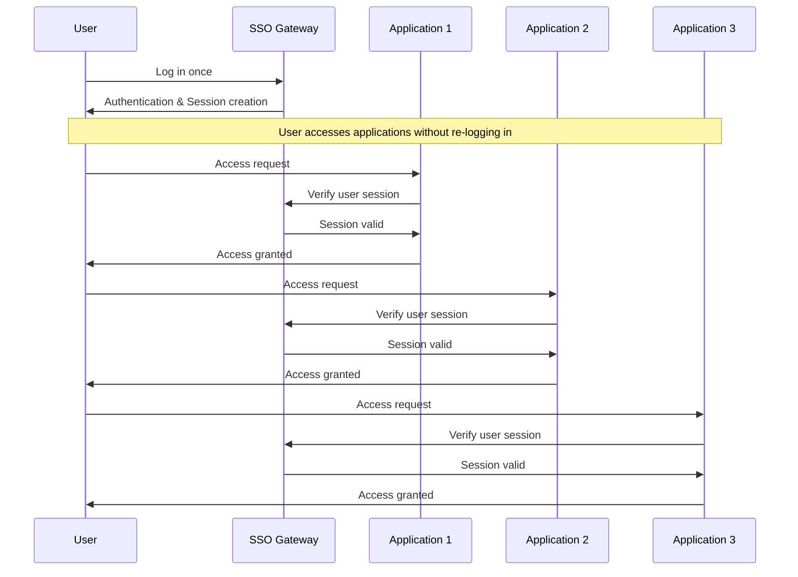
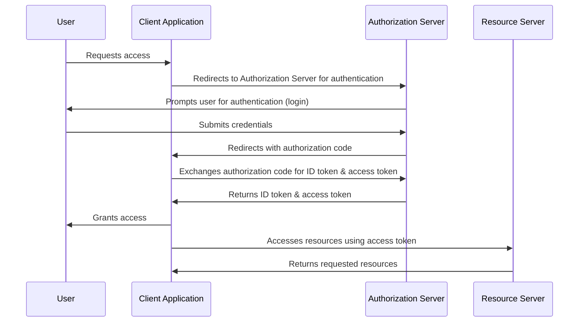

In today's cloud-first world, ensuring seamless and secure access to Amazon Elastic Kubernetes Service (EKS) is essential for IT teams. Our guide helps you enhance EKS security by integrating Single Sign-On (SSO) with OpenID Connect (OIDC) and Keycloak. This integration simplifies authentication and strengthens security measures. We aim to provide you with effective strategies to implement a robust SSO solution that meets your organization's standards, making your EKS environment more secure and compliant. KubeRocketCI leverages this integration to provide Role-Based Access Control (RBAC) for your EKS clusters, ensuring that only authorized users can access platform resources.

<!--truncate-->

## Understanding SSO, OIDC, and Keycloak

In the context of enhancing digital security and user experience, we prioritize the integration of three key elements: Single Sign-On (SSO), OpenID Connect (OIDC), and the Keycloak solution. Here’s how they connect:

- **Single Sign-On (SSO)** serves as the foundation, enabling users to access multiple applications with one set of login credentials, significantly simplifying the authentication process.

- **OpenID Connect (OIDC)** builds on the SSO framework by providing an authentication layer, which uses straightforward identity verification to ensure secure and seamless access across services.

- **Keycloak** acts as the orchestrator, implementing both SSO and OIDC to manage user identities and security protocols efficiently. It provides a comprehensive platform for securing applications and services with minimal hassle for end-users.

Together, these technologies streamline the login process, reinforce security, and enhance the user experience by allowing secure, seamless navigation across our digital ecosystem.

### What is SSO?

Single sign-on (SSO) is a user authentication method that lets you use one set of login credentials (such as a username and password) to access multiple applications. The primary benefits of SSO include an improved user experience by eliminating the need for multiple passwords and logins, and enhanced security through centralized management of user access. Organizations widely adopt SSO to streamline their authentication processes and reduce the likelihood of password fatigue among users, thereby decreasing the risk of security breaches. For more information, see [Single sign-on on Wikipedia](https://en.wikipedia.org/wiki/Single_sign-on).

This diagram shows the following steps:

1. User logs in once at the single sign-on (SSO) gateway by providing their credentials.
2. The SSO gateway authenticates the user, creates a session, and then allows the user to access multiple applications.
3. When the user attempts to access Application 1, the application verifies the user's session with the SSO gateway.
4. The SSO gateway confirms that the session is valid, and Application 1 grants the user access.

The same process is repeated for Application 2 and Application 3. Since the user's session is already established with the SSO gateway, they do not need to log in again to access these applications.

### Understanding OIDC

OpenID Connect (OIDC) is an authentication layer on top of the OAuth 2.0 protocol. It lets clients verify the identity of the end user based on authentication by an authorization server and get basic profile information about the end user in an interoperable and REST-like manner. OIDC uses JSON Web Tokens (JWTs) to securely transmit information about an end user from the identity provider to the client. This protocol is essential for modern web applications, providing a more secure and streamlined method for user authentication and authorization. Reference: [OIDC Specification](https://openid.net/specs/openid-connect-core-1_0.html)

OIDC enables single sign-on (SSO) functionality, simplifying the user experience by allowing individuals to use a single set of credentials across multiple applications. The protocol also supports robust security features, including token revocation and introspection, enhancing overall application security.

This diagram simplifies the OIDC flow into its core components:

1. **User (U)**: The end user who wants to access the client application.
2. **Client Application (C)**: The application requiring authentication from the user.
3. **Authorization Server (AS)**: The server that authenticates the user and issues tokens to the client application.
4. **Resource Server (RS)**: The server hosting protected resources that the client application wants to access on behalf of the user.

The sequence starts with the user requesting access to the client application, moving through authentication with the authorization server, and ending with the client application accessing protected resources.

### Keycloak Overview

Keycloak is an open-source identity and access management solution for modern applications and services. It offers features like single sign-on (SSO), social login, and identity brokering, making it a comprehensive solution for managing user identities. Keycloak integrates seamlessly with LDAP (Lightweight Directory Access Protocol) and Active Directory and supports OpenID Connect (OIDC), OAuth 2.0, and Security Assertion Markup Language (SAML) 2.0. By using Keycloak, organizations can enhance their security and provide a better user experience without building complex identity management features from scratch. For more details, see the Keycloak [official documentation](https://www.keycloak.org/documentation.html).

## Configuring AWS EKS for SSO with OIDC

Outline the steps required to prepare AWS EKS for integration with SSO and OIDC.

### Preparing EKS for OIDC

Discuss the prerequisites and initial setup steps for integrating OIDC with EKS.

### Setting up OIDC with Keycloak

Provide detailed instructions on configuring Keycloak as an OIDC identity provider for AWS EKS.

## Implementing SSO in AWS EKS with Keycloak

Guide readers through the process of implementing SSO in AWS EKS using Keycloak.

### Configuring Keycloak for AWS EKS

Detail the steps to configure Keycloak specifically for AWS EKS, including client setup and role mapping.

### Integrating Keycloak with AWS EKS

Explain how to integrate the configured Keycloak with AWS EKS to achieve SSO.

## KubeRocketCI RBAC Integration

Discuss how to integrate KubeRocketCI with AWS EKS and Keycloak for Role-Based Access Control (RBAC).

### Setting Up KubeRocketCI

Explain the process of setting up KubeRocketCI within the AWS EKS environment.

### Configuring RBAC in KubeRocketCI

Why it is matter.
Detail the steps to configure Role-Based Access Control in KubeRocketCI using Keycloak and AWS EKS.

## Conclusion

Summarize the key points covered in the blog and encourage the adoption of SSO with OIDC and Keycloak in AWS EKS for enhanced security.
