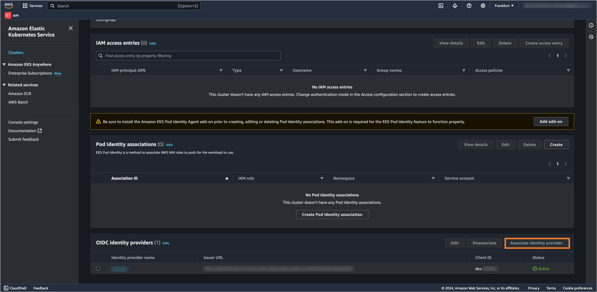

In today's cloud-first world, ensuring seamless and secure access to Amazon Elastic Kubernetes Service (EKS) is essential for IT teams. Our guide helps you enhance EKS security by integrating Single Sign-On (SSO) with OpenID Connect (OIDC) and Keycloak. This integration simplifies authentication and strengthens security measures. We aim to provide you with effective strategies to implement a robust SSO solution that meets your organization's standards, making your EKS environment more secure and compliant. KubeRocketCI leverages this integration to provide Role-Based Access Control (RBAC) for your EKS clusters, ensuring that only authorized users can access platform resources.

<!--truncate-->

## Prerequisites

Before you begin, ensure you have the following:

- A running [AWS EKS](https://docs.aws.amazon.com/eks/latest/userguide/create-cluster.html) cluster with the necessary permissions for access and management.
- Forked and cloned the [edp-cluster-add-ons](https://github.com/epam/edp-cluster-add-ons) repository.
- The [kubelogin](https://github.com/int128/kubelogin) plugin installed for authenticating to the EKS cluster using OIDC.
- The [kubectl](https://kubernetes.io/docs/tasks/tools/#kubectl) cli tool installed.
- The [aws cli](https://aws.amazon.com/cli/) tool installed.
- [Keycloak](../../docs/operator-guide/auth/keycloak) installed and configured with the [kuberocketci-rbac](https://github.com/epam/edp-cluster-add-ons/tree/main/clusters/core/addons/kuberocketci-rbac) Helm chart, which can be found in the [add-ons repository](https://github.com/epam/edp-cluster-add-ons).
- The [Keycloak-operator](https://github.com/epam/edp-keycloak-operator) installed.

## Understanding SSO, OIDC, and Keycloak

In the context of enhancing digital security and user experience, we prioritize the integration of three key elements: Single Sign-On (SSO), OpenID Connect (OIDC), and the Keycloak solution. Here’s how they connect:

- **Single Sign-On (SSO)** serves as the foundation, enabling users to access multiple applications with one set of login credentials, significantly simplifying the authentication process.

- **OpenID Connect (OIDC)** builds on the SSO framework by providing an authentication layer, which uses straightforward identity verification to ensure secure and seamless access across services.

- **Keycloak** acts as the orchestrator, implementing both SSO and OIDC to manage user identities and security protocols efficiently. It provides a comprehensive platform for securing applications and services with minimal hassle for end-users.

Together, these technologies streamline the login process, reinforce security, and enhance the user experience by allowing secure, seamless navigation across our digital ecosystem.

### What is SSO?

Single sign-on (SSO) is a user authentication method that lets you use one set of login credentials (such as a username and password) to access multiple applications. The primary benefits of SSO include an improved user experience by eliminating the need for multiple passwords and logins, and enhanced security through centralized management of user access. Organizations widely adopt SSO to streamline their authentication processes and reduce the likelihood of password fatigue among users, thereby decreasing the risk of security breaches. For more information, see [Single sign-on on Wikipedia](https://en.wikipedia.org/wiki/Single_sign-on).


This diagram shows the following steps:

1. User logs in once at the single sign-on (SSO) gateway by providing their credentials.
2. The SSO gateway authenticates the user, creates a session, and then allows the user to access multiple applications.
3. When the user attempts to access Application 1, the application verifies the user's session with the SSO gateway.
4. The SSO gateway confirms that the session is valid, and Application 1 grants the user access.

The same process is repeated for Application 2 and Application 3. Since the user's session is already established with the SSO gateway, they do not need to log in again to access these applications.

### Understanding OIDC

OpenID Connect (OIDC) is an authentication layer on top of the OAuth 2.0 protocol. It lets clients verify the identity of the end user based on authentication by an authorization server and get basic profile information about the end user in an interoperable and REST-like manner. OIDC uses JSON Web Tokens (JWTs) to securely transmit information about an end user from the identity provider to the client. This protocol is essential for modern web applications, providing a more secure and streamlined method for user authentication and authorization. Reference: [OIDC Specification](https://openid.net/specs/openid-connect-core-1_0.html)

OIDC enables single sign-on (SSO) functionality, simplifying the user experience by allowing individuals to use a single set of credentials across multiple applications. The protocol also supports robust security features, including token revocation and introspection, enhancing overall application security.

This diagram simplifies the OIDC flow into its core components:


1. **User (U)**: The end user who wants to access the client application.
2. **Client Application (C)**: The application requiring authentication from the user.
3. **Authorization Server (AS)**: The server that authenticates the user and issues tokens to the client application.
4. **Resource Server (RS)**: The server hosting protected resources that the client application wants to access on behalf of the user.

The sequence starts with the user requesting access to the client application, moving through authentication with the authorization server, and ending with the client application accessing protected resources.

### Keycloak Overview

Keycloak is an open-source identity and access management solution for modern applications and services. It offers features like single sign-on (SSO), social login, and identity brokering, making it a comprehensive solution for managing user identities. Keycloak integrates seamlessly with LDAP (Lightweight Directory Access Protocol) and Active Directory and supports OpenID Connect (OIDC), OAuth 2.0, and Security Assertion Markup Language (SAML) 2.0. By using Keycloak, organizations can enhance their security and provide a better user experience without building complex identity management features from scratch. For more details, see the Keycloak [official documentation](https://www.keycloak.org/documentation.html).

## Keycloak Configuration

The first step to enable OIDC authentication to the AWS EKS cluster using Keycloak is to set up Keycloak with the necessary configurations, such as realm, client, groups, and other settings. For this purpose, we will use the [kuberocketci-rbac](https://github.com/epam/edp-cluster-add-ons/tree/main/clusters/core/addons/kuberocketci-rbac) Helm chart available in the [edp-cluster-add-ons](https://github.com/epam/edp-cluster-add-ons) repository.

1. Clone the forked [edp-cluster-add-ons](https://github.com/epam/edp-cluster-add-on) repository and navigate to the `clusters/core/addons/kuberocketci-rbac` directory.

2. In the `values.yaml` file, set the `kubernetes.enabled` field to `true` to enable the creation of the necessary Keycloak resources:

    ```yaml title="values.yaml"
    kubernetes:
      enabled: true
    ```

3. If you use the External Secrets Operator to manage secrets, ensure the AWS Parameter Store object contains the correct Client Secret value for the **keycloak-client-eks-secret** secret:

    ```json title="AWS Parameter Store object"
    {
      ...
      "keycloak-client-eks-secret": {
        "clientSecret": "<Client_Secret_Value>"
      },
      ...
    }
    ```

    If you are not using the External Secrets Operator, you can create the **keycloak-client-eks-secret** secret manually:

    ```bash
    kubectl create secret generic keycloak-client-eks-secret \
      --from-literal=clientSecret=<Client_Secret_Value>
    ```

4. Install the **kuberocketci-rbac** Helm chart. You can use the **kubectl** cli tool or **Argo CD** for this purpose.

    - **kubectl**

    Ensure you are in the `clusters/core/addons/kuberocketci-rbac` directory if you want to install the chart with the kubectl command. For example:

    ```bash
    kubectl upgrade --install kuberocketci-rbac -n security .
    ```

    - **Argo CD**

    If you are using Argo CD to deploy charts in the **edp-cluster-add-ons** repository, ensure that the following fields for the **kuberocketci-rbac** Helm chart are correctly set in the `values.yaml` file in the `clusters/core/apps` directory:

    ```yaml title="values.yaml"
    kuberocketci-rbac:
      createNamespace: false
      enable: true
    ```

    After the installation is complete, check that the Keycloak resources, such as the realm, client, and groups, have been created successfully.

## Adding Users to Groups in Keycloak

To manage user access to the AWS EKS cluster, you need to assign users to specific groups in Keycloak. These groups will define the permissions for users accessing the AWS EKS cluster.

1. Log in to the Keycloak admin console and navigate to the **shared** realm.

2. Select the **Users** section from the left sidebar menu and select the user you want to add to a group. Navigate to the **Groups** tab and click on the **Join Group** button to add the user to a group.

    

3. Select the group you want to add the user to (e.g., **oidc-cluster-admins**). Click on the **Join** button to add the user to the selected group.

    

4. Repeat the process of adding users to groups for all users who need access to the AWS EKS cluster.

## Configuring Keycloak as an Identity Provider in AWS EKS

There are two methods to configure Keycloak as an identity provider in AWS EKS: using the AWS Management Console or Terraform.

### Method 1: Using the AWS Management Console

1. Log in to the [AWS Management Console](https://aws.amazon.com/console/) and navigate to the Amazon EKS service. Select the EKS cluster you want to configure and click on the **Access** tab.

    

2. In the **OIDC identity providers** section, click on the **Associate identity provider** button.

    

3. Fill in the following details for the Keycloak Identity Provider:

    - **Name**: `Keycloak`
    - **Issuer URL**: `https://<keycloak_url>/auth/realms/shared`, where `<keycloak_url>` is the URL of your Keycloak instance.
    - **Client ID**: `eks`.
    - **Groups Claim**: `groups`.

      

4. The process of applying the changes may take a few minutes. Once completed, you will see the Keycloak Identity Provider associated with your EKS cluster.

### Method 2: Using Terraform

To configure Keycloak as an Identity Provider in AWS EKS cluster using Terraform, you can use the [AWS EKS Terraform module](https://registry.terraform.io/modules/terraform-aws-modules/eks/aws/20.30.1). Here's an example of how to define the Keycloak Identity Provider in Terraform configuration files:

    - **variables.tf**:

    ```hcl
    variable "cluster_identity_providers" {
      description = "Configuration for OIDC identity provider"
      type        = any
      default     = {}
    }
    ```

    - **terraform.tfvars**:

    ```hcl
    cluster_identity_providers = {
      keycloak = {
        client_id    = "eks"
        issuer_url   = "https://<keycloak_url>/auth/realms/shared"
        groups_claim = "groups"
      }
    }
    ```

    - **main.tf**:

    ```hcl
    module "eks" {
      source  = "terraform-aws-modules/eks/aws"
      version = "20.14.0"
      ...
      # OIDC Identity provider
      cluster_identity_providers = var.cluster_identity_providers
    }
    ```

After applying the Terraform configuration, the Keycloak identity provider will be associated with your EKS cluster.

## Authenticating to AWS EKS cluster using kubectl

1. Configure **kubeconfig** file to use the Keycloak Identity Provider for authentication to the AWS EKS cluster. You can use the following template:

    ```yaml title="kubeconfig"
    apiVersion: v1
    preferences: {}
    kind: Config

    clusters:
    - cluster:
        server: https://<eks_cluster_endpoint>.eks.amazonaws.com
        certificate-authority-data: <eks_cluster_ca>
      name: eks

    contexts:
    - context:
        cluster: eks
        user: <keycloak_user_email>
      name: eks

    current-context: eks

    users:
    - name: <keycloak_user_email>
      user:
        exec:
          apiVersion: client.authentication.k8s.io/v1beta1
          command: kubectl
          args:
          - oidc-login
          - get-token
          - -v1
          - --oidc-issuer-url=https://<keycloak_url>/auth/realms/shared
          - --oidc-client-id=eks
          - --oidc-client-secret=<keycloak_client_secret>
    ```

    Replace the placeholders with the actual values:

    - `<eks_cluster_endpoint>`: The endpoint of your AWS EKS cluster.
    - `<eks_cluster_ca>`: The CA certificate of your AWS EKS cluster.
    - `<keycloak_user_email>`: The email address of the Keycloak user.
    - `<keycloak_url>`: The URL of your Keycloak instance.
    - `<keycloak_client_secret>`: The Client secret of the **eks** Keycloak client (provided during the **Keycloak Configuration** step).

2. Save the kubeconfig file and set the `KUBECONFIG` environment variable to point to the file:

    ```bash
    export KUBECONFIG=<path_to_kubeconfig_file>
    ```

3. Test the authentication to the AWS EKS cluster by running the following command:

    ```bash
    kubectl get nodes
    ```

    After the first command execution, you will be prompted to log in to Keycloak. Enter your credentials to authenticate and access the EKS cluster. If the authentication is successful, you will see the list of nodes in the EKS cluster.

## Configuring KubeRocketCI Portal with Keycloak OIDC Authentication

The KubeRocketCI platform natively supports Keycloak as an Identity Provider for OIDC authentication.

1. To configure the KubeRocketCI Portal with Keycloak OIDC authentication, navigate to the [edp-install](https://github.com/epam/edp-install) Helm chart and set the following values in the `values.yaml` file:

    ```yaml title="values.yaml"
    edp-headlamp:
      enabled: true
      config:
        oidc:
          enabled: true
          issuerUrl: "https://<keycloak_url>/auth/realms/shared"
          clientID: "eks"
          clientSecretName: "keycloak-client-headlamp-secret"
          clientSecretKey: "clientSecret"
    ```

    Replace the **keycloak_url** with the URL of your Keycloak instance.

2. Ensure the AWS Parameter Store object contains the correct Client Secret value for the **keycloak-client-headlamp-secret** secret:

    ```json title="AWS Parameter Store object"
    {
      ...
      "keycloak-client-headlamp-secret": "<Client_Secret_Value>"
      ...
    }
    ```

3. After setting the values, install the **edp-install** Helm chart to apply the changes:

    ```bash
    helm upgrade --install krci --namespace krci .
    ```

4. After applying the changes, the KubeRocketCI Portal will be configured to use Keycloak OIDC authentication. Users will be able to log in to the Portal using **Sign In** option.

    

## Conclusion

Integrating OpenID Connect (OIDC) authentication with Keycloak in AWS EKS enhances security and simplifies user access management. By leveraging Keycloak's capabilities, you can implement a reliable Single Sign-On (SSO) solution that meets your organization's security standards. This guide has provided step-by-step instructions to configure Keycloak as an Identity Provider, set up necessary Keycloak resources, and enable OIDC authentication for the KubeRocketCI Portal. By following these steps, you can ensure secure and seamless access to your EKS clusters and KubeRocketCI Portal, improving both security and user experience.
