In modern cloud environments, secure and efficient access management is essential, especially for platforms like Amazon EKS. This blog will guide you through integrating OpenID Connect (OIDC) authentication using Microsoft Entra, making it easier to manage access to your EKS clusters and KubeRocketCI Portal. By implementing this approach, you can simplify user authentication while ensuring strong security controls. Whether you're improving compliance or streamlining access for your team, this integration is a practical solution to enhance your cloud-native workflows.

<!--truncate-->

## Prerequisites

Before you begin, ensure you have the following:

- Access to the [Microsoft Entra Admin Center](https://entra.microsoft.com/?feature.msaljs=true#home) with administrative privileges.
- A running [AWS EKS](https://docs.aws.amazon.com/eks/latest/userguide/create-cluster.html) cluster with the necessary permissions for access and management.
- The [kubelogin](https://github.com/int128/kubelogin) plugin installed for authenticating to the EKS cluster using OIDC.
- The [kubectl](https://kubernetes.io/docs/tasks/tools/#kubectl) CLI tool installed.
- The [aws cli](https://aws.amazon.com/cli/) tool installed.

## Understanding SSO, OIDC, and Microsoft Entra

In the context of enhancing digital security and user experience, we prioritize the integration of three key elements: Single Sign-On (SSO), OpenID Connect (OIDC), and Microsoft Entra. Here’s how they connect:

- **Single Sign-On (SSO)** serves as the foundation, enabling users to access multiple applications with one set of login credentials, significantly simplifying the authentication process.

- **OpenID Connect (OIDC)** builds on the SSO framework by providing an authentication layer, which uses straightforward identity verification to ensure secure and seamless access across services.

- **Microsoft Entra** (formerly known as **Azure Active Directory**) is Microsoft's comprehensive identity and access management solution. It supports the implementation of both Single Sign-On (SSO) and OpenID Connect (OIDC), enabling organizations to securely manage user identities and enforce access controls. With its reliable set of tools, Microsoft Entra simplifies authentication, enhances security, and ensures seamless access to applications and services, making it an essential platform for modern identity management.

Together, these technologies streamline the login process, reinforce security, and enhance the user experience by allowing secure, seamless navigation across our digital ecosystem.

### Microsoft Entra Overview

Microsoft Entra, formerly known as Azure Active Directory (Azure AD), is a modern identity and access management solution designed for secure access to applications and services. It provides features like Single Sign-On (SSO), identity federation, and seamless integration with on-premises directories such as LDAP and Active Directory. Microsoft Entra supports industry-standard protocols, including OpenID Connect (OIDC), OAuth 2.0, and Security Assertion Markup Language (SAML) 2.0, making it a versatile solution for managing user identities. By leveraging Microsoft Entra, organizations can enhance security, simplify user access, and avoid the complexities of building identity management features from scratch. For more details, see the [Microsoft Entra official documentation](https://learn.microsoft.com/en-gb/entra/identity).

## Create a new Microsoft Entra Tenant

To get started with Microsoft Entra, you need to create a new tenant in the Microsoft Entra Admin Center. Follow these steps:

1. Log in to the [Microsoft Entra Admin Center](https://entra.microsoft.com/?feature.msaljs=true#home) using your Microsoft account.

    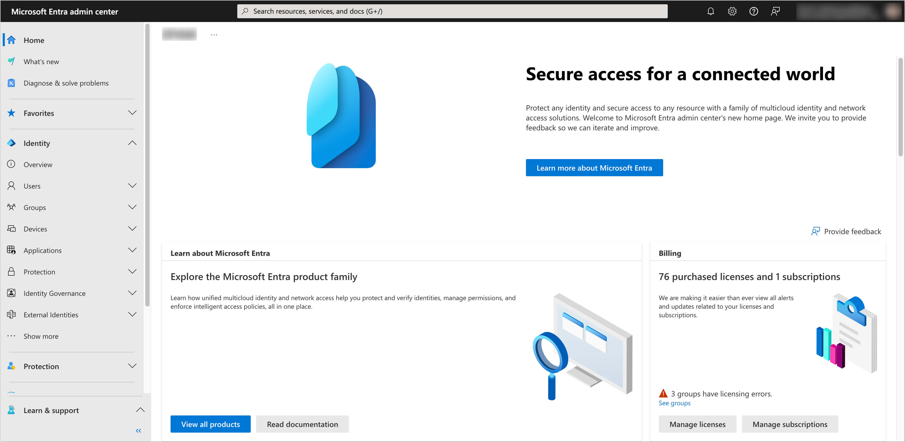

2. In the left sidebar menu, select **Overview** section and then navigate to **Manage tenants** tab.

    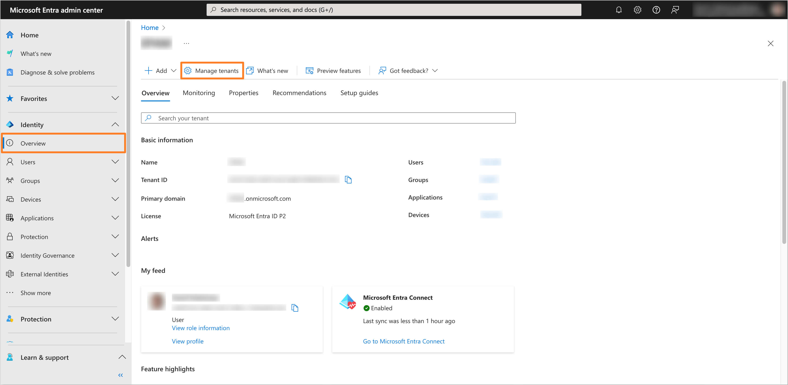

3. Click on **Create** button to create a new tenant.

    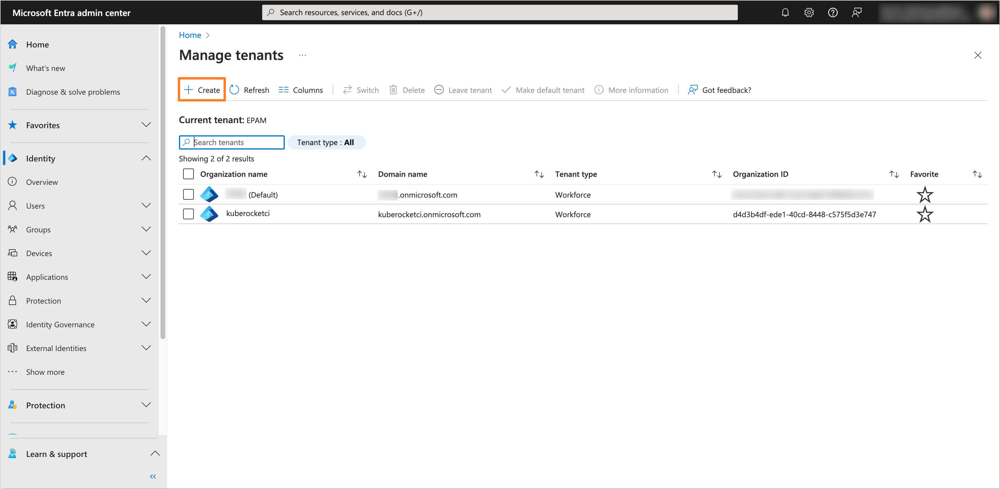

4. Select the configuration type **Workforce**.

    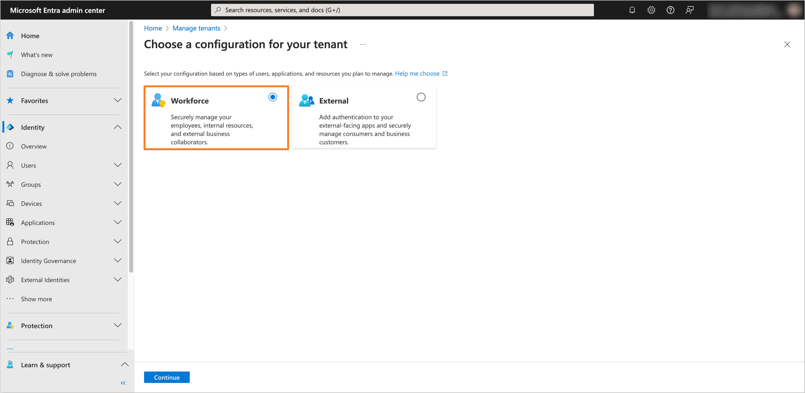

5. Fill in the fields for **Tenant Name**, **Domain Name**, and **Location**.

    :::note
    The **Tenant Name** and **Domain Name** `kuberocketci` are used as a demonstration examples. In your case, it is recommended to choose names that align with your organization's specific needs and naming conventions.
    :::

    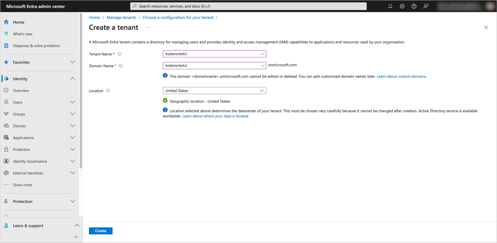

6. The new tenant will be created, and you can start configuring it for OIDC integration. Ensure you have switched to the new tenant.

## Creating and Configuring OIDC Application in Microsoft Entra

After creating the tenant, you need to set up an OIDC Application in Microsoft Entra. Here's how you can do it:

1. In the Microsoft Entra Admin Center, in the left sidebar menu, select **Applications** and then click on **App registrations**.

    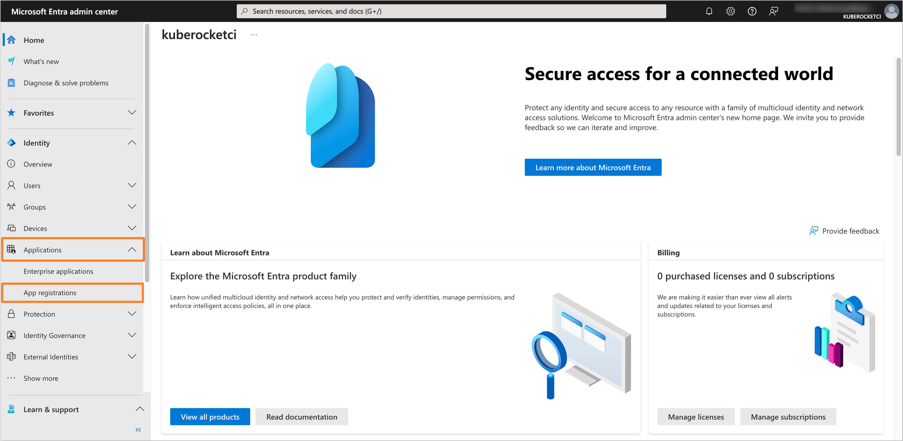

2. Click on the **New registration** button to create a new application.

    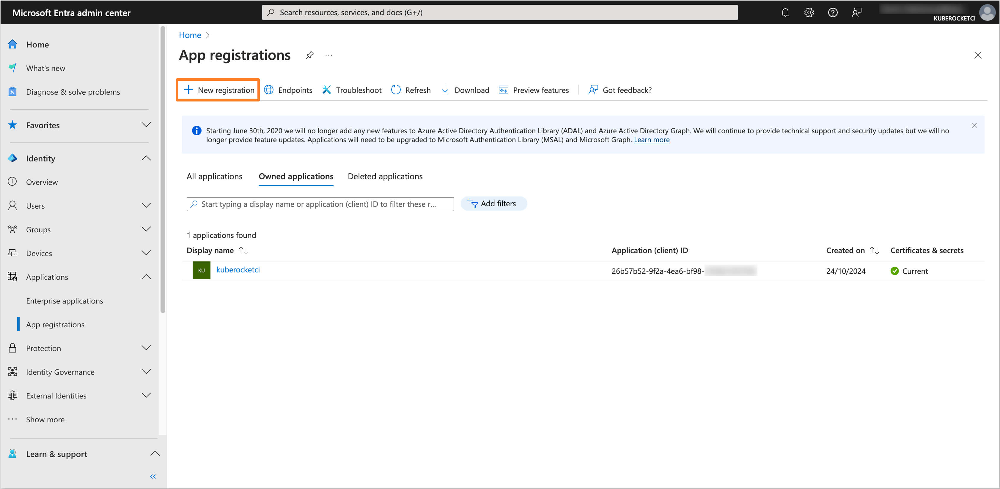

3. Fill in the details for the application, such as **Name**, **Supported account types**, and **Redirect URI** (`http://localhost:8000/`).

    :::note
    The **Name** `kuberocketci` is used as a demonstration example. In your case, it is recommended to choose a name that aligns with your application's specific needs and naming conventions (e.g. your AWS EKS cluster name).
    :::

    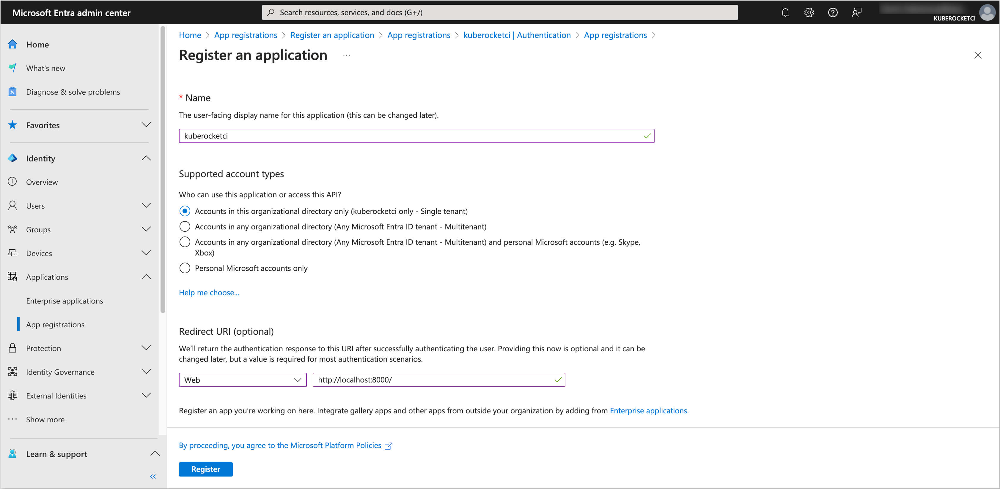

4. In the created application, navigate to the **Authentication** section from the left sidebar menu. In the **Implicit grant and hybrid flows** section, select **ID tokens** for the token type. In the **Allow public client flows** section, set the value to **No**.

    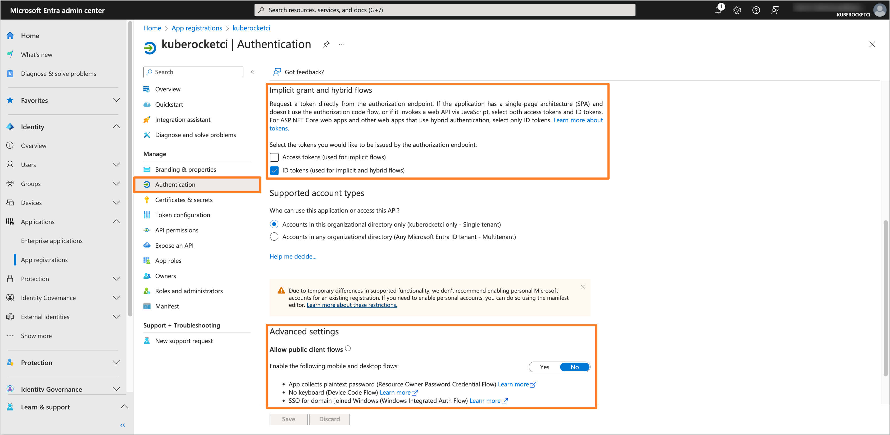

5. Navigate to the **Certificates & secrets** section from the left sidebar menu. In the **Client secrets** tab, click on the **New client secret** button to create a new secret.

    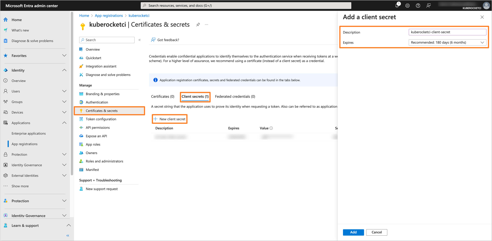

6. Copy the generated client secret value and store it securely.

    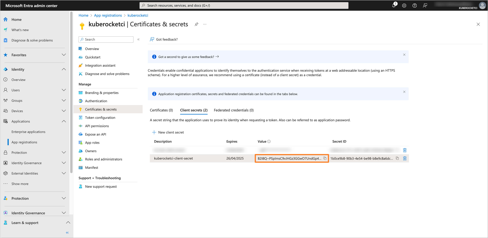

7. Navigate to the **Token configuration** section and click on **Add group claim** button. Choose the group type as **Security Groups** and for the ID token type, select **Group ID**.

    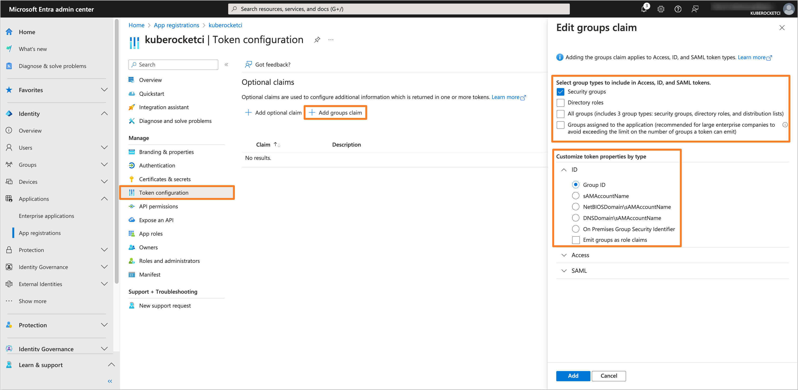

8. Navigate to the **API permissions** section. Ensure that the **User.Read** permission is added under the **Microsoft Graph** API. If not, click on the **Add a permission** button, select **Microsoft Graph**, and add the **User.Read** permission. After adding the permission, click on the **Grant admin consent for 'Tenant name'** button to grant the required permissions.

    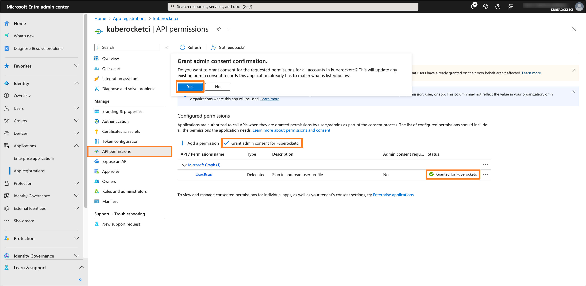

9. The OIDC Application in Microsoft Entra is now configured and ready for integration with AWS EKS.

## Creating Users and Groups in Microsoft Entra

:::note
Only users who are part of the groups configured in the Microsoft Entra Admin Center will be able to authenticate to the AWS EKS cluster using OIDC.
:::

To create users and groups in Microsoft Entra, follow these steps:

### Creating a Group

1. In the Microsoft Entra Admin Center, in the left sidebar menu, select **Groups** and then **All groups**. Click on **New group** button to create a new group(s) for users who will have access to the AWS EKS cluster.

    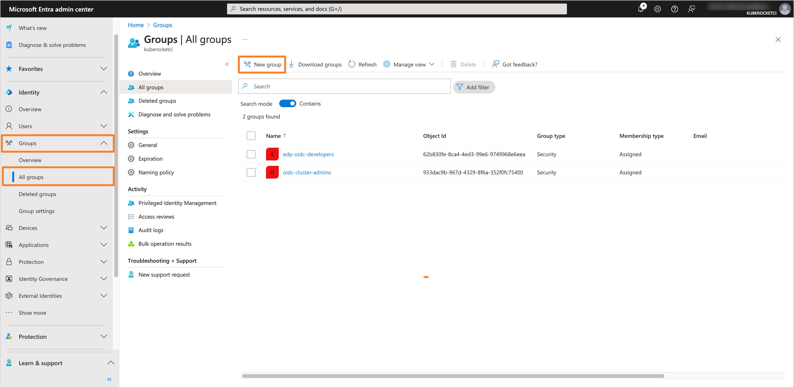

2. Fill in the details for the group, such as **Group type** and **Group name**. Click on the **Create** button to create the group.

    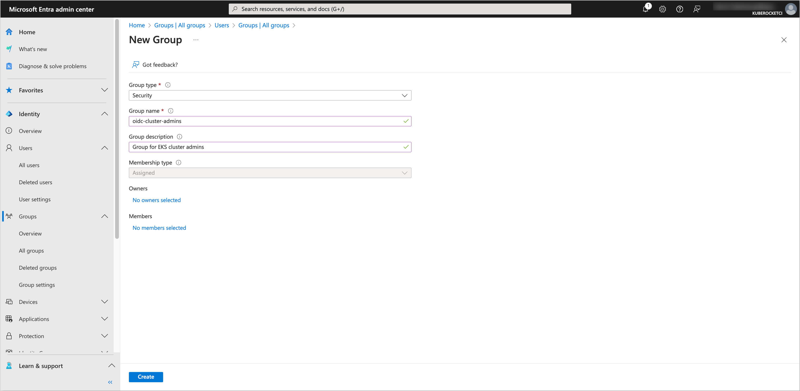

3. The group will be created, and you can start adding users to it.

### Adding Users to the Group

1. In the Microsoft Entra Admin Center, in the left sidebar menu, select **Users** and then click on **All users**. In the **New user** tab, click on the **Create new user** button to create a new user.

    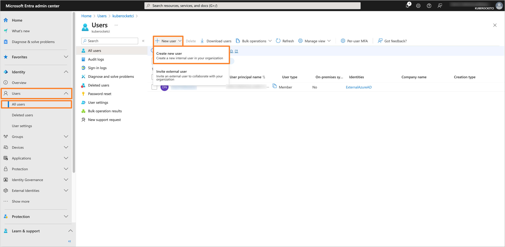

2. Fill in the details for the user, such as **User principal name**, **Mail nickname**, **Display name**, and temporary password. In the **Properties** tab you can set the **First name**, **Last name**, and other details.

    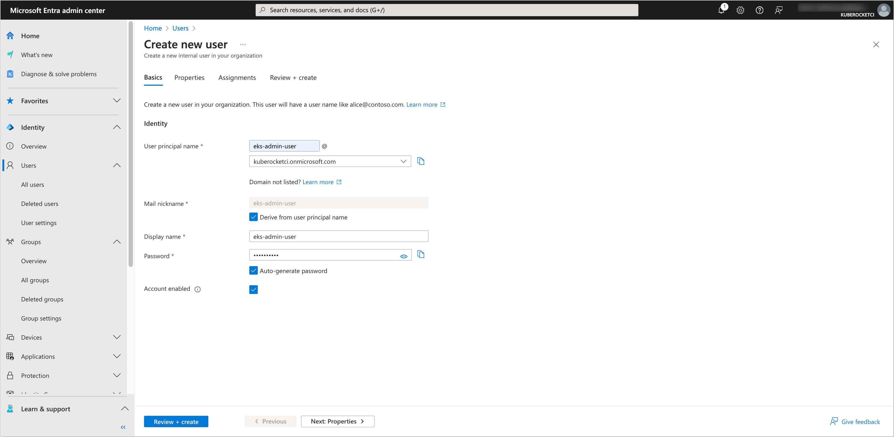

3. In the **Assignment** tab, click on the **Add group** button. In the **Select Group** window, choose the group(s) you created earlier (e.g., `oidc-cluster-admins`) and click on the **Select** button.

    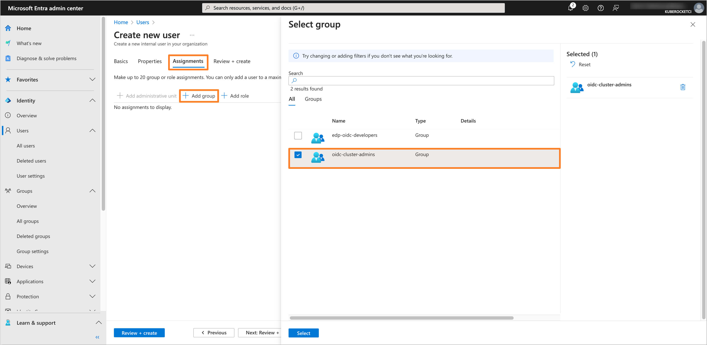

4. Click on the **Review + create** button to create the user. The user will be created and added to the group(s) you selected.

## Configuring Microsoft Entra as an Identity Provider in AWS EKS

There are two methods to configure Microsoft Entra as an Identity Provider in AWS EKS: through the AWS Management Console and using Terraform.

:::note
The Application data, such as **Directory (tenant) ID**, **Application (client) ID**, and **Issuer URL**, can be found in the **Overview** section of the OIDC Application in the Microsoft Entra Admin Center.
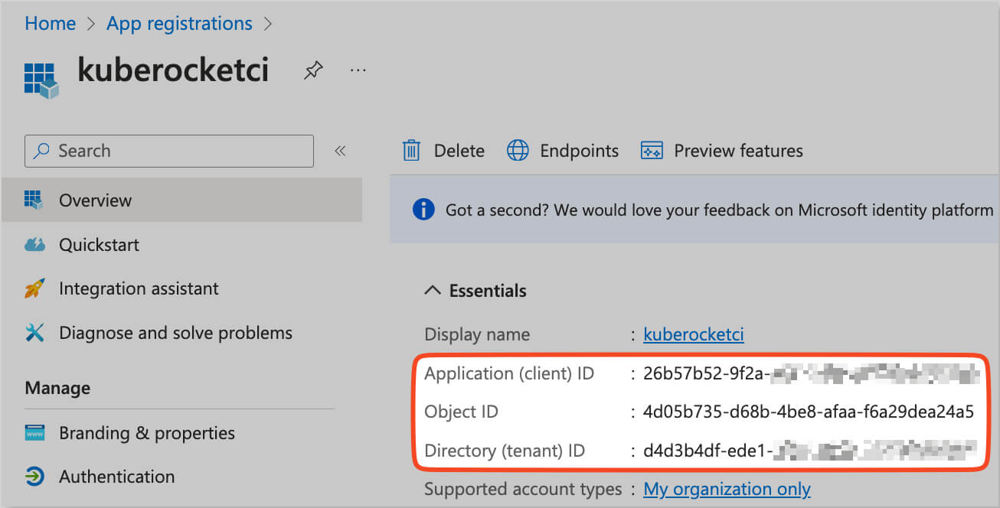
:::

### Method 1: Using the AWS Management Console

1. Log in to the [AWS Management Console](https://aws.amazon.com/console/) and navigate to the [Amazon EKS console](https://console.aws.amazon.com/eks/). Select the EKS cluster you want to configure and click on the **Access** tab.

    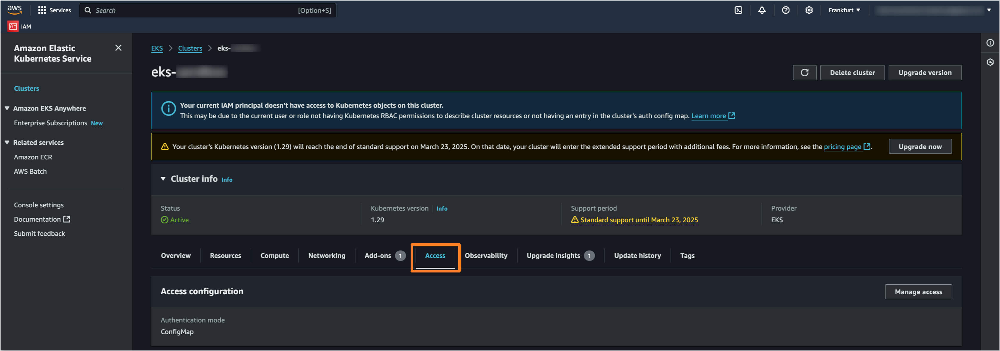

2. In the **OIDC identity providers** section, click on the **Associate identity provider** button.

    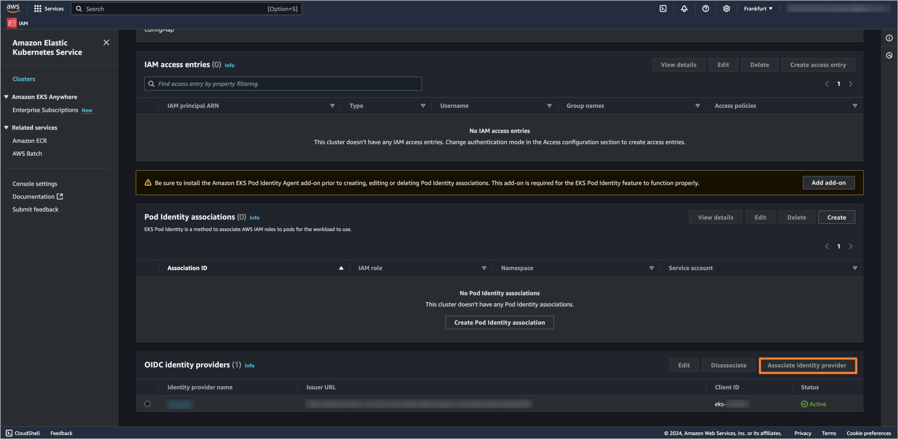

3. Fill in the following details:

    - **Name**: `Entra`
    - **Issuer URL**: `https://login.microsoftonline.com/<Tenant-ID>/`, where `<Tenant-ID>` is the **Directory** (tenant) **ID**. Ensure that the URL ends with `/`.
    - **Client ID**: `<Application (client) ID>`, which corresponds to the **Application** (client) **ID** of the OIDC Application.
    - **Username Claim**: `upn`.
    - **Groups Claim**: `groups`.

      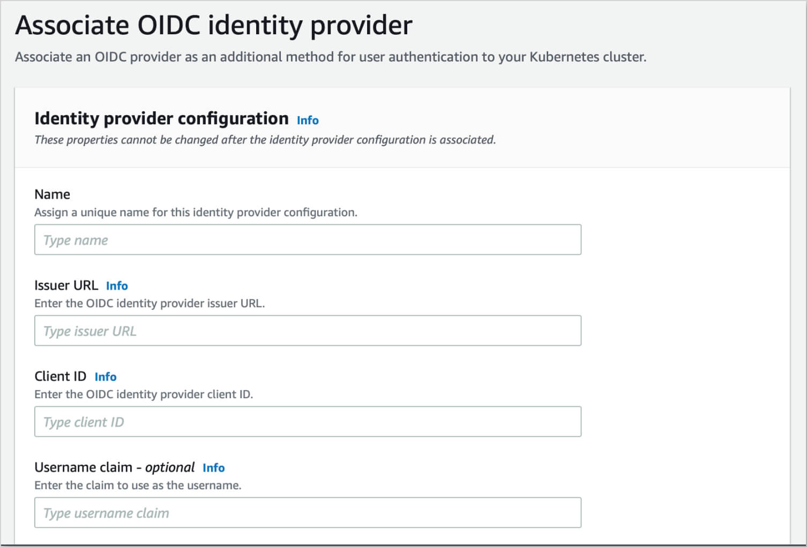

4. The process of applying the changes may take a few minutes. Once completed, the Microsoft Entra OIDC identity provider will be associated with the AWS EKS cluster.

### Method 2: Using Terraform

To configure Microsoft Entra as an Identity Provider in AWS EKS using Terraform, you can use [AWS EKS Terraform module](https://registry.terraform.io/modules/terraform-aws-modules/eks/aws/20.30.1). Here's an example of how you can do it:

    - **variables.tf**:

    ```hcl
    variable "cluster_identity_providers" {
      description = "Configuration for OIDC identity provider"
      type        = any
      default     = {}
    }
    ```

    - **terraform.tfvars**:

    ```hcl
    cluster_identity_providers = {
      entra = {
        client_id    = "<Application (client) ID>"
        issuer_url   = "https://sts.windows.net/<Tenant ID>/"
        groups_claim = "groups"
        username_claim  = "upn"
      }
    }
    ```

    - **main.tf**:

    ```hcl
    module "eks" {
      source  = "terraform-aws-modules/eks/aws"
      version = "20.14.0"
      ...
      # OIDC Identity provider
      cluster_identity_providers = var.cluster_identity_providers
    }
    ```

After applying the Terraform configuration, the Microsoft Entra OIDC identity provider will be associated with the AWS EKS cluster.

## Configuring RBAC Resources in AWS EKS cluster for Microsoft Entra User Groups

In this section, user authorization will be configured using Kubernetes Role-Based Access Control (RBAC). Microsoft Entra groups will be linked to Kubernetes ClusterRoles through ClusterRoleBinding resources, enabling precise control over resource access within the EKS cluster. Additionally, Roles and RoleBindings can be used for more granular access control within specific namespaces.

:::note
The **Object ID** of the Microsoft Entra group can be found in the **Overview** section of the group in the Microsoft Entra Admin Center.
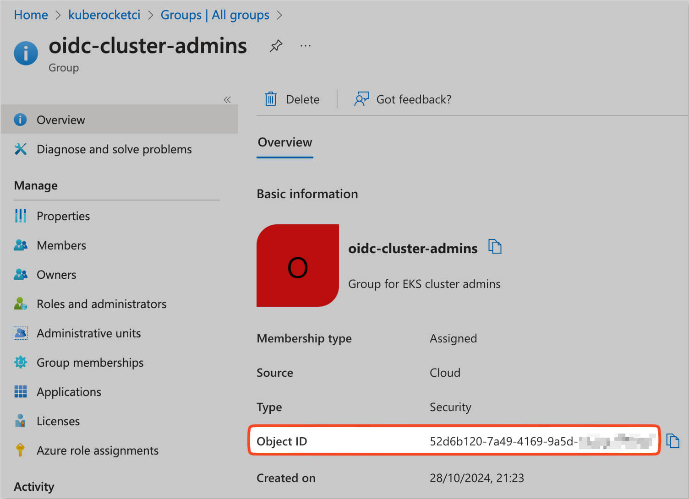
:::

1. Log in to the AWS EKS cluster and create the following **ClusterRoleBinding** resource, which associates the Microsoft Entra group `oidc-cluster-admins` with the `cluster-admin` Kubernetes Cluster Role. Replace `<your-microsoft-entra-admin-group-object-id>` with the Object ID of the `oidc-cluster-admins` group, which can be found on the `Group` overview page in the Microsoft Entra admin center.

    ```yaml
    apiVersion: rbac.authorization.k8s.io/v1
    kind: ClusterRoleBinding
    metadata:
      name: oidc-cluster-admins
    roleRef:
      apiGroup: rbac.authorization.k8s.io
      kind: ClusterRole
      name: cluster-admin
    subjects:
      - kind: Group
        name: <your-microsoft-entra-admin-group-object-id>
        apiGroup: rbac.authorization.k8s.io
    ```

    Save the above YAML to a file, for example, `clusterrolebinding.yaml`, and apply it to the EKS cluster using the following command:

    ```bash
    kubectl apply -f clusterrolebinding.yaml
    ```

    The `oidc-cluster-admins` group will now have `cluster-admin` permissions within the EKS cluster.

## Authenticating to AWS EKS using Microsoft Entra with kubectl

To authenticate to the AWS EKS cluster using Microsoft Entra, you can use the `kubectl` CLI tool with the `kubelogin` plugin. The `kubelogin` plugin simplifies the OIDC authentication process by handling the token exchange and session management. Here's how you can authenticate to the EKS cluster:

1. Create or update the kubeconfig file with the OIDC configuration. Replace `<cluster-name>` with the name of your EKS cluster and `<region-code>` with the AWS region code where the cluster is located.

    ```bash
    aws eks update-kubeconfig --region <region-code> --name <cluster-name>
    ```

2. Execute the following command to create a new kubeconfig context using the `kubelogin` plugin. Replace `<cluster-name>` with the name of your EKS cluster.

    ```bash
    kubectl config set-credentials "eks" \
      --exec-api-version=client.authentication.k8s.io/v1beta1 \
      --exec-command=kubelogin \
      --exec-arg=get-token \
      --exec-arg=--oidc-issuer-url \
      --exec-arg=https://sts.windows.net/<Tenant ID>/ \
      --exec-arg=--oidc-client-id \
      --exec-arg=<Application (client) ID> \
      --exec-arg=--oidc-client-secret \
      --exec-arg=<Application (client) Secret>
    ```

    Replace `<Tenant ID>`, `<Application (client) ID>`, and `<Application (client) Secret>` with the corresponding values from the OIDC Application in the Microsoft Entra Admin Center.

    :::note
    You can test the authentication to the EKS cluster immediately by running the following command:

    ```bash
    kubectl --user=eks get nodes
    ```

    :::

3. Set the context for the kubeconfig file to use the `eks` user and the OIDC configuration. Replace `<cluster-name>` with the name of your EKS cluster.

    ```bash
    kubectl config set-context eks --user=eks --cluster=<cluster-name>
    ```

    To switch to the `eks` context, execute the following command:

    ```bash
    kubectl config use-context eks
    ```

    Test the authentication by running the following command:

    ```bash
    kubectl get nodes
    ```

## Configuring KubeRocketCi Portal with Microsoft Entra OIDC Authentication

1. Starting from version 3.11, KubeRocketCI platform supports Microsoft Entra as an Identity Provider for OIDC authentication in the Portal UI. To configure Microsoft Entra OIDC authentication, navigate to the [edp-install](https://github.com/epam/edp-install) Helm chart repository and set the following values in the `values.yaml` file:

    ```yaml
    ...
    edp-headlamp:
      enabled: true
      config:
        oidc:
          enabled: true
          issuerUrl: "https://sts.windows.net/<Tenant ID>/"
          clientID: "<Application (client) ID>"
          clientSecretName: "<name of the secret containing the client-secret value>"
          clientSecretKey: "clientSecret"
    ...
    ```

    Replace `<Tenant ID>` and `<Application (client) ID>` with the corresponding values from the OIDC Application in the Microsoft Entra Admin Center. Also, specify the name of the Kubernetes Secret containing the Application **Client secret** value in the `clientSecretName` field.

2. In the Microsoft Entra Admin Center, navigate to the created OIDC Application and select the **Authentication** section. In the **Redirect URIs** field, add the URL of the KubeRocketCI Portal, for example, `https://portal-<krci-namespace>.<dns-wildcard>/oidc-callback`.

    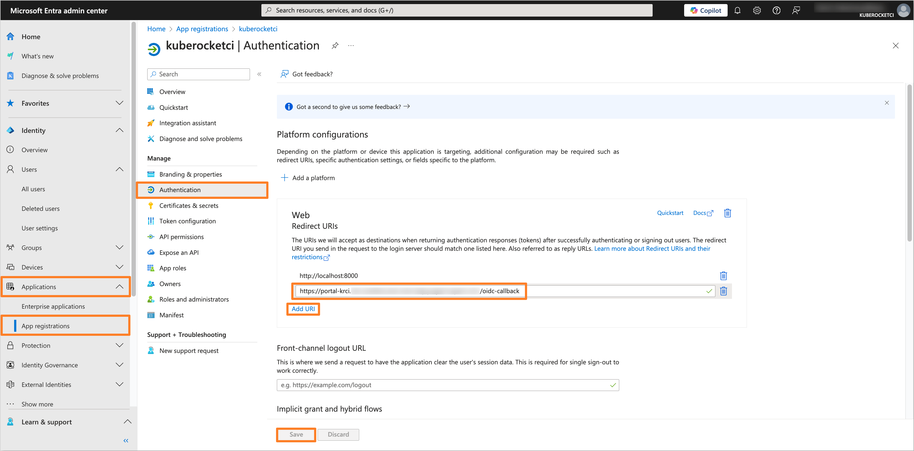

3. After applying the changes, the KubeRocketCI Portal will be configured to use Microsoft Entra OIDC authentication. Users will be able to log in to the Portal using **Sign In** option.

    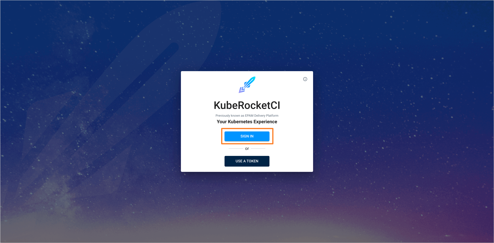

## Conclusion

Integrating OpenID Connect (OIDC) authentication with Microsoft Entra in AWS EKS is a powerful way to enhance security and streamline user access management. By leveraging the capabilities of SSO, OIDC, and Microsoft Entra, organizations can simplify authentication processes, enforce access controls, and ensure secure navigation across cloud-native environments. Whether you're managing user identities, enhancing compliance, or improving user experience, this integration provides a robust solution to meet your identity and access management needs. By following the steps outlined in this guide, you can configure Microsoft Entra as an Identity Provider in AWS EKS, authenticate users using OIDC, and secure access to your EKS clusters and KubeRocketCI Portal effectively.
