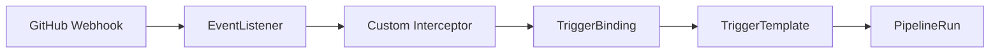
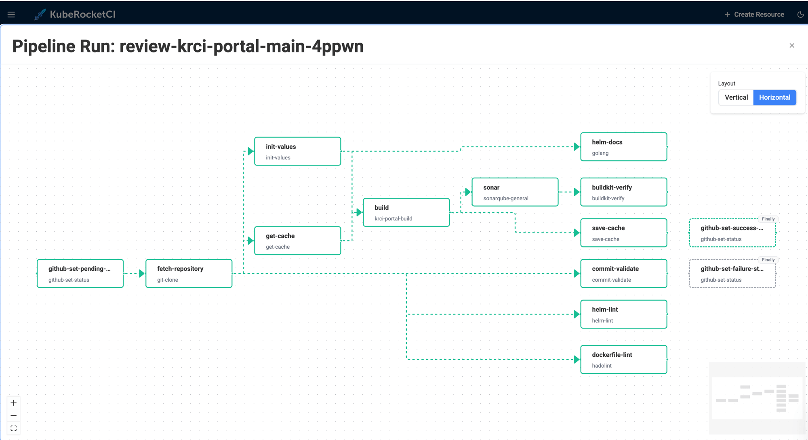
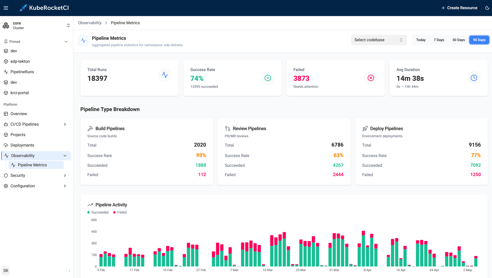

# Kubernetes-Native CI/CD with Tekton | KubeRocketCI

Building CI/CD on Kubernetes used to mean running Jenkins or GitLab CI in a pod and calling it done. [Tekton](https://tekton.dev/docs/) changed that by making pipelines first-class Kubernetes objects - Tasks and Pipelines are CRDs, PipelineRuns are namespaced resources, and every step log is a container log. KubeRocketCI goes a step further: it ships a complete, production-grade CI/CD platform on top of Tekton so your team gets sensible defaults, a portal UI, GitOps-managed pipeline definitions, and opinionated quality gates - without the months of plumbing work that comes with assembling those pieces from scratch. I've seen teams go from a bare cluster to a working build-deploy loop in under a day using this stack.

<!--truncate-->

Here's how the layering works in practice - from Tekton's native primitives to the Helm-templated pipeline library, the webhook-to-PipelineRun chain, each pipeline type, and the portal UI that surfaces it all.

## Why Does Kubernetes-Native CI/CD Matter?

Traditional CI servers are external systems that *talk to* Kubernetes. They authenticate, schedule jobs, wait for responses, and manage their own scaling independently of the cluster. Tekton turns that model inside out - the cluster *is* the CI engine. Every pipeline run is a pod, every step is a container, and the Kubernetes control plane handles scheduling, scaling, and secrets injection natively.

The practical consequences:

- **No CI server to maintain.** No Jenkins controller HA setup, no separate runner fleet. Tekton scales horizontally with your cluster.
- **Uniform RBAC.** Pipeline permissions use Kubernetes ServiceAccounts - no separate credential management UI.
- **Pipeline as code.** Pipeline definitions are YAML manifests, version-controlled alongside application code, and applied to any conformant Kubernetes cluster identically.
- **Native secret injection.** Tekton Tasks consume Kubernetes Secrets and ConfigMaps directly - no plugin abstraction required.
- **Shift-left by default.** Code quality, security scanning, and test gates run inside the cluster as ordinary containers, co-located with the workloads they protect.

## KubeRocketCI and the Tekton Stack

[KubeRocketCI](/docs/about-platform) is an open-source, cloud-agnostic SaaS/PaaS platform built on [Tekton](https://tekton.dev/docs/) - a CNCF Graduated project - developed and maintained by EPAM Systems. Where Tekton gives you primitives, KubeRocketCI gives you a working system.

The platform deploys and manages the full Tekton component set:

| Component | Role |
|---|---|
| **Tekton Pipelines** | Executes all CI and CD pipeline runs |
| **Tekton Triggers** | Listens for Git webhook events and fires the matching pipeline |
| **Tekton Interceptors** | Enriches and filters GitHub, GitLab, and Bitbucket payloads before routing |
| **Tekton Chains** | Signs pipeline artifacts for supply-chain provenance |
| **Tekton Results** | Stores run history for audit trails and portal display |

On top of Tekton, KubeRocketCI adds:

- **Pipeline library** - Helm-packaged Tasks and Pipelines for Java, Go, Node.js, Python, .NET, Helm, Terraform, and more.
- **Portal UI** - full pipeline management with DAG visualization, live log streaming, and inline manual approval gates.
- **Argo CD integration** - pipeline definitions are stored in Git and synchronized by Argo CD. Every change to a pipeline is a reviewed, audited commit.

See [Basic Concepts](/docs/basic-concepts) and the [Tekton Overview](/docs/user-guide/tekton-pipelines) for the full capability matrix.

## How Are Tekton Pipelines Defined in KubeRocketCI?

### The Helm-Templated Library

Pipelines in KubeRocketCI are not hand-written one-offs - they are generated by Helm from a structured library in [edp-tekton](https://github.com/epam/edp-tekton). The naming convention follows:

```
{gitProvider}-{buildTool}-{framework}-app-{pipelineType}-{versioning}
```

For example, a Java 17 Maven build pipeline triggered from GitHub with default versioning renders as:

```
github-maven-java17-app-build-default
```

The same pipeline for GitLab becomes `gitlab-maven-java17-app-build-default`. This pattern means every combination of git provider, language, framework, and versioning strategy gets a consistently named, independently configurable pipeline - without duplicating task logic. Shared task sequences live in common Helm templates (e.g., `_common_java_maven.yaml`) and are included by reference.

### The Real Build Task Sequence

For a Java Maven application, the build pipeline executes these tasks in order:

```
get-version
  └─ update-build-number
       └─ get-cache
            └─ compile
                 └─ test  (JaCoCo coverage)
                      └─ sonar  (quality gate: sonar.qualitygate.wait=true)
                           └─ build  (mvn clean package -DskipTests)
                                └─ push  (mvn deploy -DskipTests)
```

The `sonar` step blocks with `sonar.qualitygate.wait=true` - the build fails fast at the quality gate rather than discovering issues downstream. In my experience, this single flag is the difference between catching technical debt in minutes versus after a release candidate is already tagged. Code that doesn't pass SonarQube never produces an artifact.

Each task is a reusable Tekton `Task` CRD (`maven`, `sonarqube-maven`) - the pipeline only sets parameters and `runAfter` ordering. Swap the `maven` task image to change the JDK version; the pipeline logic stays the same.

### The Webhook-to-PipelineRun Chain

When a pull request is merged on GitHub, the event travels through four Tekton resources before a PipelineRun starts:



The **Custom Interceptor** is the key piece. It enriches the raw GitHub payload with platform-specific `extensions` that the webhook payload alone doesn't contain:

- `extensions.codebase` - the KubeRocketCI codebase name for this repository
- `extensions.codebasebranch` - the branch object with its pipeline configuration
- `extensions.pipelines.build` - the exact pipeline name to run (e.g., `github-maven-java17-app-build-default`)
- `extensions.pullRequest.headSha`, `extensions.pullRequest.author`, `extensions.pullRequest.url`

The **TriggerBinding** then extracts these into named parameters: `gitrevision`, `targetBranch`, `gitsha`, `codebase`, `codebasebranch`, `pipelineName`, `commitMessagePattern`, and Jira integration fields. The **TriggerTemplate** stamps these into a PipelineRun spec and creates it in the cluster.

This architecture means the decision of *which pipeline runs for which codebase* is stored in the platform's Kubernetes objects - not hardcoded in webhook configuration.

## Pipeline Types: From Code Review to Release

KubeRocketCI defines seven pipeline types, identified by the `app.edp.epam.com/pipelinetype` label. All are implemented as Tekton Pipelines.

### Review Pipeline (`pipelinetype: review`)

Triggered by a pull request. Runs static analysis, linting, unit tests, and code-quality gates before a merge is allowed. Typically completes in under five minutes.

Trigger methods: open a PR against a configured branch, comment `/recheck` or `/ok-to-test`, or use the **Run Again** button in the portal.

### Build Pipeline (`pipelinetype: build`)

Triggered on merge to the target branch. Executes the full task sequence (see above), builds and pushes a container image, and produces a versioned artifact. Versioning follows either `BRANCH-[DATETIME]` (default) or SemVer (MAJOR.MINOR.PATCH-BUILD_ID) depending on project configuration.

### Deploy Pipeline (`pipelinetype: deploy`)

Takes a versioned artifact and applies it to a target environment. Trigger modes: manual (via portal), `Auto` (deploy automatically on new artifact), or `Auto-stable` (promote only the rebuilt component, keep others at stable versions).

### Clean Pipeline (`pipelinetype: clean`)

Tears down an environment on demand. Paired with `Auto` deploys and dynamic environments, this enables full ephemeral workflows - spin up for a PR, validate, clean up on merge.

### Security Pipeline (`pipelinetype: security`)

A standalone pipeline decoupled from build, purpose-built for vulnerability scanning. Scan results surface in the portal's **Results** tab and link through to DefectDojo. Decoupling security means scans can run at any cadence without affecting build cycle time.

### Test Pipeline (`pipelinetype: tests`)

Executes automated test suites against already-deployed environments, independent of the deploy cycle. Teams validate application behavior on demand without triggering a full redeploy.

### Release Pipeline (`pipelinetype: release`)

Orchestrates approval and publishing for new releases. KubeRocketCI does not ship a pre-built release pipeline - release governance is organization-specific. The full Tekton API surface is available to build custom approval steps, external system integrations, and auditable release flows.

The complete pipeline type reference is in [Pipelines Overview](/docs/user-guide/pipelines) and [Tekton Overview](/docs/user-guide/tekton-pipelines).

## Customizing Pipelines

The pre-built library covers most tech stacks, but production workloads always have exceptions. KubeRocketCI supports two customization patterns without forking the platform.

### Custom Framework / Build Tool

Define a custom pipeline once with a naming pattern, and every project matching that pattern picks it up automatically. The [Tekton custom pipelines use case](/docs/use-cases/tekton-custom-pipelines) walks through the full authoring flow.

### Branch-Specific Pipelines

When different branches need different logic - `main` with full integration tests, `release` with image signing - pipelines are defined explicitly per branch. See the [custom pipelines flow guide](/docs/use-cases/custom-pipelines-flow#replace-pipelines-with-personalized-versions).

Both approaches follow the same Git-first workflow: write Tekton YAML, apply to the cluster to verify, commit, and let Argo CD synchronize the authoritative state.

## The Portal: Pipeline Management UI

The KubeRocketCI portal ships a dedicated `tekton` module with full pipeline management across four page areas: pipeline list, pipeline details, PipelineRun list, and PipelineRun details.

**Pipeline list with type filter.** The pipeline list filters by `app.edp.epam.com/pipelinetype` label - select `build`, `review`, `deploy`, or any of the seven types to narrow the view. Each pipeline shows its type, last run status, and a **Run with params** button.

**Run with params.** Clicking **Run with params** fetches the `TriggerTemplate` linked to the pipeline (via the `app.edp.epam.com/triggertemplate` label), generates a PipelineRun draft pre-filled with correct parameters, opens a YAML editor for review, and creates the PipelineRun resource via the Kubernetes API on save. No `kubectl` required.

**DAG visualization.** The pipeline details page renders the task graph using React Flow - nodes for each task, directed edges from `runAfter` dependencies, isolated tasks shown separately. Colors map to live status: blue (running), green (succeeded), red (failed), amber (pending). Finally-tasks are distinguished visually from the main execution chain.



**Live logs and history.** The PipelineRun details page streams live container logs while a run is active. After completion, logs are served from Tekton Results - the same view, no separate log aggregation setup needed.

**Inline manual approval.** When a pipeline step is an `ApprovalTask` (a platform-native CRD), the portal renders Approve / Reject buttons directly in the task view - with an optional comment field. The approval decision (`spec.action`, `spec.approve.approvedBy`, `spec.approve.comment`) is written back to the `ApprovalTask` resource. This is how release gates and environment promotion approvals are implemented as Kubernetes-native objects.

## Getting Started

### Step 1 - Install the platform

Follow the [Quick Start: Install KubeRocketCI](/docs/quick-start/platform-installation) guide for a local cluster. For production on AWS, see [Deploy on AWS EKS](/docs/operator-guide/deploy-aws-eks).

### Step 2 - Install Tekton components

The [Install Tekton](/docs/operator-guide/install-tekton) guide covers both vanilla Kubernetes and OKD/OpenShift (Tekton Operator). For the fully automated path, see [Add-Ons Overview](/docs/operator-guide/add-ons-overview).

### Step 3 - Connect your Git provider

Walk through [Integrate GitHub](/docs/quick-start/integrate-github) or configure GitLab/Bitbucket in the portal under **Git Servers**.

### Step 4 - Integrate container registry and code quality

[Integrate DockerHub](/docs/quick-start/integrate-container-registry) wires up image push. [Integrate SonarQube](/docs/quick-start/integrate-sonarcloud) activates the quality gate step in the build pipeline.

### Step 5 - Onboard your first application

[Create Application](/docs/quick-start/create-application) registers your codebase. The platform provisions a review and build pipeline for the default branch automatically - the Helm-templated library selects the correct pipeline name based on your tech stack.

### Step 6 - Configure a deployment environment

[Deploy Application](/docs/quick-start/deploy-application) connects Argo CD and configures the first CD pipeline stage. [Integrate Argo CD](/docs/quick-start/integrate-argocd) covers the Argo CD setup.

From a fresh cluster to a working build-and-deploy loop typically takes a few hours.

## What Every Onboarded App Gets Automatically

Once the platform is running, every onboarded application has:

- A **review pipeline** on every pull request - compile, test, SonarQube quality gate.
- A **build pipeline** on every merge - versioned artifact, container image pushed, Tekton Chains provenance attestation.
- A **CD pipeline** connected to Argo CD - promoting artifacts through configured stages.
- **Pipeline definitions in Git** - every change to a pipeline goes through code review, synchronized by Argo CD.
- **Live + archived logs** - streaming during a run, served from Tekton Results after completion.
- **Manual approval gates** - inline approve/reject in the portal for any pipeline step that requires human sign-off.

This is what our own dogfooding instance looks like - we run KubeRocketCI on KubeRocketCI itself. Over 90 days, the `krci` namespace logged **18,397 pipeline runs** (~200/day across build, review, and deploy types), with build pipelines hitting a **93% success rate** at an average duration of **14 minutes 38 seconds**. No external CI server involved.



The entire path - review pipeline on PR open, build pipeline on merge, artifact versioning, image push, and Argo CD sync - runs without the developer writing a single line of Jenkins Groovy or pipeline YAML. The only required input is declaring the tech stack at onboarding time.

No manual wiring required. The opinionated defaults deliver a production-grade setup from day one, and the full Tekton API surface is available when you need to diverge.

## Next Steps

- Explore the [Tekton Overview](/docs/user-guide/tekton-pipelines) for the complete pipeline type and trigger reference.
- Try the [application scaffolding use case](/docs/use-cases/application-scaffolding) to see the platform generate a project skeleton with a working CI/CD pipeline in minutes.
- Follow [autotest as quality gate](/docs/use-cases/autotest-as-quality-gate) to promote automatically only when integration tests pass.
- Read [deploy application from a feature branch](/docs/use-cases/deploy-application-from-feature-branch) for ephemeral environment patterns.

KubeRocketCI is open-source under Apache License 2.0. Platform source, Helm charts, and the full Tekton pipeline library are on [GitHub](https://github.com/epam/edp-tekton).
