# Try KubeRocketCI Locally in 2 Commands - No Cloud Account Required

Evaluating an internal developer platform without a working instance is like buying a car from a brochure. Every KubeRocketCI install path in the official docs assumes a cluster you already have - AWS EKS, GKE, an on-prem control plane. Today I ran the [try-kuberocketci testbed](https://github.com/KubeRocketCI/try-kuberocketci) end-to-end on my Apple Silicon Mac using Docker Desktop and two commands: **`make testbed`** (approximately 18–20 minutes) and **`make e2e`** (approximately 12 minutes). The result is a fully wired KubeRocketCI local install - Tekton, Argo CD, SonarQube, self-hosted GitLab CE, Prometheus, Grafana, Tekton Results, and the Portal - running in a disposable [kind](https://kind.sigs.k8s.io) cluster. No cloud account. No `/etc/hosts` edits. No clicking through UIs to trigger pipelines. This post walks through exactly what happened, command by command, screenshot by screenshot.

<!--truncate-->

## What is KubeRocketCI?

[KubeRocketCI](/docs/about-platform) (KRCI) is an open-source, Kubernetes-native internal developer platform for cloud-native CI/CD, developed and maintained under Apache 2.0. It assembles [Tekton](https://tekton.dev), [Argo CD](https://argo-cd.readthedocs.io), SonarQube, and your Git provider into a cohesive, opinionated developer experience - managing the lifecycle of your Codebases (applications, libraries, autotests) from source through review, build, and GitOps-based deployment, exposed through a single Portal UI.

KubeRocketCI markets itself as cutting time-from-project-initiation-to-active-development from days to hours. The testbed lets you verify that claim in 30 minutes on a laptop. On our own dogfooding cluster over a recent 90-day window, the platform logged [18,397 pipeline runs with a 93% build success rate](/blog/kubernetes-native-cicd-tekton-kuberocketci) - and it runs the same Tekton pipeline stack you are about to stand up locally.

This repository is not KubeRocketCI itself - it is a local installer and test harness that brings the whole platform up on your machine, ready for evaluation, development, and demo preparation.

## Prerequisites and Hardware Requirements

To run a KubeRocketCI Docker Desktop setup, you need only Docker Desktop - no cloud account, no pre-existing Kubernetes cluster, and no registry account are required.

| Requirement               | Minimum            | Recommended | Notes                                               |
|---------------------------|--------------------|-------------|-----------------------------------------------------|
| Docker Desktop            | 4.x+               | Latest      | Allocate RAM in Docker Settings → Resources         |
| RAM allocation            | 8 GB (core only)   | 12 GB+      | Full bed with GitLab + SonarQube needs 12 GB+       |
| Disk space                | ~20 GB free        | ~30 GB      | Container images and volumes                        |
| OS                        | macOS, Linux, WSL2 | macOS/Linux | Windows via WSL2 supported                          |
| Apple Silicon             | Supported          | -           | amd64 images run via Docker Desktop Rosetta 2       |
| `make`                    | Any version        | -           | Pre-installed on macOS/Linux                        |
| `kind`, `helm`, `kubectl` | Latest stable      | -           | `make tools` installs `kind` via Homebrew           |
| Internet access           | Required           | -           | Images pulled from public registries during install |

:::warning RAM is the most common failure mode

Docker Desktop with **at least 12 GB of RAM allocated** is required for the full bed. Below this threshold, GitLab CE or SonarQube will OOM-kill during startup. My live run used ~11.7 GB allocated to the Docker engine - right at the edge, and it completed successfully, but the README's 12 GB+ recommendation is well-founded. Check Docker Settings → Resources → Memory before running `make testbed`.

:::

On Apple Silicon (M1/M2/M3), Docker Desktop's Rosetta 2 emulation runs the amd64-only images (Portal, GitLab, sonar-operator) transparently. No configuration changes are needed in the testbed - it just works.

## How to Try KubeRocketCI Locally: The Full Stack You Get

The fastest way to try KubeRocketCI locally is two commands on Docker Desktop. The try-kuberocketci testbed spins up a KubeRocketCI kind cluster with the full CI/CD platform - including Tekton, Argo CD, Prometheus/Grafana, Tekton Results, SonarQube, and a self-hosted GitLab CE - in two commands: `make testbed` (approximately 18–20 minutes) and `make e2e` (approximately 12 minutes). All versions are pinned through the [edp-cluster-add-ons](https://github.com/epam/edp-cluster-add-ons) GitOps repository - the same source of truth used in production KubeRocketCI deployments - making the local testbed a faithful reproduction of a real cluster rather than a stripped-down demo.

| Step | Layer          | Component                                         | Version                                       | Namespace        |
|------|----------------|---------------------------------------------------|-----------------------------------------------|------------------|
| 1    | Cluster        | kind (Kubernetes-in-Docker)                       | v1.36.1 (kind default; node image not pinned) | -                |
| 2    | Ingress        | ingress-nginx                                     | controller-v1.11.3                            | ingress-nginx    |
| 3    | Certs          | cert-manager                                      | v1.16.2                                       | cert-manager     |
| 4    | CI engine      | [Tekton](https://tekton.dev) Pipelines / Triggers | v1.6.0 / v0.34.0                              | tekton-pipelines |
| 5    | CD engine      | [Argo CD](https://argo-cd.readthedocs.io)         | chart 9.5.17                                  | argocd           |
| 6    | Observability  | kube-prometheus-stack + Grafana                   | 84.5.0                                        | monitoring       |
| 7    | Run storage    | Tekton Results                                    | v0.17.2                                       | tekton-pipelines |
| 8    | Code quality   | SonarQube Community + sonar-operator 3.3.0        | 2025.3.1 (chart) / 25.5-community             | sonar            |
| 9    | SCM + Registry | GitLab CE + bundled Container Registry            | 17.5.1-ce                                     | gitlab           |
| 10   | Platform       | KubeRocketCI (edp-install)                        | **3.14.0**                                    | krci             |

**Why is KubeRocketCI installed last?** The edp-install chart renders provider resources - the GitServer CRD, EventListener, Ingress rules - at install time. If GitLab or Argo CD is not already running when the chart applies, the operator's SSH connection check fails and the platform never reaches a healthy state. Installing KubeRocketCI last, after every dependency is ready, is what makes the chart wire itself correctly on first reconcile.

## Step 1 - Clone the Repo and Spin Up the Testbed

```bash
git clone https://github.com/KubeRocketCI/try-kuberocketci
cd try-kuberocketci
make testbed   # ~18-20 min
```

That is the entire KubeRocketCI local install. One clone, one command.

:::tip Check Docker Desktop RAM allocation first

Before running `make testbed`, open Docker Desktop → Settings → Resources and verify the memory slider is set to 12 GB or higher. This is the single most common reason the install fails, and it takes 30 seconds to check.

:::

`make testbed` builds in strict dependency order, installing KubeRocketCI last. The sequence:

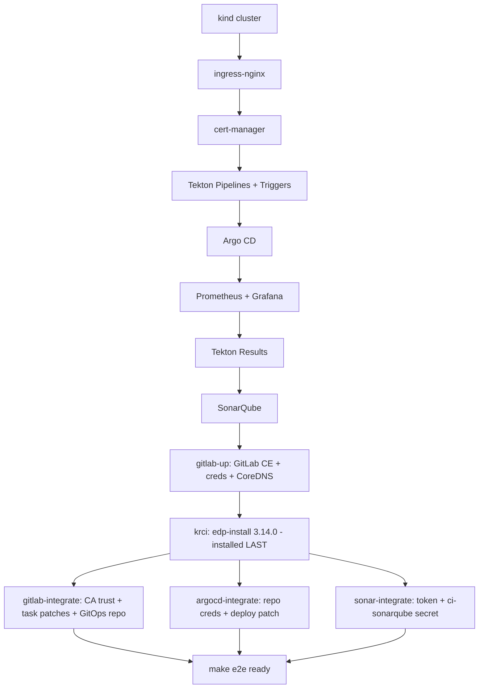

GitLab CE is the slowest component to initialize - plan for it to take several minutes of the total. Once `make testbed` completes, run `make status` to see the live cluster state and print all service URLs with credentials:

```text
NAME                 STATUS   ROLES           AGE   VERSION
krci-control-plane   Ready    control-plane   13m   v1.36.1
--- krci pods ---
NAME                                    READY   STATUS    RESTARTS   AGE
cd-pipeline-operator-57b96f56ff-x7nlw   1/1     Running   0          84s
codebase-operator-68b7599446-h8cn7      1/1     Running   0          41s
el-edp-gitlab-6cfc7857d9-fnxxd          1/1     Running   0          84s
gitfusion-86cb475dc9-mdbgb              1/1     Running   0          84s
krci-portal-65956587d5-6tvtf            1/1     Running   0          31s
tekton-cache-89846975f-86fx8            1/1     Running   0          84s
tekton-interceptor-6c68789887-88z86     1/1     Running   0          84s
...
================ Tool URLs & credentials (local only) ================
  Argo CD UI:     http://argocd.127.0.0.1.nip.io
  SonarQube UI:   http://sonar.127.0.0.1.nip.io
  GitLab UI:      https://gitlab.127.0.0.1.nip.io
  Results API:    http://tekton-results.127.0.0.1.nip.io
  Grafana UI:     http://grafana.127.0.0.1.nip.io
  Portal UI:      https://portal.127.0.0.1.nip.io
```

All six services are immediately reachable in a browser. No `/etc/hosts` edits - I will explain why in the next section.

## nip.io Wildcard DNS: No /etc/hosts Editing Required

The try-kuberocketci testbed uses [nip.io](https://nip.io) wildcard DNS so every platform service gets a stable, browser-accessible URL - no `/etc/hosts` edits, no port-forwards, no local DNS configuration required. Any subdomain of `<IP>.nip.io` resolves to `<IP>` via a public DNS server; the testbed generates all ingress hostnames in the `*.127.0.0.1.nip.io` pattern, so every service is immediately reachable from your browser with zero local DNS configuration.

Every competing local Kubernetes tutorial either requires manual `/etc/hosts` edits to map ingress hostnames to `127.0.0.1`, or skips DNS entirely and uses port-forwards. For a KubeRocketCI Docker Desktop setup that serves six platform UIs simultaneously, manual host-file management would be a non-starter - nip.io eliminates the entire problem class.

| Service             | URL                                      |
|---------------------|------------------------------------------|
| KubeRocketCI Portal | `https://portal.127.0.0.1.nip.io`        |
| Argo CD             | `http://argocd.127.0.0.1.nip.io`         |
| GitLab CE           | `https://gitlab.127.0.0.1.nip.io`        |
| SonarQube           | `http://sonar.127.0.0.1.nip.io`          |
| Grafana             | `http://grafana.127.0.0.1.nip.io`        |
| Tekton Results API  | `http://tekton-results.127.0.0.1.nip.io` |

The DNS trick works for your browser on the host. Inside the cluster, pods resolve `gitlab.127.0.0.1.nip.io` to the in-cluster GitLab Service via CoreDNS rewrites, and the kind node's containerd uses a registry mirror config to pull images from GitLab's bundled registry. This split-horizon DNS design is one of the more interesting pieces of the testbed architecture - the full walkthrough is in [docs/architecture.md](https://github.com/KubeRocketCI/try-kuberocketci/blob/main/docs/architecture.md).

## Step 2 - Run the End-to-End Pipeline

```bash
make e2e   # ~12 min
```

### How Does `make e2e` Run the Full CI/CD Pipeline Automatically?

`make e2e` automates the complete CI/CD cycle - opening a GitLab Merge Request, triggering a Tekton review pipeline, merging the MR, building and pushing a container image with kaniko to GitLab's bundled registry, and asserting the Go/Gin sample application is live via Argo CD sync - in approximately 12 minutes with zero UI clicks.

Here is the verbatim output from my run today:

```text
==> Applying the sample Codebase (test-go-app)
==> Waiting for the Codebase to be provisioned in GitLab (project + template push)
==> Waiting for the codebase-operator to create the project webhook
==> Waiting for the CodebaseImageStream test-go-app-main to exist
==> Creating the demo CDPipeline + dev Stage (triggerType: Auto)
==> Opening a merge request (branch ci-e2e-...) to trigger the review pipeline
    merge request !1 opened
==> Waiting for the webhook to create the review PipelineRun(s)
    triggered: pipelinerun.tekton.dev/review-test-go-app-main-2g7kd
==> Evaluating per-task results (review)
    review-test-go-app-main-2g7kd -> ALL_GREEN
==> Merging merge request !1 (action=merge fires the build trigger)
    merge request !1 merged
==> Waiting for the build run(s) to finish (kaniko build+push can take several minutes)
==> Evaluating per-task results (build)
    build-test-go-app-main-m8kpm -> ALL_GREEN
==> Reading the built image tag from CodebaseImageStream test-go-app-main
    built tag: main-20260606-132413
==> Waiting for the Auto trigger to deploy tag main-20260606-132413
    triggered: pipelinerun.tekton.dev/deploy-demo-dev-kkmqg
==> Evaluating per-task results (deploy)
    deploy-demo-dev-kkmqg -> ALL_GREEN
==> Verifying the application is deployed in krci-demo-dev on tag main-20260606-132413
    OK test-go-app gitlab.127.0.0.1.nip.io:5050/krci/test-go-app:main-20260606-132413@sha256:a39d120b...
E2E RESULT: PASS - review + build + deploy all green; test-go-app:main-20260606-132413 auto-deployed to krci-demo-dev.
```

The post-run cluster state confirms everything:

```bash
$ kubectl -n krci get pipelinerun
NAME                            TYPE     SUCCEEDED   REASON
build-test-go-app-main-m8kpm    build    True        Completed
deploy-demo-dev-kkmqg           deploy   True        Succeeded
review-test-go-app-main-2g7kd   review   True        Completed

$ kubectl -n krci-demo-dev get deploy,pods
NAME                          READY   UP-TO-DATE   AVAILABLE   AGE
deployment.apps/test-go-app   1/1     1            1           85s
pod/test-go-app-595fd7f5dc-8sbrc   1/1   Running   0           85s

$ kubectl get applications -A
NAMESPACE  NAME                  SYNC STATUS  HEALTH STATUS
krci       demo-dev-test-go-app  Synced       Healthy
```

The full MR-to-deployed-workload sequence, as a pipeline diagram:

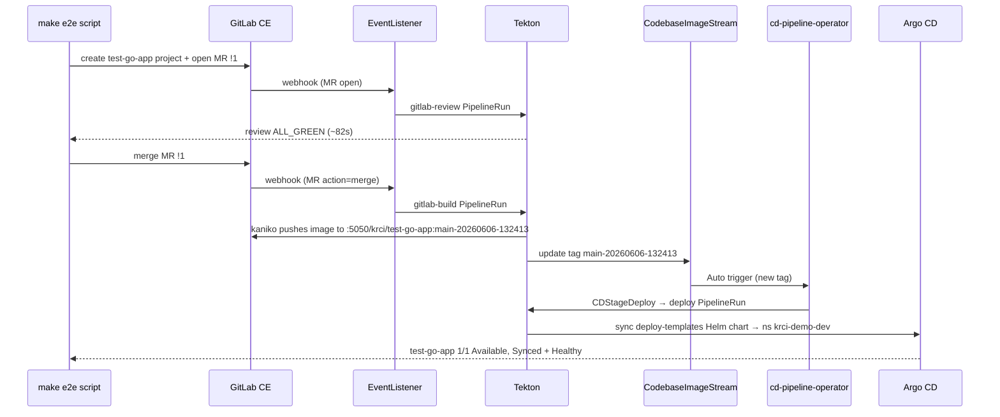

### Why GitLab's Bundled Container Registry?

A common blocker in local CI/CD setups is the container registry: DockerHub rate limits, Harbor setup complexity, credentials management. GitLab CE ships with a built-in Container Registry served on port 5050. The testbed wires kaniko to push images directly to it - eliminating every external registry dependency. Kaniko trusts the self-signed cert via a chart flag (`edp-tekton.kaniko.customCert: true`), and a group deploy token backs both push and pull. The registry URL is `gitlab.127.0.0.1.nip.io:5050/krci/<codebase>`, which maps cleanly to each codebase's GitLab project registry. No DockerHub account, no Harbor, no separate registry pod.

A note on the review/build trigger split: the EventListener has two separate Trigger CRs - `gitlab-review` fires on MR `open/reopen/update`; `gitlab-build` fires on MR `action=merge`. This means **merging** the MR - not a push to the branch - kicks the build pipeline. It is an intentional design choice that avoids spurious build runs on every force-push. Also worth noting: GitLab can occasionally deliver the MR webhook twice, creating a duplicate review run that fails fast with a harmless HTTP 400 when it tries to post the same commit status context. The e2e script asserts at least one run is fully green - the duplicate does not affect the result.

## Exploring the Platform After Install

After `make e2e` passes, every component has real data in it. Here is what I found navigating each UI - a practical KubeRocketCI getting started tour of each surface.

### KubeRocketCI Portal

The Portal signs in with a Kubernetes bearer token rather than a username/password - run `make token` to mint a 24-hour token, then paste it into the Portal's "More options → Use Service Account Token" field. (OIDC is intentionally not wired up in the testbed - there is no identity issuer inside a kind cluster - so the service-account token is the local sign-in path. `make status` flags the in-cluster Portal's token login as still being wired up; I captured these views through the Portal using that same `make token` service-account flow.)

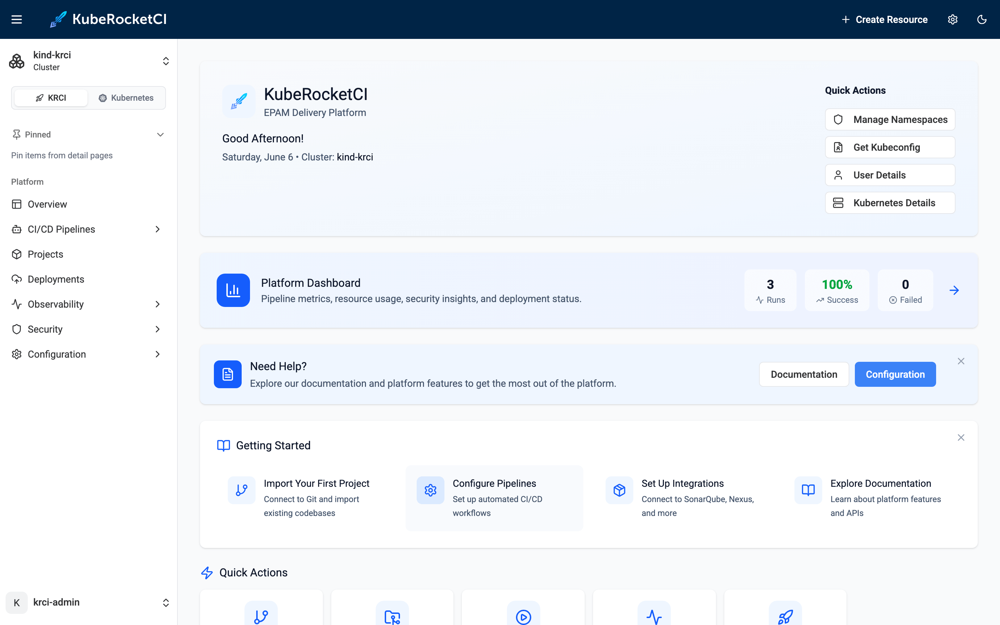

The home dashboard shows the pipeline metrics from the e2e run: **3 total runs, 100% success rate, 0 failed, average duration 2m 18s**. This is the same observability surface that surfaces 18,397 runs on the production cluster - just seeded with a single e2e cycle.

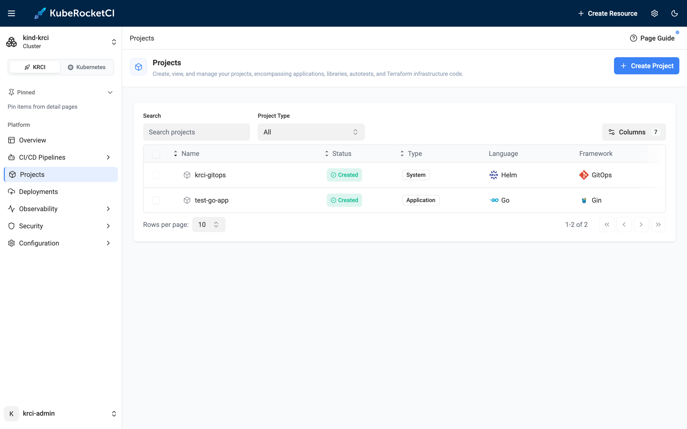

The Projects page shows both registered codebases: `krci-gitops` (the GitOps/Helm system codebase that KubeRocketCI requires) and `test-go-app` (the Go/Gin application created by the e2e script). Both show status Created.

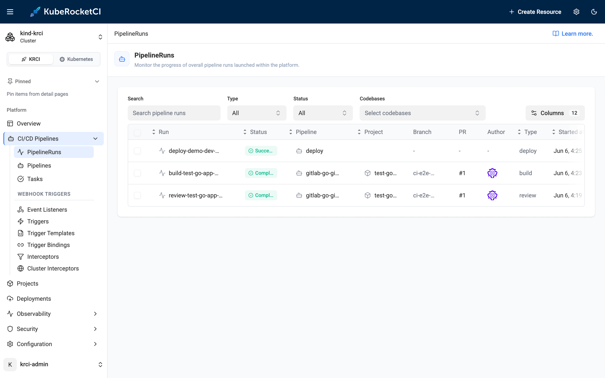

The PipelineRuns list shows all three runs - deploy, build, review - all green, all for `test-go-app` on PR #1.

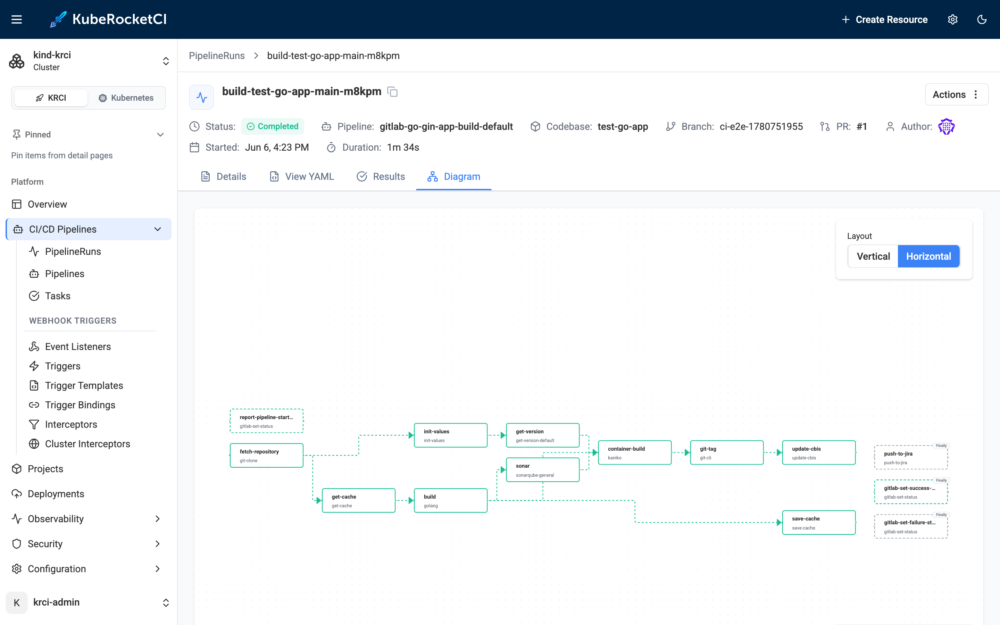

The build pipeline DAG is the most visually satisfying part. Every node in the React Flow graph is green: `report-pipeline-start` → `fetch-repository` → `get-version` → `sonar` → `build` → `container-build` → `git-tag` → `update-cbis` → `save-cache`. The sonar step includes a quality gate wait - the build would have failed here if SonarQube reported issues.

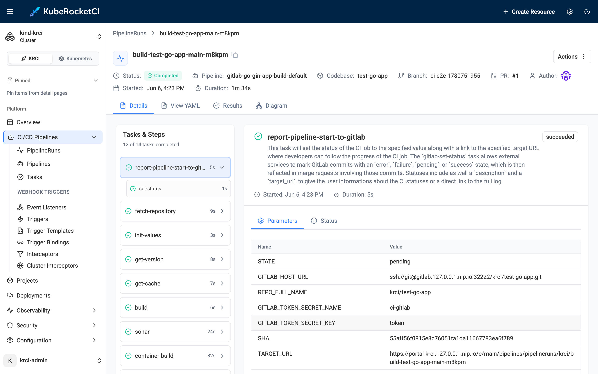

The build run details confirm the pipeline name (`gitlab-go-gin-app-build-default`) and duration (1m 34s). This is the Helm-templated pipeline library at work - the name encodes the Git provider, language, framework, and pipeline type, as described in the [Kubernetes-native CI/CD with Tekton](/blog/kubernetes-native-cicd-tekton-kuberocketci) post.

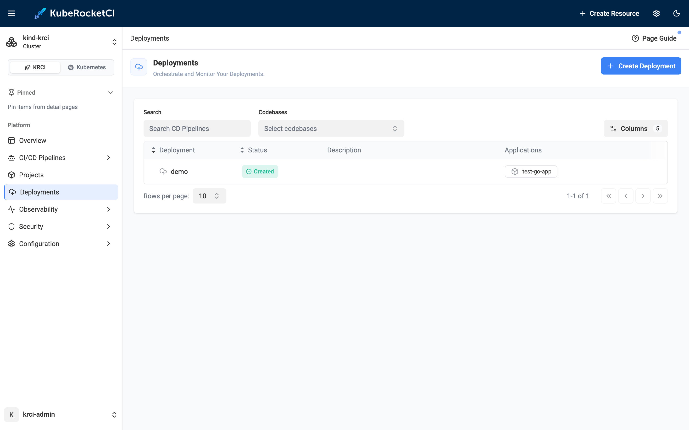

The Deployments page shows the `demo` CDPipeline created by the e2e script, with `test-go-app` as its application.

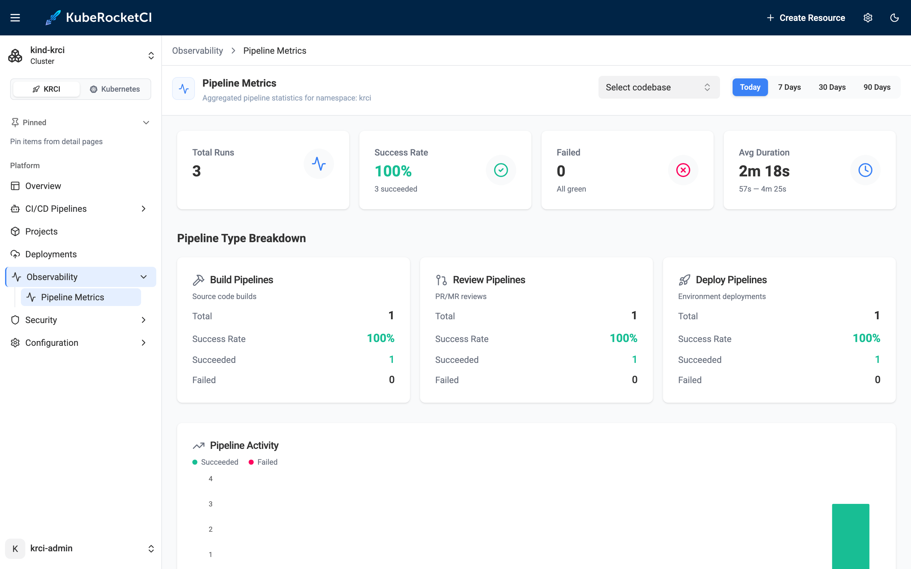

The Observability → Pipeline Metrics view breaks down the three runs: Build 1/100%, Review 1/100%, Deploy 1/100%, average 2m 18s across all types.

### Argo CD

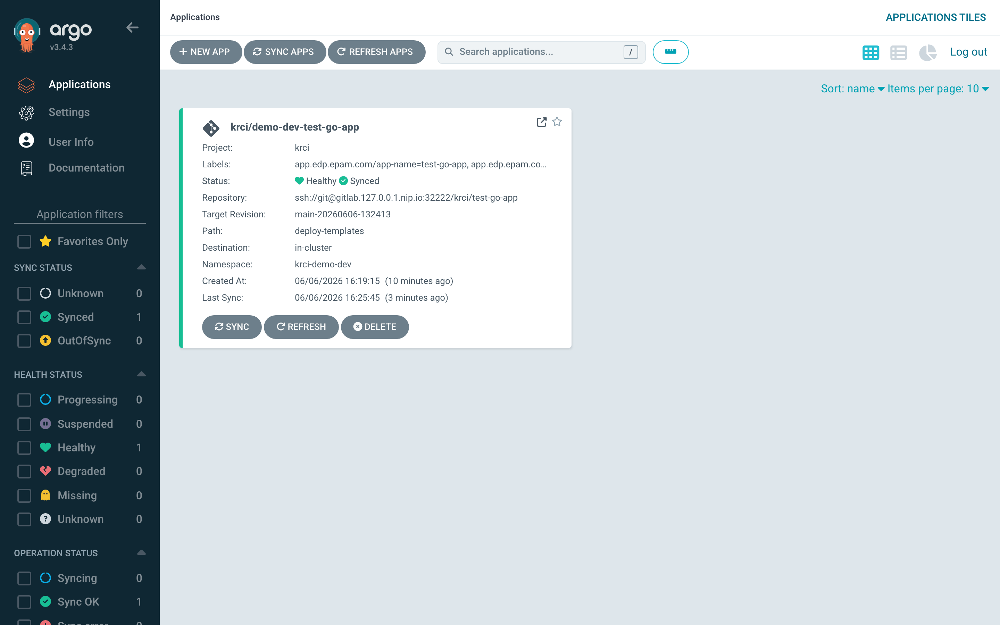

Argo CD shows `demo-dev-test-go-app` as Synced + Healthy, target revision `main-20260606-132413`, path `deploy-templates`, namespace `krci-demo-dev`. This is the GitOps delivery leg: after kaniko pushed the image and the CodebaseImageStream updated, the cd-pipeline-operator created a CDStageDeploy resource, which triggered a deploy PipelineRun, which applied the Helm chart through Argo CD. The full GitOps chain, locally.

### GitLab

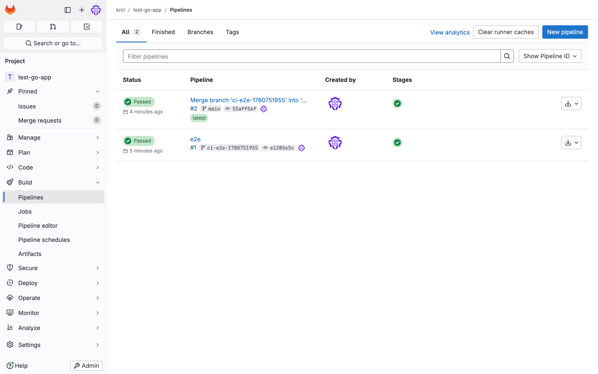

The self-hosted GitLab project shows both pipelines as Passed - Tekton's `gitlab-set-status` task wrote commit statuses back to GitLab after each pipeline run completed. Pipeline #1 is the review run (MR open), pipeline #2 is the build run (MR merge). The Go/Gin app is live at `test-go-app` in namespace `krci-demo-dev` - its `/` route returns 404 by design (no root handler in the Gin app), but the server is live and the deployment is `1/1 Available`.

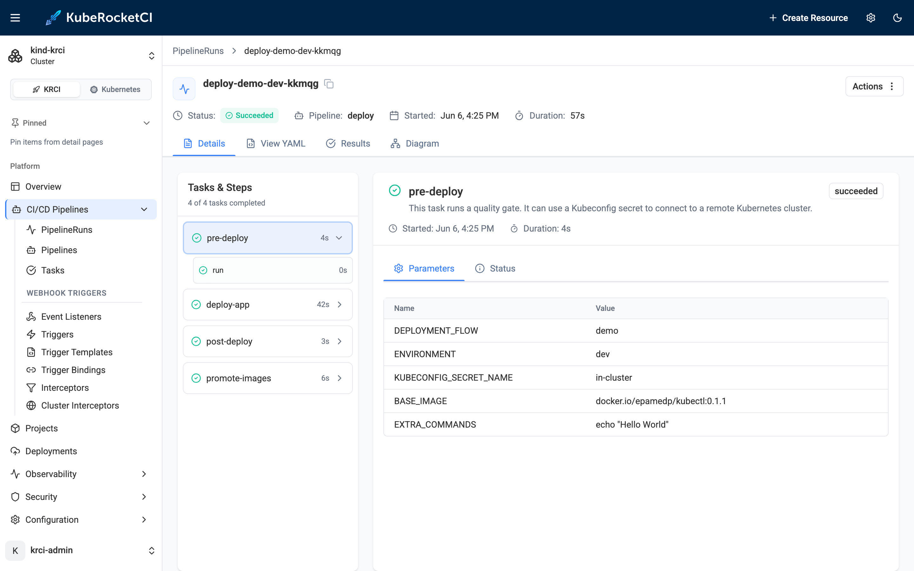

The deploy PipelineRun details confirm the full GitOps delivery chain completed in 57 seconds - all four tasks green (pre-deploy → deploy-app → post-deploy → promote-images), the Argo CD sync applied, and the workload live in `krci-demo-dev`.

To explore [Tekton pipelines in KubeRocketCI](/docs/user-guide/tekton-pipelines) further, or start customizing pipelines for your own stack, the [krci CLI daily use](/blog/krci-cli-daily-use) post covers how to drive the platform from the terminal and hand off to AI agents. For the foundational [basic concepts](/docs/basic-concepts), the docs cover Codebases, CDPipelines, CodebaseImageStreams, and Stages in depth.

## Tearing Down: make down

```bash
make down
```

`make down` deletes the kind cluster and all associated Kubernetes resources, leaving Docker Desktop in a clean state. Nothing persists outside the kind cluster - no volumes, no registry state, no credentials. The testbed is fully disposable and can be re-run from scratch in under 20 minutes.

This disposability is a first-class design goal, not an afterthought. For full from-zero validation: `make down && make testbed && make e2e`. The [try-kuberocketci repository](https://github.com/KubeRocketCI/try-kuberocketci) runs this sequence as part of its own CI regression.

:::info Safe on shared machines

The testbed uses fixed local-only credentials, self-signed TLS, and broad RBAC - all intentionally, for a throwaway kind cluster bound to localhost. It is explicitly not safe to expose or use on any shared, internet-reachable, or production cluster. See [SECURITY.md](https://github.com/KubeRocketCI/try-kuberocketci/blob/main/SECURITY.md) for the details.

:::

## Use Cases: Why Try KubeRocketCI Locally?

The fastest way to try KubeRocketCI locally is also the safest way to evaluate it - no cloud spend, no shared infrastructure, no consequences if something breaks. Here are the four use cases where the testbed pays off immediately.

**Evaluating KubeRocketCI before adoption.** Before committing months of engineering time to an IDP, run `make testbed` and spend 30 minutes with the real platform - not a demo video or a vendor-configured sandbox. Compare hands-on against Backstage, kubriX, or other IDPs with a working instance under your own fingers. The [official platform installation guide](/docs/quick-start/platform-installation) covers the cloud path when you are ready to move from local to a real cluster.

**Learning platform engineering.** The testbed is a coherent, fully-wired example of Tekton, Argo CD, GitOps, SonarQube, and Tekton Results working together. Every piece is independently inspectable with `kubectl`, `helm`, and the respective UIs. Productive learning by reading a real system, not a toy demo.

**Contributing to KubeRocketCI.** The testbed is designed as a contributor sandbox. Run `make down && make testbed` to reproduce an issue from scratch without a cloud account. Each component can be rebuilt independently (`make sonar`, `make argocd`, etc.), so debugging one piece does not require tearing down the rest.

**Demo preparation.** Spin up a fresh instance in under 20 minutes before a presentation; tear down afterward. The `make e2e` output gives you a verified, live end-state to present - not a screen recording.

## How This Compares to Other Local IDP Options

The table below compares try-kuberocketci against the three closest local IDP alternatives across the features that matter most for local evaluation - install time, automated testing, component depth, and Apple Silicon support.

| Feature                    | try-kuberocketci               | CNOE idpBuilder         | kubriX kind guide | Manual Tekton+ArgoCD |
|----------------------------|--------------------------------|-------------------------|-------------------|----------------------|
| Commands to full stack     | 2 (`make testbed`, `make e2e`) | 1 (`idpbuilder create`) | 6 manual steps    | 15+ manual steps     |
| Install time               | ~18–20 min                     | ~5–10 min               | ~30 min           | 60+ min              |
| Automated E2E test         | Yes (zero UI clicks)           | No                      | No                | No                   |
| Tekton CI pipelines        | Yes                            | No                      | No                | Manual               |
| Self-hosted GitLab CE      | Yes                            | No (Gitea)              | No                | No                   |
| SonarQube                  | Yes                            | No                      | No                | Optional/manual      |
| Tekton Results             | Yes                            | No                      | No                | No                   |
| Prometheus + Grafana       | Yes                            | No                      | No                | No                   |
| Apple Silicon support      | Explicit (Rosetta)             | Yes                     | Not documented    | Not documented       |
| nip.io DNS (no /etc/hosts) | Yes                            | Partial                 | No                | No                   |
| GitOps-pinned versions     | Yes (edp-cluster-add-ons)      | Partial                 | No                | No                   |
| Teardown command           | `make down`                    | Manual                  | Manual            | Manual               |

CNOE idpBuilder is the closest open-source alternative - it installs Argo CD, Gitea, and ingress-nginx in approximately 5–10 minutes with a single command. It is a solid choice for a minimal GitOps sandbox. What it does not have: Tekton CI pipelines, SonarQube quality gates, Tekton Results for pipeline history, Prometheus/Grafana observability, or an automated end-to-end pipeline proof. The try-kuberocketci testbed installs a significantly larger stack and uniquely validates the full MR-to-deployed-workload cycle without any UI interaction. Also note: GitHub integration is fully supported in production KubeRocketCI ([integrate GitHub with KubeRocketCI](/docs/quick-start/integrate-github)) - the testbed uses GitLab specifically because it can be self-hosted in the kind cluster without a cloud account.

## Frequently Asked Questions

### What is KubeRocketCI?

KubeRocketCI (KRCI) is an open-source internal developer platform for cloud-native CI/CD on Kubernetes, developed by EPAM and released under Apache 2.0, that integrates Tekton, Argo CD, and GitLab (or GitHub, Bitbucket) into a unified developer workflow platform. It manages Codebases from source through review, build, and GitOps-based deployment, surfacing everything through a single Portal UI and CLI.

### How do I try KubeRocketCI without a cloud account?

Clone the [try-kuberocketci repository](https://github.com/KubeRocketCI/try-kuberocketci) and try KubeRocketCI locally by running `make testbed` - it installs the full KubeRocketCI platform on a local kind cluster on Docker Desktop in approximately 18–20 minutes, with no cloud account or pre-existing Kubernetes cluster required. Run `make e2e` afterward to validate the full CI/CD pipeline automatically.

### What are the hardware requirements to run KubeRocketCI locally?

Docker Desktop with at least 12 GB of RAM allocated to the Docker engine is required for the full bed (8 GB suffices if you skip GitLab and SonarQube). Approximately 20 GB of free disk space is also needed for container images and volumes. No other cloud or network infrastructure is required.

### Does KubeRocketCI work on Apple Silicon (M1/M2/M3)?

Yes. Apple Silicon (M1/M2/M3) is fully supported: Docker Desktop's Rosetta 2 emulation runs the amd64 container images (Portal, GitLab CE, sonar-operator) transparently on ARM64 hardware, with no configuration changes required in the testbed. I ran the entire flow on an Apple Silicon Mac for this post - the testbed explicitly documents and tests ARM64 support.

### How long does it take to install KubeRocketCI locally?

**`make testbed`** installs the full platform in **approximately 18–20 minutes**; **`make e2e`** runs a complete automated pipeline proof in **approximately 12 minutes**. Total time from zero to a verified live workload is under 35 minutes. GitLab CE is typically the slowest component to initialize - the rest of the stack comes up faster.

### What components does `make testbed` install?

In dependency order: a single-node kind cluster, ingress-nginx, cert-manager, Tekton Pipelines/Triggers, Argo CD, Prometheus and Grafana, Tekton Results, SonarQube Community, self-hosted GitLab CE (with bundled container registry), and KubeRocketCI edp-install 3.14.0 - 10 components in a defined sequence, with KubeRocketCI installed last so the chart can wire itself to every running dependency on first reconcile.

### How do I run an end-to-end CI/CD pipeline locally with KubeRocketCI?

Run **`make e2e`** after `make testbed` completes. It automates the full cycle: applies a sample Go/Gin Codebase, waits for the codebase-operator to provision the GitLab project and webhook, opens a Merge Request to trigger the Tekton review pipeline, merges the MR to trigger the build pipeline (kaniko pushes the image to GitLab's bundled registry), waits for Argo CD to sync the deployment, and asserts the workload is `1/1 Available` - all in approximately 12 minutes with zero UI clicks.

### How do I tear down the local KubeRocketCI environment?

Run **`make down`** to delete the kind cluster and all associated Kubernetes resources, leaving Docker Desktop in a clean state. Nothing persists outside the kind cluster. The testbed can be re-run from scratch in under 20 minutes and is designed to be fully disposable - suitable for evaluation, demo preparation, contributor testing, and automated platform CI regression.

### Why is there no /etc/hosts editing required?

The testbed uses [nip.io](https://nip.io) wildcard DNS: any subdomain of `<IP>.nip.io` resolves to `<IP>` via public DNS, so all platform services get stable browser-accessible URLs (`*.127.0.0.1.nip.io` → `127.0.0.1`) without any local DNS configuration. Inside the cluster, CoreDNS rewrites handle pod-to-service resolution, and the kind node's containerd uses a registry mirror config for image pulls - no host-level DNS changes at any point.

### What is the difference between try-kuberocketci and CNOE idpBuilder?

CNOE idpBuilder spins up a minimal IDP stack (Argo CD + Gitea + ingress-nginx) in approximately 5–10 minutes but ships no Tekton CI pipelines, no SonarQube, no GitLab CE, no Tekton Results, and no automated e2e validation. The try-kuberocketci testbed installs a full production-parity platform with all of these in ~18–20 minutes and uniquely includes a fully automated end-to-end pipeline test that validates a real MR-to-deployed-workload cycle without any UI interaction.

## Summary

The fastest way to try KubeRocketCI locally is two commands on Docker Desktop. **`make testbed`** brings up a complete KubeRocketCI platform - 10 components including Tekton, Argo CD, SonarQube, GitLab CE, Prometheus/Grafana, and Tekton Results - in approximately 18–20 minutes. **`make e2e`** validates the full MR-to-deployed-workload pipeline automatically in approximately 12 minutes. Total: under 35 minutes from zero to a verified live workload, on Docker Desktop, with no cloud account. **`make down`** leaves nothing behind.

I ran this end-to-end on June 6, 2026 on an Apple Silicon Mac with Docker Desktop. The e2e test passed with 3/3 green runs (review + build + deploy), 100% success rate, average duration 2m 18s, and the Go/Gin sample app deployed at tag `main-20260606-132413`.

The most useful next steps from here:

- Explore the [KubeRocketCI quick start overview](/docs/quick-start/quick-start-overview) to continue KubeRocketCI getting started and move from a local kind cluster to a real cloud deployment.
- Read [Kubernetes-native CI/CD with Tekton](/blog/kubernetes-native-cicd-tekton-kuberocketci) for the deeper pipeline architecture and production metrics.
- Use the [krci CLI](/blog/krci-cli-daily-use) to drive the platform from the terminal and AI agents after onboarding your first real application.
- Check [KubeRocketCI documentation](https://docs.kuberocketci.io) for the full operator guide and integration references.

KubeRocketCI is open-source under Apache License 2.0. The testbed, platform source, and Helm charts are all on [GitHub](https://github.com/KubeRocketCI/try-kuberocketci).

{/* cspell:ignore fnxxd mdbgb tvtf kkmqg sbrc */}
