# Ephemeral Preview Environments on Kubernetes

An ephemeral preview environment is an isolated, temporary Kubernetes deployment created from a single feature branch and torn down when the work is done. Every branch gets its own namespace, its own image, its own URL - and zero of it lingers afterward. Ephemeral environments on Kubernetes make this pattern available on your own cluster - but a hands-on, open-source, portal-native version - feature branch to isolated namespace to one-click destroy, backed by real Tekton CI and Argo CD GitOps - is conspicuously missing from the public record.

So I built one, end to end, on the same local [try-kuberocketci](/blog/try-kuberocketci-locally) testbed from my last post: a [kind](https://kind.sigs.k8s.io) cluster running [KubeRocketCI](/docs/about-platform) 3.14.0 with Tekton, Argo CD, and self-hosted GitLab. This post is the full walkthrough - every screenshot, every line of terminal output, captured from a live run. We will take a stable `main` deployment, branch off it, ship a change that is visible *only* in the preview environment, inject per-environment config through GitOps, prove the two environments never touch each other, and then destroy the whole thing - leaving the baseline exactly as it was.

<!--truncate-->

## What Is an Ephemeral Preview Environment?

An **ephemeral preview environment** is a short-lived, namespace-isolated copy of your application, provisioned automatically from a feature branch or pull request and destroyed when that branch merges or is no longer needed. Unlike a shared staging environment - where one branch at a time monopolizes the slot - a preview environment is dedicated to a single branch, carries no long-term state, and releases its resources (namespace, pods, ingress) the moment you tear it down.

The terms *preview environment* and *ephemeral environment* are used interchangeably. "Preview" emphasizes the use case (review a branch before merge); "ephemeral" emphasizes the lifecycle (temporary by design). In KubeRocketCI they are the same object: a Deployment **Stage** with its own isolated Kubernetes namespace, created for a branch and removed on demand.

A preview environment lifecycle has five stages:

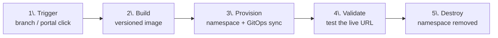

1. **Trigger** - create or push a branch in the Portal.
2. **Build** - Tekton pipeline builds and pushes a versioned image.
3. **Provision** - namespace created, Argo CD syncs the application.
4. **Validate** - test the live URL.
5. **Destroy** - namespace and Argo CD application deleted.

### Ephemeral vs. Staging: Why Shared Environments Become Bottlenecks

A shared staging environment serializes your team: only one branch can occupy it at a time, so parallel feature work cannot be validated simultaneously, and "who broke staging?" becomes a recurring standup question. Ephemeral preview environments give every branch its own namespace, so several features can be tested concurrently without interfering - and when a branch merges, its namespace is deleted, so there is no idle staging box quietly accruing cost.

That last point matters more than it looks. Industry surveys consistently find a large share of provisioned Kubernetes capacity sits idle, and the trend is getting worse - [CAST AI's 2026 State of Kubernetes Optimization Report](https://cast.ai/blog/2026-state-of-kubernetes-resource-optimization-cpu-at-8-memory-at-20-and-getting-worse/) measured average CPU utilization at just **8%** across roughly 23,000 production clusters (down from 10% a year earlier), and [Flexera's 2026 State of the Cloud report](https://www.flexera.com/about-us/press-center/flexera-finds-cloud-value-is-rising-while-ai-waste-grows) pegs self-estimated cloud waste at **~29%**, its first rise in five years. Permanent staging environments are a textbook source of that waste. An environment that deletes itself cannot become idle.

### Namespace-per-Branch, vCluster, or Dedicated Cluster?

There are three common isolation models. **Namespace-per-branch** reuses one shared control plane, provisions in seconds, and is sufficient for most teams - it is the model used here. **vCluster** adds a lightweight virtual API server per environment for stronger isolation at higher overhead. A **dedicated cluster per branch** is maximum isolation but impractical at scale. KubeRocketCI uses namespace-per-branch, with Argo CD managing each namespace's application manifests.

:::note Namespace isolation is not network isolation
A separate namespace scopes names, RBAC, and quotas - but by default pods in different namespaces can still reach each other over the cluster network. If your preview environments need network isolation too, add `NetworkPolicy` rules; the namespace boundary alone does not provide them.
:::

## How KubeRocketCI Delivers Preview Environments

Before the walkthrough, a quick map of the moving parts. KubeRocketCI wraps a few [core concepts](/docs/basic-concepts) that turn a Git branch into a running environment:

- **Codebase / CodebaseBranch** - your application (`test-go-app`) and a branch within it (`feature-tt-123`). Creating a branch in the Portal creates the `CodebaseBranch` resource and mirrors the branch into Git.
- **CodebaseImageStream (CBIS)** - the record of container image tags built for a branch. The build pipeline writes new tags here; the CD side reads from it. This handoff is the key to ordering (more on that below).
- **Deployment (CDPipeline) and Environment (Stage)** - the deployment flow and the individual environments within it. A Stage owns a namespace and an Argo CD Application.
- **Trigger type** - `Manual`, `Auto`, or `Auto-stable`. We use **Auto**: the environment redeploys whenever a new image tag lands in the CBIS, so the preview env always tracks the branch head with no manual step. (See [Deployment Strategies](/docs/user-guide/auto-stable-trigger-type).)

Here is the full path from a feature-branch build to a live, isolated workload:

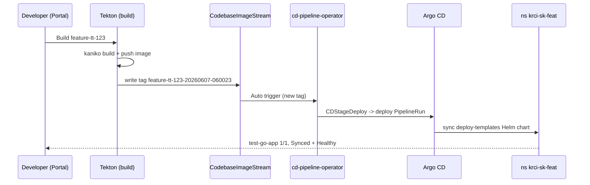

The crucial detail is the **CBIS handoff**: Tekton writes the image tag *after* the image is actually pushed, and the Auto trigger only fires once that tag exists. The image is therefore guaranteed to be present before Argo CD tries to deploy it - which avoids the `ImagePullBackOff` race that bare deploy-only tooling is prone to.

## Baseline: The Local Testbed Starting Point

The starting point is the end state of the [previous post](/blog/try-kuberocketci-locally): the sample Go/Gin app `test-go-app` built from `main` and deployed by the `demo` Deployment into namespace `krci-demo-dev`.

```bash
$ kubectl get applications -n krci
NAMESPACE   NAME                   SYNC STATUS   HEALTH STATUS
krci        demo-dev-test-go-app   Synced        Healthy

$ kubectl -n krci-demo-dev get deploy test-go-app -o jsonpath='{.spec.template.spec.containers[0].image}'
gitlab.127.0.0.1.nip.io:5050/krci/test-go-app:main-20260606-132413@sha256:a39d120b...
```

One property of `main` matters for the rest of this post: the Gin app only handles `/hello`, so the root path returns 404. That 404 is our control - the feature environment will return 200 on the same path, and `main` will keep returning 404 the entire time.

```bash
# main, GET /         (no root handler on main)
$ curl -s -o /dev/null -w "%{http_code}\n" http://localhost:18080/
404
```

## Step 1: Create the Feature Branch via the Portal

In the `test-go-app` component, **Branches → Create branch**. I name it `feature-tt-123`, leave **From** as `main`, and keep the default review and build pipelines.

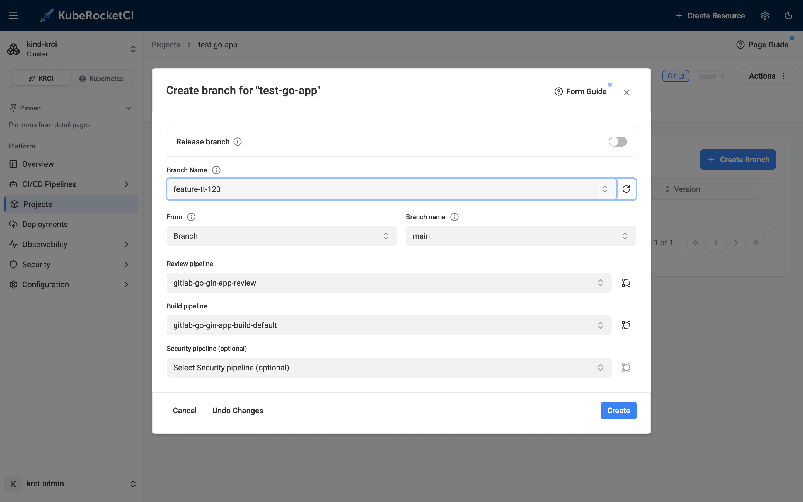

Clicking **Create** provisions a `CodebaseBranch` resource and mirrors the branch into GitLab with an (initially empty) CodebaseImageStream:

```bash
$ kubectl -n krci get codebasebranch,codebaseimagestream | grep feature
codebasebranch.v2.edp.epam.com/test-go-app-feature-tt-123-0afaf       created   feature-tt-123
codebaseimagestream.v2.edp.epam.com/test-go-app-feature-tt-123-0afaf  test-go-app
```

## Step 2: Make a Change That Only the Preview Will Show

To prove isolation, the feature branch needs to behave differently from `main`. I add a root `/` handler that returns `200` and echoes a `NAME` environment variable (we will set that variable per-environment in Step 7), plus the Helm `extraEnv` plumbing the override needs. The whole change is 30 lines across four files:

```go title="main.go (feature-tt-123)"
	r := gin.Default()
	r.GET("/", func(c *gin.Context) {
		c.JSON(http.StatusOK, gin.H{
			"status": "ok",
			"name":   os.Getenv("NAME"),
		})
	})
	r.GET("/hello", func(c *gin.Context) {
```

```yaml title="deploy-templates/templates/deployment.yaml (feature-tt-123)"
          ports:
            - name: http
              containerPort: {{ .Values.service.port }}
              protocol: TCP
          {{- if .Values.extraEnv }}
          env:
          {{- toYaml .Values.extraEnv | nindent 12 }}
          {{- end }}
```

The default `extraEnv: {}` goes into `values.yaml`, and a matching unit test goes into `main_test.go`. Crucially, this change lives **only on `feature-tt-123`** - `main` is never touched.

## Step 3: Build the Feature Branch

Feature branches are built on demand: on the **Branches** tab, the `feature-tt-123` row has a **Build** button. One click starts the `gitlab-go-gin-app-build-default` pipeline.

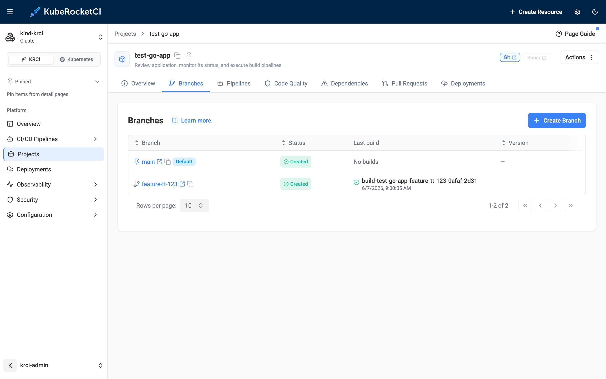

The build is the familiar Tekton DAG - fetch, version, SonarQube quality gate, kaniko image build, Git tag, and the all-important `update-cbis` step that records the new tag:

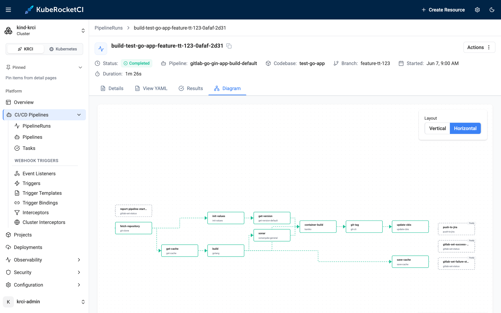

```bash
$ kubectl -n krci get pipelinerun | grep build-test-go-app-feature-tt-123-0afaf
build-test-go-app-feature-tt-123-0afaf-2d31   True   Completed
```

### Reading the New Image Tag from the CodebaseImageStream

With **default** [versioning](/docs/user-guide/artifact-versioning), the tag is `BRANCH-DATETIME`. The build writes it to the CBIS:

```bash
$ kubectl -n krci get codebaseimagestream test-go-app-feature-tt-123-0afaf \
    -o jsonpath='{.spec.tags[*].name}'
feature-tt-123-20260607-060023
```

## Step 4: Create the Deployment Flow and Auto-Trigger Environment

Now the environment. I follow the recommended convention of naming the deployment flow after my initials - `sk` - so personal preview flows are easy to find. In **Deployments → Create Deployment**, I select `test-go-app` and set its branch to `feature-tt-123`.

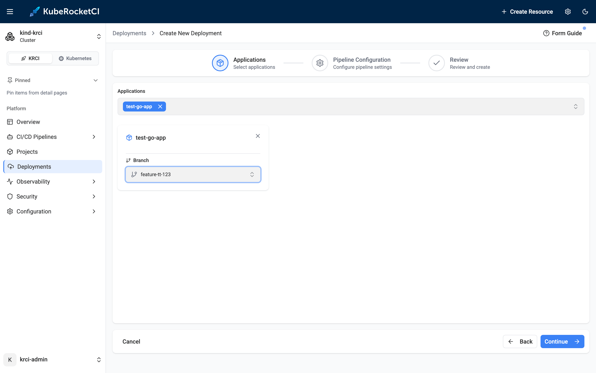

Then I add an environment named `feat` with trigger type **Auto**:

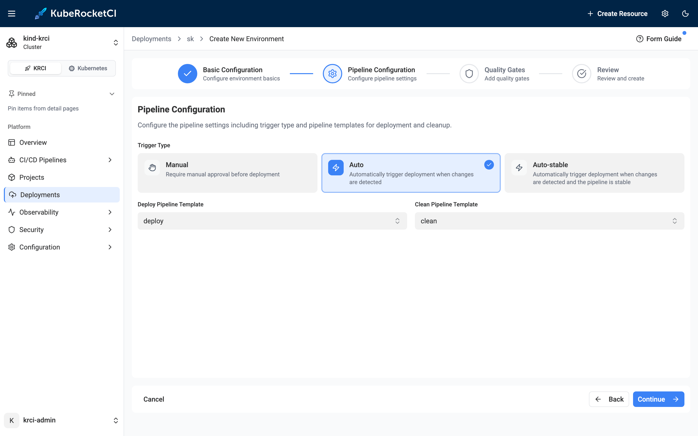

### Naming Conventions: How KRCI Builds the Namespace

The namespace is derived as `krci-<deployment>-<environment>`, which the form pre-fills as `krci-sk-feat`. The environment overview confirms the wiring - Auto trigger, `in-cluster`, namespace `krci-sk-feat`, deploy and clean pipeline templates, quality gate Manual:

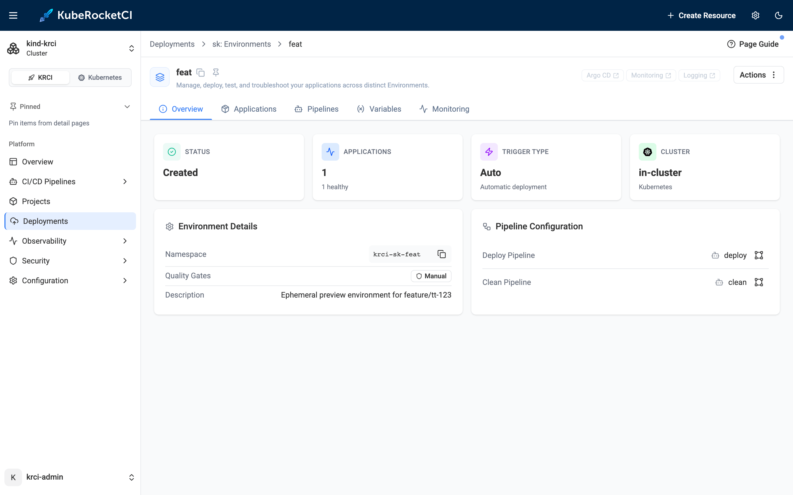

Creating the environment *before* the next build is deliberate: with Auto, the deploy fires on a CBIS *update*. Arm the environment first, and the build that follows will deploy itself.

## Step 5: The Feature Image Auto-Deploys

Triggering one more build updates the CBIS, the Auto trigger fires, and the `cd-pipeline-operator` creates the deploy run - no clicks. The deploy pipeline runs its four tasks and goes green in 47 seconds:

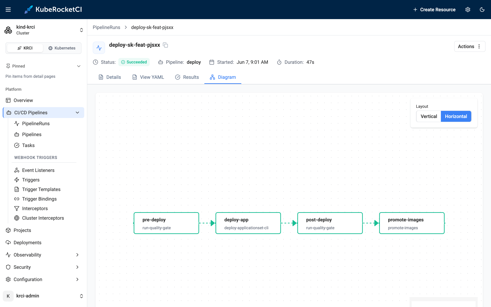

The whole preview environment now shows in one card - the `feat` Stage, its namespace, the deploy/clean pipelines, and the application `Healthy + Synced` on the feature tag:

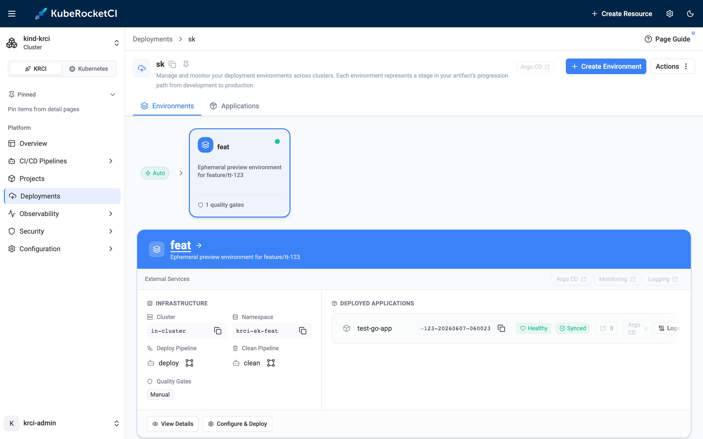

The cluster agrees:

```bash
$ kubectl -n krci get pipelinerun | grep sk-feat
deploy-sk-feat-pjsxx   True   Succeeded

$ kubectl get applications -n krci
NAMESPACE   NAME                  SYNC STATUS   HEALTH STATUS
krci        demo-dev-test-go-app  Synced        Healthy   # main, untouched
krci        sk-feat-test-go-app   Synced        Healthy   # the new preview env

$ kubectl -n krci-sk-feat get deploy,pods
NAME                          READY   UP-TO-DATE   AVAILABLE
deployment.apps/test-go-app   1/1     1            1
NAME                               READY   STATUS
pod/test-go-app-666f6c6994-rltdl   1/1     Running
```

## Step 6: Proof of Isolation - Feature Gets 200, Main Gets 404

This is the part no one publishes with real output. Two namespaces, two image tags, two versions of the code, running side by side on the same cluster:

```bash
$ kubectl -n krci-demo-dev get deploy test-go-app -o jsonpath='{..image}'
...test-go-app:main-20260606-132413@sha256:a39d120b...        # main

$ kubectl -n krci-sk-feat get deploy test-go-app -o jsonpath='{..image}'
...test-go-app:feature-tt-123-20260607-060023@sha256:812a57de...  # feature
```

And the behavioral proof - same path, two answers:

```bash
# feature env (krci-sk-feat)  ->  GET /
HTTP/1.1 200 OK
{"name":"","status":"ok"}

# main env (krci-demo-dev)    ->  GET /
HTTP/1.1 404 Not Found

# sanity: both still serve /hello
feature  /hello -> 200  {"message":"Hello, World!"}
main     /hello -> 200  {"message":"Hello, World!"}
```

The feature branch's new code is live in `krci-sk-feat` and answers `200`. The exact same request to `main` in `krci-demo-dev` still returns `404`. Nothing on `main` changed. That is the entire promise of a preview environment, demonstrated rather than asserted.

## Step 7: Per-Environment Config via GitOps Values Override

Preview environments usually need their own configuration - a different feature flag, API endpoint, or, here, a `NAME` variable. The GitOps way to do this is a values file in the [GitOps repository](/docs/user-guide/gitops) at the path `<deployment>/<environment>/<application>-values.yaml`, with **Values override** enabled for the environment.

```yaml title="sk/feat/test-go-app-values.yaml (in the GitOps repo)"
extraEnv:
  - name: NAME
    value: "Hello from the sk/feat preview environment"
```

On the environment's **Applications** tab, I open **Configure Deploy**, flip the per-app **Values override** toggle, and **Start Deploy**:

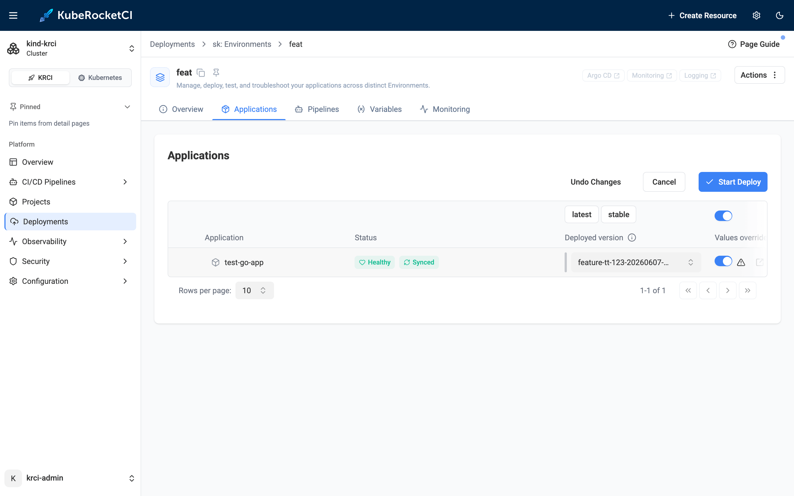

```bash
$ kubectl -n krci get pipelinerun | grep sk-feat
deploy-sk-feat-pjsxx   True   Succeeded
deploy-sk-feat-ec0e    True   Succeeded
```

KubeRocketCI pulls the values file from the GitOps repo and applies it to the Argo CD Application at sync time - no image rebuild required. The pod picks up the variable, and because our root handler echoes it, the override is now visible over HTTP too:

```bash
$ kubectl -n krci-sk-feat exec deploy/test-go-app -- env | grep ^NAME=
NAME=Hello from the sk/feat preview environment

# feature env GET /  (now reflects the per-environment value)
{"name":"Hello from the sk/feat preview environment","status":"ok"}

# main pod has no such variable
$ kubectl -n krci-demo-dev exec deploy/test-go-app -- env | grep ^NAME=
(no output)
```

## Step 8: Destroy the Environment - Namespace Gone, Zero Residual Cost

Teardown is a first-class action, not a side effect of closing a PR. On the deployment, **Actions → Delete** asks me to type the name to confirm:

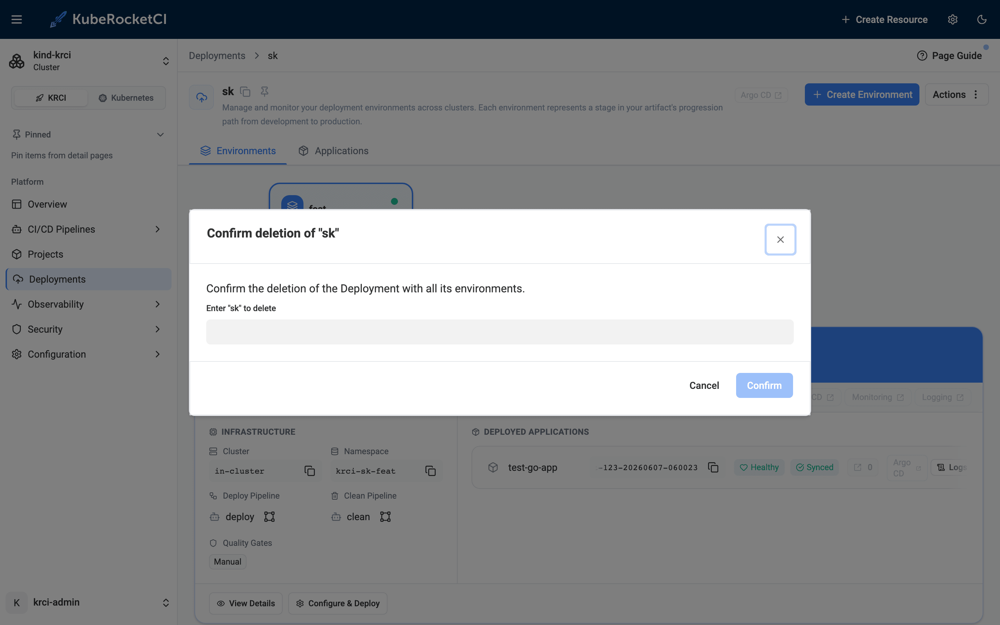

The `cd-pipeline-operator` deletes the namespace and its Argo CD Application. In about 5 seconds the preview environment is gone - and the `main` baseline is exactly as it was:

```bash
$ kubectl get ns krci-sk-feat
Error from server (NotFound): namespaces "krci-sk-feat" not found

$ kubectl get applications -n krci
NAMESPACE   NAME                   SYNC STATUS   HEALTH STATUS
krci        demo-dev-test-go-app   Synced        Healthy        # baseline intact

$ kubectl -n krci-demo-dev get deploy test-go-app
NAME          READY   UP-TO-DATE   AVAILABLE
test-go-app   1/1     1            1
```

### Cleanup Checklist: Stage, Branch, GitOps Entry Are Independent

One thing to know: destroying the Stage does **not** delete the branch.

```bash
$ kubectl -n krci get codebasebranch | grep feature
test-go-app-feature-tt-123-0afaf   created   feature-tt-123     # still here
```

The Stage, the `CodebaseBranch`, the Git branch, and the GitOps values file are independent lifecycle objects. To fully clean up after a feature, delete the branch on the **Branches** tab and remove the `<deployment>/<environment>/` entry from the GitOps repo. That independence is a feature: you can spin a preview environment up and down repeatedly for the same branch without ever touching Git history.

## KubeRocketCI vs. Other Preview Environment Approaches

| Capability | KubeRocketCI | Argo CD ApplicationSet (PR generator) | Uffizzi | Okteto / Qovery / Vercel (SaaS) |
|---|---|---|---|---|
| License | Apache-2.0 | Apache-2.0 | Proprietary (SaaS only since 2024) | Proprietary / freemium |
| Self-hosted | Yes | Yes | No | Control plane is SaaS |
| Builds the image | Yes (Tekton) | **No** - deploy only | Yes | Yes |
| GitOps CD | Yes (Argo CD) | Yes (Argo CD) | No (Compose/Helm) | Varies |
| Developer Portal UI | Yes | No (YAML) | Limited | Yes |
| Per-branch namespace | Yes | Yes | Yes | Yes |
| Per-env values override | Yes (GitOps) | Manual | Limited | Yes |
| One-click destroy | Yes | Manual | Yes | Yes |
| Cost per environment | Compute only | Compute only | Compute only | Per-env / per-seat fees |

### The Argo CD ApplicationSet PR Generator: Powerful, but Incomplete

The Argo CD ApplicationSet **Pull Request generator** is the closest pure-OSS pattern, and it is genuinely useful - it watches open PRs and creates an Argo CD Application for each. But it is a *deployment* tool only: **it does not build container images**. The CI pipeline must build and push the tagged image first, and if the ApplicationSet reconciles before the image exists, the pods hit `ImagePullBackOff`. KubeRocketCI sidesteps that ordering problem with the CodebaseImageStream handoff described earlier - Tekton writes the tag, and the Auto trigger only fires once it is there. You also get a Portal, a Build button, and a Destroy button instead of hand-written `ApplicationSet` YAML.

### Why SaaS Preview Tools Don't Cover Full-Stack Kubernetes

Vercel and Netlify nail preview deployments for frontend/static workloads, and Qovery/Okteto/Bunnyshell offer polished managed experiences - but they put a SaaS control plane (and a per-environment or per-seat bill) between you and your cluster. Demand is real, but the tooling still frustrates teams: in [Port's 2025 State of Internal Developer Portals survey](https://www.port.io/state-of-internal-developer-portals), just **6%** of developers were satisfied with the self-service tooling they use to spin up environments on demand. The open question that leaves is how to get that developer experience **on your own cluster, with no SaaS bill** - exactly the gap an Apache-2.0 IDP like KubeRocketCI fills.

## Frequently Asked Questions

### What is the difference between a preview environment and an ephemeral environment?

They are used interchangeably. "Preview environment" emphasizes the use case - reviewing a feature branch before merge - while "ephemeral environment" emphasizes the lifecycle: it is temporary and torn down when done. In KubeRocketCI both refer to the same object: a Deployment Stage with its own isolated Kubernetes namespace, created for a branch and destroyed on demand.

### Do I need a SaaS subscription to get preview environments on Kubernetes?

No. KubeRocketCI is Apache-2.0 open source and runs entirely on your own cluster - kind locally, or EKS/GKE/AKS in production. There is no per-environment fee and no SaaS control plane. You bring the cluster; KRCI provides the Portal, CI (Tekton), and GitOps CD (Argo CD) to manage the full preview-environment lifecycle.

### Does setting up ephemeral environments require YAML expertise?

Not for the day-to-day flow. Creating a branch, building it, and deploying to an isolated namespace are all Portal form actions. The only YAML you write is the optional per-environment values file in the GitOps repo - and only when you actually need to override a value for a specific preview. The CDPipeline and Argo CD Application resources are managed by KRCI operators.

### How does per-environment configuration override work in a GitOps workflow?

You add a file at `<deployment>/<environment>/<application>-values.yaml` in the GitOps repository - for example `sk/feat/test-go-app-values.yaml` - containing Helm values that override the application's defaults. Enable the **Values override** toggle on the environment, then deploy. KubeRocketCI applies those values to the Argo CD Application at sync time, so the pod reflects them without rebuilding the image.

### What happens to the namespace when I delete the environment in KRCI?

The `cd-pipeline-operator` deletes the Kubernetes namespace and the associated Argo CD Application - all pods, services, and configmaps in that namespace are removed. The `CodebaseBranch` and the Git branch are separate objects, so destroying the Stage does not delete or merge the branch; clean those up separately if you want to.

### Does the Argo CD ApplicationSet Pull Request generator build container images?

No. It is a deployment tool that watches open pull requests and creates Argo CD Applications for them. Your CI pipeline (Tekton, GitHub Actions, GitLab CI) must build and push the image first. If the ApplicationSet fires before the image is ready, pods hit `ImagePullBackOff`. KubeRocketCI avoids this with the CodebaseImageStream handoff: Tekton writes the tag, and the Auto trigger deploys only after it exists.

### How much does it cost to run ephemeral environments on Kubernetes with KubeRocketCI?

The software cost is zero - KubeRocketCI is Apache-2.0 with no per-environment fee. The only cost is the compute the environment consumes while it runs, and because preview environments are destroyed when the branch work is done, they do not accumulate idle compute the way permanent staging environments do. On the local kind testbed in this post, the preview environment cost nothing beyond the Docker Desktop resources already allocated.

## Summary

Starting from a stable `main` deployment, we created a feature branch in the Portal, shipped a change visible only on that branch, built it through Tekton, and let an **Auto** environment deploy it to its own isolated namespace through Argo CD GitOps. We proved the isolation with real output - `feature` returns `200`, `main` keeps returning `404` - injected per-environment config through a GitOps values override, and then destroyed the environment in one action, leaving the baseline untouched and zero residual cost behind.

No SaaS bill, no hand-written `ApplicationSet` YAML, no `kubectl` required for the happy path - just a feature branch, a few portal clicks, and a real isolated Kubernetes environment that cleans up after itself. The pattern - feature branch deployment on Kubernetes with isolated namespaces - is entirely self-hosted and free. I ran the entire flow on June 7, 2026 on the local [try-kuberocketci](/blog/try-kuberocketci-locally) testbed; every screenshot and command output above is from that run.

The most useful next steps from here:

- Spin up the testbed yourself with [Try KubeRocketCI Locally](/blog/try-kuberocketci-locally), then follow this flow on your own machine.
- Read the [Deploy Application From a Feature Branch](/docs/use-cases/deploy-application-from-feature-branch) use case and [Manage Deployments](/docs/user-guide/manage-environments) for the full reference.
- Explore [Deployment Strategies](/docs/user-guide/auto-stable-trigger-type) (Manual, Auto, Auto-stable) and the [Argo CD Diff preview](/docs/user-guide/argo-cd-preview) for gated promotions.
- See the deeper [Kubernetes-native CI/CD with Tekton](/blog/kubernetes-native-cicd-tekton-kuberocketci) architecture and the [krci CLI](/blog/krci-cli-daily-use) for driving all of this from the terminal.

KubeRocketCI is open source under Apache License 2.0. The platform, Helm charts, and the testbed are all on [GitHub](https://github.com/KubeRocketCI/try-kuberocketci).

{/* cspell:ignore pjsxx 0afaf rltdl */}
