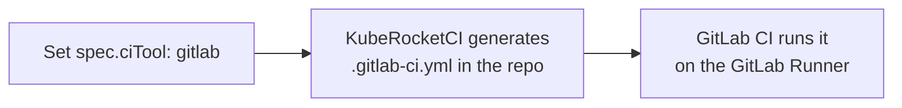
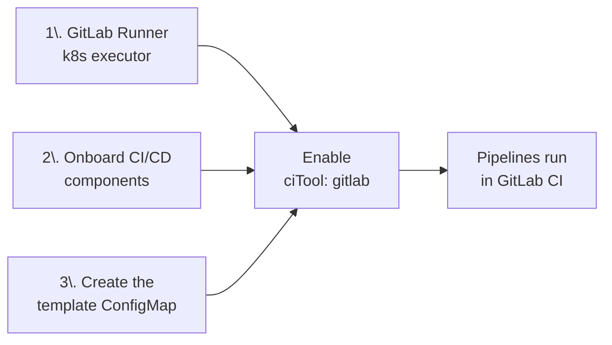
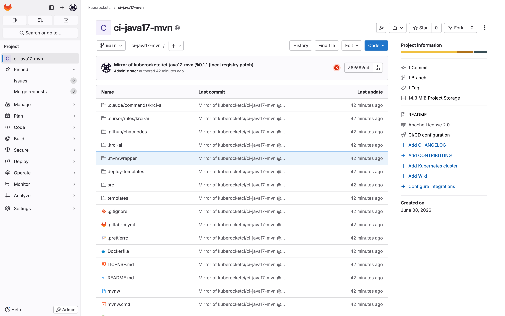
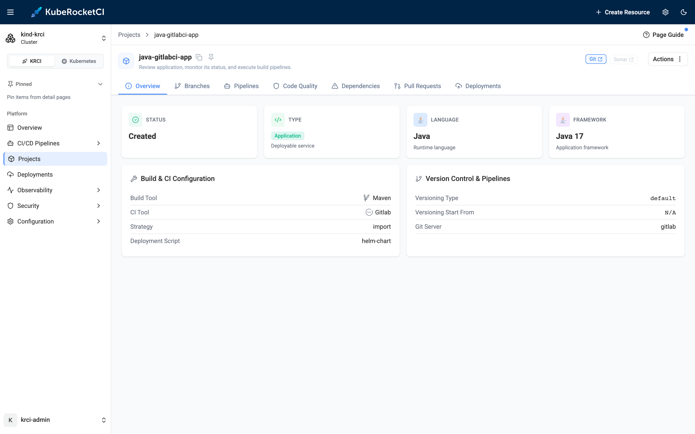
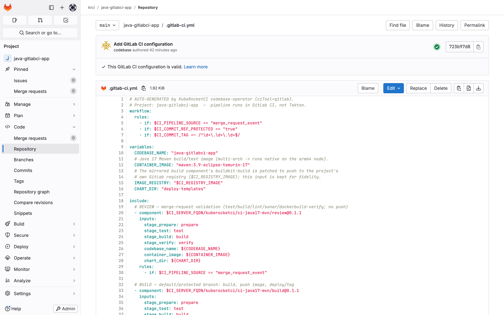
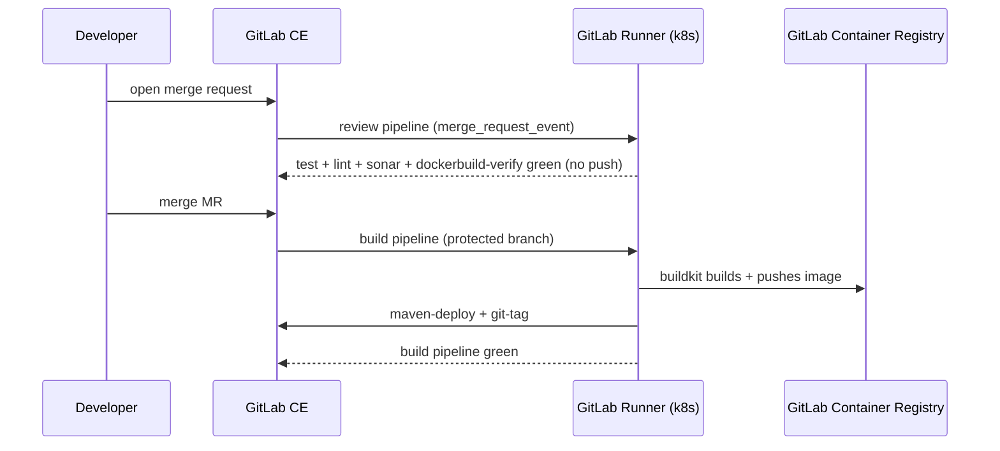
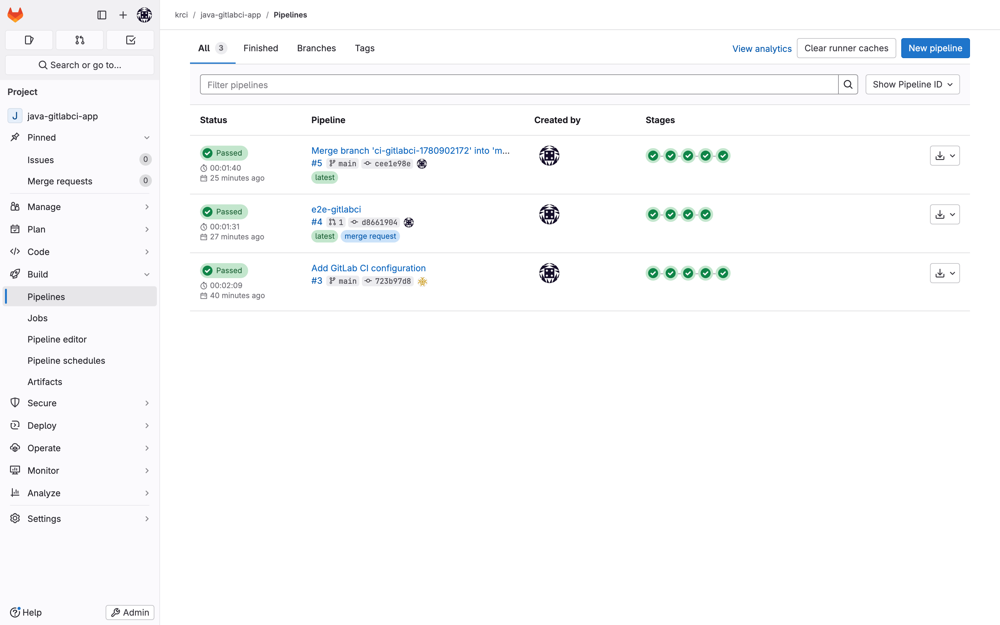
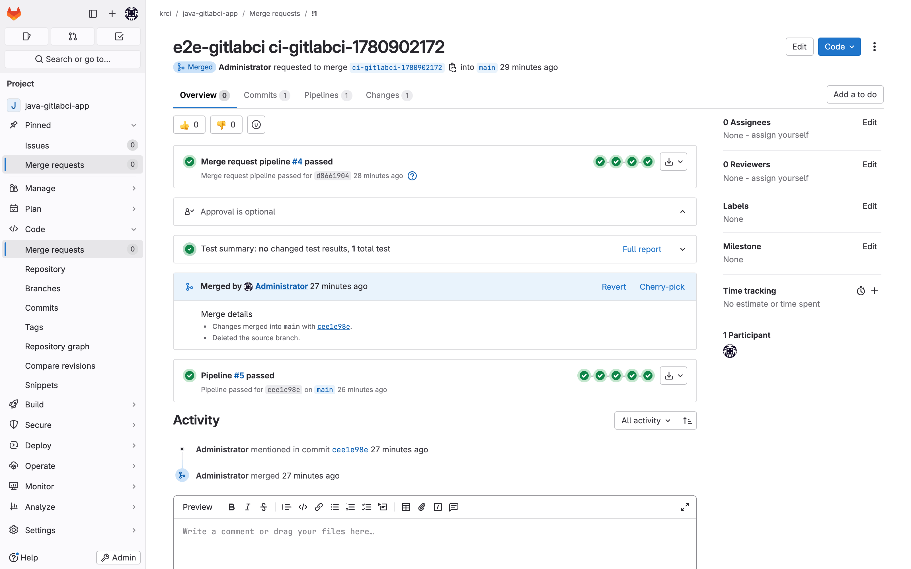
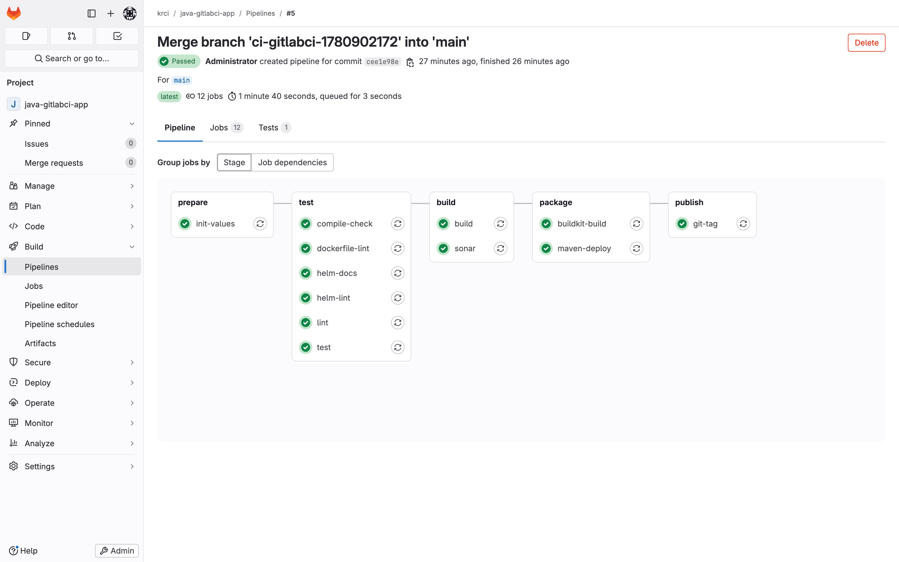
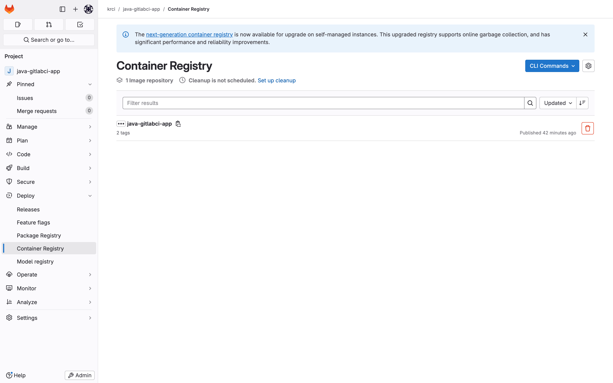

# GitLab CI Integration: Run CI in GitLab Instead of Tekton with KubeRocketCI

**GitLab CI integration** in KubeRocketCI lets a single application run its CI pipeline in **GitLab CI - on a GitLab Runner - instead of Tekton**, while still being managed as a first-class Codebase on the platform. You set one field on the Codebase (`spec.ciTool: gitlab`), and KubeRocketCI generates a **`.gitlab-ci.yml`** in the repository; GitLab then runs the pipeline, with no Tekton involved. From then on, every merge request runs a review pipeline and every merge runs a build pipeline - all native GitLab CI, all on your own cluster.

This is part three of my hands-on series on the local [try-kuberocketci](/blog/try-kuberocketci-locally) testbed. In [part one](/blog/try-kuberocketci-locally) I stood up the full platform in two commands; in [part two](/blog/ephemeral-preview-environments-kubernetes-feature-branch) I built ephemeral preview environments from a feature branch. Both ran their CI in **Tekton**. This post takes the same [kind](https://kind.sigs.k8s.io) cluster running [KubeRocketCI](/docs/about-platform) 3.13 and shows the **multi-CI** path: how GitLab CI integration works, the three things you must set up *before* you enable it - a Runner, the onboarded **CI/CD components**, and a **ConfigMap** - and a full review-to-build run with real output.

<!--truncate-->

## What "GitLab CI Integration" Means in KubeRocketCI

By default, KubeRocketCI runs your CI in Tekton. Version 3.13 added **multi-CI**: a per-Codebase choice of engine, set with one field - `spec.ciTool: tekton` (the default) or `spec.ciTool: gitlab` (see the [3.13 notes](/docs/operator-guide/upgrade/upgrade-krci-3.13) and [Codebase API](/docs/api/codebase)). Choosing `gitlab` is what this post is about.

When you set `ciTool: gitlab`, KubeRocketCI handles the wiring. Instead of the Tekton `EventListener` and webhook it would normally create, it **generates a `.gitlab-ci.yml` and commits it to the repository**; GitLab CI then runs the pipeline. The file is generated rather than written by hand, and no Tekton is involved - the build runs as native GitLab CI jobs on a GitLab Runner, and the logs reside in GitLab.

Other aspects are unchanged: the application remains a first-class **Codebase**, with the same Portal, branches, and GitOps deployment as a Tekton application. GitLab-CI and Tekton applications can run side by side on the same platform; only the CI execution moves to GitLab (see [the comparison below](#gitlab-ci-vs-tekton-when-to-use-which)).



On a real codebase the file lands in the repo, and there is no project webhook - GitLab CI does not need one:

```bash
$ kubectl -n krci get codebase java-gitlabci-app -o jsonpath='{.spec.ciTool}'
gitlab
# .gitlab-ci.yml is committed to the repo; project webhooks: 0
```

The generated `.gitlab-ci.yml` is intentionally minimal: it contains no build logic of its own and instead references reusable GitLab CI/CD components. Those components must be in place first.

## Before You Enable It: Three Things to Set Up First

GitLab CI integration has three prerequisites that the Tekton path does not - a one-time platform setup, not something you repeat per app. Skip any one and the first pipeline fails to start or cannot resolve its components; complete them once, and subsequent GitLab-CI Codebases require no additional setup.



### 1. Install a GitLab Runner (KubeRocketCI Does Not Bundle One)

Tekton ships with KubeRocketCI; a **GitLab Runner does not**. GitLab CE already serves CI, but with no runner registered, jobs sit `pending` forever. On the testbed, `make gitlab-ci` installs the official `gitlab/gitlab-runner` Helm chart with the **Kubernetes executor** and registers it.

```bash
$ kubectl -n gitlab-runner get pods
NAME                            READY   STATUS    RESTARTS   AGE
gitlab-runner-f655c776c-xr9cm   1/1     Running   0          26m

# the runner reports online as an instance runner
runner: krci-kubernetes   online=True   executor=kubernetes
```

The Kubernetes executor runs each job as a pod in the cluster - the same model Tekton uses, so your CI capacity scales with the cluster. The testbed uses Helm for simplicity, but on a real cluster you install the runner the GitOps way, like every other platform component: KubeRocketCI ships a [`gitlab-runner` add-on](https://github.com/epam/edp-cluster-add-ons/tree/main/clusters/core/addons/gitlab-runner) in the [edp-cluster-add-ons](https://github.com/epam/edp-cluster-add-ons) repository that Argo CD reconciles, with the runner's registration token supplied through External Secrets. Either way you end up with one registered runner, sized to your job volume, ready to execute GitLab CI jobs.

### 2. Onboard the KubeRocketCI CI/CD Components Into Your Instance

This prerequisite is easy to overlook. The injected `.gitlab-ci.yml` does not contain the build steps directly; it references a **GitLab CI/CD component** - the [`kuberocketci/ci-java17-mvn`](https://gitlab.com/kuberocketci/ci-java17-mvn) library, which exposes `review` and `build` entry points over a 7-stage flow (`prepare → test → build → verify → package → publish → release`).

The catch: **GitLab CI/CD components only resolve on the same GitLab instance** (`$CI_SERVER_FQDN`). A component reference like `$CI_SERVER_FQDN/kuberocketci/ci-java17-mvn/build@0.1.1` will not reach out to `gitlab.com` - it resolves against *your* GitLab. So you must **onboard (mirror) the components into your instance before enabling GitLab CI**, and tag them at the version your template pins.



On the testbed, `make gitlab-ci` mirrors the component into the local GitLab as `kuberocketci/ci-java17-mvn` at tag `0.1.1` (with two local-only patches: native arm64 builds and pushing to the in-cluster GitLab Container Registry instead of Docker Hub). In your own environment, this is where you publish the KubeRocketCI components - or your own forked components - to your GitLab CI/CD Catalog so every project can `include` them.

:::tip Onboard the components first, enable the Codebase second
If you set `ciTool: gitlab` before the component exists at the pinned tag on your instance, KubeRocketCI still injects `.gitlab-ci.yml`, but the very first pipeline fails at the `include:` stage with an unresolved-component error. Mirror and tag the components first.
:::

### 3. Create the `.gitlab-ci.yml` Template ConfigMap

KubeRocketCI does not invent the pipeline - it fills in a template stored in a **ConfigMap**, one per tech stack. The Codebase points at the template with an annotation (or KubeRocketCI falls back to a `gitlab-ci-{lang}-{buildtool}` naming convention), and your codebase name is substituted in before the file is committed.

The ConfigMap for Java/Maven contains only orchestration - a `workflow` rule set, variables, and two `include`d component entry points (`review` and `build`) gated by rules:

```yaml title="manifests/gitlab-ci-java-maven-configmap.yaml (excerpt)"
apiVersion: v1
kind: ConfigMap
metadata:
  name: gitlab-ci-java-maven
  namespace: krci
data:
  .gitlab-ci.yml: |
    workflow:
      rules:
        - if: $CI_PIPELINE_SOURCE == "merge_request_event"
        - if: $CI_COMMIT_REF_PROTECTED == "true"
        - if: $CI_COMMIT_TAG =~ /^\d+\.\d+\.\d+$/

    variables:
      CODEBASE_NAME: "{{.CodebaseName}}"
      CONTAINER_IMAGE: "maven:3.9-eclipse-temurin-17"
      IMAGE_REGISTRY: "$CI_REGISTRY_IMAGE"
      CHART_DIR: "deploy-templates"

    include:
      # REVIEW - merge-request validation (test/build/lint/sonar/dockerbuild-verify; no push)
      - component: $CI_SERVER_FQDN/kuberocketci/ci-java17-mvn/review@0.1.1
        inputs: { codebase_name: ${CODEBASE_NAME}, container_image: ${CONTAINER_IMAGE}, chart_dir: ${CHART_DIR} }
        rules:
          - if: $CI_PIPELINE_SOURCE == "merge_request_event"

      # BUILD - protected/default branch: build, push image, deploy/tag
      - component: $CI_SERVER_FQDN/kuberocketci/ci-java17-mvn/build@0.1.1
        inputs: { codebase_name: ${CODEBASE_NAME}, container_image: ${CONTAINER_IMAGE}, image_registry: ${IMAGE_REGISTRY}, chart_dir: ${CHART_DIR} }
        rules:
          - if: $CI_COMMIT_BRANCH == $CI_DEFAULT_BRANCH || $CI_COMMIT_REF_PROTECTED == "true"

    stages: [prepare, test, build, verify, package, publish, release]
```

Apply it once:

```bash
$ kubectl apply -f manifests/gitlab-ci-java-maven-configmap.yaml
configmap/gitlab-ci-java-maven created
```

These two rules are the entire control flow: the `review` component runs on `merge_request_event`, and the `build` component runs on the protected/default branch. That split produces the "MR → review, merge → build" behavior, with no webhook required.

## Enable GitLab CI on a Codebase (`spec.ciTool: gitlab`)

With the Runner online, the components onboarded, and the ConfigMap applied, enabling GitLab CI is one Codebase manifest. The `ciTool: gitlab` field selects the engine; the annotation selects the template:

```yaml title="manifests/sample-gitlabci-codebase.yaml (excerpt)"
apiVersion: v2.edp.epam.com/v1
kind: Codebase
metadata:
  name: java-gitlabci-app
  namespace: krci
  annotations:
    app.edp.epam.com/gitlab-ci-template: gitlab-ci-java-maven   # pick the ConfigMap
spec:
  type: application
  lang: java
  framework: java17
  buildTool: maven
  ciTool: gitlab            # <-- run CI in GitLab CI, not Tekton
  strategy: import
  gitServer: gitlab
  gitUrlPath: /krci/java-gitlabci-app
  disablePutDeployTemplates: true
```

In the KubeRocketCI Portal, the component is a normal Codebase - same lifecycle, same branches, same deployment story as a Tekton app - but its **CI Tool reads `GitLab`**. That is the platform side of the integration: you manage the app on KubeRocketCI, even though its pipeline executes in GitLab.



Once KubeRocketCI finishes, the injected `.gitlab-ci.yml` is visible in the GitLab project - the `{{.CodebaseName}}` placeholder now reads `java-gitlabci-app`, and the two component includes are wired and ready:



## The Pipeline in Action: Review on MR, Build on Merge

The flow mirrors the Tekton path from the [previous posts](/blog/ephemeral-preview-environments-kubernetes-feature-branch) - open a merge request to validate, merge to build and publish - but every job runs in GitLab CI on the Runner.



In the GitLab project, both pipelines show green - one triggered by the merge request, one by the merge to `main`:



### Review Pipeline (Merge Request)

Opening a merge request triggers a `merge_request_event` pipeline that runs the `review` component - validation only, **no image push**. On the live run it finished green in **91 seconds**, 10 jobs across four stages:

```text
review pipeline #4 (merge_request_event) - 91s - GREEN
  prepare   init-values
  test      test            compile-check   lint
  test      helm-docs       helm-lint       dockerfile-lint
  build     build           sonar
  verify    dockerbuild-verify        # buildkit builds the image but does NOT push
```

The `sonar` job is a real SonarQube quality gate - the same engine the Tekton pipelines use - and `dockerbuild-verify` proves the image builds without publishing it. GitLab renders the MR with its pipeline result attached:



### Build Pipeline (Protected Branch)

Merging the MR pushes to the protected `main` branch, which trips the second `workflow` rule and runs the `build` component. It is the review jobs **plus** the publishing stages - `buildkit-build` (build *and* push), `maven-deploy`, and `git-tag`. On the live run it finished green in **100 seconds**, 12 jobs:

```text
build pipeline #5 (push, protected main) - 100s - GREEN
  prepare   init-values
  test      test            compile-check   lint
  test      helm-docs       helm-lint       dockerfile-lint
  build     build           sonar
  package   buildkit-build  maven-deploy    # build+push image, publish artifact
  publish   git-tag                         # tag the release
```

The build pipeline graph in GitLab shows the stages fanning out - the same DAG model you get in Tekton, rendered by GitLab:



### The Image Lands in GitLab's Container Registry

The `buildkit-build` job builds the container image and pushes it to GitLab's bundled **Container Registry** using the CI job token - no external registry, no Docker Hub credentials. After the build pipeline, the image is published with a content-addressed tag, and `git-tag` has created the matching release tag:

```bash
# image published by the build pipeline
image: krci/java-gitlabci-app   tags: [723b97d8, cee1e98e]

# release tags created by the git-tag job
tag: v0.1.0-cee1e98e
tag: v0.1.0-723b97d8
```



From here, the [GitOps delivery story](/blog/ephemeral-preview-environments-kubernetes-feature-branch) is identical to the Tekton path - the published image feeds the same CodebaseImageStream and Argo CD deployment flow covered in part two of this series.

## GitLab CI vs Tekton: When to Use Which

Both engines are first-class. The choice is about where your team already lives and what you want to own.

| Dimension | Tekton (default) | GitLab CI (`ciTool: gitlab`) |
|---|---|---|
| Pipeline definition | Tekton `PipelineRun` (KRCI-managed) | `.gitlab-ci.yml` (operator-injected, GitLab-native) |
| Trigger mechanism | Tekton webhook | GitLab `workflow` rules (no webhook) |
| Where job logs live | KubeRocketCI Portal / Tekton | GitLab CI UI |
| Reusable build logic | Tekton tasks / pipeline library | GitLab CI/CD **components** (must be on your instance) |
| Image build | kaniko | buildkit |
| Runner needed | No (Tekton bundled) | **Yes** - install a GitLab Runner |
| Best when | you want a unified, K8s-native CI surface in the Portal | your org standardizes on GitLab CI and its component catalog |

**Use Tekton** when you want every Codebase to share one Kubernetes-native CI surface inside the Portal, with pipeline history in [Tekton Results](/blog/kubernetes-native-cicd-tekton-kuberocketci). **Use GitLab CI** when your organization has standardized on GitLab CI/CD components and wants pipeline authoring and logs to stay in GitLab - while still getting the KubeRocketCI Codebase lifecycle, Portal, and GitOps deployment around them. And because the choice is per-Codebase, you can migrate one application at a time.

## Frequently Asked Questions

### What does `ciTool: gitlab` do in KubeRocketCI?

It switches a Codebase's CI engine from Tekton to GitLab CI. Instead of wiring the pipeline into Tekton, KubeRocketCI generates a `.gitlab-ci.yml` in the repository, and the pipeline runs as native GitLab CI jobs on a GitLab Runner. The only valid values for the field are `tekton` and `gitlab`.

### Does KubeRocketCI replace GitLab CI, or run on top of it?

It runs on top of it. With GitLab CI integration, KubeRocketCI manages the Codebase lifecycle, owns the injected `.gitlab-ci.yml`, and provides the Portal and GitOps deployment - but the pipeline itself executes in GitLab CI, and the job logs live in GitLab. There is no Tekton in the pipeline path at all.

### Do I need a GitLab Runner for the GitLab CI path?

Yes. KubeRocketCI bundles Tekton but not a GitLab Runner. With `ciTool: gitlab`, jobs run as GitLab CI and need a registered runner to execute. The testbed installs the official `gitlab/gitlab-runner` Helm chart with the Kubernetes executor, registered via a GitLab 17.x runner authentication token. Without a runner, pipelines stay `pending`.

### Why do I have to onboard the CI/CD components into my own GitLab instance?

Because GitLab CI/CD components only resolve on the same instance (`$CI_SERVER_FQDN`). A reference like `$CI_SERVER_FQDN/kuberocketci/ci-java17-mvn/build@0.1.1` is looked up on *your* GitLab, not `gitlab.com`. So you must mirror (onboard) the KubeRocketCI components - or your own forks - into your instance and tag them at the version your template pins, before enabling GitLab CI on any Codebase.

### What is the ConfigMap for in GitLab CI integration?

The ConfigMap holds the `.gitlab-ci.yml` template that KubeRocketCI injects. You create one per tech stack (for example `gitlab-ci-java-maven`), and the Codebase points at it with an annotation. KubeRocketCI substitutes your codebase name and commits the result. The template is thin orchestration - it `include`s the onboarded CI/CD components and gates them with `workflow` rules.

### How does the MR-to-build flow work without a webhook?

GitLab CI integration relies on GitLab's own `workflow` rules instead of a webhook. The injected `.gitlab-ci.yml` includes the `review` component gated on `$CI_PIPELINE_SOURCE == "merge_request_event"` and the `build` component gated on the protected/default branch. Opening a merge request runs review; merging pushes to the protected branch and runs build. GitLab triggers both natively, so no project webhook is created.

### Can Tekton and GitLab CI codebases coexist on the same cluster?

Yes. The choice is per-Codebase, and the same `gitlab` GitServer is reused for both engines. On the testbed, Tekton codebases (the Go app from parts one and two) run side by side with the GitLab-CI Java app on the same KubeRocketCI platform. You can adopt GitLab CI for one application without touching the rest.

### Where does the container image go in the GitLab CI build pipeline?

The `buildkit-build` job builds and pushes the image to GitLab's bundled Container Registry using the CI job token - no external registry or Docker Hub credentials required. On the testbed it pushes to the in-cluster GitLab registry, and the `git-tag` job creates a matching release tag. From there the image feeds the same CodebaseImageStream and Argo CD deployment flow as the Tekton path.

## Summary

GitLab CI integration in KubeRocketCI lets a Codebase run its pipeline in **GitLab CI instead of Tekton** by setting `spec.ciTool: gitlab`. KubeRocketCI then **generates a `.gitlab-ci.yml`** that pulls in reusable GitLab CI/CD components, gated so that a merge request runs a review pipeline and a merge runs a build pipeline. There is no webhook and no Tekton in the path - the proof is **zero `PipelineRun`s** for the Codebase.

Before you enable it, set up three things: a **GitLab Runner** (KubeRocketCI does not bundle one), the **onboarded CI/CD components** in your own instance (they only resolve on the same GitLab), and the **template ConfigMap** KubeRocketCI injects. Complete these once, and subsequent GitLab-CI Codebases require no additional setup.

I ran the full flow on the local [try-kuberocketci](/blog/try-kuberocketci-locally) testbed: review pipeline green in 91s (10 jobs), build pipeline green in 100s (12 jobs), image pushed to GitLab's Container Registry, release tags created, and zero Tekton PipelineRuns - every command and result above is from that run.

The most useful next steps from here:

- Spin up the testbed with [Try KubeRocketCI Locally](/blog/try-kuberocketci-locally), then run `make gitlab-ci` and `make e2e-gitlabci` to reproduce this flow.
- Read the [3.13 upgrade notes](/docs/operator-guide/upgrade/upgrade-krci-3.13) for the multi-CI `ciTool` enum and the [Codebase API](/docs/api/codebase) for the field reference.
- Compare the Tekton path in [Kubernetes-native CI/CD with Tekton](/blog/kubernetes-native-cicd-tekton-kuberocketci) and the GitOps delivery in [Ephemeral Preview Environments](/blog/ephemeral-preview-environments-kubernetes-feature-branch).
- Browse the [KubeRocketCI documentation](https://docs.kuberocketci.io) and the [basic concepts](/docs/basic-concepts) for Codebases, CodebaseImageStreams, and deployment flows.

KubeRocketCI is open source under Apache License 2.0. The platform, Helm charts, and the testbed are all on [GitHub](https://github.com/KubeRocketCI/try-kuberocketci).

{/* cspell:ignore gitlabci buildkit kaniko configmap mvn temurin xr9cm */}
