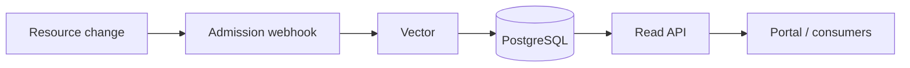
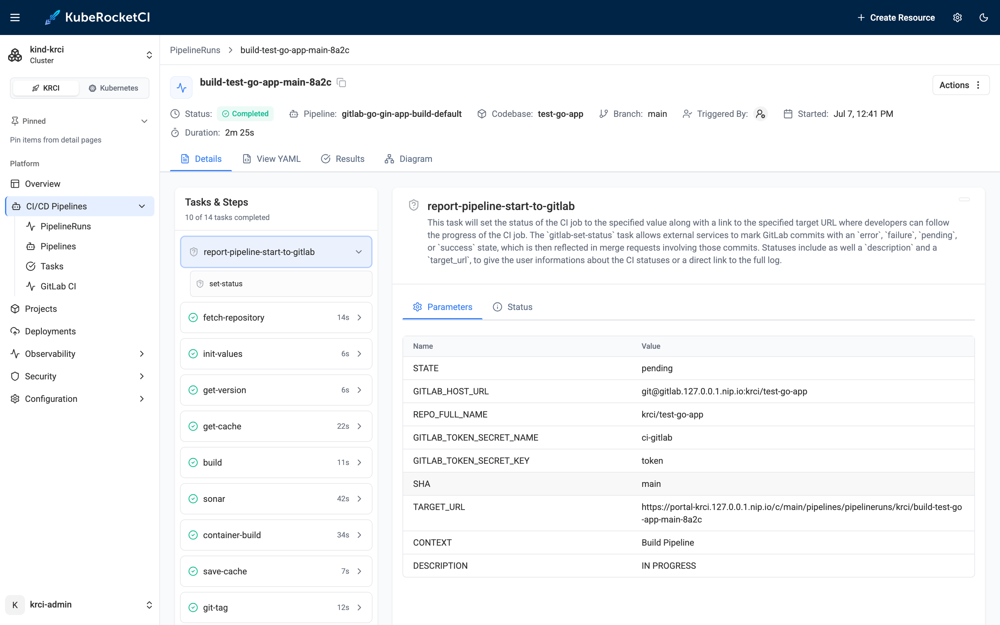
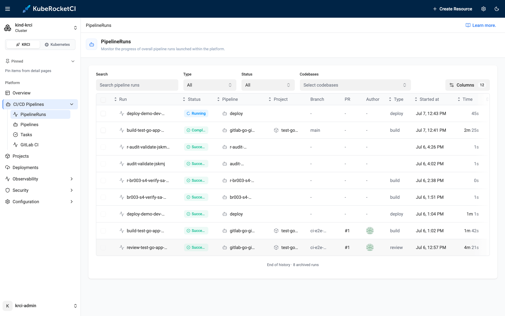

# A Portable Kubernetes Audit Trail: Who Changed What | KubeRocketCI

You trigger pipelines. You update a `GitServer`, promote a deployment, adjust a `Codebase`. Much of that flows through GitOps and lands in your Git history - but not all of it. Some changes you make directly against the cluster, from the portal or `kubectl`, because that's the quickest way to get something done. That's normal, everyday platform work. What's harder is answering a fair question that comes up afterward: *what changed, when, and who made the change?* - especially for the changes that never went through a pull request.

On managed Kubernetes the raw answer exists - the API server writes an audit record for every request - but getting to it is another story. On Amazon EKS those records stream to CloudWatch. Answering a simple operational question then means writing a Logs Insights query, knowing the retention window, and having the right IAM. Great for a SIEM pipeline; heavy for a Tuesday-afternoon "what just changed?". KubeRocketCI ships a lighter, portable alternative called **krci-audit** - a self-contained, queryable audit trail that works the same on EKS, on-prem, or a local kind cluster. The catch, which most of this post is about: an audit trail is not free, so you should be deliberate about what you capture.

<!--truncate-->

Here's the reasoning - why native audit logs leave a gap for day-to-day questions, how krci-audit fills it without a cloud dependency, the performance trap of auditing everything (with real numbers from a running cluster), and where this is going next.

## Why Aren't Native Kubernetes Audit Logs Enough for "Who Changed What?"

**Short answer: they're built for security forensics and SIEM, not for a quick operational lookup.** The data exists - every managed Kubernetes distribution can emit [API server audit logs](https://kubernetes.io/docs/tasks/debug/debug-cluster/audit/), a structured record of who called the API, what they changed, and when. On EKS you enable the `audit` log type and the control plane ships it to CloudWatch Logs. As a foundation that's exactly right: immutable, comprehensive, centrally retained, and easy to alert on.

But for *operational* questions it has friction:

- **Quick access is a query, not a lookup.** "Who created this PipelineRun?" becomes a CloudWatch Logs Insights query against a large, verbose stream - filtered by `objectRef`, `verb`, and time - not a one-line answer.
- **It's cloud-locked.** The retrieval path on EKS (CloudWatch), on AKS (Azure Monitor), and on-prem (a file sink you wire up yourself) are all different. Your runbook doesn't port.
- **It's undifferentiated.** The native stream captures *everything* the audit policy allows - most of which is control-plane noise you'll never ask about (more on that below).
- **It lives outside your platform.** Developers using the KubeRocketCI portal can't see "who triggered this run" without leaving the tool and querying a cloud console they may not have access to.

None of this makes native audit logging wrong - it makes it the *wrong tool for the quick, in-platform question*. That's the gap krci-audit targets.

## How Does krci-audit Give You a Portable Audit Trail?

**It captures a scoped set of admission changes inside your cluster and makes them instantly queryable** - no dependency on any cloud provider's logging service. krci-audit is a small, self-contained component that does exactly that.



A resource change hits a validating admission webhook, which ships the record through Vector into an append-only PostgreSQL table; a read-only API then serves it to the portal and other consumers. The pieces:

| Component | Role |
| --- | --- |
| **Capture** | A `ValidatingWebhookConfiguration` (backed by [kube-audit-rest](https://github.com/RichardoC/kube-audit-rest)) receives the `AdmissionReview` for each matching change. It runs with `failurePolicy: Ignore` and a 1-second timeout, so it **never blocks a platform operation**. |
| **Ship** | A [Vector](https://vector.dev/) sidecar tails the capture log, keeps only the events you asked for, and writes them to PostgreSQL. |
| **Store** | A dedicated PostgreSQL database holds events in a monthly-partitioned, **append-only** table. Writes use a least-privilege role that cannot update or delete existing rows. |
| **Read API** | A separate, read-only service exposes initiator lookup and a filterable events query. It connects as a SELECT-only role, so the read path can never alter the trail. |

Because the whole thing runs *inside* your cluster, the experience is identical on EKS, AKS, GKE, OpenShift, or a laptop kind cluster - the same install, the same API, the same portal feature. It's an [add-on](/docs/next/operator-guide/monitoring-and-observability/audit-trails-setup), off by default, that you turn on when you have a reason to.

## Why Shouldn't You Audit Everything?

**Because an admission webhook sits in the write path of the API server** - so a catch-all policy taxes every write *and* buries the trail in noise. Every request matching the webhook's rules is paused, sent to the webhook, and awaited (within the timeout) before the write completes. Point it at `*` - all resources - and you pay that cost on everything.

How much noise? To put real numbers on it, I measured the [local **try-kuberocketci** testbed](/blog/try-kuberocketci-locally) - a single-node [kind](https://kind.sigs.k8s.io/) cluster (Kubernetes v1.36.1) running the full platform and otherwise idle. Comparing each `Lease` object's `resourceVersion` over a 30-second window shows the churn a catch-all audit policy would capture (reproduce it with `kubectl get leases -A`, twice, 30 seconds apart):

- **31 `Lease` objects, and all 31 changed within those 30 seconds** - pure leader-election heartbeat traffic. Extrapolated: **~3,720 `Lease` UPDATE admissions per hour**, none of which anyone will ever audit.
- And that's before `Events` (13), `EndpointSlices` (50), `Pods` (54), and `ConfigMaps` (122) - all high-churn, all captured by a `*` policy.

Now compare that to the **scoped** trail the same testbed actually recorded over ~36 hours, using krci-audit's default configuration (shown below):

| Resource | Events |
| --- | --- |
| PipelineRuns | 97 (71 UPDATE, 18 DELETE, 8 CREATE) |
| CodebaseBranches | 12 |
| GitServers | 4 |
| CodebaseImageStreams | 2 |
| CDStageDeployments / Stages | 3 |

That's **118 meaningful events over a day and a half** - roughly **80 a day** - versus **~3,720 an hour** of lease noise from a single un-scoped resource type. A catch-all policy would be on the order of a thousand times larger, almost entirely with records no one wants.

**The design that avoids this:** scope at the webhook *rules*, not downstream. When a resource isn't in the rules, the API server **never calls the webhook at all** - zero added latency, zero stored noise. krci-audit's default rules capture only what the platform cares about:

```yaml
capture:
  failurePolicy: Ignore   # never block a platform operation
  timeoutSeconds: 1
  rules:
    - apiGroups: ["v2.edp.epam.com"]   # KubeRocketCI CRDs
      resources: ["*"]
    - apiGroups: ["tekton.dev"]
      resources: ["pipelineruns"]
  level: metadata          # capture object metadata, not full bodies (bounds size and PII)
```

The guidance is simple: **audit with a goal, not by default.** Decide what question you need the trail to answer - "who triggered pipelines", "who touched Git server config", "who deleted deployments" - and capture *those* resources. You can widen the filter later with a `helm upgrade`; you can't un-spend the latency budget you burned auditing lease renewals.

## How Do You See Who Triggered a Pipeline?

**The KubeRocketCI portal shows a "Triggered By" field on the PipelineRun details page** - the first thing krci-audit powers, answering a question every platform user eventually asks: *who started this run?*



It resolves the run's creator from the audit trail and classifies them:

- A **human** user (for runs started from the portal), or
- An **automation** identity - the service account behind a Git webhook or scheduled build (as shown above), or
- **N/A**, when the initiator can't be resolved (for example, historical runs created before auditing was enabled).

It's deliberately distinct from the existing **Author** column, which shows the Git commit author. The person who wrote the code is not always the identity that launched the run. Under the hood the portal calls the krci-audit read API with the run's `kind`, `namespace`, and `name`; no extra annotations, no changes to how pipelines are created.



## How Do You Query the Audit Trail Directly?

**Through a plain HTTP API** - the same data the portal uses, handy for incident triage, scripts, and compliance exports. It's a `ClusterIP` service (in-cluster only), so port-forward it to try from your workstation:

```bash
kubectl -n krci-audit port-forward svc/krci-audit-api 18080:8080
```

**"Who created this resource?"** - an initiator lookup by `kind`, `namespace`, and `name`:

```bash
curl "http://localhost:18080/api/v1/audit/initiator?kind=PipelineRun&namespace=krci&name=build-test-go-app-main-8a2c"
```

```json
{
  "actor": "system:serviceaccount:krci:krci-admin",
  "operation": "CREATE",
  "found": true,
  "timestamp": "2026-07-07T09:41:13Z"
}
```

**"What happened to this kind of object?"** - a filterable, paginated events query (by `kind`, `operation`, `actor`, time):

```bash
curl "http://localhost:18080/api/v1/audit/events?kind=PipelineRun&operation=DELETE&limit=20"
```

Real questions this answers without a cloud console:

- *"Who deleted my Codebase last night?"* - filter by `operation=DELETE` and the object.
- *"Show me everything this service account did."* - filter by `actor`; the same query backs a user's own activity view.
- *"Produce the change history for this resource for an audit."* - export the filtered result.

Because the store is **append-only** and time-stamped, it doubles as compliance evidence: an immutable record of who changed what. It maps cleanly to **SOC 2**, **ISO 27001**, **GDPR**, and **PCI DSS** change-tracking controls, and it's retrievable through the API without handing anyone direct database access.

## When Should You Still Use Native Audit and SIEM?

**When you need cluster-wide forensics, tamper-proof off-cluster retention, or cross-signal correlation - keep shipping the API server audit log to your SIEM.** To be clear about scope: krci-audit **complements** native audit logging, it doesn't replace a security program. krci-audit is for the **operational, in-platform** question - fast, portable, developer-facing "who/what/when" - not the security org's system of record.

## Future Work

This is the first slice of a broader capability. Next up:

- **Authentication and authorization on the API.** Today the read API is unprotected and reachable only in-cluster (ClusterIP, no Ingress), with network scope as the interim boundary. Role-based access - so the trail respects who's allowed to see what - is the next milestone.
- **"Who changed what" across every object, in the portal.** The initiator today is surfaced for PipelineRuns; the same audit data can enrich *every* KubeRocketCI resource - a change history and last-modified-by on Codebases, environments, Git servers, and more - turning the portal into a single place to answer accountability questions for the whole platform.

## Next Steps

- **Operators:** follow the [Audit Trails Setup guide](/docs/next/operator-guide/monitoring-and-observability/audit-trails-setup) to enable the add-on, choose what to capture, and set retention.
- **Users:** see the [Pipelines Overview](/docs/next/user-guide/pipelines) for the Triggered By field in context.
- **New to the platform?** Start with [What is KubeRocketCI](/docs/about-platform) or [try it locally](/docs/quick-start/quick-start-overview).

Audit trails are one of those features that's invisible until the moment you need it - and then it's the only thing that matters. Turn it on with a goal, keep it scoped, and it'll answer "who changed what?" in one call instead of one afternoon.
