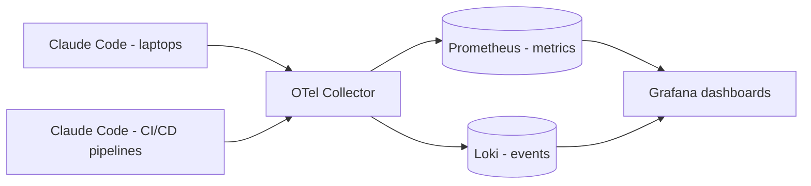
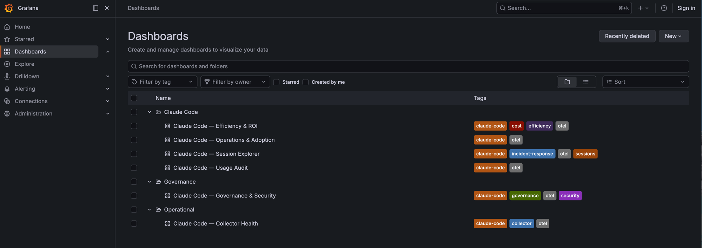
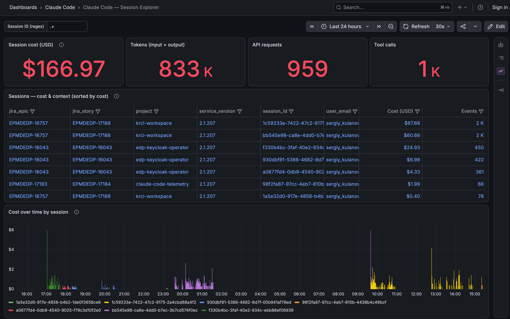
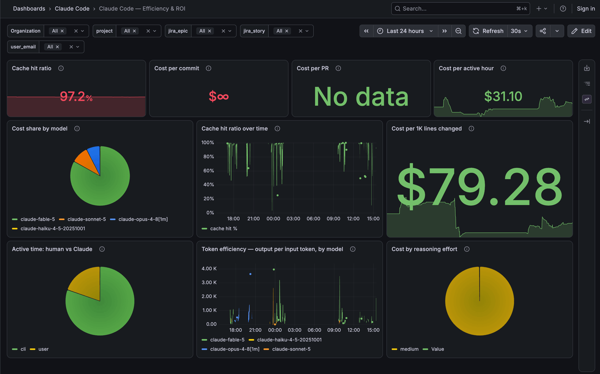
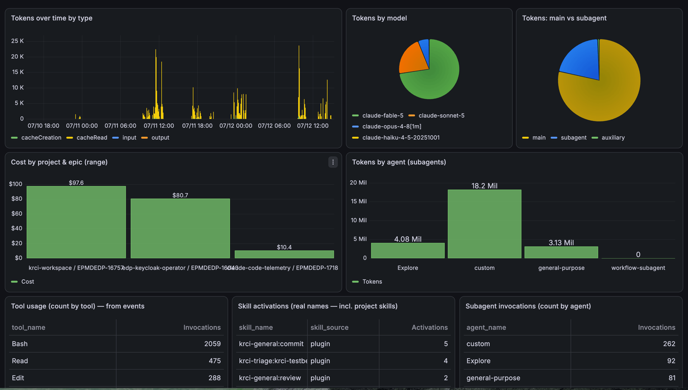
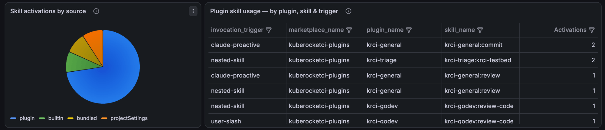
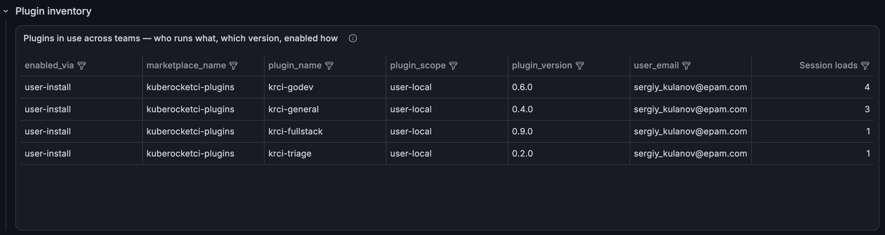

# Claude Code Telemetry: Token and Cost Metrics

In the last 24 hours, one engineer's Claude Code sessions burned **$166.97**, **833K input/output tokens**, and **959 API requests** - and I can tell you exactly which Jira story got that money, which model spent it, which subagents did the heavy lifting, and that the prompt-cache hit ratio stayed at **97.2%** the whole time. Not from a vendor console: from a self-hosted Grafana stack fed by telemetry Claude Code already emits.

That last part is the point. Claude Code has native [OpenTelemetry support](https://code.claude.com/docs/en/monitoring-usage) - rich metrics and events for tokens, cost, sessions, tools, skills, and agents - but nothing to look at them with. As soon as AI-assisted development becomes a line item, every engineering leader asks the same questions: *what are we spending, on what, and is it worth it?* This post shows how we answer them at KubeRocketCI with a small OTel Collector → Prometheus + Loki → Grafana pipeline that runs identically on a laptop and on a team Kubernetes cluster - the **claude-code-telemetry** stack - without ever capturing a single prompt or line of your code.

<!--truncate-->

Here's the path we'll take: why an "AI Factory" needs production-grade metering, what Claude Code emits out of the box, how to stand the stack up locally in minutes, how to attribute cost to projects and Jira tickets, how to deploy it for a whole team on Kubernetes (including CI/CD pipelines), the cardinality trap to avoid - and what a real day of data actually says.

## Why Should You Measure Claude Code Usage?

**Because AI agents are production workers now, and production workers get metered.** When developers and CI pipelines run Claude Code daily, token spend becomes real budget - and without attribution you can't answer which project, epic, or team consumed it, whether the spend produced code, or how adoption is trending.

Think of it as the observability layer of an **AI Factory**: the same discipline you apply to build minutes, cloud bills, and test flakiness, applied to AI-assisted engineering. Concretely, the questions that come up in every rollout:

- **FinOps:** cost by project, epic, story, user, and model - who spends, on what work.
- **Efficiency:** cost per commit, cost per 1K lines changed, cache hit ratio - is the spend producing output.
- **Adoption:** daily/weekly active users, sessions, active hours - is the investment being used.
- **Governance:** which plugins, skills, and MCP servers run where, in which versions - what your fleet actually executes.

And one hard constraint shapes everything: this must work **without capturing prompts, responses, or file contents**. Usage analytics is not surveillance - only aggregate counters and structured metadata should ever cross the wire.

## What Telemetry Does Claude Code Emit Out of the Box?

**Claude Code natively exports OTLP metrics and events once you set a few environment variables** - no wrappers, no scraping, no plugins. The metric names are fixed by the CLI, but every one carries dimensions you can slice by, and you can add your own.

The metrics that matter most for tokenomics:

| Metric | What it answers |
| --- | --- |
| `claude_code.token.usage` | tokens by `type` (input/output/cacheRead/cacheCreation), `model`, `agent.name`, `skill.name` |
| `claude_code.cost.usage` | USD by the same dimensions, plus plugin and marketplace |
| `claude_code.session.count` / `active_time.total` | adoption and engagement |
| `claude_code.lines_of_code.count`, `commit.count`, `pull_request.count` | output to divide cost by |

Alongside metrics, Claude Code emits **events** - `api_request` (per-call cost and token detail), `skill_activated`, `tool_result`, `tool_decision` - which carry the high-cardinality forensics: per-session, per-prompt, per-tool detail.

Two facts drive the whole design. First, **you cannot invent new metric names**, but you *can* inject new **dimensions** and derive anything downstream with PromQL or LogQL. Second, content capture is opt-in and off by default in our setup: prompts, assistant responses, file contents, and raw API bodies stay dark - we enable only `OTEL_LOG_TOOL_DETAILS` so skill, agent, and tool *names* are visible.

## Which Claude Products Support OpenTelemetry?

**Only Claude Code emits OTel today - the CLI, its IDE extensions, and the Agent SDK all share the same environment-variable configuration.** Claude Desktop's chat has no telemetry export (only its Cowork feature offers an admin-configured OTLP endpoint on Team/Enterprise plans), Claude Code on the web currently emits nothing, and raw API usage is served by Anthropic's pull-based Usage and Cost APIs instead.

| Product | OTel export | Mechanism |
| --- | --- | --- |
| Claude Code CLI | Yes | `CLAUDE_CODE_ENABLE_TELEMETRY` + `OTEL_*` env vars |
| VS Code / JetBrains extensions | Yes | inherit the CLI's `settings.json` |
| Agent SDK | Yes | same pipeline, runs as a child process |
| Claude Desktop (chat) | No | Cowork feature only, via admin portal |
| Claude Code on the web | Not yet | managed sandbox exposes no `OTEL_*` config |
| Claude API | No | pull-based [Usage & Cost / Analytics APIs](https://code.claude.com/docs/en/monitoring-usage) |

Two practical consequences for a rollout. First, the stack described here captures **CLI, IDE-extension, and Agent SDK sessions** - if part of your team works in Claude Code on the web, that spend is invisible to OTel until Anthropic closes the gap, so budget reconciliation still needs the Usage and Cost API as the financial source of truth. Second, if you later enable Cowork telemetry, note its content is **not redacted by default** - unlike Claude Code - so apply filtering in the collector before it shares a backend with this pipeline.

## How Do You Build a Self-Hosted Telemetry Stack?

**With one OTel Collector fanning out to Prometheus for metrics and Loki for events, visualized in Grafana** - the standard trio, packaged twice from the same config so a laptop and a Kubernetes cluster behave identically. That's the entire [claude-code-telemetry](https://github.com/KubeRocketCI/claude-code-telemetry) architecture:



The Collector is the heart: it receives OTLP (gRPC/HTTP), stamps every datapoint with a `collector.env` attribute so laptop and cluster traffic never get confused, converts resource attributes into Prometheus labels (`resource_to_telemetry_conversion`), and ships full-fidelity events to Loki. On top sit six pre-built dashboards, organized into three Grafana folders by audience:



- **Claude Code** - Usage Audit, Efficiency & ROI, Operations & Adoption, Session Explorer: the daily-driver views.
- **Governance** - Governance & Security: plugins, skills, permission decisions across the fleet.
- **Operational** - Collector Health: is the pipeline itself alive and ingesting.

## How Do You Enable It for Local Development?

**Start the docker-compose testbed, merge one `env` block into your Claude Code settings, and data flows within a minute.** The local stack is the source of truth we iterate on - same collector pipeline, same dashboards as the cluster deployment:

```bash
git clone https://github.com/KubeRocketCI/claude-code-telemetry.git
cd claude-code-telemetry/local
docker compose up -d   # Grafana :3000 · Prometheus :9090 · Loki :3100 · OTLP :4317
```

Then merge `local/claude-settings.snippet.json` into `~/.claude/settings.json` - the essentials:

```json
{
  "env": {
    "CLAUDE_CODE_ENABLE_TELEMETRY": "1",
    "OTEL_METRICS_EXPORTER": "otlp",
    "OTEL_LOGS_EXPORTER": "otlp",
    "OTEL_EXPORTER_OTLP_PROTOCOL": "grpc",
    "OTEL_EXPORTER_OTLP_ENDPOINT": "http://localhost:4317",
    "OTEL_LOG_TOOL_DETAILS": "1",
    "OTEL_LOG_USER_PROMPTS": "0",
    "OTEL_LOG_ASSISTANT_RESPONSES": "0",
    "OTEL_LOG_TOOL_CONTENT": "0"
  }
}
```

Restart Claude Code, open Grafana, and the Usage Audit dashboard starts filling with your own traffic. This loop - real usage in, dashboard iteration out - is how every panel in this post was built.

## How Do You Attribute Cost to Projects and Jira Tickets?

**By injecting business dimensions through `OTEL_RESOURCE_ATTRIBUTES` before each session starts.** Claude Code reads the variable once at startup and stamps every metric and event with it - so the discipline is simple: *one Jira ticket ≈ one session*.

```bash
export OTEL_RESOURCE_ATTRIBUTES="project=krci-portal,jira.epic=EPMDEDP-15000,jira.story=EPMDEDP-17147"
claude
```

Three custom keys are enough to start: `project` (the git repository), `jira.epic`, and `jira.story`. User identity comes free - Claude Code natively attaches `user.email`, `user.id`, and `organization.id` to everything, so per-person breakdowns need no injection at all.

The Session Explorer dashboard shows what this buys you. Every session becomes a row with its epic, story, project, user, cost, and event count - sortable, filterable, drillable:



Reading my own last 24 hours: **$166.97 total**, and the table names the culprits - two long `krci-workspace` sessions on story EPMDEDP-17188 at **$67.68** and **$60.66**, a `edp-keycloak-operator` triage on EPMDEDP-16043 at **$24.93**, and the session that built the telemetry stack itself at **$1.99**. When a manager asks "what did that epic cost in AI assistance?", this table *is* the answer - down to the session.

## How Do You Deploy It for a Team on Kubernetes?

**With the repo's self-contained Helm bundle - one `helm install`, no operators, no CRDs, no cluster-monitoring prerequisites.** Local PoC is for one laptop; team consumption means everyone's Claude Code - and your CI runners - pushing OTLP to a single in-cluster endpoint with shared dashboards:

```bash
helm dependency update deploy-templates
helm install claude-code-telemetry deploy-templates \
  -n claude-code-telemetry --create-namespace
```

The bundle wraps the upstream OTel Collector, Prometheus, Loki, and Grafana charts, and it is **deliberately isolated**: its Prometheus scrapes exactly two static targets (the collector's data and self-telemetry ports), all cluster-wide discovery is disabled, no node-exporter or kube-state-metrics tag along, and RBAC is namespace-scoped. It won't fight the observability stack you already run - and if you have one, each component toggles off (`grafana.enabled: false`, `prometheus.enabled: false`, …) so you can wire just the collector into existing storage.

Three things change at team scale compared to the laptop:

1. **Distribution** - ship the `env` block through a managed `settings.json` (MDM), so telemetry is on for everyone, pointed at the team endpoint, and can't be silently unset.
2. **Authentication** - expose the OTLP endpoint behind auth (`OTEL_EXPORTER_OTLP_HEADERS` with a bearer token, or Claude Code's `otelHeadersHelper` for short-lived tokens).
3. **Enforcement** - the Collector becomes the governance point users cannot bypass: inject defaults for missing attributes, validate `jira.*` values against `^[A-Z]+-[0-9]+$`, and drop or route telemetry that arrives without a `project`.

Every datapoint's `collector.env` label (`local-poc` vs `k8s`) keeps sources distinguishable, so laptops and the cluster can even feed shared dashboards during a migration without mixing data.

## How Do You Collect Metrics from CI/CD Pipelines?

**Exactly the same way - headless Claude Code in a pipeline step is still Claude Code, and the same OTLP env vars apply.** This is where the AI Factory framing stops being a metaphor: automated agents doing code review, test generation, or triage inside [Tekton pipelines](/blog/kubernetes-native-cicd-tekton-kuberocketci) spend tokens too, and they should land in the same ledger as human sessions.

In a pipeline task, set the same telemetry variables plus attribution that identifies the machine work:

```yaml
env:
  - name: CLAUDE_CODE_ENABLE_TELEMETRY
    value: "1"
  - name: OTEL_METRICS_EXPORTER
    value: "otlp"
  - name: OTEL_LOGS_EXPORTER
    value: "otlp"
  - name: OTEL_EXPORTER_OTLP_ENDPOINT
    value: "http://otel-collector.claude-code-telemetry:4317"
  - name: OTEL_RESOURCE_ATTRIBUTES
    value: "project=$(params.codebase),jira.epic=none,jira.story=$(params.ticket)"
```

The pipeline populates `project` from the codebase it builds and the ticket from the change it processes - attribution comes from parameters you already have. One caveat worth knowing: Claude Code does **not** propagate `OTEL_*` variables to subprocesses, so only the CLI process itself is instrumented - which is exactly what you want in a build pod. The result: a single Grafana view where "cost of AI per merge request" and "cost of AI per developer day" sit side by side.

## What Is the Cardinality Trap?

**Every unique label combination in Prometheus is a stored time series - so unbounded labels like Jira story IDs will eventually blow up your metrics store.** This is the telemetry twin of the lesson from our [Kubernetes audit trail post](/blog/kubernetes-audit-trail-who-changed-what): collect with a goal, not by default.

The rule we apply, enforced in the Collector:

- **Bounded dimensions** (`model`, `type`, `agent.name`, `skill.name`, `project`, `jira.epic`) → safe as **metric labels**, fast Grafana breakdowns.
- **Unbounded dimensions** (`jira.story`, `session.id`, `prompt.id`) → **events in Loki only**; derive per-story cost with LogQL over `api_request` events.

A single-user PoC can keep `jira.story` on metrics for convenience - ours does. At team scale, the Collector strips it from the metrics pipeline while Loki keeps the full detail. Same data, right store: Prometheus answers "how much, by which bounded dimension" in milliseconds; Loki answers "what exactly happened in that session" when you drill in.

## What Do the Numbers Actually Say?

**That efficiency metrics are the fastest way to turn raw spend into decisions - including uncomfortable ones.** The Efficiency & ROI dashboard divides cost by output, and a real day of data is more instructive than any synthetic demo:



- **Cache hit ratio: 97.2%.** Prompt caching is doing enormous work - at roughly a tenth of the input price, those cache reads are the difference between $167 and a number several times larger. If this ratio drops, something in your workflow broke; it's the first efficiency metric worth alerting on.
- **Cost per active hour: $31.10.** A defensible, explainable unit price for AI pairing - the number to put next to an engineer's loaded hourly cost when someone asks about ROI.
- **Cost per 1K lines changed: $79.28.** Noisy on any single day, meaningful as a trend across weeks and projects.
- **Cost per commit: $∞.** Total cost divided by `claude_code.commit.count`, which counts only commits made by Claude Code itself. We review and commit by hand, so the counter stays at zero and the panel shows infinity. If you commit through the agent, this becomes a real spend-per-delivered-commit number.

The Usage Audit dashboard tells you *where* the tokens went:



Over the two-day range: cost concentrates in **krci-workspace / EPMDEDP-16757 ($97.6)** and **edp-keycloak-operator / EPMDEDP-16043 ($80.7)**, with the telemetry stack's own development a modest **$10.4**. Token type over time is dominated by `cacheRead` - visual confirmation of that 97.2%. And the subagent panel is the sleeper hit: **custom agents consumed 18.2M tokens** against 4.08M for built-in Explore and 3.13M for general-purpose - the multi-agent workflows you build are where the budget actually goes. Tool usage (2,059 Bash invocations vs 475 Reads and 288 Edits in the window) rounds out the picture of what the agent fleet physically does all day.

## How Do You Govern Plugins and Skills Across a Team?

**The same event stream doubles as a software inventory - who runs which plugin, in which version, triggered how.** The Governance & Security dashboard breaks down skill activations by trigger, which quietly answers an adoption question every platform team has:



In our data, most activations are `claude-proactive` or `nested-skill` rather than `user-slash` - the agent invokes the team's KubeRocketCI plugins on its own more often than humans type slash commands. That's exactly what you want from packaged expertise, and now it's measurable rather than anecdotal.

The plugin inventory closes the loop for fleet management:



Every user session reports its loaded plugins with marketplace, version, and install scope. When you ship a fixed `krci-godev` and need to know who's still loading 0.6.0 - the dashboard already knows.

## Next Steps

- **Try it on your laptop:** clone [claude-code-telemetry](https://github.com/KubeRocketCI/claude-code-telemetry), run `docker compose up -d` in `local/`, merge the settings snippet, and watch your own session appear.
- **Deploy for your team:** install the Helm bundle from `deploy-templates/` and distribute the `env` block via managed settings.
- **Go deeper on the design:** the repo's `docs/analytics.md` covers the attribution model, cardinality guidance, and rollout plan; `spec/` catalogs the full Claude Code OTEL vocabulary.
- **See the platform context:** Claude Code is one worker in the factory - [KubeRocketCI](/docs/about-platform) provides the CI/CD floor it works on, from [Tekton pipelines](/blog/kubernetes-native-cicd-tekton-kuberocketci) to [audit trails](/blog/kubernetes-audit-trail-who-changed-what). New here? [Try it locally](/blog/try-kuberocketci-locally).

Token spend is the new build minutes: invisible until the invoice arrives, obvious once it's on a dashboard. Claude Code already emits everything you need - stand up the backend, inject three attributes, and "what does AI development cost us?" becomes a Grafana query instead of a guess.
