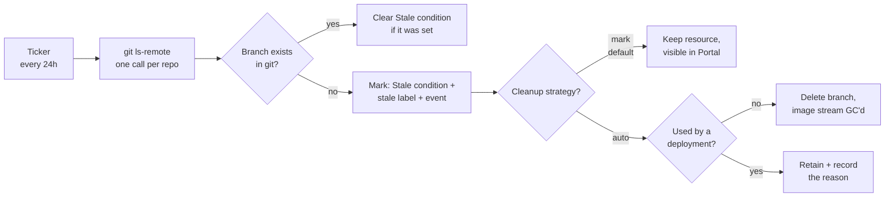
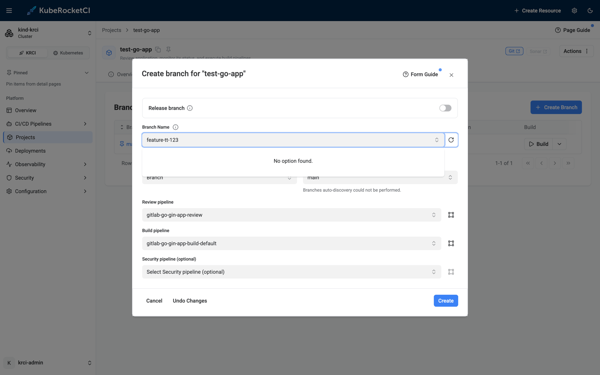
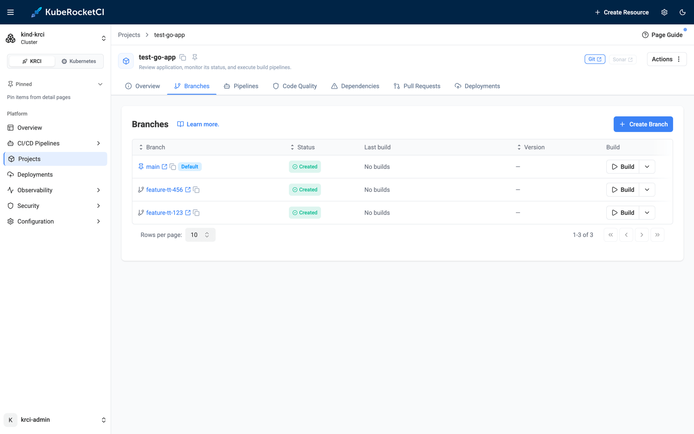
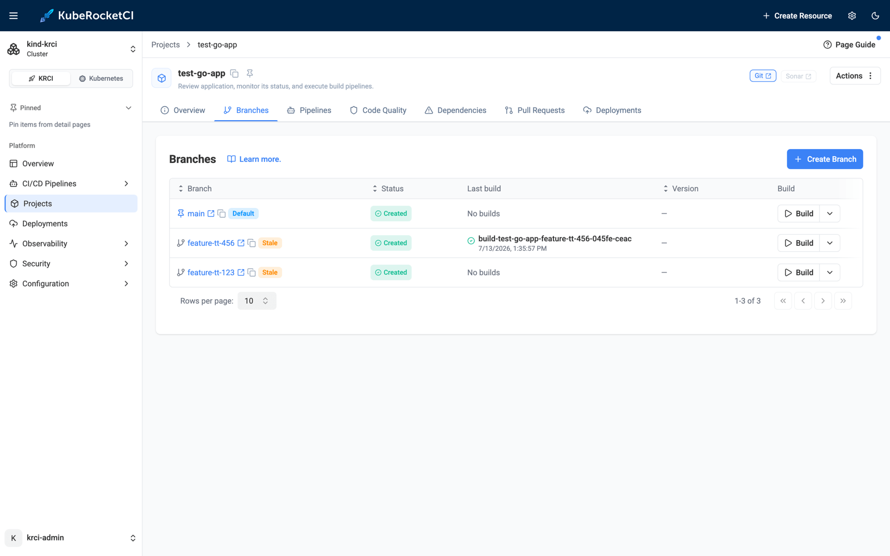
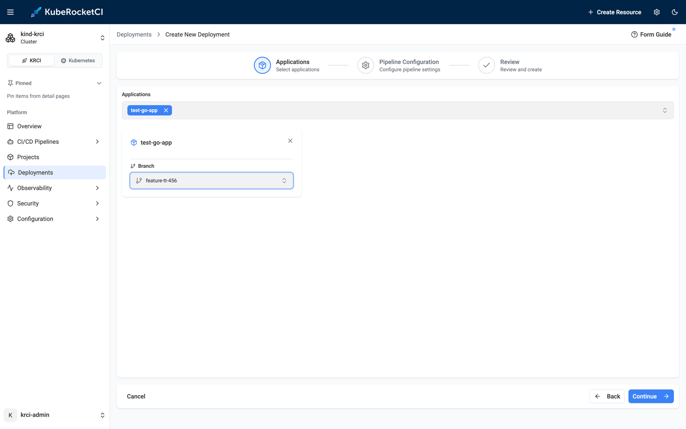
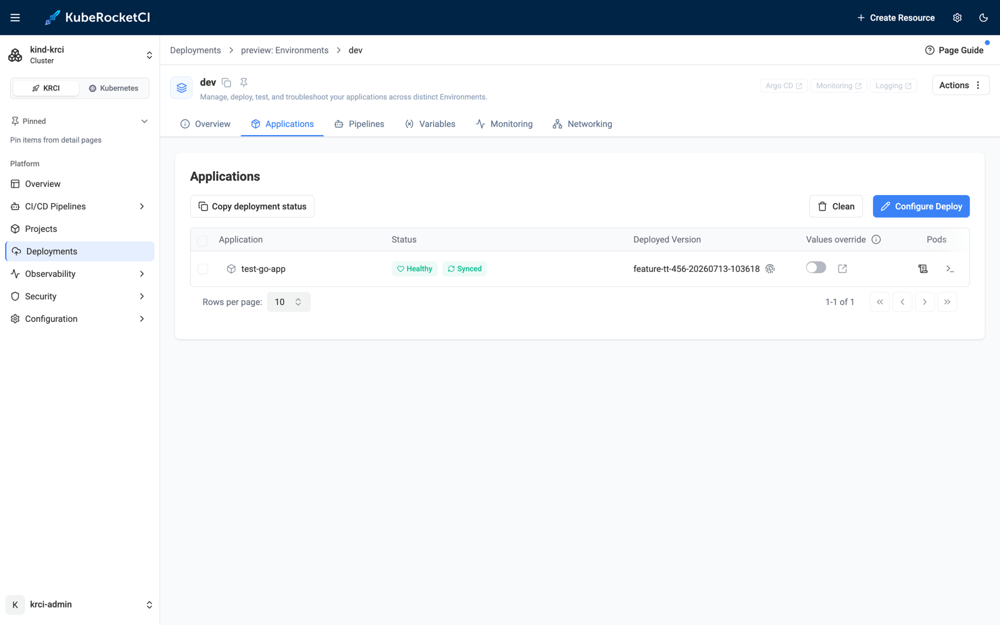
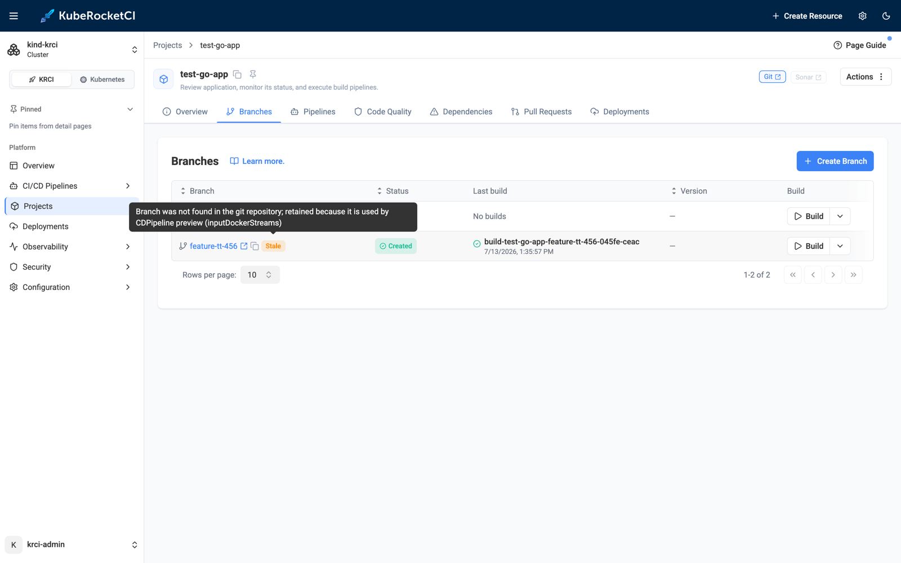
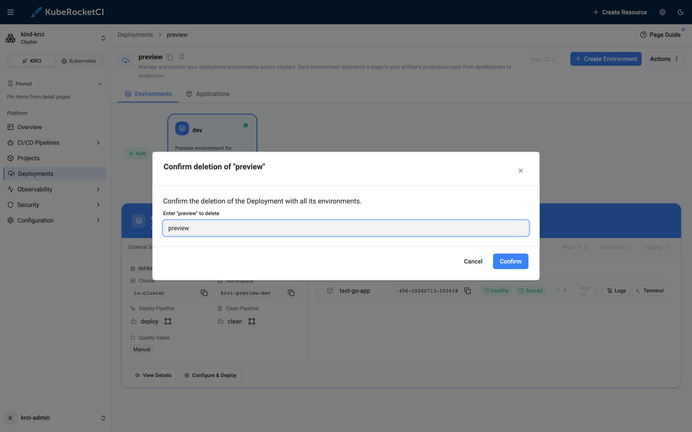

# Stale Branch Cleanup on Kubernetes: Keep Your Platform in Sync with Git

Every feature branch you create in KubeRocketCI becomes a `CodebaseBranch` resource in Kubernetes - the object that drives its CI pipelines, records its built images, and feeds [ephemeral preview environments](/blog/ephemeral-preview-environments-kubernetes-feature-branch). But when that branch merges and someone deletes it in GitLab or GitHub, the Kubernetes side never hears about it. The `CodebaseBranch` lives on: it clutters the Portal, offers a Build button for a branch that no longer exists, and on a busy platform these orphans accumulate by the hundreds.

KubeRocketCI 3.14 closes that gap. The codebase-operator now periodically verifies every branch against the real git repository, marks missing ones with a **Stale** condition (and a badge in the Portal), and - if you opt in - deletes them automatically, while refusing to touch any branch that is still wired into a deployment. This post shows the whole lifecycle live on the local [try-kuberocketci](/blog/try-kuberocketci-locally) testbed: every screenshot and command output below is from a real run.

<!--truncate-->

## Why Stale Branches Accumulate

The branch-per-feature workflow that makes [preview environments](/blog/ephemeral-preview-environments-kubernetes-feature-branch) so effective is also what produces the litter. The lifecycle of a healthy feature branch ends with a merge and a `git branch -d` - usually a checkbox in the merge request. That deletion happens *in git*. The platform objects created for the branch - the `CodebaseBranch` resource, its `CodebaseImageStream` (the record of images built from it) - are Kubernetes resources, and nothing in the git provider tells Kubernetes to remove them.

The result is drift between two sources of truth:

- **The Portal shows branches that do not exist.** New team members trigger builds against them and get confusing clone failures.
- **Resources pile up.** Platforms with dozens of codebases and a branch-per-ticket habit accumulate hundreds of dead `CodebaseBranch` and `CodebaseImageStream` objects.
- **Nobody knows which ones are safe to delete.** A `CodebaseBranch` may look abandoned and still be the input of a live deployment - deleting the wrong one breaks an environment.

Manual cleanup does not scale, and a naive cron that deletes anything old is dangerous. What you want is exactly what a Kubernetes operator is for: continuously observe external state (git), record it on the resource, and act on it with guardrails.

## How Stale Branch Detection Works

The codebase-operator runs a **stale branch checker** - a leader-elected background loop, not a webhook - because branch deletion in git produces no Kubernetes event to react to. On every tick it makes one cheap `git ls-remote` call per repository (no cloning, no working tree) and compares the listed branches against the `CodebaseBranch` resources in the namespace:



The verdict is recorded in three places, so both humans and tooling can consume it:

- **A `Stale` status condition** on the `CodebaseBranch` - the source of truth, with a reason (`BranchNotFoundInGit`) and a human-readable message.
- **The `app.edp.epam.com/stale` label**, mirroring the condition so you can filter with a plain label selector.
- **Kubernetes events** (`BranchStale`, `StaleBranchDeleted`, `StaleBranchRetained`, `BranchStaleResolved`) for audit trails and alerting.

Just as important is what the checker will *not* do:

- **No marking on infrastructure errors.** If the git server is unreachable or credentials are rejected, the sweep skips that repository entirely - a GitLab outage will never mass-mark your branches.
- **Default branches are never checked.** `main` cannot go stale.
- **Branches not yet pushed or already terminating are skipped.**
- **A branch that reappears in git is un-marked** on the next sweep (`BranchStaleResolved`).

Detection is always on and needs no configuration - the interval defaults to 24 hours (`branchStaleCheckInterval` Helm value; `0` disables the checker). Cleanup is a separate, opt-in decision per codebase, which we will get to below.

## Walkthrough: Marking Stale Branches on a Live Cluster

The setup is the same local testbed as the [preview environments post](/blog/ephemeral-preview-environments-kubernetes-feature-branch): a [kind](https://kind.sigs.k8s.io) cluster with KubeRocketCI, Tekton, Argo CD, and a self-hosted GitLab, with the sample Go application `test-go-app` already onboarded. The only deviation from defaults: I set the check interval to `2m` so the demo does not wait a day between sweeps.

The operator confirms the checker is running on startup:

```text
INFO  stale-branch-checker  Starting stale branch checker  {"interval": "2m0s"}
INFO  stale-branch-checker  Listing remote branches  {"repository": "git@gitlab.127.0.0.1.nip.io:krci/test-go-app.git"}
INFO  stale-branch-checker  Remote branches listed successfully  {"count": 2}
INFO  stale-branch-checker  Codebase branches staleness check finished  {"codebases": 2}
```

### Step 1: Create Two Feature Branches

In the `test-go-app` component: **Branches → Create Branch**. I create `feature-tt-123` and `feature-tt-456` from `main`, keeping the default pipelines.



Each click creates a `CodebaseBranch` resource and pushes the branch to GitLab. Note the new **STALE** column on the resource - empty for now, because every branch exists in git:

```bash
$ kubectl -n krci get codebasebranch
NAME                               RESULT    STATUS    CODEBASE NAME   BRANCH           STALE
krci-gitops-main                   success   created   krci-gitops     main
test-go-app-feature-tt-123-02e67   success   created   test-go-app     feature-tt-123
test-go-app-feature-tt-456-045fe   success   created   test-go-app     feature-tt-456
test-go-app-main                   success   created   test-go-app     main
```



### Step 2: Delete a Branch in Git - and Watch It Get Marked

Now the everyday event this feature exists for: the branch is merged and removed *in the git provider* - the "delete source branch" checkbox on a merge request, or an explicit API call. I delete `feature-tt-123` straight in GitLab:

```bash
$ curl -X DELETE -H "PRIVATE-TOKEN: $PAT" \
    "https://gitlab.127.0.0.1.nip.io/api/v4/projects/krci%2Ftest-go-app/repository/branches/feature-tt-123"
# HTTP 204
```

Kubernetes knows nothing about this - until the next sweep. Within two minutes:

```bash
$ kubectl -n krci get codebasebranch
NAME                               RESULT    STATUS    CODEBASE NAME   BRANCH           STALE
krci-gitops-main                   success   created   krci-gitops     main
test-go-app-feature-tt-123-02e67   success   created   test-go-app     feature-tt-123   True
test-go-app-feature-tt-456-045fe   success   created   test-go-app     feature-tt-456   False
test-go-app-main                   success   created   test-go-app     main
```

The condition carries the full story:

```json
{
  "type": "Stale",
  "status": "True",
  "reason": "BranchNotFoundInGit",
  "message": "Branch was not found in the git repository",
  "lastTransitionTime": "2026-07-13T10:33:09Z"
}
```

An event is emitted for the audit trail, and the mirrored label makes fleet-wide queries trivial:

```bash
$ kubectl -n krci get events --field-selector involvedObject.name=test-go-app-feature-tt-123-02e67
LAST SEEN   TYPE      REASON        MESSAGE
86s         Warning   BranchStale   Branch feature-tt-123 was not found in the git repository and is marked as stale

$ kubectl -n krci get codebasebranch -l app.edp.epam.com/stale=true
NAME                               ...   BRANCH           STALE
test-go-app-feature-tt-123-02e67   ...   feature-tt-123   True
```

The Portal surfaces the same information as a warning badge in the branch list - hover it and the tooltip shows the condition message:



At this point nothing has been deleted - the default cleanup strategy is **mark**: make staleness visible, let a human decide. For many teams that is already the win. But we can go further.

## Auto Cleanup - With a Deployment-Aware Safety Net

Before turning on automatic deletion, let's build the exact scenario that makes naive cleanup dangerous: a stale branch that is *still deployed*.

Following the [preview environment flow](/blog/ephemeral-preview-environments-kubernetes-feature-branch), I build `feature-tt-456` and create a Deployment named `preview` with an Auto-triggered `dev` environment consuming that branch's image stream:



After the deploy pipeline finishes, the preview environment is live in its own namespace, running the image built from `feature-tt-456`:



Now I delete `feature-tt-456` in GitLab too. Next sweep: **both** branches are stale - but one of them is backing a running environment.

### Guardrail 1: The Admission Webhook

Even a well-meaning human with `kubectl` cannot break the deployment by "cleaning up" the stale branch. The codebase-operator's admission webhook now rejects deleting any `CodebaseBranch` that participates in a deployment (a rule the Portal used to enforce only client-side):

```bash
$ kubectl -n krci delete codebasebranch test-go-app-feature-tt-456-045fe
Error from server (Forbidden): admission webhook "codebasebranch.epam.com" denied the request:
CodebaseBranch test-go-app-feature-tt-456-045fe cannot be deleted because it is used by
CDPipeline preview (inputDockerStreams); remove it from the deployment first
```

### Guardrail 2: Retention in Auto Cleanup

Automatic cleanup is opt-in **per codebase**, via a single annotation:

```bash
$ kubectl -n krci annotate codebase test-go-app app.edp.epam.com/branch-cleanup-strategy=auto
```

With `auto`, the next sweep deletes stale branches that nothing references - and retains the ones that a `CDPipeline` (or a Stage autotest quality gate) still uses. One sweep later, the two stale branches got exactly opposite treatment:

```bash
$ kubectl -n krci get events --sort-by=.lastTimestamp | grep Stale
Warning   BranchStale          Branch feature-tt-456 was not found in the git repository and is marked as stale
Normal    StaleBranchDeleted   Branch feature-tt-123 was not found in the git repository and is not used by any deployment, deleting

$ kubectl -n krci get codebasebranch
NAME                               RESULT    STATUS    CODEBASE NAME   BRANCH           STALE
krci-gitops-main                   success   created   krci-gitops     main
test-go-app-feature-tt-456-045fe   success   created   test-go-app     feature-tt-456   True
test-go-app-main                   success   created   test-go-app     main
```

`feature-tt-123` is gone, and because the `CodebaseBranch` owns its `CodebaseImageStream`, the image stream was garbage-collected with it - no orphaned children. `feature-tt-456` stays, and its condition message names the exact resource that is keeping it alive:

```text
Branch was not found in the git repository; retained because it is used by CDPipeline preview (inputDockerStreams)
```

The Portal tooltip shows the same reason, so the "why is this still here?" question answers itself:



### Releasing the Hold

The retained branch is cleaned up the moment it stops being needed. I remove the preview Deployment in the Portal (**Actions → Delete**, type the name to confirm) - which, as covered in the [previous post](/blog/ephemeral-preview-environments-kubernetes-feature-branch), tears down the environment namespace and the Argo CD Application:



Next sweep, the last stale branch goes too:

```bash
$ kubectl -n krci get events --sort-by=.lastTimestamp | grep StaleBranchDeleted
Normal   StaleBranchDeleted   Branch feature-tt-123 ... not used by any deployment, deleting
Normal   StaleBranchDeleted   Branch feature-tt-456 ... not used by any deployment, deleting

$ kubectl -n krci get codebasebranch
NAME               RESULT    STATUS    CODEBASE NAME   BRANCH   STALE
krci-gitops-main   success   created   krci-gitops     main
test-go-app-main   success   created   test-go-app     main
```

The platform is back to exactly what git says it should be - no manual bookkeeping, and at no point could the cleanup have taken down a running environment.

## Configuration Reference

| Setting | Where | Default | Effect |
|---|---|---|---|
| `branchStaleCheckInterval` | codebase-operator Helm values (env `BRANCH_STALE_CHECK_INTERVAL`) | `24h` | Sweep interval; `0` disables detection entirely |
| `app.edp.epam.com/branch-cleanup-strategy` | Annotation on a `Codebase` | `mark` | `mark` = only flag stale branches; `auto` = delete unreferenced stale branches |
| `app.edp.epam.com/stale` label | Set by the operator on `CodebaseBranch` | - | Mirrors the `Stale` condition for label-selector queries |

Events emitted by the checker:

| Event reason | Type | Meaning |
|---|---|---|
| `BranchStale` | Warning | Branch missing in git, marked as stale |
| `BranchStaleResolved` | Normal | Branch reappeared in git, mark removed |
| `StaleBranchDeleted` | Normal | Auto cleanup deleted an unreferenced stale branch |
| `StaleBranchRetained` | Warning | Stale branch kept because a deployment references it |

Handy one-liners:

```bash
# All stale branches across the platform namespace
kubectl -n krci get codebasebranch -l app.edp.epam.com/stale=true

# Why is this branch still around?
kubectl -n krci get codebasebranch <name> -o jsonpath='{.status.conditions[?(@.type=="Stale")].message}'
```

## Frequently Asked Questions

### What marks a CodebaseBranch as stale in KubeRocketCI?

A periodic checker in the codebase-operator lists the repository's branches with `git ls-remote` and compares them against the `CodebaseBranch` resources. If a branch no longer exists in the git repository, the resource gets a `Stale` status condition (reason `BranchNotFoundInGit`), the `app.edp.epam.com/stale` label, a Kubernetes event, and a warning badge in the Portal.

### Can the default branch ever be marked stale or deleted?

No. Default branches (for example `main`) are excluded from staleness checks entirely, as are branches that have not been pushed yet and branches already being deleted.

### What happens if GitLab or GitHub is down during a sweep?

Nothing. The checker never marks branches when the repository listing fails - connectivity problems, DNS errors, or rejected credentials cause the repository to be skipped for that sweep. Only a successful listing that positively lacks the branch produces a stale mark.

### Does stale detection delete branches automatically?

Not by default. Out of the box the strategy is `mark`: branches are flagged and left for a human. Automatic deletion is enabled per codebase with the `app.edp.epam.com/branch-cleanup-strategy: auto` annotation, and even then a stale branch referenced by a CDPipeline or a Stage quality gate is retained, with the retaining resource recorded in the condition message.

### Can a stale branch that is still deployed be deleted by mistake?

No - two independent guardrails prevent it. Auto cleanup skips any branch referenced by a deployment, and the codebase-operator's admission webhook rejects manual deletion (`kubectl delete`, API calls) of a `CodebaseBranch` that participates in a deployment, naming the CDPipeline in the error message.

### What happens to the images built from a deleted branch?

The `CodebaseBranch` owns its `CodebaseImageStream`, so when auto cleanup deletes the branch resource, Kubernetes garbage collection removes the image stream record with it. The container images themselves stay in your registry - registry retention is a separate concern.

### How do I find all stale branches across the platform?

`kubectl get codebasebranch -l app.edp.epam.com/stale=true -A`. The label mirrors the status condition specifically so that plain label selectors - and any tooling built on them - can find stale branches without parsing conditions.

## Summary

Feature branches are ephemeral; the Kubernetes resources behind them used to be forever. With KubeRocketCI 3.14, the codebase-operator closes the loop. One `git ls-remote` per repository per sweep detects branches deleted from git, and a `Stale` condition plus label plus Portal badge make them visible. An opt-in per-codebase `auto` strategy deletes the ones nothing depends on - while an admission webhook and a deployment-aware retention check make sure the cleanup can never take down a running environment.

In this run we created two branches, deleted them in GitLab at different points of their lifecycle, and watched the operator mark one, auto-delete it, retain the other while its [preview environment](/blog/ephemeral-preview-environments-kubernetes-feature-branch) was alive, and finish the job the moment the environment was gone - ending with a platform that matches git exactly.

Next steps from here:

- Spin up the same environment with [Try KubeRocketCI Locally](/blog/try-kuberocketci-locally) and replay the flow - the whole demo fits in a lunch break.
- Read [Manage Branches](/docs/user-guide/manage-branches) for the day-to-day branch workflow in the Portal.
- See [Ephemeral Environments on Kubernetes](/blog/ephemeral-preview-environments-kubernetes-feature-branch) for the preview-environment lifecycle that produces these branches in the first place.
- Explore the [codebase-operator on GitHub](https://github.com/epam/edp-codebase-operator) - the stale checker lives in `controllers/codebasebranch/stalecheck/`.

KubeRocketCI is open source under Apache License 2.0. The platform, Helm charts, and the local testbed are all on [GitHub](https://github.com/KubeRocketCI/try-kuberocketci).

{/* cspell:ignore stalecheck 02e67 045fe */}
