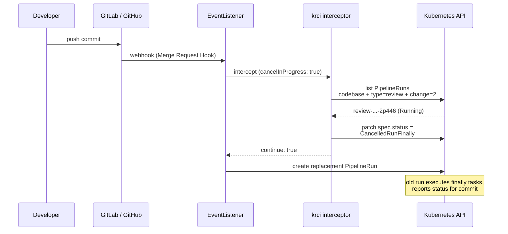
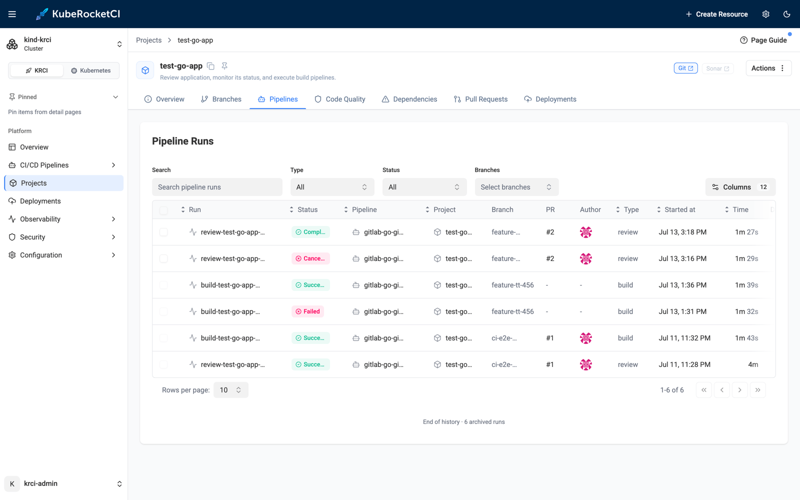
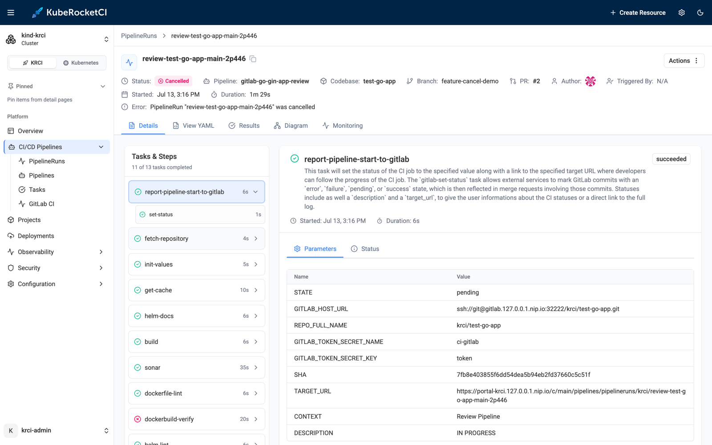
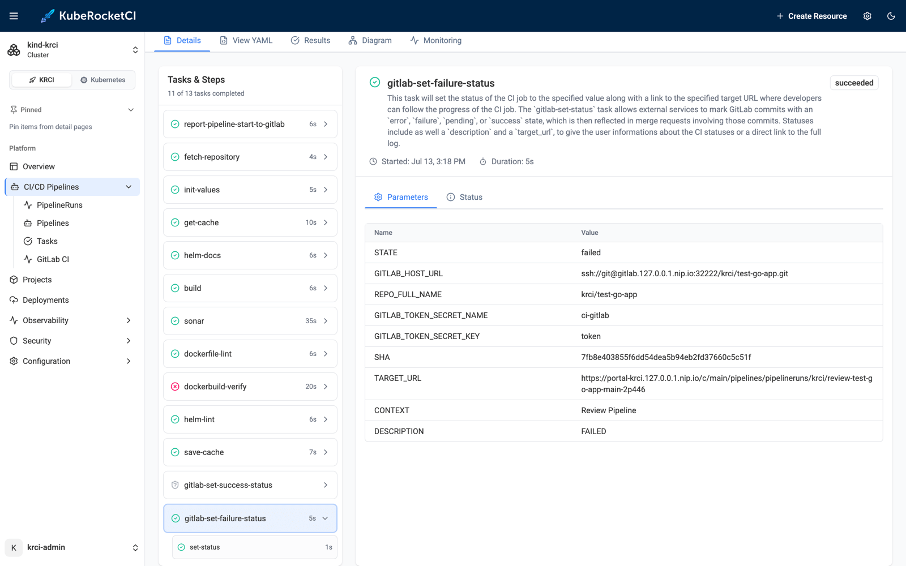

# Cancel In-Progress Tekton Pipelines: Stop Wasting CI on Outdated Commits

Push a commit to a merge request and your review pipeline starts. Spot a typo, push again thirty seconds later - and now *two* pipelines are running, one of them validating a commit that no longer matters. GitHub Actions solved this years ago with `concurrency.cancel-in-progress`; Tekton has no built-in equivalent, so on a Tekton-based platform those superseded runs keep burning CPU until they finish, producing results nobody will read.

KubeRocketCI 3.14 closes that gap with a single chart flag: `pipelines.cancelInProgress`. When enabled, the KRCI [Tekton interceptor](/blog/kubernetes-native-cicd-tekton-kuberocketci) cancels still-running review PipelineRuns for the same pull request before triggering the replacement. The cancellation is graceful (`CancelledRunFinally`): the superseded run still executes its `finally` tasks, so your git provider gets a status for the old commit instead of an eternally "pending" check. This post shows the whole flow live on the local [try-kuberocketci](/blog/try-kuberocketci-locally) testbed - every screenshot and command output is from a real run.

<!--truncate-->

## The Problem: Superseded Review Runs Pile Up

A review (pull request) pipeline exists to answer one question: *is this commit mergeable?* The moment a newer commit lands on the same merge request, that question changes - and every pipeline still validating the old commit is wasted work. The pattern is worst exactly where CI matters most: active MRs with quick fix-up pushes, `/recheck` comments, rebases. Each event spawns a full pipeline - clone, build, lint, SonarQube scan, image verification - and on a shared cluster those zombie runs compete with useful work for CPU, memory, and runner capacity.

GitHub Actions users express the fix in two lines of YAML:

```yaml title="GitHub Actions equivalent (for comparison)"
concurrency:
  group: review-${{ github.ref }}
  cancel-in-progress: true
```

Tekton, by design, has no such primitive - a `PipelineRun` is a standalone Kubernetes resource with no concept of "group" or "supersedes". The [Tekton community has discussed pipeline concurrency for years](https://github.com/tektoncd/community/pull/716) without a shipped core feature. So the platform layer has to provide it - and in KubeRocketCI, the natural place is the **krci interceptor**, the component that already sits between every git webhook and every triggered pipeline.

## How Cancel-In-Progress Works

The interceptor enriches webhook payloads for all four supported git providers (GitHub, GitLab, Bitbucket, Gerrit) before Tekton's EventListener instantiates a PipelineRun. That position makes it the perfect referee: it sees the *new* event before the new run exists, and it can find every *old* run for the same change because review PipelineRuns are now stamped with a `app.edp.epam.com/git-change-number` label at creation time.



The design choices matter as much as the mechanism:

- **Graceful, not brutal.** The interceptor patches `spec.status: CancelledRunFinally` - Tekton stops scheduling new tasks and cancels running ones, but the pipeline's `finally` section still executes. In KubeRocketCI's pipelines-library, that is where commit status is reported back to the git provider - so the superseded commit ends up marked *failed*, never stuck *pending*.
- **Review pipelines only.** The `cancelInProgress` parameter is injected into review Triggers exclusively. Build pipelines - the ones producing versioned artifacts after a merge - are never cancelled.
- **Best-effort by contract.** If listing or patching fails, the error is logged and the new pipeline triggers anyway. Cancellation can never break your CI.
- **Scoped to one change.** The label selector matches codebase + pipeline type + change number, so parallel MRs on the same repository never interfere with each other.
- **RBAC follows the flag.** The interceptor's Role gains `patch` on `pipelineruns` only when the feature is enabled.

Enabling it is one Helm value on the pipelines-library chart:

```yaml title="values.yaml (pipelines-library)"
pipelines:
  # Cancel in-progress review PipelineRuns when a new commit is pushed to the same
  # Pull Request / Merge Request / Gerrit change. Cancellation is graceful
  # (spec.status: CancelledRunFinally), so finally tasks of the superseded run still execute.
  cancelInProgress: true
```

## Walkthrough: Two Commits, One Surviving Pipeline

The environment is the same local testbed as my previous posts: a [kind](https://kind.sigs.k8s.io) cluster with KubeRocketCI, Tekton, and self-hosted GitLab, with the Go sample application `test-go-app` onboarded and `pipelines.cancelInProgress: true` set.

### Step 1: Open a Merge Request

I create a branch, add a commit, and open a merge request through the GitLab API - the same thing a developer does from the terminal:

```bash
$ git checkout -b feature-cancel-demo && git commit -m "feat: add feature (attempt 1)" && git push
# MR !2 "Add feature" opened against main
```

The webhook fires, and the review pipeline starts. Note the change-number label - this is the handle the interceptor will use later:

```bash
$ kubectl -n krci get pipelinerun --show-labels | grep review
review-test-go-app-main-2p446   Unknown   Running   2s
  app.edp.epam.com/codebase=test-go-app,
  app.edp.epam.com/pipelinetype=review,
  app.edp.epam.com/git-change-number=2, ...
```

### Step 2: Push a Fix While the Pipeline Is Still Running

Ninety seconds in - the pipeline is mid-flight, fetch, build and sonar already done, image verification in progress - I notice the typo and push the fix to the same branch:

```bash
$ git commit -m "feat: add feature (attempt 2, fixes review)" && git push
```

GitLab sends the `update` webhook. The interceptor finds the still-running pipeline for change 2, cancels it, and lets the new one trigger. Twenty seconds later the picture is exactly what you want:

```bash
$ kubectl -n krci get pipelinerun
NAME                            SUCCEEDED   REASON      STARTTIME   COMPLETIONTIME
review-test-go-app-main-2p446   False       Cancelled   104s        15s
review-test-go-app-main-8th5r   Unknown     Running     22s
```

One log line in the interceptor tells the story:

```text
Canceled in-progress PipelineRun review-test-go-app-main-2p446 superseded
by a new event for codebase test-go-app change 2
```

The Portal shows both runs side by side - the superseded run **Cancelled** at 1m 29s instead of running to completion, the replacement already underway:



### Step 3: Verify the Cancellation Was Graceful

Open the cancelled run in the Portal. The status is `Cancelled`, the spec says `CancelledRunFinally`, and the task list is the interesting part:



```bash
$ kubectl -n krci get taskrun -l tekton.dev/pipelineRun=review-test-go-app-main-2p446
NAME                                       OK      REASON
...-fetch-repository                       True    Succeeded
...-build                                  True    Succeeded
...-sonar                                  True    Succeeded
...-dockerbuild-verify                     False   TaskRunCancelled   <- was in flight
...-gitlab-set-failure-status              True    Succeeded          <- finally task ran
```

`dockerbuild-verify` - the task that was running when the second commit arrived - was cancelled. But the `finally` task `gitlab-set-failure-status` executed *after* the cancellation and reported the outcome to GitLab:



The git provider's view confirms it - no dangling "pending" check anywhere:

```bash
# commit #1 (superseded)
$ glab api projects/krci%2Ftest-go-app/repository/commits/7fb8e40/statuses
Review Pipeline -> failed

# commit #2 (current)
$ glab api projects/krci%2Ftest-go-app/repository/commits/5ffb585/statuses
Review Pipeline -> success
```

The replacement run finished green, the MR shows a passing pipeline for the latest commit, and the cluster spent zero extra minutes on the outdated one.

## What This Saves

Back-of-the-envelope for a real team: the review pipeline above takes about 4 minutes of pod time (clone, build, lint, SonarQube, image verification). A ten-developer team pushing an average of one fix-up commit per MR wastes one full pipeline per MR - dozens of pipeline-hours per month on a busy repository, all competing with useful runs for cluster capacity. Concurrency limits and cluster autoscaling treat the symptom; cancelling superseded runs removes the work itself. It is the same reasoning that makes [ephemeral environments](/blog/ephemeral-preview-environments-kubernetes-feature-branch) cheaper than permanent staging: the cheapest workload is the one that stops existing when it stops being useful.

## Configuration Reference

| Setting | Where | Default | Effect |
|---|---|---|---|
| `pipelines.cancelInProgress` | pipelines-library Helm values | `false` | Cancel in-progress review PipelineRuns superseded by a new event for the same change |
| `app.edp.epam.com/git-change-number` | Label stamped on review PipelineRuns | - | Selector the interceptor uses to find superseded runs |

Behavior summary:

- **Triggers cancellation:** a new commit pushed to the same PR/MR/Gerrit change, and re-trigger comments (`/recheck`, `/ok-to-test`).
- **Cancels:** review PipelineRuns for the same codebase and change number that are not already done or cancelled.
- **Never touches:** build pipelines, runs for other changes, runs for other codebases.
- **On failure:** logs the error and proceeds - the new pipeline always triggers.

Handy one-liner to see every run for a given pull request, newest first:

```bash
kubectl -n krci get pipelinerun \
  -l app.edp.epam.com/git-change-number=2,app.edp.epam.com/codebase=test-go-app \
  --sort-by=.metadata.creationTimestamp
```

## Frequently Asked Questions

### Does Tekton have a built-in equivalent of GitHub Actions cancel-in-progress?

No. Tekton PipelineRuns are independent Kubernetes resources with no native concurrency groups; pipeline concurrency has been a long-running community discussion without a shipped core feature. KubeRocketCI implements the pattern at the platform layer, in the interceptor that already processes every git webhook.

### Why CancelledRunFinally instead of just deleting the PipelineRun?

Deleting (or hard-cancelling) a run would leave the superseded commit with a forever-pending status in GitLab or GitHub, and would skip cleanup logic. `CancelledRunFinally` stops the useless work but still executes the pipeline's `finally` tasks - in KubeRocketCI's pipeline library that is where the commit status is reported, so the old commit is cleanly marked as failed.

### Are build pipelines ever cancelled?

No. The `cancelInProgress` interceptor parameter is injected into review Triggers only. Build pipelines - triggered by merges and producing versioned artifacts - always run to completion.

### Which git providers are supported?

All four KubeRocketCI providers: GitHub, GitLab, Bitbucket, and Gerrit. The change number is parsed from each provider's webhook payload (including Gerrit's, which sends it as either an integer or a string), and the same label-based cancellation logic applies everywhere.

### What happens if the cancellation itself fails?

Nothing visible to the developer. Cancellation is best-effort: a failure to list or patch PipelineRuns is logged by the interceptor and the new pipeline is triggered regardless. The worst case is the old behavior - two runs in parallel - never a blocked pipeline.

### Can two different merge requests cancel each other's pipelines?

No. The interceptor matches on codebase *and* pipeline type *and* change number. Parallel MRs on the same repository each have their own change number, so their pipelines coexist untouched.

### How do I enable this on an existing KubeRocketCI installation?

Set `pipelines.cancelInProgress: true` in the pipelines-library chart values and upgrade the release. The chart adds the interceptor parameter to review Triggers, stamps the change-number label on review runs, and extends the interceptor's RBAC with `patch` on `pipelineruns` - all gated by the same flag, nothing else changes.

## Summary

Every push to an active merge request used to leave a zombie review pipeline burning cluster resources on a commit nobody cares about anymore. With `pipelines.cancelInProgress: true`, the KRCI interceptor now cancels superseded review runs the instant the replacing event arrives - gracefully, so `finally` tasks still report a status for the old commit, scoped by a change-number label so parallel MRs never collide, and best-effort so CI can never be blocked by its own cleanup.

In this run, the second commit landed 90 seconds into the first commit's pipeline: the in-flight task was cancelled on the spot, GitLab received a *failed* status for the superseded commit and a *success* for the new one, and only one pipeline ran to completion. The whole feature is one Helm value.

Next steps from here:

- Stand up the same environment with [Try KubeRocketCI Locally](/blog/try-kuberocketci-locally) and replay the flow.
- Read [Kubernetes-Native CI/CD with Tekton](/blog/kubernetes-native-cicd-tekton-kuberocketci) for the architecture this builds on - the interceptor, triggers, and the pipelines library.
- See [Manage Tekton Pipelines](/docs/user-guide/tekton-pipelines) for the day-to-day pipeline workflow in the Portal.
- Explore the implementation in [edp-tekton on GitHub](https://github.com/epam/edp-tekton) - the cancellation logic lives in `pkg/interceptor/cancel_pipelineruns.go`.

KubeRocketCI is open source under Apache License 2.0. The platform, Helm charts, and the local testbed are all on [GitHub](https://github.com/KubeRocketCI/try-kuberocketci).

{/* cspell:ignore pipelineruns dockerbuild 2p446 8th5r 7fb8e40 5ffb585 COMPLETIONTIME glab Ftest */}
