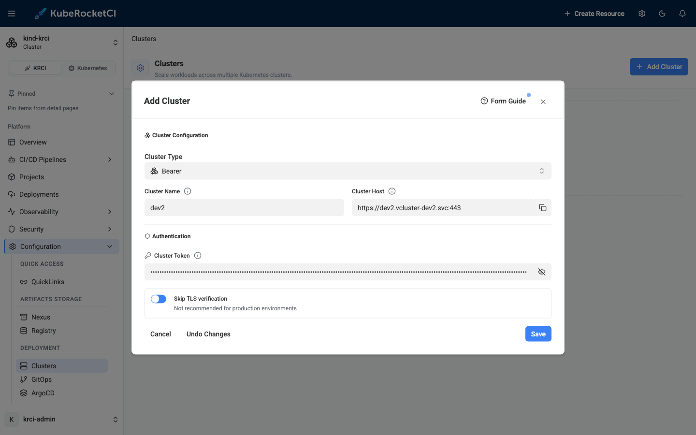
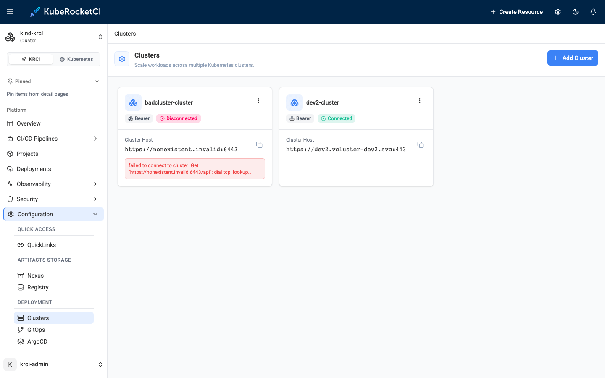
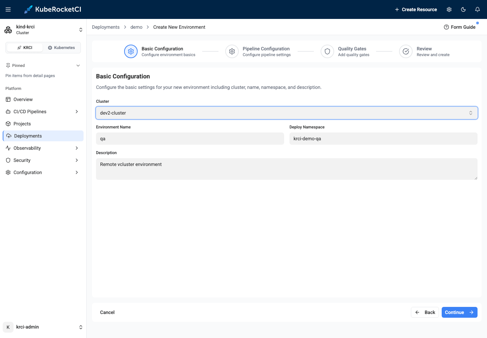
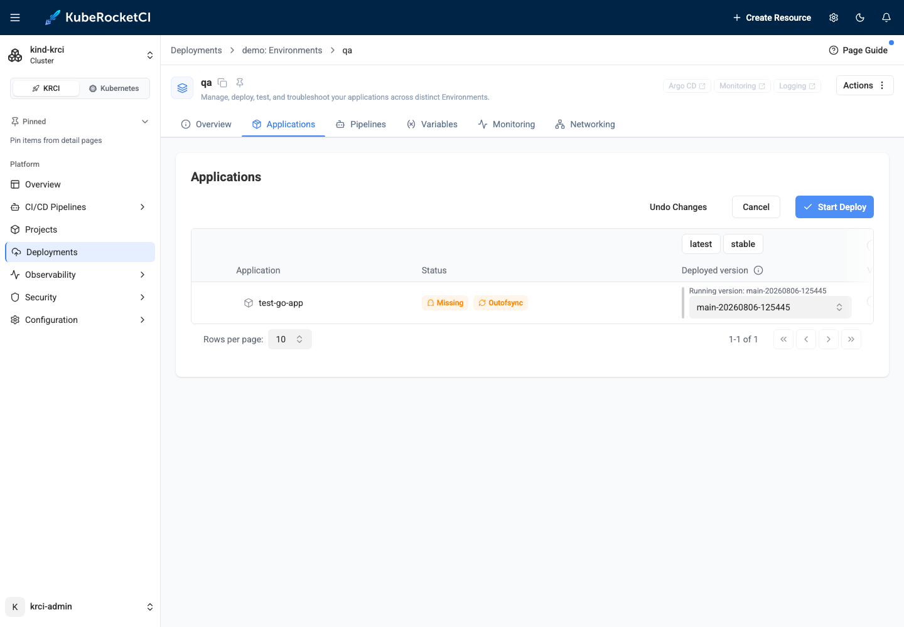
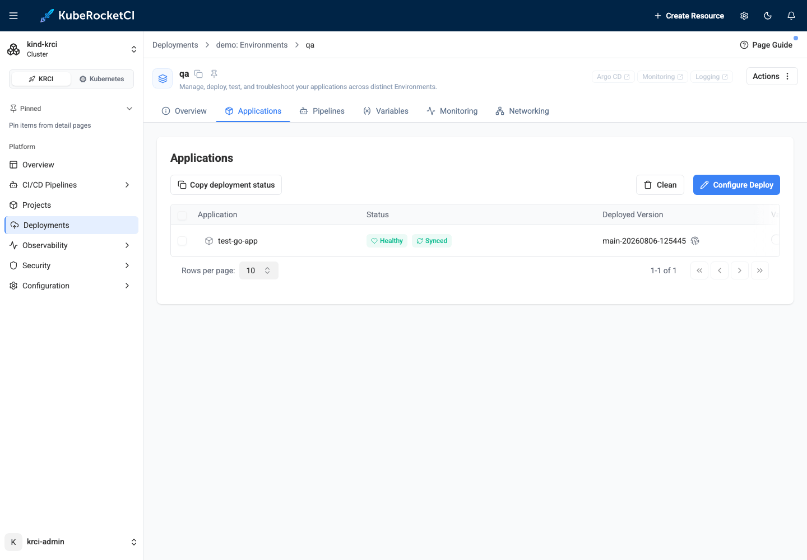

# Isolate Deployment Environments with vcluster: Multi-Cluster CD Without a Second Cluster

Every platform team hits the same wall: the `qa` environment needs a different CRD version than `dev`, a teammate's experiment needs cluster-admin, or a preview environment needs to be disposable without a change-advisory meeting. Kubernetes namespaces don't isolate any of that - CRDs, admission webhooks, and cluster-scoped RBAC are shared by every namespace on the cluster. The textbook answer is a second cluster, but a second cluster means a second control plane to pay for, patch, and secure.

[vcluster](https://www.vcluster.com/) sits exactly in that gap: a certified Kubernetes distribution that runs *inside* a namespace of your existing cluster, with its own API server, its own CRDs, and its own RBAC - while the pods it schedules land on the host nodes you already own. That makes it a perfect deployment target for a CI/CD platform: real cluster isolation, zero new hardware.

This post walks through the complete flow on KubeRocketCI: create a vcluster, register it through the Portal, wire Argo CD, and promote an application into it. Everything below - every command, screenshot, and error message - is from a real run on the local [try-kuberocketci](/blog/try-kuberocketci-locally) testbed.

<!--truncate-->

## Why a Virtual Cluster Instead of a Namespace or a Real Cluster?

| | Namespace | vcluster | Separate cluster |
|---|---|---|---|
| Workload isolation | Yes | Yes | Yes |
| Own CRDs & API versions | No - shared | Yes | Yes |
| Own RBAC / cluster-admin | No - shared cluster scope | Yes | Yes |
| Blast radius of a bad operator | Whole cluster | The vcluster | The other cluster |
| Extra infrastructure cost | None | ~1 pod (control plane) | Full control plane + nodes |
| Setup time | Seconds | Minutes | Hours to days |
| Teardown | `kubectl delete ns` | `vcluster delete` | Ticket to infra team |

If you need hard isolation of the *control plane* - separate cloud account, separate failure domain, compliance boundary - use a real cluster. For everything else (per-team sandboxes, qa environments with diverging CRDs, disposable preview targets like the ones in our [ephemeral environments post](/blog/ephemeral-preview-environments-kubernetes-feature-branch)), a vcluster gives you cluster-grade isolation at namespace-grade cost.

## Spin Up the vcluster and Mint a Deployer Token

Two commands stand up the virtual cluster next to the platform (the testbed runs KubeRocketCI in a kind cluster, but the flow is identical on any Kubernetes):

```bash
vcluster create dev2 --namespace vcluster-dev2 --connect=false
```

The vcluster's API server is now reachable from inside the host cluster at a stable Service URL: `https://dev2.vcluster-dev2.svc:443`. That in-cluster address is all the platform needs - no ingress, no load balancer.

Next, create a ServiceAccount inside the vcluster for the platform to deploy with, following the [remote cluster via token](/docs/operator-guide/cd/deploy-application-in-remote-cluster-via-token) guide:

```bash
vcluster connect dev2 --namespace vcluster-dev2 -- bash -c '
kubectl create sa krci-deployer -n kube-system
kubectl create clusterrolebinding krci-deployer-admin \
  --clusterrole=cluster-admin --serviceaccount=kube-system:krci-deployer
kubectl apply -f - <<EOF
apiVersion: v1
kind: Secret
metadata:
  name: krci-deployer-token
  namespace: kube-system
  annotations:
    kubernetes.io/service-account.name: krci-deployer
type: kubernetes.io/service-account-token
EOF
kubectl -n kube-system get secret krci-deployer-token \
  -o jsonpath="{.data.token}" | base64 -d'
```

One detail that makes vcluster unusually friendly for CI/CD: pods scheduled in the vcluster are synced to the host nodes, so image pulls reuse the host's registry access. No new registry credentials, mirrors, or CA bundles to configure on a "new" cluster.

## Add the Cluster Through the Portal

In the Portal, navigate to **Configuration** -> **Deployment** -> **Clusters**, click **+ Add Cluster**, and fill in the Bearer form: name `dev2`, host `https://dev2.vcluster-dev2.svc:443`, the token from above, and **Skip TLS verification** for the first pass (you can wire the CA properly later).



Here is what actually happens when you click Save - understanding it will save you a debugging session later:

1. The Portal creates **one Secret** named `dev2-cluster` (your name plus a `-cluster` suffix) in the platform namespace, containing a kubeconfig.
2. The cd-pipeline-operator picks it up, performs a **live connectivity probe** against the API endpoint, and stamps the result on the Secret as annotations (`app.edp.epam.com/cluster-connected`, `app.edp.epam.com/cluster-error`).
3. Only after the probe succeeds, it generates a ready-to-use **Argo CD cluster secret** next to it, named `dev2-cluster-argocd-cluster`.

The "Secret has been created" toast therefore does *not* mean your credentials work. The truth is on the cluster card, which flips to **Connected** or **Disconnected** about a minute later:



That Disconnected card on the left is a deliberate demo - a cluster registered with an unreachable host. The Portal accepts it silently; the badge and error text are the only signals. Always wait for **Connected** before moving on.

## Wire Argo CD: Three Steps and One Golden Rule

The Portal registration alone is not enough to deploy. Three pieces of glue connect the new cluster to the delivery machinery, and all three must agree on **one string: the cluster Secret name** (`dev2-cluster`). This is the part where most integrations go sideways, so here is the full naming chain from our live run:

| Step | Object | Value |
|---|---|---|
| You type in the Portal | form field | `dev2` |
| Portal creates | Secret (platform ns) | `dev2-cluster` |
| Operator generates | Argo CD Secret (platform ns) | `dev2-cluster-argocd-cluster`, `data.name: dev2-cluster` |
| You add | `krci-config` ConfigMap | `available_clusters: dev2-cluster` |
| Environment wizard writes | `Stage.spec.clusterName` | `dev2-cluster` |
| Operator renders | Argo CD Application destination | `name: dev2-cluster` |
| Deploy pipeline receives | `KUBECONFIG_SECRET_NAME` param | `dev2-cluster` |

The `clusterName` is resolved *as a Secret name* by the operator and *as a destination name* by Argo CD - one string, two lookups. With that in mind, the three steps:

**1. Offer the cluster to the Environment wizard** - add the Secret name to the `krci-config` ConfigMap:

```bash
kubectl -n krci patch configmap krci-config --type merge \
  -p '{"data":{"available_clusters":"dev2-cluster"}}'
```

**2. Let Argo CD see the cluster.** Argo CD only discovers cluster secrets in its own control-plane namespace, so copy the generated secret there (keep the `argocd.argoproj.io/secret-type: cluster` label):

```bash
kubectl -n krci get secret dev2-cluster-argocd-cluster -o json \
  | jq '.metadata = {"name":"dev2-cluster","namespace":"argocd",
        "labels":{"argocd.argoproj.io/secret-type":"cluster"}}' \
  | kubectl apply -f -
```

**3. Allow the destination in the Argo CD AppProject** - without this, the first deploy fails (we will meet the exact error below):

```bash
kubectl -n argocd patch appproject krci --type json \
  -p '[{"op":"add","path":"/spec/destinations/-",
        "value":{"name":"dev2-cluster","namespace":"krci-*"}}]'
```

Full reference for these steps lives in the [Add Cluster](/docs/user-guide/add-cluster) guide.

## Create the Environment on the Virtual Cluster

Back in the Portal, open your Deployment Flow and create a new Environment. The **Cluster** dropdown now offers `dev2-cluster` next to `in-cluster` - pick it, and the wizard derives the deploy namespace as usual:



The moment the Environment is created, the operator reaches into the vcluster and prepares everything a tenant needs: the namespace (labelled with the tenant name), a `tenant-admin` RoleBinding, and a copy of the registry pull secret. You can verify from outside:

```bash
vcluster connect dev2 --namespace vcluster-dev2 -- \
  kubectl -n krci-demo-qa get rolebinding,secret
```

```text
NAME                                                 ROLE                AGE
rolebinding.rbac.authorization.k8s.io/tenant-admin   ClusterRole/admin   24s

NAME             TYPE                             DATA   AGE
secret/regcred   kubernetes.io/dockerconfigjson   1      24s
```

## Deploy and Prove the Isolation

Open the environment's **Applications** tab, click **Configure Deploy**, pick the image version, and hit **Start Deploy**:



The regular deploy pipeline runs, Argo CD resolves the destination by name, and the application lands *inside* the virtual cluster:

```bash
vcluster connect dev2 --namespace vcluster-dev2 -- \
  kubectl -n krci-demo-qa get deploy,pods
```

```text
NAME                          READY   UP-TO-DATE   AVAILABLE
deployment.apps/test-go-app   1/1     1            1

NAME                              READY   STATUS    RESTARTS
pod/test-go-app-84cd86f69-5xj4c   1/1     Running   0
```

From the host cluster's point of view, this workload lives in the vcluster's namespace under synthetic names; from the vcluster's point of view, it is a normal Deployment in a normal namespace with its own RBAC universe around it. Install a conflicting CRD version in there, grant someone cluster-admin, delete the whole thing - the host cluster and every other environment never notice.



## The Three Errors You Will Actually Hit

Every one of these appeared during our validation run - deliberately or not. Search engines love exact error strings, and so do humans at 2 a.m.

### `failed to get cluster secret: secrets "dev2" not found`

The Environment's `clusterName` does not match the cluster Secret name. Almost always this means `available_clusters` contains the plain name you typed in the Portal (`dev2`) instead of the Secret name (`dev2-cluster`). Fix the ConfigMap value; the Environment reconciles on the next loop.

### `InvalidSpecError: application destination server 'dev2-cluster' ... do not match any of the allowed destinations in project 'krci'`

The Argo CD AppProject does not allow the new cluster as a destination - step 3 above was skipped. Patch the AppProject, then re-run the deploy; the Application resolves immediately.

### The cluster card stays "Disconnected" (or "Unknown" forever)

Read the error on the card - it is the operator's live probe result. Wrong token, unreachable host, and TLS failures all surface there within a minute. If the badge never changes at all, check that the Secret was created in the platform namespace: the Portal writes it to whatever namespace is currently selected, and the operator only watches its own.

## Tear It Down in the Right Order

Order matters, because the operator needs the cluster Secret to clean up the remote side:

1. Delete the Environments that target the cluster.
2. Remove the name from `available_clusters`.
3. Delete the cluster in the Portal (the generated Argo CD secret is owned by it and goes too).
4. Delete your copy in the `argocd` namespace and the AppProject destination.
5. `vcluster delete dev2 --namespace vcluster-dev2`

Delete the Secret before the Environments and the operator silently skips the remote cleanup, leaving orphaned namespaces inside the vcluster - harmless here, since step 5 vaporizes the whole thing, but a real remote cluster would keep the litter.

## Wrap-Up

A vcluster turns "we need another environment" from an infrastructure request into a two-command operation - and to KubeRocketCI it is just another remote cluster: registered in the Portal, deployed to by the same pipelines, governed by the same [GitOps machinery](/blog/kubernetes-native-cicd-tekton-kuberocketci). The only real tax is the naming chain, and now you have the map.

Try the whole flow yourself on the [local testbed](/blog/try-kuberocketci-locally), and check the [Add Cluster](/docs/user-guide/add-cluster) guide for the reference procedure, including IRSA-based clusters on EKS.
