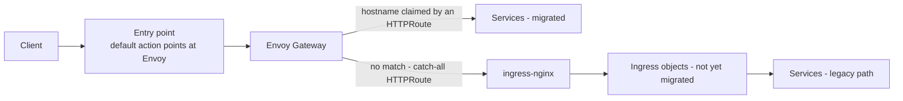
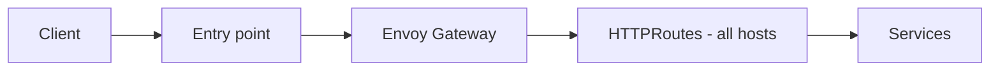

# Migrating from NGINX Ingress to Envoy Gateway, One Host at a Time

Ingress NGINX [was retired in March 2026](https://kubernetes.io/blog/2025/11/11/ingress-nginx-retirement/). The Kubernetes Steering and Security Response Committees were blunt about what that means: *"There will be no more releases for bug fixes, security patches, or any updates of any kind after the project is retired"*, and *"choosing to remain with Ingress NGINX after its retirement leaves you and your users vulnerable to attack"* ([statement, January 2026](https://kubernetes.io/blog/2026/01/29/ingress-nginx-statement/)). If your cluster still has `Ingress` objects, you have a migration you did not ask for.

The Gateway API is the destination, and converting a single workload to it is easy: its chart renders an `HTTPRoute` instead of an `Ingress`, and you are done. The migration is not the conversion. It is everything that happens between the first converted host and the last one - because the entry point in front of the cluster points at exactly one thing, and switching it happens for every host at the same moment.

This post compares the ways through that middle, then goes deep on the one that turned out to need no per-host infrastructure work at all: an `HTTPRoute` with **no hostnames**, which the Gateway API defines as the lowest-precedence match, handing everything unclaimed straight back to the ingress-nginx controller. On the cluster behind this post - roughly a hundred hosts across platform add-ons, developer environments, and teams the platform group does not own - it meant the switch was safe on day one and every remaining host migrated when its owner was ready. Every route table and log excerpt below is read from that cluster, with hostnames and namespaces replaced by generic ones.

<!--truncate-->

## Why This Migration Is Hard: One Edge, Many Hosts

Converting a workload to the Gateway API is a local change: its chart renders an `HTTPRoute` instead of an `Ingress`, and nothing outside that namespace has to know. The entry point in front of the cluster is the opposite. It is a single setting, shared by every host, and it points at one data plane at a time. That asymmetry is the whole problem, and it is easiest to see as three states.

**Today** - one controller, one path, every host on an `Ingress`:


**During the migration** - both data planes alive in one cluster, which is the state most people cannot picture and are right to be nervous about:



**When it is done** - the catch-all and the ingress-nginx controller are deleted together:



The middle state is worth naming precisely, because it is where the fear lives: **the two controllers are not competing. They are stacked.** Envoy Gateway is the edge, and ingress-nginx is one of its backends. Nothing arbitrates between them, nothing races, and nothing has to agree on who owns a hostname - Envoy answers every request, and hands over the ones it has no route for.

Without that middle state you are left choosing between converting every host before you may switch anything, or moving hosts at the edge one at a time. Both are worse, which is the next section.

## The Migration Options, Compared

| Approach | How it works | Cost |
|---|---|---|
| Big-bang cutover | Convert every `Ingress`, flip the edge once | Needs a complete host inventory; on a shared cluster that list never converges |
| `ingress2gateway` | Bulk-translate `Ingress` objects into Gateway API resources | Solves translation, not sequencing - you still need every host ready at once |
| DNS, per host | Point each hostname at the Gateway independently | TTL-bound, slow to roll back, and needs DNS access the platform team may not have |
| Edge rule per host | One entry-point rule per migrated host | Correct, but couples a chart value to an infrastructure change - what we tried first |
| Catch-all `HTTPRoute` | ingress-nginx becomes Envoy's fallback backend | One infrastructure change in total; hosts migrate voluntarily |

The second row deserves more than a table cell, because it is the tool the Kubernetes project itself points you at - and it is a complement to this pattern rather than an alternative to it. [Ingress2Gateway 1.0](https://kubernetes.io/blog/2026/03/20/ingress2gateway-1-0-release/) translates `Ingress` resources and 30+ ingress-nginx annotations into Gateway API equivalents, and warns you about the configuration it cannot translate. Its own announcement draws the boundary: *"Ingress2Gateway is a migration assistant, not a one-shot replacement"*, and *"migration is not a 'one-click' affair."* It answers **what** each route should look like. It does not answer **when** each one goes live, which is the part that blocks a shared cluster. Use `ingress2gateway` to generate the routes and the catch-all to control the order in which they take effect.

The fourth row is where we started. A host gets its `HTTPRoute`, then a second change - outside the cluster, in the infrastructure repository, reviewed and applied by whoever owns it - adds that hostname to the entry point. Correct and auditable, and the wrong unit of work: the change that matters is one line in a Helm values file, and it does nothing until an infrastructure pull request lands. On AWS that second change is a host-header rule on the load balancer listener:

```hcl title="routing hosts at the edge, one entry per migrated host (the approach we replaced)"
rules = var.envoy_gateway_route_enabled ? {
  envoy = {
    priority   = 10
    actions    = [{ type = "forward", target_group_key = "envoy-instance" }]
    conditions = [{ host_header = { values = var.envoy_gateway_route_hosts } }]
  }
} : {}
```

Hosts can be batched into a single rule, and the quota is [100 non-default rules per load balancer](https://docs.aws.amazon.com/elasticloadbalancing/latest/application/load-balancer-limits.html) (adjustable), so capacity is not the binding constraint. The process is.

## Making nginx the Fallback: One Hostname-less HTTPRoute

The Gateway API resolves a request by hostname first, and it is explicit about ranking: precedence goes to the route with more characters in a matching non-wildcard hostname. A route with no `hostnames` at all matches every host and has zero such characters, so it loses every contest - which is precisely the behavior a fallback needs. The fallback is therefore not a special mechanism. It is an ordinary `HTTPRoute` that declines to claim any host:

```yaml title="httproute-nginx-fallback.yaml (ingress-nginx add-on)"
apiVersion: gateway.networking.k8s.io/v1
kind: HTTPRoute
metadata:
  name: nginx-fallback
spec:
  parentRefs:
    - name: main-gateway
      namespace: envoy-gateway-system
  rules:
    - matches:
        - path:
            type: PathPrefix
            value: /
      backendRefs:
        - name: ingress-nginx-controller
          port: 80
```

Its backend is the ingress-nginx controller Service, so anything Envoy cannot match by hostname is handed to nginx, which then does what it has always done: look the host up in its `Ingress` objects and proxy it.

Two properties of the parent `Gateway` have to hold or the route never becomes useful. First, its listener must admit routes from other namespaces - `allowedRoutes.namespaces.from: All`, or a selector that covers the add-on. Second, it must not pin a `hostname` of its own: a listener hostname is intersected with the route's, so a hostname-less route inherits it and stops being a catch-all.

The design decisions that make this safe are all consequences of that one omitted field:

- **It cannot shadow anything.** Hostname-less is the weakest possible match. Adding this route to a Gateway that already serves fifty hostnames changes the outcome of exactly zero of those requests.
- **It carries no unmatched traffic before the flip.** Until the entry point's default action points at Envoy, nothing unmatched reaches the Gateway at all, so the route can ship weeks ahead and be verified `Accepted` in place.
- **Migration order stops mattering, per hostname.** A host with a route is served by Envoy, a host without one by nginx, a host with both by Envoy. But the catch-all is per-hostname, not per-path: a route that claims a hostname and matches only some of its paths strands the rest on Envoy's own 404 instead of falling through, so keep component routes on a `/` prefix unless you mean otherwise.
- **Rollback stays local.** Deleting a host's `HTTPRoute` drops it back to the fallback path automatically, because its `Ingress` was never removed. No infrastructure change, no coordination.

## Can a Catch-All Route Shadow an Existing Route?

This is the objection every experienced reader raises, and it is worth checking against the data plane rather than the spec. Envoy's admin interface dumps the route configuration the proxy is actually running:

```bash
# terminal 1
kubectl port-forward -n envoy-gateway-system \
  "$(kubectl get pod -n envoy-gateway-system \
      -l gateway.envoyproxy.io/owning-gateway-name=main-gateway -o name | head -1)" 19000:19000

# terminal 2
curl -s "http://127.0.0.1:19000/config_dump?resource=dynamic_route_configs"
```

That returns JSON. Summarized to one line per virtual host:

```text title="virtual hosts, summarized from the dump and anonymized"
route_config: <gateway-ns>/<gateway-name>/http
virtual_hosts: 49

  #  domains                    routes  cluster
  0  app-a.example.com               8  httproute/ns-a/app-a/rule/4
  1  app-b.example.com               5  httproute/ns-b/app-b/rule/0
  2  app-c.example.com               3  httproute/ns-c/app-c/rule/0
  3  *                               1  httproute/<ingress-nginx-ns>/nginx-fallback/rule/0
  4  app-d.example.com               1  httproute/ns-d/app-d/rule/0
  ...
 48  app-z.example.com               1  httproute/ns-z/app-z/rule/0
```

Look at index 3. The catch-all is not last in the list - it is fourth, in the middle of forty-eight real hostnames, and it still never intercepts any of them. **Envoy does not evaluate virtual hosts top to bottom.** It builds a lookup keyed by domain and resolves in a fixed order of specificity: exact match, then longest suffix wildcard, then prefix wildcard, then `*`. Envoy's own API reference is blunt about the last one: only a single virtual host in the entire route configuration can match on `*`. Its position in the array is meaningless. This is the part people expect to behave like an ordered rule list, and it does not.

The table is also assembled at runtime. Envoy Gateway watches `HTTPRoute` objects, translates them to xDS, and pushes the new configuration to the running proxy. During the check above, the data plane Pod reported `RESTARTS 0` at `AGE 2h24m` while five routes created eight to eleven minutes earlier - by an environment's own Helm release - were already virtual hosts in that dump.

Envoy's access log then names the route that served each request, so both paths are visible in one stream. A host with its own `HTTPRoute` goes straight to the workload; a host with only an `Ingress` matches nothing, lands on the `*` virtual host, and goes to the ingress-nginx controller Service:

```json title="sanitized access-log entries - native route, then fallback route"
{ ":authority": "app-a.example.com",
  "route_name": "httproute/ns-a/app-a/rule/0/match/0/app-a_example_com",
  "upstream_host": "<workload-pod>:<port>",
  "response_code": 200, "response_code_details": "via_upstream" }

{ ":authority": "legacy-app.example.com",
  "route_name": "httproute/<ingress-nginx-ns>/nginx-fallback/rule/0/match/0/*",
  "upstream_host": "<ingress-nginx-pod>:80",
  "response_code": 302, "response_code_details": "via_upstream" }
```

The same fallback request then appears in the nginx access log, where the `[namespace-service-port]` field records which `Ingress` upstream nginx picked:

```text
"GET / HTTP/1.1" 302 138 ... [<namespace>-legacy-app-8080] ...
```

Two proxies, two log lines, one request: `client → entry point → Envoy → nginx-fallback → ingress-nginx → Ingress → Service`. The user sees a normal `302` and nothing about the topology underneath.

## Moving the Edge: One Change, Once

The generic statement is short: **point whatever fronts your cluster at the Gateway's data plane instead of the ingress-nginx controller.** One change, once, for the whole cluster. What that means in practice depends on how traffic reaches you:

- **A `Service` of type `LoadBalancer`** - the Gateway's data plane gets one, and the cloud provider moves the address. Often the simplest path.
- **A cloud load balancer you manage yourself** - change the default action or backend to the Gateway's target group or NodePort.
- **MetalLB or a bare-metal front end** - reassign the address to the data plane Service.
- **DNS** - workable as a last resort, but TTL-bound and slow to roll back, so prefer any of the above.

One thing to check whatever the edge is: **health checks send a `Host` header that matches no route**, usually the target's own address, so they land on the catch-all and get whatever nginx's default backend returns - typically a `404`. Make sure the probe in front of your data plane tolerates that response, or the new backend never reports healthy and the switch fails on arrival.

Our edge happens to be an AWS load balancer managed in Terraform, where the behavior is two independent variables that keep provisioning separate from cutting over:

```hcl title="example.tfvars (terraform-aws-platform) - worked example"
# 1. Provision the Envoy data-plane target group and register the node Auto Scaling Groups.
#    Nothing forwards to it yet.
envoy_gateway_enabled = true

# 2. Flip the load balancer default :443 action onto that target group.
#    Only takes effect when envoy_gateway_enabled is true.
platform_default_gateway = "envoy"   # "nginx" is the default
```

The listener's default action resolves conditionally on both variables, so leaving the second at `nginx` keeps it byte-for-byte what it was, and enabling only the first creates the target group and its attachments without moving any traffic. That separation is the point: the data plane is provisioned and proven healthy before anything routes to it. Its health check matcher is set to `200,404`, for exactly the reason above.

One safe sequence:

1. Deploy Envoy Gateway and the parent `Gateway`.
2. Provision the data plane at the edge and wait for it to report healthy. Nothing forwards to it yet.
3. Deploy the `nginx-fallback` route and confirm `Accepted=True` / `ResolvedRefs=True`.
4. Move the edge's default to the Gateway. This is the step that changes the picture: every host with no route of its own starts arriving through Envoy and falling through to nginx.
5. Migrate hosts one at a time by enabling the component's own HTTPRoute setting in its chart values.

Rolling the whole edge back is step 4 in reverse. Because nginx was never removed and every `Ingress` was left in place, the cluster returns to its previous behavior with no in-cluster change at all.

Rolling *one host* back is the case that surprises people. Re-enabling its `Ingress` is not enough - its exact-hostname `HTTPRoute` still outranks the catch-all, so traffic never reaches nginx and the restored `Ingress` sits there doing nothing. A single host goes back to nginx only when its route is removed **and** its `Ingress` exists.

Because the change spans three upstream repositories with different commit conventions, the commits and the pre-pull-request reviews went through `/krci-general:commit` and `/krci-general:review` from the [KubeRocketCI Claude Code plugins](https://github.com/KubeRocketCI/claude-plugins), which kept the delivery loop short across all of them.

## What This Does Not Solve

The fallback path is a hop, and a hop has consequences that are easy to discover the hard way:

- **The client moves one hop further away from nginx.** After the switch, nginx peers with an Envoy Pod instead of the entry point, so `X-Forwarded-For` gains an entry and `X-Forwarded-Proto` describes the edge-to-Envoy leg rather than the client's TLS. Check `use-forwarded-headers`, any IP allow-lists, real-client-IP logging, and `ssl-redirect` behavior before step 4, not after. This changes for every fallback host at once.
- **TLS is assumed to terminate at the edge.** The Gateway in this design has a plain HTTP listener because the entry point holds the certificate. A setup that terminates TLS in the cluster needs the listener, the certificate reference, and the fallback's own scheme handling worked out separately.
- **Partial-path routes strand the rest of their host**, as above - the catch-all cannot rescue a path that a hostname-scoped route already claimed.
- **Ingress-derived metrics go quiet per migrated host**, which matters most if something scales on them.

None of these is a reason to keep the per-host model. They are the checks that belong in the plan before the edge moves.

## What It Saved

A snapshot of the cluster at the time of writing - the figures move as environments come and go:

| Hosts on the cluster | Count |
|---|---|
| Served natively by Envoy (own `HTTPRoute`) | 48 |
| Served through the catch-all to nginx (`Ingress` only) | 49 |
| Carrying both, mid-migration | 4 |
| Infrastructure changes required per migrated host | 0 |

Roughly half the hosts have not been touched and do not need to be. They belong to teams outside the platform group, and under the per-host model they would have had to be inventoried and coordinated before a single request could move. Instead they kept working through a route that never mentions them, while the other half migrated one Helm value at a time.

## Configuration Reference

| Setting | Where | Default | Effect |
|---|---|---|---|
| `nginxFallback.enabled` | `ingress-nginx` add-on values | `false` | Renders the hostname-less catch-all `HTTPRoute` |
| `nginxFallback.gateway.name` / `.namespace` | same | `main-gateway` / `envoy-gateway-system` | Parent `Gateway` the fallback attaches to |
| `nginxFallback.service.name` / `.port` | same | `ingress-nginx-controller` / `80` | Backend the unmatched traffic is handed to |
| `envoy_gateway_enabled` | `terraform-aws-platform` | `false` | Creates the Envoy data-plane target group and registers the node ASGs. Nothing routes to it yet |
| `platform_default_gateway` | `terraform-aws-platform` | `"nginx"` | `"envoy"` moves the load balancer default `:443` action to Envoy. Effective only when `envoy_gateway_enabled = true` |
| the component's HTTPRoute flag | component chart values | `false` | Gives that component its own hostname-scoped route. The key differs per chart - `httproute.enabled` in the krci-portal chart, a per-Git-server key in the Tekton chart |

Two checks worth running during a rollout - the first before the switch, the second after each host migrates:

```bash
# Is the fallback accepted AND resolved? Print the status, not just the condition names.
kubectl get httproute nginx-fallback -n <ingress-nginx-ns> \
  -o jsonpath='{range .status.parents[0].conditions[*]}{.type}={.status} {end}{"\n"}'

# Did this host stop touching nginx after migration? (expect no matches, across all replicas)
kubectl logs -n <ingress-nginx-ns> -l app.kubernetes.io/name=ingress-nginx \
  --since=10m | grep '<host>'
```

## Frequently Asked Questions

### Can I run ingress-nginx and Envoy Gateway in the same cluster?

Yes, and that is the point of this pattern. They are not two controllers competing for the same traffic - they are stacked. Envoy Gateway is the edge and answers every request; ingress-nginx becomes one of its backends, reached only for hostnames no `HTTPRoute` claims. Both keep their own configuration, and neither needs to know about the other.

### Do I have to migrate every Ingress at once?

No, and on a shared cluster you almost certainly cannot - that list never converges. With the catch-all in place, hosts that have not moved yet keep working unchanged, and migration becomes voluntary and per-host.

### How does this compare to ingress2gateway?

They solve different halves of the same problem and work well together. `ingress2gateway` produces the routes; it does not decide when each one goes live. Generate them with it, then use the catch-all to control the order in which they take effect.

### What happens to a host with no HTTPRoute and no Ingress?

It reaches the catch-all, gets handed to nginx, matches no `Ingress`, and receives nginx's default backend response - typically a `404`. That is the same answer such a host got before the migration, and it is why health checks, whose `Host` header matches nothing, behave predictably.

### Does the fallback path add latency?

It adds one in-cluster proxy hop: Envoy to the ingress-nginx controller Service, then nginx to the workload. The difference was not measured for this post, so do not take a number on faith here - but the hop is inside the cluster network and it is meant to be temporary. Once a host gets its own `HTTPRoute` it is routed directly by Envoy and the hop disappears, so hosts where latency matters are the ones to migrate first.

### How is a single host moved back to nginx after migrating it?

Remove its `HTTPRoute` and make sure its `Ingress` still exists. Re-enabling the `Ingress` on its own does nothing: the exact-hostname route still outranks the catch-all, so traffic never reaches nginx and the restored `Ingress` is dead weight. Keeping the `Ingress` in place during migration is what makes this a values change rather than an incident.

### Is this needed on a brand-new cluster?

No. If every workload ships an `HTTPRoute` from day one there is nothing to fall back to, and the catch-all is off by default for that reason. It is a migration tool for clusters that already carry `Ingress` objects.

## Summary

Ingress NGINX is retired, so the migration is not optional any more - only its pace is. The hard part is not the target state but the long middle, where two data planes serve one cluster and no team can be blocked on another. Solving that host by host at the edge puts every migration outside the cluster: an infrastructure pull request, a plan review, an apply, for a change whose real content is one line in a Helm values file.

One `HTTPRoute` with the `hostnames` field left out replaces all of it. It cannot shadow anything, because it is the lowest-precedence route on the Gateway; anything unclaimed still reaches the same `Ingress` and the same Service, because its backend is the ingress-nginx controller. Roughly half the hosts on the cluster now ride that route without anyone having enumerated them, while the other half migrated one values file at a time - each new route reaching the running proxy over xDS, with no restart and no per-host infrastructure change anywhere in the path.

Next steps from here:

- Read [Ingress NGINX Retirement: What You Need to Know](https://kubernetes.io/blog/2025/11/11/ingress-nginx-retirement/) and [Before You Migrate: Five Surprising Ingress-NGINX Behaviors](https://kubernetes.io/blog/2026/02/27/ingress-nginx-before-you-migrate/) before planning your own cutover.
- Generate your routes with [Ingress2Gateway](https://kubernetes.io/blog/2026/03/20/ingress2gateway-1-0-release/), then use the catch-all to sequence them.
- The fallback route lives in the `ingress-nginx` add-on in [edp-cluster-add-ons](https://github.com/epam/edp-cluster-add-ons); the edge toggles are in [terraform-aws-platform](https://github.com/KubeRocketCI/terraform-aws-platform). The [Envoy Gateway section of the 3.14 upgrade guide](/docs/operator-guide/upgrade/upgrade-krci-3.14) covers the per-component opt-in values.
- New to the platform? Start with [What is KubeRocketCI](/docs/about-platform) or [try it locally](/blog/try-kuberocketci-locally).

KubeRocketCI is open source under Apache License 2.0. The platform, Helm charts, and add-ons are all on [GitHub](https://github.com/KubeRocketCI).

{/* cspell:ignore httproutes tfvars */}
