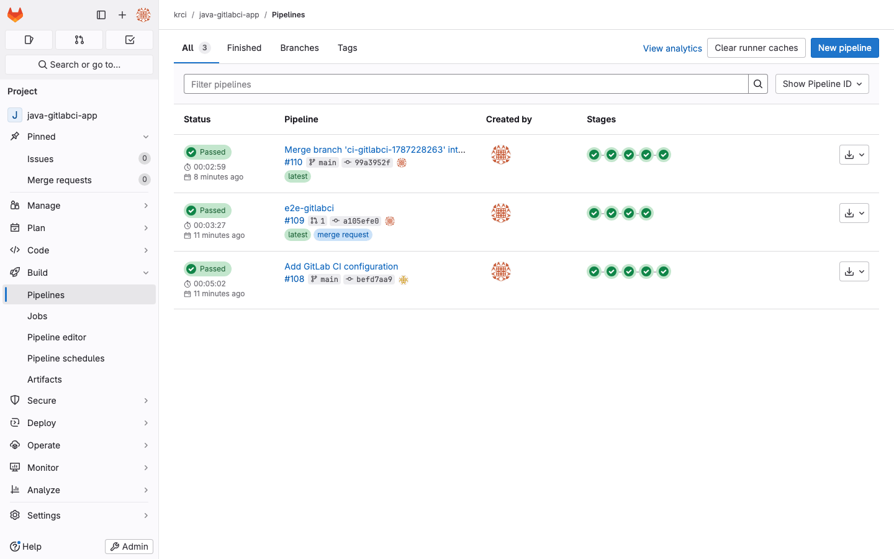

# KubeRocketCI vs GitLab CI: Kubernetes-Native CI/CD Compared

KubeRocketCI is an open-source, Kubernetes-native CI/CD platform built on Tekton and Argo CD. It runs entirely on your own cluster and works with GitHub, GitLab, Bitbucket, or Gerrit as the code host. GitLab CI is the CI/CD service inside the GitLab DevSecOps platform. The core difference: Tekton-based CI you own and can isolate, versus CI bound to the GitLab application.

<!--truncate-->

*Disclosure: we build KubeRocketCI. Every GitLab claim below links to GitLab's own documentation, GitLab's strengths are stated plainly, and all facts are current as of August 2026.*

## TL;DR: When to Choose Which

- **Choose KubeRocketCI** if your delivery target is Kubernetes and you want Tekton-based CI, GitOps CD, and quality gates pre-integrated on infrastructure you control — including fully isolated, air-gapped setups — with no per-user licensing.
- **Choose GitLab CI** if you want one SaaS application for repos, issues, CI, and (on higher tiers) security scanning — and Kubernetes is one of several deployment targets.
- **Already on GitLab?** You do not have to move your repositories. KubeRocketCI connects GitLab as a code host and runs CI on Tekton in your cluster — GitLab keeps the merge requests, Tekton runs the pipelines.
- **Already on GitLab CI?** You do not have to abandon your pipelines either. KubeRocketCI supports GitLab CI natively as a codebase's CI engine (`ciTool: gitlab`), so existing pipelines keep running while you adopt the platform — [details below](#bonus-you-do-not-have-to-pick-on-day-one).

## What Each One Is

**KubeRocketCI** is an open-source (Apache 2.0) CI/CD platform that runs on any Kubernetes cluster. It assembles Tekton for CI, Argo CD for GitOps delivery, and Kubernetes operators that manage codebases, branches, environments, and integrations (SonarQube, Nexus, DefectDojo, and more) as custom resources. It works with GitHub, GitLab, Bitbucket, and Gerrit as the code host. See [How KubeRocketCI builds Kubernetes-native CI/CD on Tekton](/blog/kubernetes-native-cicd-tekton-kuberocketci) for the architecture.

**GitLab CI** is the pipeline service built into GitLab, available as SaaS (gitlab.com) or self-managed. Pipelines are defined in `.gitlab-ci.yml` and run on GitLab Runners; the [Kubernetes executor](https://docs.gitlab.com/runner/executors/kubernetes/) creates a pod per job. Deployment to Kubernetes goes through the [GitLab agent for Kubernetes with Flux](https://docs.gitlab.com/user/clusters/agent/gitops/) for pull-based GitOps.

## Feature Comparison

| Aspect             | KubeRocketCI                                           | GitLab CI                                                   |
|--------------------|--------------------------------------------------------|-------------------------------------------------------------|
| CI engine          | Tekton pipelines (or GitLab CI — see below)            | GitLab Runners, pod-per-job on Kubernetes                   |
| CD / GitOps        | Argo CD, pull-based, bundled                           | GitLab agent + Flux, pull-based                             |
| Code host          | GitHub, GitLab, Bitbucket, Gerrit                      | GitLab only                                                 |
| Quality gates      | SonarQube gate in every pipeline, all free             | SAST on all tiers; dependency scanning and DAST on Ultimate |
| Hosting            | Self-hosted on your cluster                            | SaaS or self-managed                                        |
| Pricing model      | Open source; you pay for your infrastructure           | Per-user tiers; SaaS runners metered in compute minutes     |
| Pipeline authoring | Tekton CRDs, library included, custom pipelines in git | `.gitlab-ci.yml`, includes, CI/CD Components catalog        |

## Pipeline Architecture: Tekton CRDs vs .gitlab-ci.yml

GitLab CI defines pipelines in `.gitlab-ci.yml` inside each repository. Sharing logic across projects uses includes and, since GitLab 17.0, the versioned [CI/CD Components catalog](https://docs.gitlab.com/ci/components/). Runners execute jobs; on Kubernetes, each job becomes a pod.

KubeRocketCI defines pipelines as Tekton resources that live in the cluster, not in each repository. The platform ships a pipeline library covering 10+ languages across four code hosts, so a new codebase gets working review and build pipelines without writing YAML. When you outgrow the defaults, you [bring custom Tekton pipelines from your own git repository](/docs/use-cases/custom-pipelines-flow).

Both can centralize shared logic — GitLab through the Components catalog, KubeRocketCI through the cluster-resident library. The practical difference is the default: in GitLab CI every repository still owns a `.gitlab-ci.yml` and opts into shared components at a version it chooses, while in KubeRocketCI a codebase carries no pipeline file at all and receives the platform's pipelines — and their upgrades — automatically, with per-repo customization as the exception rather than the norm. The two models are converging: KubeRocketCI plans to also support storing pipeline definitions inside the code repository, giving teams that prefer repo-local pipelines the same choice GitLab users have today.

## Bring Your Own Git Host: GitHub, GitLab, Bitbucket, Gerrit

GitLab CI runs only against GitLab repositories — adopting it means adopting GitLab as the code host. KubeRocketCI decouples the two: a webhook from GitHub, GitLab, Bitbucket, or Gerrit hits a Tekton interceptor that enriches the payload with codebase metadata and triggers the right pipeline. Review pipelines report back to the pull or merge request on whichever host you use.

This matters most for teams already on GitLab who want cluster-owned CI: repositories, merge requests, and permissions stay in GitLab, while pipelines run on Tekton next to the workloads they build. It also matters for organizations with mixed hosting — one platform serves GitHub and GitLab teams with the same pipeline library and the same quality gates.

## Self-Hosted and Isolated: CI That Never Leaves Your Cluster

Tekton pipelines are Kubernetes resources executed as pods on your cluster. With KubeRocketCI, the whole CI/CD loop — trigger, pipeline, build, scan, image push, GitOps sync — can run inside your network boundary, including air-gapped environments with an internal git server (Gerrit or self-managed GitLab) and an internal registry. There is no SaaS control plane, no metered compute minutes, and no outbound dependency that a regulated environment has to whitelist.

GitLab covers part of this with self-managed GitLab, which is a mature option — but the CI engine still lives inside the GitLab application, and features unlock by [subscription tier](https://about.gitlab.com/pricing/) even when self-hosted. With KubeRocketCI, the full platform is Apache-2.0 open source wherever it runs.

## Kubernetes Deployment and GitOps

Both products landed on the same conclusion — pull-based GitOps — with different engines. GitLab pairs its agent for Kubernetes with Flux and is sunsetting the older certificate-based cluster integration ([migration required by May 2026](https://docs.gitlab.com/user/clusters/agent/enterprise_considerations/)). KubeRocketCI bundles Argo CD, and its environments are platform objects: promotion between stages, [preview environments per feature branch](/blog/ephemeral-preview-environments-kubernetes-feature-branch), and manual approval gates come out of the box.

GitLab's review apps cover the preview-environment use case on all tiers. The difference is assembly: with GitLab you compose agent, Flux, and environment configuration yourself; with KubeRocketCI the pieces arrive wired together.

## Cost and Ownership

GitLab prices per user across Free, Premium, and Ultimate tiers, and meters SaaS shared runners in compute minutes; self-managed runners consume no minutes but you operate them. The security features most relevant to a hardened pipeline — dependency scanning and DAST — sit in the [Ultimate tier](https://docs.gitlab.com/user/application_security/dependency_scanning/). Check [current pricing](https://about.gitlab.com/pricing/) for exact numbers.

KubeRocketCI is Apache-2.0 open source with no license fee and no per-user or per-minute metering. Your cost is the Kubernetes infrastructure it runs on and the team that operates it. That trade is the honest one to evaluate: GitLab sells you operations; KubeRocketCI assumes you want to own them — typically because the cluster and the platform team already exist.

## Bonus: You Do Not Have to Pick on Day One

One caveat worth knowing, without overselling it: KubeRocketCI also supports GitLab CI itself as a codebase's CI engine (`ciTool: gitlab`) — the operator even injects the `.gitlab-ci.yml` for you. That mode *is* GitLab CI, not an alternative to it; its value is migration freedom. Teams can onboard onto the platform, keep exceptional repositories on their existing GitLab CI pipelines, and move to Tekton codebase by codebase. We verified the mode end-to-end while writing this post — review and build pipelines fully green on a GitLab Runner:

The hands-on walkthrough is in [GitLab CI integration in KubeRocketCI](/blog/gitlab-ci-integration-kuberocketci).

## Migrating from .gitlab-ci.yml

If you do move CI to Tekton, the path is incremental:

1. Connect your GitLab instance as a [Git server](/docs/user-guide/add-git-server) — repositories stay in GitLab.
2. Onboard codebases; the default pipeline library replaces the common 80% of `.gitlab-ci.yml` (build, test, lint, scan, image push) without authoring.
3. Port genuinely custom jobs as [custom Tekton pipelines](/docs/use-cases/custom-pipelines-flow).
4. Keep exceptional repos on `ciTool: gitlab` for as long as needed — migration per codebase, not big-bang.

Start with the [quick start](/docs/quick-start/quick-start-overview) to evaluate on a test cluster.

## Where GitLab CI Is Simply Better

Fairness requires saying it directly. If you want zero infrastructure to operate, GitLab SaaS wins — there is no cluster to run. GitLab is one application for issues, merge requests, registry, and CI with one permission model; KubeRocketCI integrates best-of-breed tools instead, which is more moving parts. And GitLab's [CI/CD Components catalog](https://docs.gitlab.com/ci/components/) is a mature, versioned sharing mechanism with a public ecosystem. Teams not deploying to Kubernetes have little reason to run a Kubernetes-native platform at all.

## Methodology

GitLab facts come from GitLab's documentation, linked inline, as of August 2026. KubeRocketCI behavior was verified hands-on for this post on KubeRocketCI 3.15 with GitLab CE, a GitLab Runner, and the `ciTool: gitlab` end-to-end flow described above. Pricing changes frequently — always confirm against the vendor's live pricing page.

## Related Reading

- [GitLab CI integration in KubeRocketCI: hands-on walkthrough](/blog/gitlab-ci-integration-kuberocketci)
- [Kubernetes-native CI/CD with Tekton: how KubeRocketCI works](/blog/kubernetes-native-cicd-tekton-kuberocketci)
- [Ephemeral preview environments on Kubernetes](/blog/ephemeral-preview-environments-kubernetes-feature-branch)
