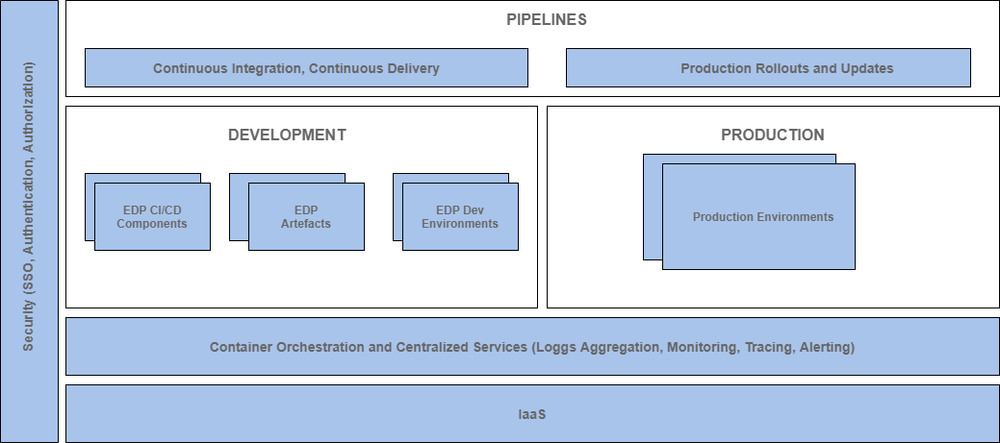
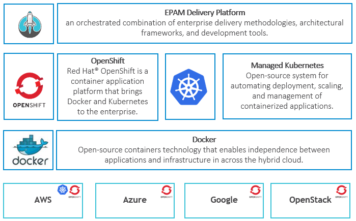

# About Platform

**KubeRocketCI (previously known as EPAM Delivery Platform)** is an **open-source** cloud-agnostic SaaS/PaaS solution for software development, licensed under **Apache License 2.0**. It provides a pre-defined set of CI/CD patterns and tools, which allow a user to start product development quickly with established **code review**, **release**, **versioning**, **branching**, **build** processes. These processes include static code analysis, security checks, linters, validators, dynamic feature environments provisioning. Platform consolidates the top Open-Source CI/CD tools by running them on Kubernetes/OpenShift, which enables web/app development either in isolated (on-prem) or cloud environments.

KubeRocketCI, which is also called **"The Rocket"**, is a platform that allows shortening the time that is passed before an active development can be started from several months to several hours.

Platform consists of the following:

- The platform based on managed infrastructure and container orchestration
- Security covering authentication, authorization, and SSO for platform services
- Development and testing toolset
- Well-established engineering process and EPAM practices (EngX) reflected in CI/CD pipelines, and delivery analytics
- A set of pre-configured pipelines for different types of applications
- Observability stack

## Features

- Deployed and configured CI/CD toolset ([Tekton](https://tekton.dev/), [ArgoCD](https://argoproj.github.io/cd/), [Nexus](https://help.sonatype.com/repomanager3), [SonarQube](https://www.sonarqube.org/), [DefectDojo](https://www.defectdojo.org/))
- [GitHub](https://about.gitlab.com/features/)(by default) or [GitLab](https://about.gitlab.com/features/)
- [Tekton](./operator-guide/install-tekton.md) is a pipeline orchestrator
- [CI pipelines](./user-guide/index.md)

  |Language|Framework|Build Tool|Application|Library|Autotest|
  |:-|:-:|:-:|:-:|:-:|:-:|
  |Java|Java 8, Java 11, Java 17|Gradle, Maven|:white_check_mark:|:white_check_mark:|:white_check_mark:|
  |Python|Python 3.8, FastAPI, Flask|Python|:white_check_mark:|:white_check_mark:||
  |C#|.Net 3.1, .Net 6.0|.Net|:white_check_mark:|:white_check_mark:||
  |Go|Beego, Gin, Operator SDK|Go|:white_check_mark:|||
  |JavaScript|React, Vue, Angular, Express, Next.js, Antora|NPM|:white_check_mark:|:white_check_mark:||
  |HCL|Terraform|Terraform||:white_check_mark:||
  |Helm|Helm, Pipeline|Helm||:white_check_mark:||
  |Groovy|Codenarc|Codenarc||:white_check_mark:||
  |Rego|OPA|OPA||:white_check_mark:||
  |Container|Docker|Kaniko||:white_check_mark:||

- [Portal UI](./user-guide/index.md) as a single entry point
- [Environments](./user-guide/add-cd-pipeline.md) for Microservice Deployment
- Kubernetes native approach ([CRD, CR](https://kubernetes.io/docs/concepts/extend-kubernetes/api-extension/custom-resources/)) to declare CI/CD pipelines

## What's Inside

KubeRocketCI is suitable for all aspects of delivery starting from development including the capability to deploy production environment.
Platform architecture is represented on a diagram below (see more [on the Reference Architecture](./developer-guide/reference-architecture.md) page)

KubeRocketCI consists of four cross-cutting concerns:

1. Infrastructure as a Service;
2. GitOps approach;
3. Container orchestration and centralized services;
4. Security.

On top of these indicated concerns, the platform incorporates several additional blocks, including:

- **CI/CD Components**: These components facilitate various features in the CI/CD process, such as artifacts storage and distribution (Nexus or Artifactory), static code analysis (Sonar), and more.
- **Artifacts**. This element represents an artifact that is being delivered through the pipelines and presented as a code.

    >_Artifact samples: frontend, backend, applications, functional and non-functional autotests, workloads for 3rd party components that can be deployed together with applications._

- **Development and Production Environments** that share the same logic. Environments wrap a set of artifacts with a specific version, and allow performing SDLC routines in order to be sure of the artifacts quality;
- **Pipelines**. Pipelines cover CI/CD process, production rollout and updates. They also connect three elements indicated above via automation allowing SDLC routines to be non-human;

### Technology Stack

Explore the KubeRocket technology stack diagram

The IaaS layer supports most popular public clouds AWS, Azure and GCP keeping the capability to be deployed on private/hybrid clouds based on OpenStack.
Containers are based on [Docker technology](https://www.docker.com/), orchestrated by Kubernetes compatible solutions.

There are two main options for Kubernetes provided by the platform:

- Managed Kubernetes in Public Clouds to avoid installation and management of Kubernetes cluster, and get all benefits of scaling, reliability of this solution;
- OpenShift that is a Platform as a Service on the top of Kubernetes from Red Hat. OpenShift is the default option for on-premise installation and it can be considered whether the _solution built on the top of KubeRocketCI_ should be **cloud-agnostic** or require **enterprise support**;

There is **no limitation** to run KubeRocketCI on vanilla Kubernetes.

## Related Articles

- [Quick Start](./quick-start/platform-installation.md)
- [Basic Concepts](basic-concepts.md)
- [Glossary](glossary.md)
- [Supported Versions and Compatibility](supported-versions.md)
