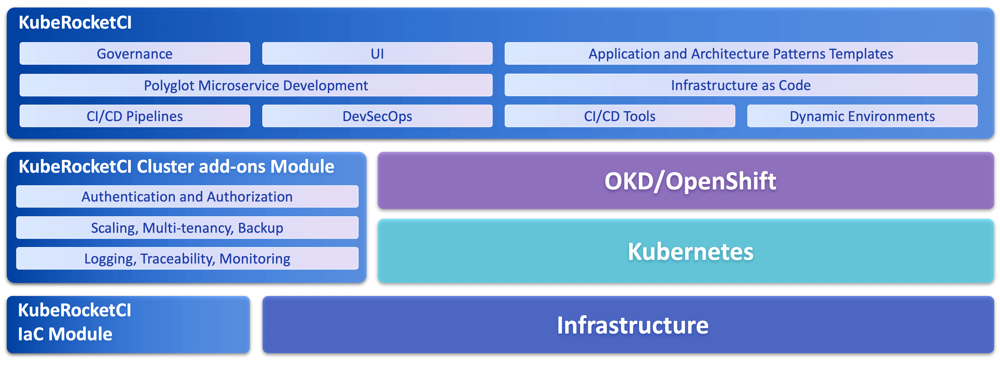

# About the KubeRocketCI Platform

<head>
  <link rel="canonical" href="https://docs.kuberocketci.io/docs/about-platform/" />
</head>

**KubeRocketCI (previously known as EPAM Delivery Platform)** is an **open-source** cloud-agnostic SaaS/PaaS solution for software development, licensed under **Apache License 2.0**. It provides a pre-defined set of CI/CD patterns and tools, which allow a user to start product development quickly with established **code review**, **release**, **versioning**, **branching**, **build** processes. These processes include static code analysis, security checks, linters, validators, dynamic feature environments provisioning. Platform consolidates the top Open-Source CI/CD tools by running them on Kubernetes/OpenShift, enabling web/app development in isolated (on-prem) or cloud environments.

KubeRocketCI, which is also called **"The Rocket"**, is a platform that allows shortening the time that is passed before an active development can start from several months to several hours.

The platform consists of the following blocks:

- The platform is based on managed infrastructure and container orchestration
- Security covering authentication, authorization, and SSO for platform services
- Development and testing toolset
- Well-established engineering process and EPAM practices (EngX) reflected in CI/CD pipelines and delivery analytics
- A set of pre-configured pipelines for different types of applications (polyglot microservices)
- Observability stack

## Features

- Deployed and configured CI/CD toolset ([Tekton](https://tekton.dev/), [ArgoCD](https://argoproj.github.io/cd/), [Nexus Repository Manager](https://help.sonatype.com/repomanager3), [SonarQube](https://www.sonarqube.org/), [DefectDojo](https://www.defectdojo.org/), [Dependency-Track](https://dependencytrack.org/).
- [GitHub](https://about.gitlab.com/features/)(by default) or [GitLab](https://about.gitlab.com/features/).
- [Tekton](./operator-guide/install-tekton.md) is a pipeline orchestrator.
- [CI pipelines](./user-guide/index.md) for polyglot applications:

  |Language|Framework|Build Tool|Application|Library|Autotest|
  |:-|:-:|:-:|:-:|:-:|:-:|
  |Java|Java 8, Java 11, Java 17, Java 21|Gradle, Maven|:white_check_mark:|:white_check_mark:|:white_check_mark:|
  |Python|Python 3.8, FastAPI, Flask|Python|:white_check_mark:|:white_check_mark:||
  |C#|.Net 3.1, .Net 6.0|.Net|:white_check_mark:|:white_check_mark:||
  |C|None|Make,CMake|:white_check_mark:|||
  |C++|None|Make,CMake|:white_check_mark:|||
  |Go|Beego, Gin, Operator SDK|Go|:white_check_mark:|||
  |JavaScript|React, Vue, Angular, Express, Next.js, Antora|NPM|:white_check_mark:|:white_check_mark:||
  |HCL|Terraform|Terraform||:white_check_mark:||
  |Helm|Helm, Pipeline|Helm||:white_check_mark:||
  |Groovy|Codenarc|Codenarc||:white_check_mark:||
  |Rego|OPA|OPA||:white_check_mark:||
  |Container|Docker|Kaniko||:white_check_mark:||

- [Portal UI](./user-guide/index.md) as a single entry point
- [Deployment Flows](./user-guide/add-cd-pipeline.md) for Microservice Deployment
- Kubernetes native approach ([CRD, CR](https://kubernetes.io/docs/concepts/extend-kubernetes/api-extension/custom-resources/)) to declare CI/CD pipelines

## What's Inside KubeRocketCI

KubeRocketCI offers a comprehensive solution for the entire software delivery lifecycle, from development to deploying production environments. It's designed to be suitable for all aspects of delivery, ensuring a seamless and efficient process.

Platform modules are represented on a diagram below (more [on the Reference Architecture](./developer-guide/reference-architecture.md) page)

The architecture of KubeRocketCI is designed to support a broad range of delivery aspects effectively:

1. **Infrastructure as a Service (IaaS)**: The platform leverages managed infrastructure services, providing a robust foundation for container orchestration and other platform services. Central to our approach to IaaS is the adoption of the **Infrastructure as Code (IaC)** methodology. This methodology ensures that infrastructure is defined and managed through code, enabling the automation of infrastructure provisioning and management.

2. **GitOps Approach**: Embracing GitOps principles, KubeRocketCI ensures an efficient and reliable way to manage deployments and configurations using Git as the single source of truth. This approach is applied not only for deploying **business applications** but also for the robust **management of the platform itself**, utilizing an [add-ons methodology](https://github.com/epam/edp-cluster-add-ons). By treating both platform components and business applications as code, KubeRocketCI facilitates automated, transparent, and collaborative processes, significantly enhancing deployment velocity and platform governance.

3. **Container Orchestration and Centralized Services**: At its core, the platform utilizes Kubernetes/OpenShift for orchestrating containerized applications, coupled with centralized services to manage the lifecycle of these applications.

4. **Security**: Comprehensive security measures are in place, covering authentication, authorization, and Single Sign-On (SSO) for platform services, ensuring the safeguarding of your applications and data.

On top of the primary architectural pillars, KubeRocketCI integrates several key components to enhance the CI/CD process:

**CI/CD Components**: These components support various CI/CD functionalities, like artifacts storage and distribution (via Nexus or Artifactory), static code analysis (Sonar), and more.

**Artifacts Management**: Representing the deliverables within the pipelines, artifacts can range from frontend and backend applications to functional and non-functional autotests, and workloads for 3rd party components.

**Development and Production Deployment Flows**: Deployment Flows in KubeRocketCI maintain consistency across development and production, encapsulating artifacts with specific versions to ensure quality through the Software Development Life Cycle (SDLC).

**Pipelines**: Covering the end-to-end CI/CD process, pipelines in KubeRocketCI automate the integration and delivery workflows, connecting the above components seamlessly.

### Technology Stack

KubeRocketCI's technology stack is adaptable to most popular public clouds such as AWS, Azure, and GCP, with support for private/hybrid clouds based on OpenStack. The containerization layer is powered by Kubernetes or OpenShift, offering flexibility and choice in deployment options.

Explore the KubeRocketCI technology stack diagram

The platform provides two main options for Kubernetes:

- Managed Kubernetes in Public Clouds to avoid installation and management of Kubernetes cluster, and get all benefits of scaling, reliability of this solution;
- OpenShift is a Platform as a Service on the top of Kubernetes from Red Hat. OpenShift is the default option for on-premise installation and it can be considered whether the _solution built on the top of KubeRocketCI_ should be **cloud-agnostic** or require **enterprise support**;

There is **no limitation** to run KubeRocketCI on vanilla Kubernetes.

## Related Articles

- [Quick Start](./quick-start/platform-installation.md)
- [Basic Concepts](basic-concepts.md)
- [Glossary](glossary.md)
- [Supported Versions and Compatibility](supported-versions.md)
