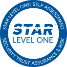

---

title: "Compliance"
description: "An overview of KubeRocketCI's commitment to compliance with security standards, demonstrating the platform's adherence to rigorous third-party audits and trustworthiness in deployments."
sidebar_label: "Compliance"

---
<!-- markdownlint-disable MD025 -->

# Compliance

<head>
  <link rel="canonical" href="https://docs.kuberocketci.io/docs/compliance/" />
</head>

The integrity of your deployments is our paramount commitment. We are devoted to strengthening our Kubernetes platform to comply with the most stringent security standards. Trust is the bedrock of our relationships, and we manifest this commitment by undergoing rigorous third-party audits to ensure compliance. We pledge unwavering support as you manage and deploy solutions within your environment, emphasizing security and reliability. Examine our compliance with various frameworks, laws, and regulations to understand our dedication to upholding robust security standards for the solutions you manage and deploy.

