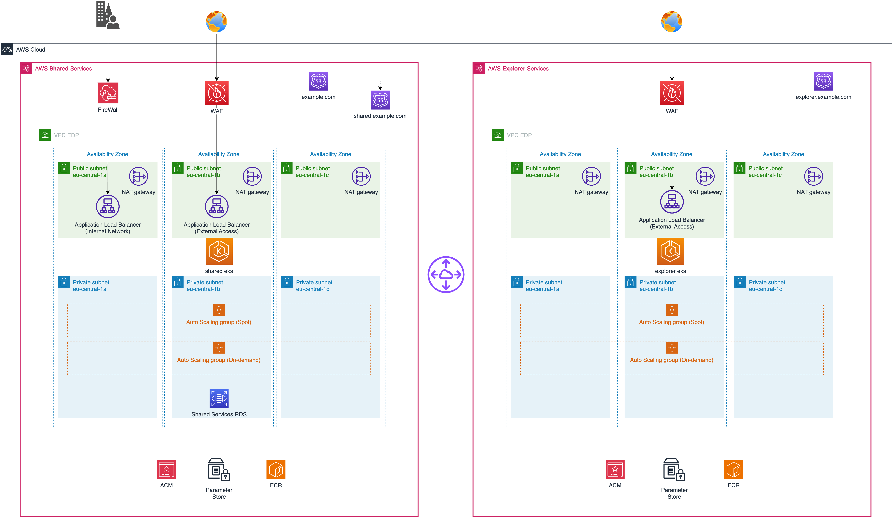

# EDP Deployment on AWS

This document describes the EPAM Delivery Platform (EDP) deployment architecture on AWS. It utilizes various AWS services such as Amazon Elastic Kubernetes Service (EKS), Amazon EC2, Amazon Route 53, and others to build and deploy software in a repeatable, automated way.

## Overview

The EDP deployment architecture consists of two AWS accounts: Shared and Explorer. The *Shared* account hosts shared services, while the *Explorer* account runs the development team workload and EDP services. Both accounts have an AWS EKS cluster deployed in multiple Availability Zones (AZs). The EKS cluster runs the EDP Services, development team workload, and shared services in the case of the Shared account.

## Key Components

1. **AWS Elastic Kubernetes Service (EKS)**: A managed Kubernetes service used to run the EDP Services, development team workload, and shared services. EKS provides easy deployment and management of Kubernetes clusters.
2. **Amazon EC2**: Instances running within private subnets that serve as nodes for the EKS cluster. Autoscaling Groups are used to deploy these instances, allowing for scalability based on demand.
3. **Amazon Route 53**: A DNS web service manages external and internal DNS records for the EDP deployment. It enables easy access to resources using user-friendly domain names.
4. **AWS Application Load Balancer (ALB)**: Used for managing ingress traffic into the EDP deployment. Depending on requirements, ALBs can be configured as internal or external load balancers.
5. **AWS WAF**: Web Application Firewall service used to protect external ALBs from common web exploits by filtering malicious requests.
6. **AWS Certificate Manager (ACM)**: A service that provisions manages, and deploys SSL/TLS certificates for use with AWS services. ACM is used to manage SSL certificates for secure communication within the EDP deployment.
7. **AWS Elastic Container Registry (ECR)**: A fully-managed Docker container registry that stores and manages Docker images. ECR provides a secure and scalable solution for storing container images used in the EDP deployment.
8. **AWS Systems Manager Parameter Store**: Used to securely store and manage secrets required by various components of the EDP deployment. Parameter Store protects sensitive information such as API keys, database credentials, and other secrets.

## High Availability and Fault Tolerance

The EKS cluster is deployed across multiple AZs to ensure high availability and fault tolerance. This allows for automatic failover in case of an AZ outage or instance failure. Autoscaling Groups automatically adjust the number of EC2 instances based on demand, ensuring scalability while maintaining availability.

## Design Considerations

### Reliability

- Using multiple AZs ensures high availability and fault tolerance for the EKS cluster.
- Autoscaling Groups enable automatic scaling of EC2 instances based on demand, providing reliability during peak loads.
- Multiple NAT gateways are deployed in each AZ to ensure reliable outbound internet connectivity.

### Performance Efficiency

- Utilizing AWS EKS allows for efficient management of Kubernetes clusters without the need for manual configuration or maintenance.
- Spot instances can be utilized alongside on-demand instances within the EKS cluster to optimize costs while maintaining performance requirements.
- Amazon Route 53 enables efficient DNS resolution by managing external and internal DNS records.

### Security

- External ALBs are protected using AWS WAF, which filters out malicious traffic and protects against common web exploits.
- ACM is used to provision SSL/TLS certificates, ensuring secure communication within the EDP deployment.
- Secrets required by various components are securely stored and managed using the AWS Systems Manager Parameter Store.

### Cost Optimization

- Utilizing spot and on-demand instances within the EKS cluster can significantly reduce costs while maintaining performance requirements.
- Autoscaling Groups allow for automatic scaling of EC2 instances based on demand, ensuring optimal resource utilization and cost efficiency.

## Conclusion

The EPAM Delivery Platform (EDP) deployment architecture on AWS follows best practices and patterns from the Well-Architected Framework. By leveraging AWS services such as EKS, EC2, Route 53, ALB, WAF, ACM, and Parameter Store, the EDP provides a robust and scalable CI/CD system that enables developers to deploy and manage infrastructure and applications quickly. The architecture ensures high availability, fault tolerance, reliability, performance efficiency, security, and cost optimization for the EDP deployment.
