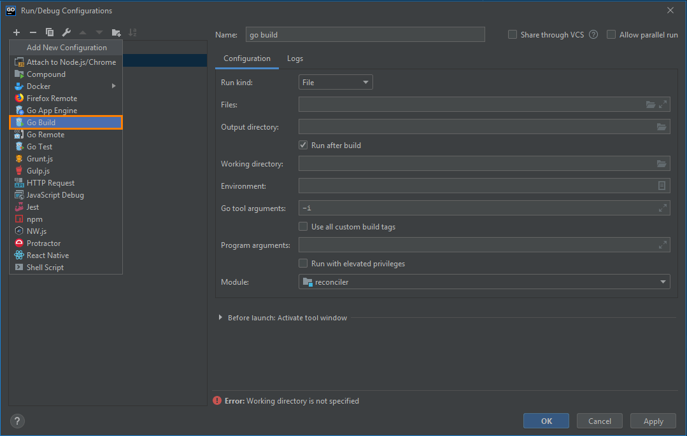
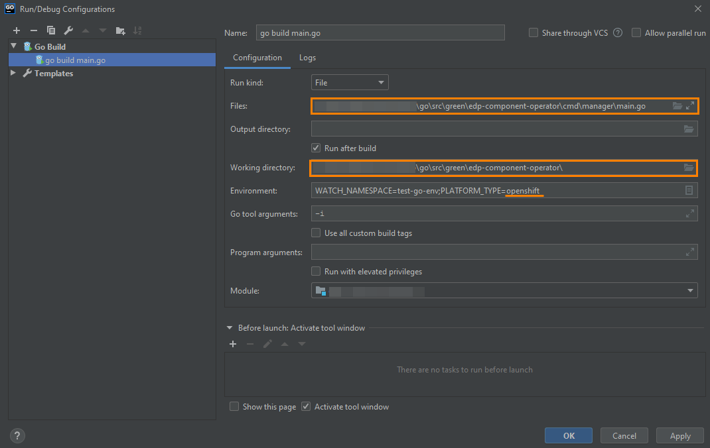
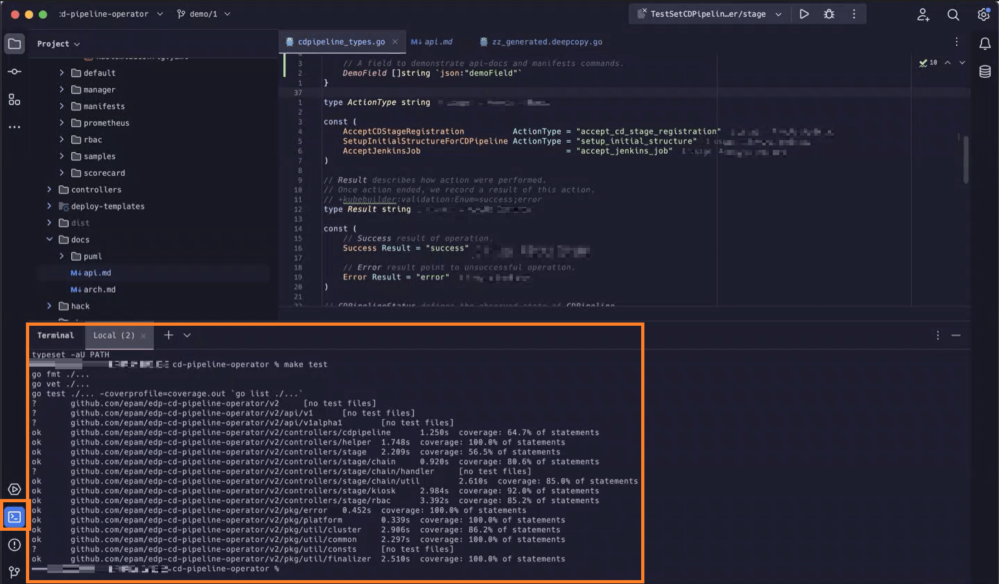
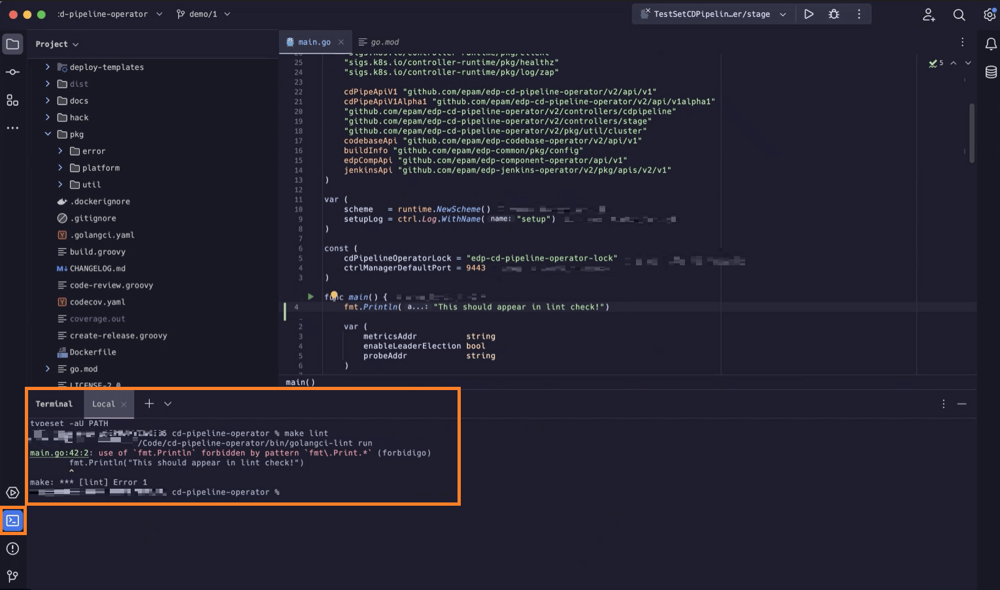
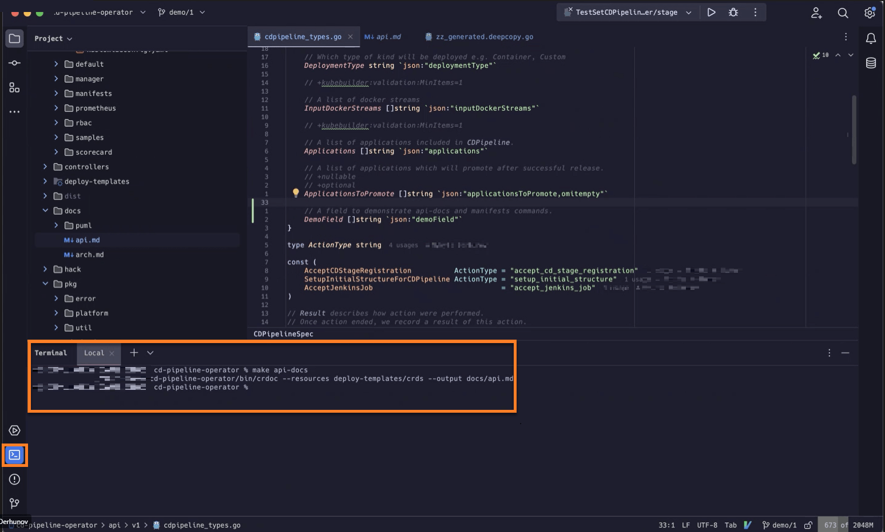
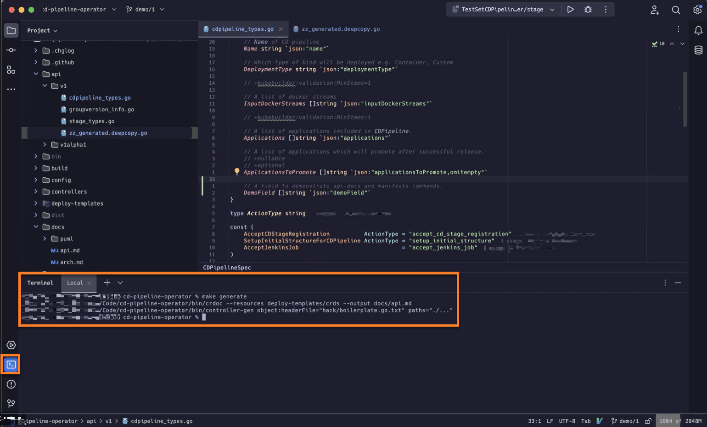
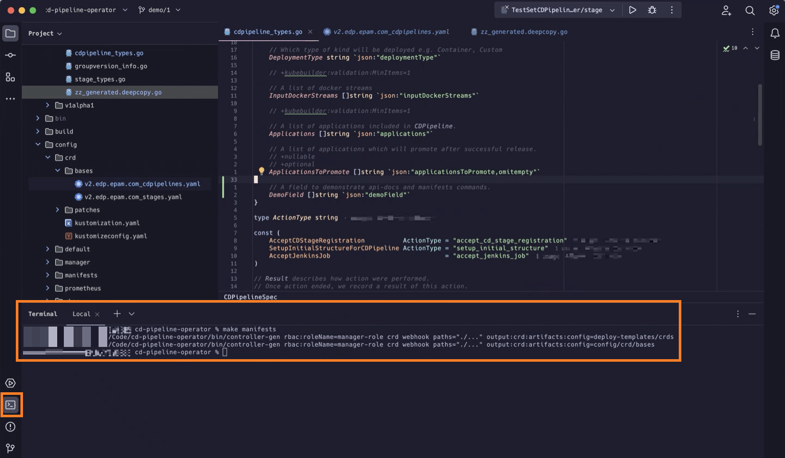

# Operator Development

This page is intended for developers with the aim to share details on how to set up the local environment and start coding in Go language for EPAM Delivery Platform.

## Prerequisites

* [Git](https://github.com/git-guides/install-git) is installed;

* One of our [repositories](https://github.com/epam/edp-install/blob/master/README.md) where you would like to contribute is cloned locally;

* [Docker](https://docs.docker.com/engine/install/) is installed;

* [Kubectl](https://kubernetes.io/docs/setup/) is set up;

* Local Kubernetes cluster ([Kind](https://kind.sigs.k8s.io/) is recommended) is installed;

* [Helm](https://helm.sh/docs/intro/install/) is installed;

* Any IDE ([GoLand](https://www.jetbrains.com/go/) is used here as an example) is installed;

* [GoLang](https://go.dev/dl/) stable version is installed.

:::note
  Make sure GOPATH and GOROOT environment variables are added in PATH.
:::

## Environment Setup

Set up your environment by following the steps below.

#### Set Up Your IDE

We recommend using  GoLand  and enabling the  Kubernetes  plugin. Before installing plugins, make sure to save your work because IDE may require restarting.

#### Set Up Your Operator

To set up the cloned operator, follow the three steps below:

1. Configure Go Build Option. Open folder in GoLand, click the  button and select the `Go Build` option:

   

2. Fill in the variables in Configuration tab:

   - In the `Files` field, indicate the path to the main.go file;

   - In the `Working directory` field, indicate the path to the operator;

   - In the `Environment field`, specify the namespace to watch by setting `WATCH_NAMESPACE` variable. It should equal `default` but it can be any other if required by the cluster specifications.

   - In the `Environment field`, also specify the platform type by setting `PLATFORM_TYPE`. It should equal either `kubernetes` or `openshift`.

  

3. Check cluster connectivity and variables. Local development implies working within local Kubernetes clusters. [Kind](https://kind.sigs.k8s.io/) (Kubernetes in Docker) is recommended so set this or another environment first before running code.

## Pre-commit Activities

Before making commit and sending pull request, take care of precautionary measures to avoid crashing some other parts of the code.

#### Testing and Linting

Testing and linting must be used before every single commit with no exceptions. The instructions for the commands below are written [here](https://github.com/epam/edp-keycloak-operator/blob/master/Makefile).

It is mandatory to run test and lint to make sure the code passes the tests and meets acceptance criteria. Most operators are covered by tests so just run them by issuing the commands "make test" and "make lint":

  ```bash
  make test
  ```

  The command "make test" should give the output similar to the following:



  ```bash
  make lint
  ```

  The command "make lint" should give the output similar to the following:



#### Observe Auto-Generated Docs, API and Manifests

The commands below are especially essential when making changes to API. The code is unsatisfactory if these commands fail.

* Generate documentation in the .MD file format so the developer can read it:

  ```bash
  make api-docs
  ```

  The command "make api-docs" should give the output similar to the following:



* There are also manifests within the operator that generate zz_generated.deepcopy.go file in /api/v1 directory. This file is necessary for the platform to work but it's time-consuming to fill it by yourself so there is a mechanism that does it automatically. Update it using the following command and check if it looks properly:

  ```bash
  make generate
  ```

  The command "make generate" should give the output similar to the following:



* Refresh custom resource definitions for Kubernetes, thus allowing the cluster to know what resources it deals with.

  ```bash
  make manifests
  ```

  The command "make manifests" should give the output similar to the following:



At the end of the procedure, you can push your code confidently to your branch and create a pull request.

That's it, you're all set! Good luck in coding!

## Related Articles

* [KubeRocketCI Project Rules. Working Process](edp-workflow.md)
