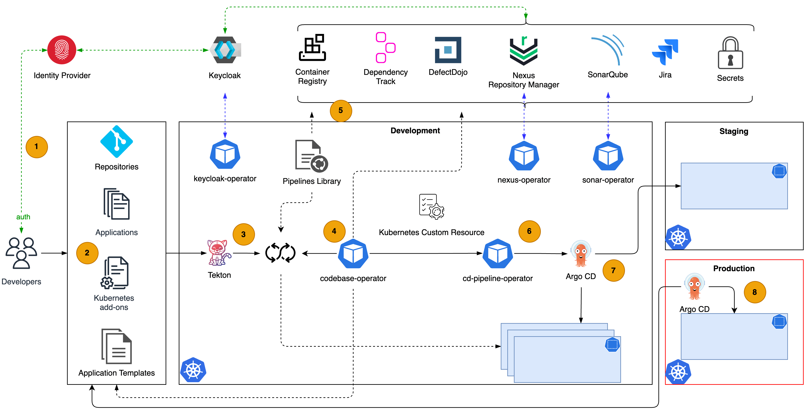
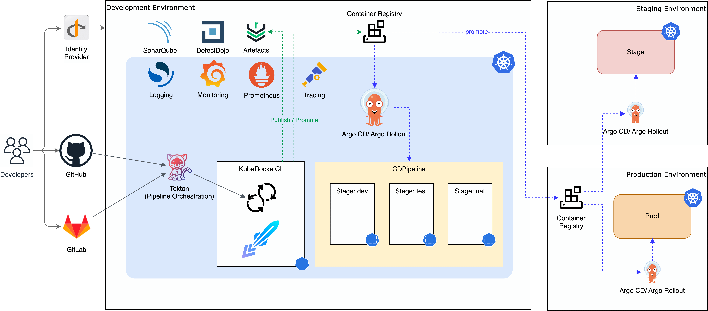

# Reference Architecture

The KubeRocketCI Reference Architecture serves as a blueprint for software delivery, outlining the best practices, tools, and technologies leveraged by the platform to ensure efficient and high-quality software development. It provides a comprehensive guide to navigate the complexities of software delivery, from code to deployment.

KubeRocketCI operates on Kubernetes, a leading open-source system for automating deployment, scaling, and management of containerized applications. It consolidates a variety of open-source tools, ensuring a flexible and adaptable system that can seamlessly run on any public cloud or on-premises infrastructure. This versatility allows for a wide range of deployment options, **catering to diverse business needs** and **operational requirements**.

## Key Principles

The KubeRocketCI is built on a set of key principles that guide its design and functionality:

* **Managed Infrastructure and Container Orchestration:** KubeRocketCI is based on a platform that leverages managed infrastructure and container orchestration, primarily through Kubernetes or OpenShift.

* **Security:** KubeRocketCI places a high emphasis on security, covering aspects such as authentication, authorization, and Single Sign-On (SSO) for platform services.

* **Development and Testing Toolset:** KubeRocketCI provides a comprehensive set of tools for development and testing, ensuring a robust and reliable software delivery process.

* **Well-Established Engineering Process:** KubeRocketCI reflects EPAM’s well-established engineering practices (EngX) in its CI/CD pipelines and delivery analytics.

* **Open-Source and Cloud-Agnostic:** As an open-source, cloud-agnostic solution, KubeRocketCI can be run on any preferred Kubernetes or OpenShift clusters.

* **DevSecOps Excellence:** KubeRocketCI empowers DevSecOps by making security a mandatory quality gate.

* **Automated Testing:** KubeRocketCI ensures seamless and predictable regression testing through automated test analysis.

## Architecture Overview

KubeRocketCI encompasses a comprehensive CI/CD ecosystem integrating essential tools such as the **Tekton** and **Argo CD**, augmented by additional functionalities. Within this robust framework, KubeRocketCI seamlessly integrates **SonarQube** for continuous code quality assessment, enabling thorough analysis and ensuring adherence to coding standards. Additionally, incorporating **Static Application Security Testing (SAST)** toolset fortifies platform's security posture by proactively identifying vulnerabilities within the codebase. KubeRocketCI leverages dedicated artifact storage solutions to manage and version application artifacts securely, ensuring streamlined deployment processes and traceability throughout the software development lifecycle. See the reference architecture diagram below:

1. Developers access the platform by authenticating with their corporate credentials. The platform utilizes OpenID Connect (OIDC) for authentication and authorization across all tools and Kubernetes clusters. Using OIDC, KubeRocketCI establishes a unified and secure authentication mechanism, ensuring seamless access control and user authentication for all integrated tools. This standardized approach upholds strict security protocols, ensuring consistency in authentication and authorization policies across the platform ecosystem. To integrate existing Identity Providers (IdPs), Keycloak serves as an identity broker on the platform. KubeRocketCI offers the keycloak-operator to streamline Keycloak integration within the platform.

2. Developers engage with the platform via the KubeRocketCI, an intuitive interface offering a comprehensive overview of the platform’s capabilities. This centralized hub facilitates seamless navigation and access to various platform tools and components. Within the KubeRocketCI, developers can generate new components (codebases). The platform integrates with version control systems, optimizing source code management, fostering collaboration, and streamlining code review processes. To create new codebases, developers utilize Application Templates, ensuring a standardized approach to application development. The platform accommodates a range of application templates such as Java, Node.js, .NET, Python, and more. Additionally, developers can design custom templates via the KubeRocketCI Marketplace to cater to their specific requirements.

3. Tekton is a potent, adaptable, and cloud-native framework designed for crafting CI/CD systems. It offers a collection of shared, reusable components that empower developers to construct, test, and deploy applications across various cloud providers or on-premises systems. As a foundational element within the KubeRocketCI CI/CD ecosystem, Tekton seamlessly integrates with other tools and services, providing a robust and adaptable framework for constructing CI/CD pipelines. Tekton Pipelines allow developers to efficiently build, test, and deploy applications, while Tekton Triggers initiate pipelines based on specific events.

4. The codebase operator is a crucial part of the platform ecosystem. It manages codebases, their creation, deletion, and scaffolding, as well as their associated resources. It provides versioning, branching, and release capabilities and enables seamless integration with Git servers and Jira.

5. The platform has various cloud-agnostic tools that offer different functionalities, such as artifact storage, static security analysis, and code quality assessment. These tools are accessible through pipelines and codebase controllers. Additionally, the platform supports integration with managed services from cloud providers to deliver its core functionality—for instance, AWS Parameter Store stores secrets and AWS ECR - container images. AzureDevops Artifacts is an option to store artifacts leveraging Azure Cloud capabilities. SonarCloud, a cloud-based version of SonarQube, can be integrated to conduct static code analysis.

6. The CD Pipeline Operator oversees CD pipelines and their related resources. It offers a collection of shared, reusable components for constructing CD pipelines. Integrated with Tekton and Argo CD, the CD Pipeline Operator harnesses their capabilities, ensuring a robust and dependable software delivery process. With a Kubernetes API interface, the CD Pipeline Operator facilitates the management of CD pipelines. It enables artifact promotion logic and the triggering of CD pipelines based on specific events, further enhancing the efficiency and adaptability of the software delivery workflow.

7. Argo CD is a pivotal deployment tool adopted within the platform, embracing the GitOps delivery approach. It serves as the foundation for deploying both operational and business workloads. KubeRocketCI recommends running a dedicated Argo CD instance to manage operational workloads, employing the [Kubernetes add-ons approach](https://github.com/epam/edp-cluster-add-ons) for streamlined management.

8. Production workloads operate in isolation within dedicated Kubernetes clusters to uphold stringent standards and ensure the utmost security and resource allocation. This approach guarantees the highest isolation and operational integrity levels for critical production systems, aligning with industry best practices. KubeRocketCI strongly recommends utilizing a pull model for production deployment. In this model, production deployment is initiated by the Argo CD instance explicitly deployed for the production environment.

## Technology Stack

The Platform is meticulously engineered to uphold best practices in workload distribution across various environments, including development, testing (manual/automation), user acceptance (UAT), staging, and production. While lower environments like development and testing may feasibly share clusters for workload efficiency, KubeRocketCI strongly advocates and enforces the necessity of **segregating production workloads into dedicated clusters**. This segregation ensures the highest isolation, security, and resource allocation levels for mission-critical production systems, adhering to industry standards and ensuring optimal operational integrity.

KubeRocketCI harnesses the robust capabilities of Kubernetes in conjunction with a suite of powerful tools tailored for monitoring, logging, and tracing. It integrates the **Prometheus** stack within ecosystem, leveraging its metrics collection, storage, and querying capabilities to enable comprehensive monitoring of system performance and health. KubeRocketCI runs **OpenSearch** for centralized logging, enabling efficient log aggregation, analysis, and management across the platform. Incorporating **OpenTelemetry** enables standardized and seamless observability data collection, facilitating deep insights into platform behavior and performance. Additionally, it allows for connection with external aggregators and tools that support the OpenTelemetry protocol (OTLP).

KubeRocketCI integrates with GitLab, GitHub, and Gerrit for version control. These systems are foundational components enabling efficient source code management, collaboration, and code review processes.

Platform ensures robust security measures by leveraging OpenID Connect (OIDC) for authentication and authorization across all platform tools and Kubernetes clusters. By employing OIDC, KubeRocketCI establishes a unified and secure authentication mechanism, enabling seamless access control and user authentication for all tools integrated into the platform. This standardized approach ensures stringent security protocols, maintaining authentication consistency and authorization policies across the platform ecosystem.
