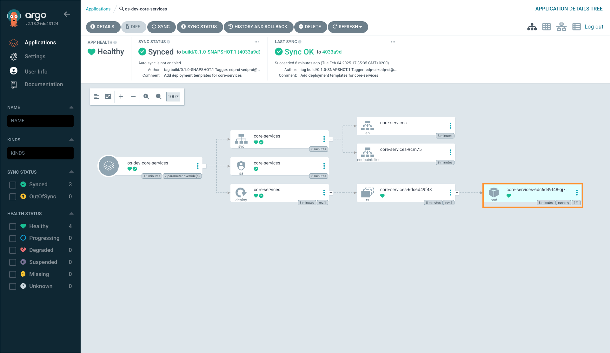
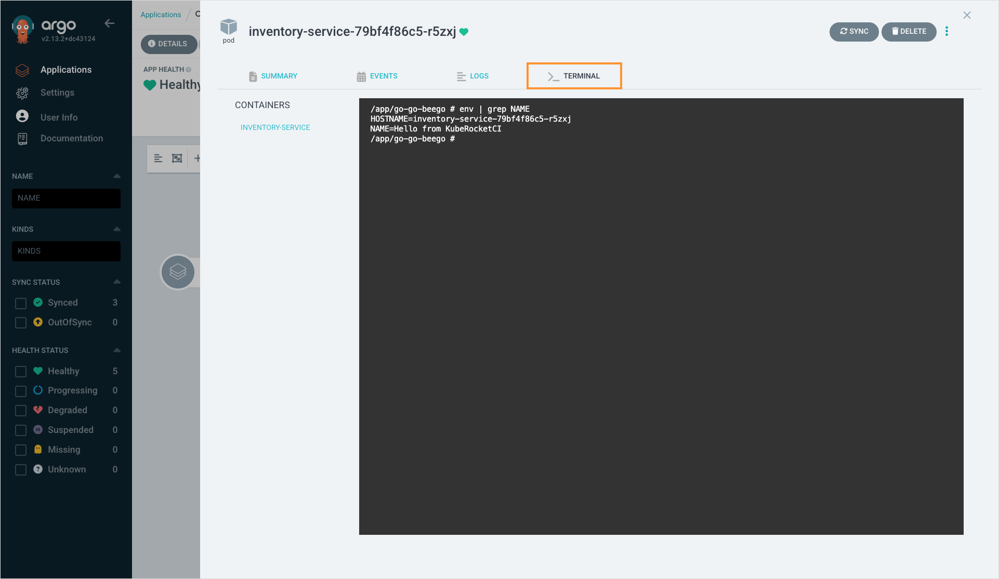

# How Can I Open the Application Terminal?

There are two options to view application logs:

1. **Using KubeRocketCI portal**: Navigate to the environment details page and click the **Show terminal** button in front of the application whose terminal you want to open. More information is provided in the [Manage Deployment Flows](../../../user-guide/manage-environments.md#troubleshoot-application). This method is preferable when your application is deployed in the same cluster as the platform.
2. **Using a pod's terminal window in Argo CD**: This method implies using Argo CD to view the application terminal. It is preferable when the application is deployed into a [remote cluster](../../../user-guide/add-cluster.md).

To open application terminal via Argo CD, follow the steps below:

1. On the environment details page, click the **Argo CD** button.
2. Enter the application whose terminal you want to open.
3. Click the pod block to view its details:

    

4. Navigate to the **Terminal** tab to view the application terminal:

    
