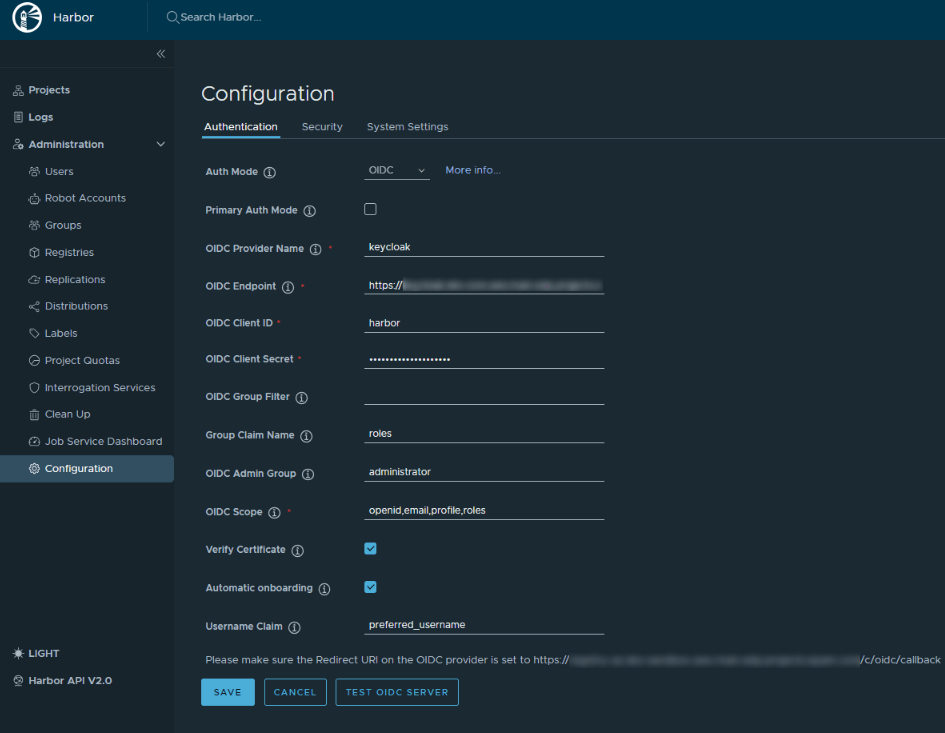

<!-- markdownlint-disable MD025 -->

# Harbor OIDC Configuration

<head>
  <link rel="canonical" href="https://docs.kuberocketci.io/docs/operator-guide/artifacts-management/harbor-oidc/" />
</head>

This guide outlines the steps for integrating [OIDC (OpenID Connect) authorization](https://openid.net/connect/) with Harbor, facilitating Single Sign-On (SSO) capabilities. By adopting OIDC, Harbor gains a unified authentication mechanism, simplifying user access management and enhancing security. This approach centralizes user permissions and access control, streamlining administration through a singular configuration interface.

## Prerequisites

Before the beginning, ensure your installation meets the following criteria:

* [Keycloak](../auth/keycloak.md) is installed;
* [KubeRocketCI](../install-kuberocketci.md) is installed.

## Configure Keycloak

This section details the procedure to configure Harbor with Keycloak for secure authentication using the following steps:

1. Generate the Keycloak Client Secret:

    Start by creating a secret named `keycloak-client-harbor-secret` for Keycloak. This can be accomplished either through the commands provided below or by employing the External Secrets Operator. The secret acts as a secure token for establishing communication between Keycloak and Harbor.

    Generate the secret using OpenSSL and store it in a Kubernetes secret within the platform namespace (e.g, `edp`):

    ```bash
    KEYCLOAK_CLIENT_HARBOR_SECRET=$(openssl rand -base64 32 | head -c 32)
    kubectl -n edp create secret generic keycloak-client-harbor-secret \
        --from-literal=cookie-secret=${KEYCLOAK_CLIENT_HARBOR_SECRET}
    ```

2. Deploy the KeycloakClient Custom Resource:

    Proceed to create the `KeycloakClient` custom resource by applying the `harborkeycloakclient.yaml` configuration in the appropriate namespace. This step involves utilizing the previously generated `keycloak-client-harbor-secret`. Upon successful deployment, Keycloak will register Harbor as a client, with the Kubernetes secret serving as the client password.

    Apply the `harborkeycloakclient.yaml` to establish the resource:

    ```yaml
    apiVersion: v1.edp.epam.com/v1
    kind: KeycloakClient
    metadata:
      name: harbor
    spec:
      advancedProtocolMappers: true
      clientId: harbor
      directAccess: true
      public: false
      secret: keycloak-client-harbor-secret
      defaultClientScopes:
        - profile
        - email
        - roles
      targetRealm: control-plane
      webUrl: <harbor_endpoint>
      protocolMappers:
        - name: roles
          protocol: openid-connect
          protocolMapper: oidc-usermodel-realm-role-mapper
          config:
            access.token.claim: true
            claim.name: roles
            id.token.claim: true
            userinfo.token.claim: true
            multivalued: true
    ```

    Ensure to replace `<harbor_endpoint>` with your actual Harbor URL. This configuration links Harbor to Keycloak, enabling OIDC-based Single Sign-On (SSO) for a streamlined authentication process.

## Configure Harbor

The next stage is to configure Harbor. Proceed with following the steps below:

1. Log in to Harbor UI with an account that has Harbor system administrator privileges. To get the administrator password, execute the command below:

    ```bash
    kubectl get secret harbor -n harbor -o jsonpath='{.data.HARBOR_ADMIN_PASSWORD}' | base64 --decode
    ```

2. Navigate to **Administration** -> **Configuration** -> **Authentication**. Configure OIDC using the parameters below:

    ```ini
    auth_mode: oidc_auth
    oidc_name: keycloak
    oidc_endpoint: <keycloak_endpoint>/auth/realms/control-plane
    oidc_client_id: harbor
    oidc_client_secret: <keycloak-client-harbor-secret>
    oidc_groups_claim: roles
    oidc_admin_group: administrator
    oidc_scope: openid,email,profile,roles
    verify_certificate: true
    oidc_auto_onboard: true
    oidc_user_claim: preferred_username
    ```

    

As a result, users will be prompted to authenticate themselves when logging in to Harbor UI.

## Related Articles

* [EKS OIDC With Keycloak](../auth/configure-keycloak-oidc-eks.md)
* [External Secrets Operator Integration](../secrets-management/external-secrets-operator-integration.md)
* [Integrate Harbor With KubeRocketCI Pipelines](harbor-integration.md)
