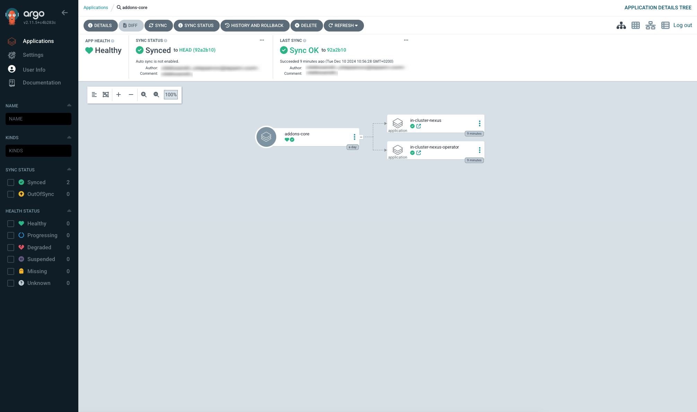
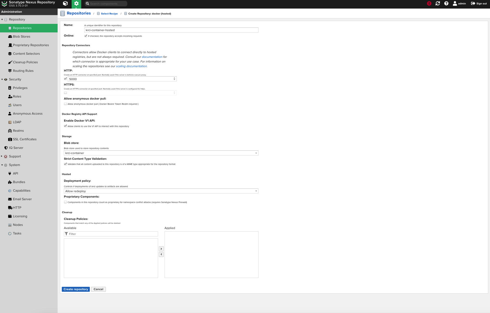

<!-- markdownlint-disable MD025 -->

import Tabs from '@theme/Tabs';
import TabItem from '@theme/TabItem';

# Nexus Image Registry

<head>
  <link rel="canonical" href="https://docs.kuberocketci.io/docs/operator-guide/artifacts-management/nexus-image-registry/" />
</head>

This documentation guide provides comprehensive instructions for integrating **Nexus Repository Manager** as a docker image registry with KubeRocketCI.

## Installation

To install Nexus in environment, it's recommended to use the resources provided in the [Cluster Add-Ons](https://github.com/epam/edp-cluster-add-ons) repository. This approach involves installing both the Nexus repository manager and the [nexus-operator](https://github.com/epam/edp-nexus-operator). Leveraging the Cluster Add-Ons simplifies the deployment and management process, providing a streamlined method to integrate Nexus into infrastructure.

1. Navigate to the forked cluster Add-Ons repository and align the [nexus values.yaml](https://github.com/epam/edp-cluster-add-ons/tree/main/clusters/core/addons/nexus/values.yaml) and [nexus-operator values.yaml](https://github.com/epam/edp-cluster-add-ons/tree/main/clusters/core/addons/nexus-operator/values.yaml) files. Follow the instructions to deploy Nexus, ensuring it's correctly configured to serve as artifact repository.

2. Sync resources and wait till the all **nexus** and **nexus-operator** resources is created:

    

3. **Sign In** into **Nexus Repository Manager** using the default credentials **Username**: `admin` and **Password**: `admin123` and update the default password for better security:

    

4. Update the configuration to enable **nexus** and **nexus-operator** in [Add-Ons](https://github.com/epam/edp-cluster-add-ons/blob/main/clusters/core/apps/values.yaml) repository:

    ```yaml title="clusters/core/apps/values.yaml"
    nexus:
      createNamespace: true
      enable: true

    nexus-operator:
      createNamespace: true
      enable: true
    ```

## Configuration

With [Add-Ons approach](https://github.com/epam/edp-cluster-add-ons/blob/main/clusters/core) `nexus-operator` create the necessary roles, **Service Account** `ci.user`, blob stores, repository, scripts, cleanup policies automatically. Below is a comprehensive guide on how to create all resources manually.

## Configuration Nexus Repository Manager with nexus-operator

1. Create a Kubernetes Secret that the **nexus-operator** will use to connect to the **Nexus Repository Manager** and create all resources:

  <Tabs
    defaultValue="manifests"
    values={[
      {label: 'Manifests', value: 'manifests'},
      {label: 'External Secrets Operator', value: 'externalsecret'},
    ]}>
    <TabItem value="manifests">
      ```yaml
      apiVersion: v1
      kind: Secret
      metadata:
        name: nexus-admin-password
        namespace: nexus
      type: Opaque
      data:
        user: YWRtaW4=     # base64-encoded value of "admin"
        password: cGFzcw== # base64-encoded value of "pass"
      ```
    </TabItem>
    <TabItem value="externalsecret">
      ```json
      "nexus-admin-password":
      {
        "user": "XXXXXXX",
        "password": "XXXXXXX"
      }
      ```
      </TabItem>
  </Tabs>

2. Create a secret using `manifests` or with `External Secrets Operator` to enable the **edp-nexus-operator** to connect to the **Nexus Repository Manager** for provisioning:

  <Tabs
    defaultValue="manifests"
    values={[
      {label: 'Manifests', value: 'manifests'},
      {label: 'External Secrets Operator', value: 'externalsecret'},
    ]}>
    <TabItem value="manifests">
      ```yaml
      apiVersion: v1
      kind: Secret
      metadata:
        name: ci-nexus
        namespace: nexus
      type: Opaque
      stringData:
        password: <nexus-user-password>
      ```
    </TabItem>
    <TabItem value="externalsecret">
      ```json
      "ci-nexus":
      {
        "password": "XXXXXXX"
      }
      ```
      </TabItem>
  </Tabs>

## Configuration Nexus Repository Manager without nexus-operator

Without using the **nexus-operator**, manual updates are required for the Helm chart values of the **Nexus Repository Manager**, as well as the creation of blob stores, repositories, roles, and the **Service Account** `ci.user`.

1. Update **Nexus Repository Manager** helm chart values:

    ```yaml
    nexus-repository-manager:
      nexus:
        docker:
          enabled: true
          registries:
            - host: nexus-ci-container.example.com
              port: 5000
    ```

2. Create blob store. Open the Nexus UI and navigate to **Server administration and configuration** -> **Repository** -> **Blob Stores** and click **Create Blob Store**, fill the following fields and click **Save** button:

    * **Type**: `File`
    * **Name**: `krci-container`

    

3. Create repository. Open the Nexus UI and navigate to **Server administration and configuration** -> **Repository** -> **Repositories**, click **+ Create repository**, select **docker (hosted)**, fill the following fields and click **Save** button:

    * **Name**: `A unique identifier for this repository`
    * **HTTP**: `5000`
    * **Enable Docker V1 API**: `check`
    * **Blob store name**: `krci-container`
    * **Strict Content Type Validation**: `check`

    

4. Open the Nexus UI and navigate to **Server administration and configuration** -> **Security** -> **Roles**. Click the **Create Role** button, fill the following fields and click **Save** button:

    * **Type**: `Nexus role`
    * **Role ID**: `krci-admin`
    * **Role Name**: `krci-admin`
    * **Role Descriptions**: `Read and write access to all repos and scripts`
    * **Applied Privileges**: `nx-apikey-all`, `nx-repository-view-*-*-add`, `nx-repository-view-*-*-browse`,`nx-repository-view-*-*-edit`, `nx-repository-view-*-*-read`, `nx-script-*-add`, `nx-script-*-delete`, `nx-script-*-read`, `nx-script-*-run`

    

5. Create repository Service Account `ci.user`. Open the Nexus UI and navigate to **Server administration and configuration** -> **Security** -> **User**. Click the `Create local user` button to create a new user:

    

6. Type the `ci.user` username, fill the following fields and click the **Create local user** button to create the ***Service Account**, fill the following fields and click **Save** button:

    * **ID**: `ci.user`
    * **First name**: `ci.user`
    * **Last name**: `CI`
    * **Email**: `ci.user@krci.com`
    * **Password**: `<nexus-user-password>`
    * **Status**: `Active`
    * **Roles**: `krci-admin`

    

## Integration Nexus Repository Manager with KubeRocketCI

1. Open **KubeRocketCI** -> **Configuration** -> **ARTIFACTS STORAGE** -> **REGISTRY**. Click **+ ADD REGISTRY**  fill in the fields below, and then click **SAVE** button:

    * **Registry Provider**: `Nexus`
    * **Registry Endpoint**: `nexus-ci-container.example.com`
    * **Repository**: `krci` # The name of folder in nexus repository
    * **Push account User**: `ci.user`
    * **Push account Password/Token**: `<nexus-user-password>`
    * **Use the Push Accounts credentials**: `check`

    

2. After build application open **Nexus Repository Manager** -> **Browse server contents** -> **Browse** and open container registry:

    

## Related Articles

* [Install via Add-Ons](../add-ons-overview.md)
* [Manage Container Registries](../../user-guide/manage-container-registries.md)
* [Nexus Sonatype Integration](nexus-sonatype.md)
* [Change Container Registry](../../user-guide/change-container-registry.md)
