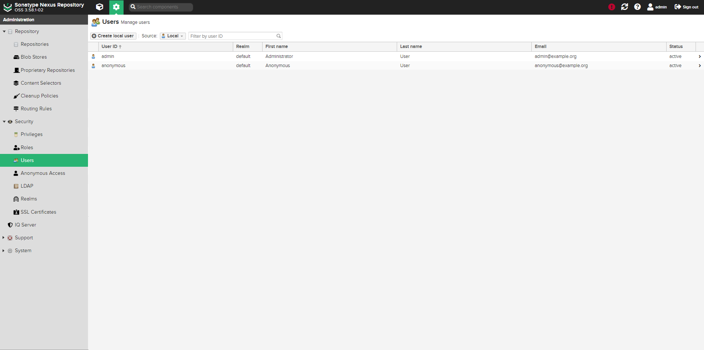
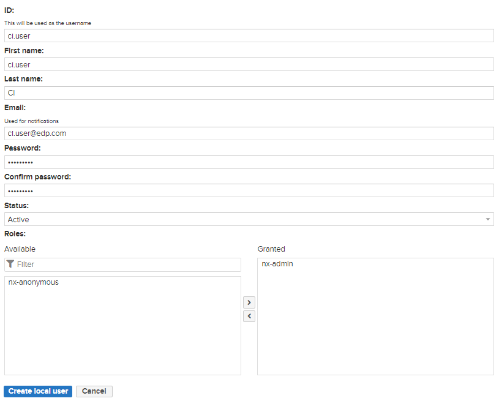

import Tabs from '@theme/Tabs';
import TabItem from '@theme/TabItem';

# Sonatype Nexus Repository OSS Integration

This documentation guide provides comprehensive instructions for integrating Sonatype Nexus Repository OSS (Nexus) with KubeRocketCI.

<div style={{ display: 'flex', justifyContent: 'center' }}>
<iframe width="560" height="315" src="https://www.youtube.com/embed/ger8yoXB24U" title="Integrate KubeRocketCI with Nexus" frameborder="0" allow="accelerometer; autoplay; clipboard-write; encrypted-media; gyroscope; picture-in-picture" allowfullscreen="allowfullscreen"></iframe>
</div>

## Prerequisites

Before proceeding, ensure that you have the following prerequisites:

* Kubectl version 1.26.0+ is installed. Please refer to the [Kubernetes official website](https://kubernetes.io/releases/download/) for details.
* [Helm](https://helm.sh) version 3.14.0+ is installed. Please refer to the [Helm page](https://github.com/helm/helm/releases) on GitHub for details.

## Installation

To install Nexus in your environment, it's recommended to use the resources provided in the [Cluster Add-Ons](https://github.com/epam/edp-cluster-add-ons) repository. This approach involves installing both the Nexus repository manager and the [nexus-operator](https://github.com/epam/edp-nexus-operator). Leveraging the Cluster Add-Ons simplifies the deployment and management process, providing a streamlined method to integrate Nexus into your infrastructure.

1. **Nexus Repository Manager**: First, navigate to the [Nexus section within the EDP Cluster Add-Ons](https://github.com/epam/edp-cluster-add-ons/tree/main/add-ons/nexus) repository. Follow the instructions to deploy Nexus, ensuring it's correctly configured to serve as your artifact repository.

2. **Nexus-Operator**: Then, proceed with the [nexus-operator](https://github.com/epam/edp-nexus-operator) installation. The operator facilitates easier management and automation of Nexus, allowing for seamless updates, configuration changes, and monitoring.

## Configuration

To guarantee robust authentication and precise access control within the platform ecosystem, it's essential to establish a Service Account named `ci.user`. This account acts as a distinct identifier, enabling seamless integration and secure communication across the KubeRocketCI environment.

To create the Nexus `ci.user` and define repository parameters follow the steps below:

1. Open the Nexus UI and navigate to **Server administration and configuration** -> **Security** -> **User**. Click the `Create local user` button to create a new user:

    

2. Type the `ci-user` username, define an expiration period, and click the `Generate` button to create the token:

    

3. KubeRocketCI operates using a specific repository naming convention, where all repository names adhere to predefined standards. To align with this, navigate to **Server administration and configuration** -> **Repository** -> **Repositories** within Nexus. Here, repository creation is limited to those that match the required programming language, ensuring consistency and compliance with the KubeRocketCI framework.

    

    <Tabs
      defaultValue="java"
      values={[
        {label: 'Java', value: 'java'},
        {label: 'JavaScript', value: 'javascript'},
        {label: 'DotNet', value: 'dotnet'},
        {label: 'Python', value: 'python'}
      ]}>

      <TabItem value="java">
        a) Click Create a repository by selecting "maven2(proxy)" and set the name as "edp-maven-proxy". Enter the remote storage URL as "https://repo1.maven.org/maven2/". Save the configuration.

        b) Click Create a repository by selecting "maven2(hosted)" and set the name as "edp-maven-snapshot". Change the Version policy to "snapshot". Save the configuration.

        c) Click Create a repository by selecting "maven2(hosted)" and set the name as "edp-maven-releases". Change the Version policy to "release". Save the configuration.

        d) Click Create a repository by selecting "maven2(group)" and set the name as "edp-maven-group". Change the Version policy to "release". Add repository to group. Save the configuration.
      </TabItem>
      <TabItem value="javascript">
        a) Click Create a repository by selecting "npm(proxy)" and set the name as "edp-npm-proxy". Enter the remote storage URL as "https://registry.npmjs.org". Save the configuration.

        b) Click Create a repository by selecting "npm(hosted)" and set the name as "edp-npm-snapshot". Save the configuration.

        c) Click Create a repository by selecting "npm(hosted)" and set the name as "edp-npm-releases". Save the configuration.

        d) Click Create a repository by selecting "npm(hosted)" and set the name as "edp-npm-hosted". Save the configuration.

        e) Click Create a repository by selecting "npm(group)" and set the name as "edp-npm-group". Add repository to group. Save the configuration.
      </TabItem>

      <TabItem value="dotnet">
        a) Click Create a repository by selecting "nuget(proxy)" and set the name as "edp-dotnet-proxy". Select Protocol version NuGet V3. Enter the remote storage URL as "https://api.nuget.org/v3/index.json". Save the configuration.

        b) Click Create a repository by selecting "nuget(hosted)" and set the name as "edp-dotnet-snapshot". Save the configuration.

        c) Click Create a repository by selecting "nuget(hosted)" and set the name as "edp-dotnet-releases". Save the configuration.

        d) Click Create a repository by selecting "nuget(hosted)" and set the name as "edp-dotnet-hosted". Save the configuration.

        e) Click Create a repository by selecting "nuget(group)" and set the name as "edp-dotnet-group". Add repository to group. Save the configuration.
      </TabItem>

      <TabItem value="python">
        a) Click Create a repository by selecting "pypi(proxy)" and set the name as "edp-python-proxy". Enter the remote storage URL as "https://pypi.org". Save the configuration.

        b) Click Create a repository by selecting "pypi(hosted)" and set the name as "edp-python-snapshot". Save the configuration.

        c) Click Create a repository by selecting "pypi(hosted)" and set the name as "edp-python-releases". Save the configuration.

        d) Click Create a repository by selecting "pypi(group)" and set the name as "edp-python-group". Add repository to group. Save the configuration.
      </TabItem>

    </Tabs>

4. Provision secrets using manifest, EDP Portal or with the externalSecrets operator

  <Tabs
    defaultValue="portal"
    values={[
      {label: 'UI Portal', value: 'portal'},
      {label: 'Manifests', value: 'manifests'},
      {label: 'External Secrets Operator', value: 'externalsecret'},
    ]}>
    <TabItem value="portal">
      Go to **EDP Portal** -> **EDP** -> **Configuration** -> **Nexus**. Update or fill in the **URL**, **nexus-user-id**, **nexus-user-password** and click the **Save** button:

      
    </TabItem>
    <TabItem value="manifests">
      ```yaml
      apiVersion: v1
      kind: Secret
      metadata:
        name: ci-nexus
        namespace: edp
        labels:
          app.edp.epam.com/secret-type: nexus
          app.edp.epam.com/integration-secret: "true"
      type: Opaque
      stringData:
        url: https://nexus.example.com
        username: <nexus-user-id>
        password: <nexus-user-password>
      ```
    </TabItem>
    <TabItem value="externalsecret">
      ```json
      "ci-nexus":
      {
        "url": "https://nexus.example.com",
        "username": "XXXXXXX",
        "password": "XXXXXXX"
      },
      ```

      Go to **EDP Portal** -> **EDP** -> **Configuration** -> **Nexus** and see `Managed by External Secret` message.

      

      More detail of External Secrets Operator Integration can found on [the following page](../secrets-management/external-secrets-operator-integration.md)
      </TabItem>
  </Tabs>

## Related Articles

* [Install KubeRocketCI](../install-kuberocketci.mdx)
* [Install External Secrets Operator](../secrets-management/install-external-secrets-operator.md)
* [External Secrets Operator Integration](../secrets-management/external-secrets-operator-integration.md)
* [Cluster Add-Ons Overview](../add-ons-overview.md)
