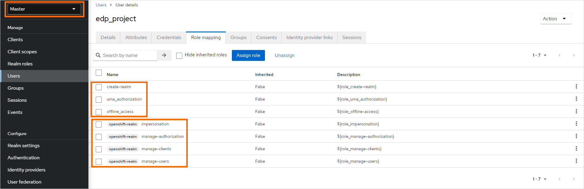

# Install Keycloak

<head>
  <link rel="canonical" href="https://docs.kuberocketci.io/docs/operator-guide/auth/keycloak/" />
</head>

Inspect the prerequisites and the main steps to perform for installing Keycloak.

:::info
  The installation process below is given for a Kubernetes cluster. The steps that differ for an OpenShift cluster are
  indicated in the warnings blocks.
:::

## Prerequisites

* Kubectl version 1.26.0+ is installed. Please refer to the [Kubernetes official website](https://kubernetes.io/releases/download/) for details.
* [Helm](https://helm.sh) version 3.14.0+ is installed. Please refer to the [Helm page](https://github.com/helm/helm/releases) on GitHub for details.

:::info
  Out team recommends a Keycloakx helm chart from the [codecentric](https://github.com/codecentric/helm-charts/tree/master/charts/keycloakx) repository, but other repositories can be used as well (e.g. [Bitnami](https://github.com/bitnami/charts/tree/master/bitnami/keycloak/)).
  Before installing Keycloak, it is necessary to install a [PostgreSQL database](https://www.postgresql.org/download/).
:::

:::info
  It is also possible to install Keycloak using the cluster add-ons. For details, please refer to the [Install via Add-Ons](../add-ons-overview.md) page.
:::

## PostgreSQL Installation

To install PostgreSQL, follow the steps below:

1. Check that a security namespace is created. If not, run the following command to create it:

    ```bash
    kubectl create namespace security
    ```

    :::warning
      On the OpenShift platform, apply the `SecurityContextConstraints` resource. Change the namespace in the `users` section if required.

      <details>
      <summary><b>View: keycloak-scc.yaml</b></summary>
          ```yaml
          allowHostDirVolumePlugin: false
          allowHostIPC: false
          allowHostNetwork: false
          allowHostPID: false
          allowHostPorts: false
          allowPrivilegeEscalation: true
          allowPrivilegedContainer: false
          allowedCapabilities: null
          apiVersion: security.openshift.io/v1
          allowedFlexVolumes: []
          defaultAddCapabilities: []
          fsGroup:
            type: MustRunAs
            ranges:
              - min: 999
                max: 65543
          groups: []
          kind: SecurityContextConstraints
          metadata:
            annotations:
              "helm.sh/hook": "pre-install"
            name: keycloak
          priority: 1
          readOnlyRootFilesystem: false
          requiredDropCapabilities:
            - KILL
            - MKNOD
            - SETUID
            - SETGID
          runAsUser:
            type: MustRunAsRange
            uidRangeMin: 1
            uidRangeMax: 65543
          seLinuxContext:
            type: MustRunAs
          supplementalGroups:
            type: RunAsAny
          users:
            - system:serviceaccount:security:keycloakx
          volumes:
            - configMap
            - downwardAPI
            - emptyDir
            - persistentVolumeClaim
            - projected
            - secret
          ```
      </details>

      <details>
      <summary><b>View: postgresql-keycloak-scc.yaml</b></summary>
          ```yaml
          allowHostDirVolumePlugin: false
          allowHostIPC: false
          allowHostNetwork: false
          allowHostPID: false
          allowHostPorts: false
          allowPrivilegeEscalation: true
          allowPrivilegedContainer: false
          allowedCapabilities: null
          apiVersion: security.openshift.io/v1
          allowedFlexVolumes: []
          defaultAddCapabilities: []
          fsGroup:
            type: MustRunAs
            ranges:
              - min: 999
                max: 65543
          groups: []
          kind: SecurityContextConstraints
          metadata:
            annotations:
                "helm.sh/hook": "pre-install"
            name: postgresql-keycloak
          priority: 1
          readOnlyRootFilesystem: false
          requiredDropCapabilities:
          - KILL
          - MKNOD
          - SETUID
          - SETGID
          runAsUser:
            type: MustRunAsRange
            uidRangeMin: 1
            uidRangeMax: 65543
          seLinuxContext:
            type: MustRunAs
          supplementalGroups:
            type: RunAsAny
          users:
          - system:serviceaccount:security:default
          volumes:
          - configMap
          - downwardAPI
          - emptyDir
          - persistentVolumeClaim
          - projected
          - secret
          ```
      </details>
    :::

2. Create PostgreSQL admin secret:

    ```bash
    kubectl -n security create secret generic keycloak-postgresql \
    --from-literal=password=<postgresql_password> \
    --from-literal=postgres-password=<postgresql_postgres_password>
    ```

3. Add a helm chart repository:

    ```bash
    helm repo add bitnami https://charts.bitnami.com/bitnami
    helm repo update
    ```

4. Install PostgreSQL v15.2.0 using [bitnami/postgresql](https://artifacthub.io/packages/helm/bitnami/postgresql) Helm chart v12.1.15:

    :::info
      The PostgreSQL can be deployed in production ready mode. For example, it may include multiple replicas, persistent storage, autoscaling, and monitoring.
      For details, please refer to the [official Chart documentation](https://github.com/bitnami/charts/tree/master/bitnami/postgresql).
    :::

    ```bash
    helm install postgresql bitnami/postgresql \
    --version 12.1.15 \
    --values values.yaml \
    --namespace security
    ```

  Check out the _values.yaml_ file sample of the PostgreSQL customization:

  <details>
  <summary><b>View: values.yaml</b></summary>
    ```yaml
    # PostgreSQL read only replica parameters
    readReplicas:
      # Number of PostgreSQL read only replicas
      replicaCount: 1

    image:
      tag: 15.2.0-debian-11-r0

    global:
      postgresql:
        auth:
          username: admin
          existingSecret: keycloak-postgresql
          database: keycloak

    primary:
      persistence:
        enabled: true
        size: 3Gi
    ```
  </details>

## Keycloak Installation

To install Keycloak, follow the steps below:

1. Use `security` namespace from the PostgreSQL installation.

2. Add a chart repository:

    ```bash
    helm repo add codecentric https://codecentric.github.io/helm-charts
    helm repo update
    ```

3. Create Keycloak admin secret:

    ```bash
    kubectl -n security create secret generic keycloak-admin-creds \
    --from-literal=username=<keycloak_admin_username> \
    --from-literal=password=<keycloak_admin_password>
    ```

4. Install Keycloak 20.0.3 using [codecentric/keycloakx](https://artifacthub.io/packages/helm/codecentric/keycloakx) Helm chart:

    :::info
      Keycloak can be deployed in production ready mode. For example, it may include multiple replicas, autoscaling, and monitoring.
      For details, please refer to the [official Chart documentation](https://github.com/codecentric/helm-charts/tree/master/charts/keycloakx).
    :::

    ```bash
    helm install keycloakx codecentric/keycloakx \
    --version 2.3.0 \
    --values values.yaml \
    --namespace security
    ```

    Check out the _values.yaml_ file sample of the Keycloak customization:

    <details>
    <summary><b>View: values.yaml</b></summary>

      ```yaml
      replicas: 1

      # Deploy the latest version
      image:
        tag: "24.0.4"

      # The following parameter is unrecommended to expose. Exposed health checks lead to an unnecessary attack vector.
      health:
        enabled: false
      # The following parameter is unrecommended to expose. Exposed metrics lead to an unnecessary attack vector.
      metrics:
        enabled: false

      command:
        - "/opt/keycloak/bin/kc.sh"
        - "--verbose"
        - "start"

      extraEnv: |
        - name: KC_HOSTNAME
          value: "keycloak.<ROOT_DOMAIN>"
        - name: KC_SPI_HOSTNAME_DEFAULT_ADMIN
          value: "keycloak.<ROOT_DOMAIN>"
        - name: KC_HTTP_ENABLED
          value: "true"
        - name: KC_HOSTNAME_STRICT
          value: "false"
        - name: KC_HOSTNAME_STRICT_HTTPS
          value: "false"
        - name: KC_SPI_EVENTS_LISTENER_JBOSS_LOGGING_SUCCESS_LEVEL
          value: "info"
        - name: KEYCLOAK_ADMIN
          valueFrom:
            secretKeyRef:
              name: keycloak-admin-creds
              key: username
        - name: KEYCLOAK_ADMIN_PASSWORD
          valueFrom:
            secretKeyRef:
              name: keycloak-admin-creds
              key: password
        - name: JAVA_OPTS_APPEND
          value: >-
            -XX:+UseContainerSupport
            -XX:MaxRAMPercentage=50.0
            -Djava.awt.headless=true
            -Djgroups.dns.query={{ include "keycloak.fullname" . }}-headless
            -Dkeycloak.connectionsHttpClient.default.expect-continue-enabled=true
            -Dkeycloak.connectionsHttpClient.default.reuse-connections=false
        - name: HTTP_ADDRESS_FORWARDING
          value: "true"
        - name: PROXY_ADDRESS_FORWARDING
          value: "true"

      # This block should be uncommented if you install Keycloak on Kubernetes
      ingress:
        enabled: true
        annotations:
          nginx.ingress.kubernetes.io/proxy-buffer-size: 256k
        # Defines the class of the Ingress Controller.
        # It allows you to choose which Ingress controller in cluster should be used to expose the Keycloak service to the outside world.
        ingressClassName: "nginx"
        # Exposes Keycloak paths according to the rules from documentation.
        # Ref: https://www.keycloak.org/server/reverseproxy#_exposed_path_recommendations
        console:
          enabled: false
        rules:
          - host: keycloak.<ROOT_DOMAIN>
            paths:
              - path: '{{ tpl .Values.http.relativePath $ | trimSuffix "/" }}/'
                pathType: Prefix

      proxy:
        enabled: true
        mode: "edge"

      # This block should be uncommented if you set Keycloak to OpenShift and change the host field
      # route:
      #   enabled: false
      #   # Path for the Route
      #   path: '/'
      #   # Host name for the Route
      #   host: "keycloak.<ROOT_DOMAIN>"
      #   # TLS configuration
      #   tls:
      #     enabled: true

      resources:
        limits:
          memory: "2048Mi"
        requests:
          cpu: "50m"
          memory: "512Mi"

      # Check database readiness at startup
      dbchecker:
        enabled: true

      database:
        vendor: postgres
        existingSecret: keycloak-postgresql
        hostname: postgresql
        port: 5432
        username: admin
        database: keycloak
      ```

    </details>

## Configuration

For configuring Keycloak within your environment, it's recommended to utilize the [edp-keycloak-operator](https://github.com/epam/edp-keycloak-operator).
This operator simplifies the integration process by automating the deployment and management of Keycloak instances.
It ensures that Keycloak is correctly configured to serve as an identity provider, facilitating secure access management across your applications.

By leveraging the edp-keycloak-operator, you can efficiently manage realms, users, and client configurations, making it an essential tool for robust access control in Kubernetes environments.

To create a Keycloak user in the Master realm who can manage other realms, follow these steps:

1. Create the `edp_<EDP_PROJECT>` user and set the password in the `Master` realm.

    :::note
      This user should be used by Keycloak Operator to access Keycloak. Please refer to the [Install KubeRocketCI](../install-kuberocketci.md) page for details.
    :::

2. In the `Role Mapping` tab, assign the proper roles to the user:

    * Realm Roles:
      * create-realm,
      * offline_access,
      * uma_authorization

    * Client Roles `openshift-realm`:
      * impersonation,
      * manage-authorization,
      * manage-clients,
      * manage-users

    

    :::note
      `openshift-realm` is the realm name used as the `broker` realm, which is utilized for integrating third-party Identity Providers. You can find more information about this integration in the [kuberocketci-rbac](https://github.com/epam/edp-cluster-add-ons/tree/main/clusters/core/addons/kuberocketci-rbac) repository of the KubeRocketCI platform.
    :::

## Related Articles

* [Install KubeRocketCI](../install-kuberocketci.md)
* [Install Harbor](../artifacts-management/harbor-installation.md)
* [Install via Add-Ons](../add-ons-overview.md)
