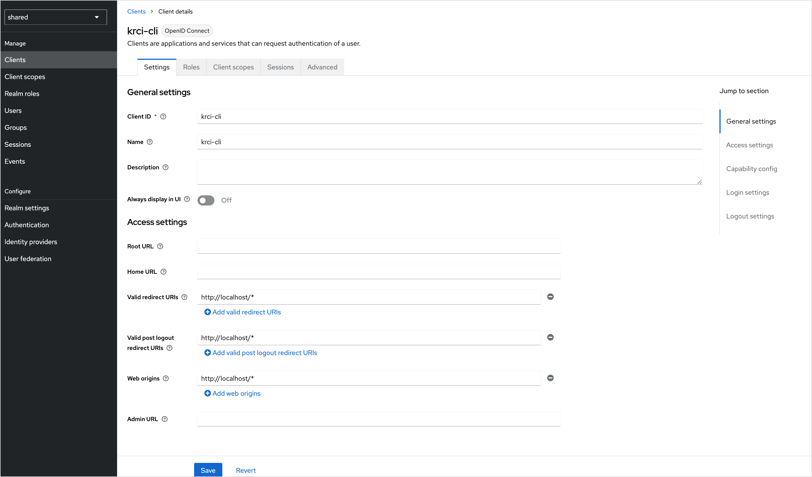
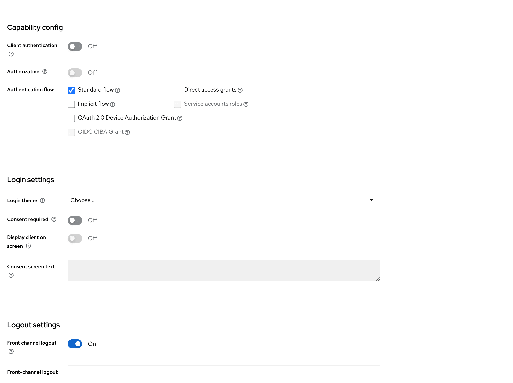
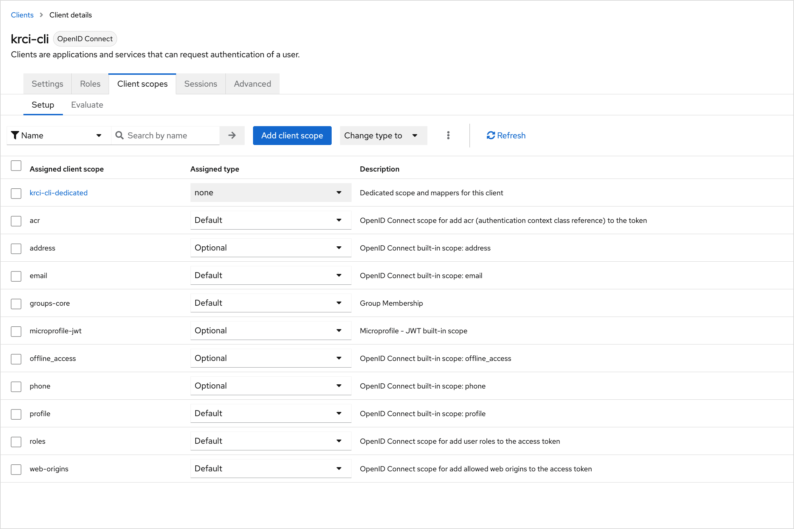
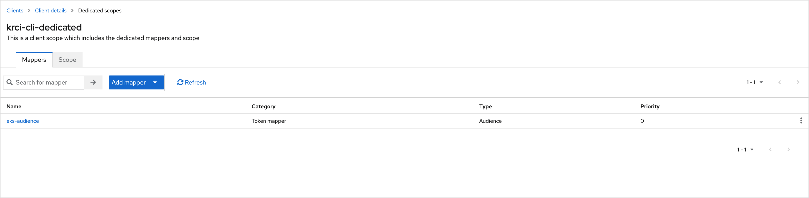
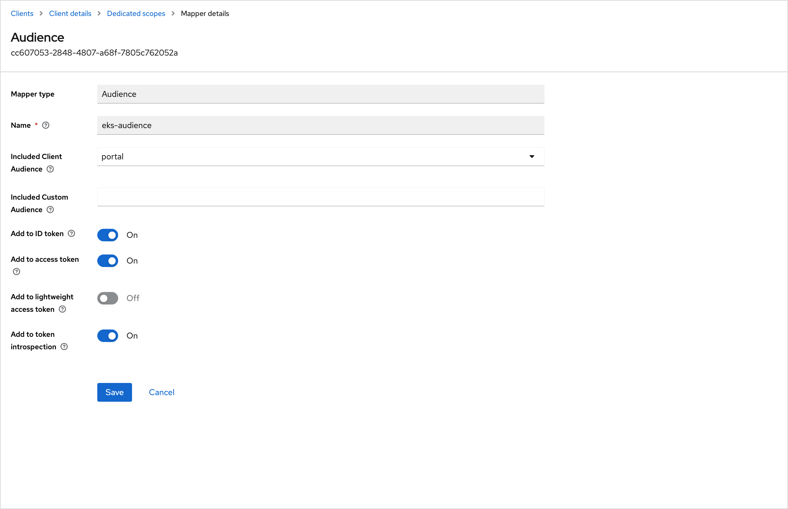

<!-- markdownlint-disable MD025 -->

# KubeRocketCI CLI Keycloak Client

<head>
  <link rel="canonical" href="https://docs.kuberocketci.io/docs/operator-guide/auth/krci-cli-client-for-keycloak" />
</head>

The [KubeRocketCI CLI](https://github.com/KubeRocketCI/cli) authenticates users through the browser (OAuth 2.0 authorization code flow with PKCE). This page describes how to register a **public** OpenID Connect client in Keycloak so operators can run `krci auth login` against your KubeRocketCI Portal.

:::info
  Create the client in the **same realm** the Portal already uses. To confirm the realm, inspect the OIDC settings returned by the Portal, for example the endpoint `GET /rest/v1/config/oidc` on your Portal base URL (replace the host with yours):

  ```http
  GET https://portal.example.com/rest/v1/config/oidc
  ```

  Create the client only in the **Platform realm** you identified above. Application clients belong there, not in Keycloak’s built-in administrative realms.
:::

## Select Realm

In the Keycloak Admin Console, use the realm drop-down in the top-left corner and select the realm your Portal uses.

## Create Client

The next step is to create a Keycloak client itself:

1. In the left sidebar, open **Clients**, then click **Create client**.
2. On **General settings**, set the fields as follows:

    | Field | Value |
    |-------|--------|
    | Client type | OpenID Connect |
    | Client ID | `krci-cli` |
    | Name | KubeRocketCI CLI (display only) |
    | Description | Public OIDC client for the KubeRocketCI CLI (PKCE) |
    | Always display in console | Off |

3. Click **Next**.
4. On **Capability config**, set the toggles:

    | Toggle | Value | Note |
    |--------|-------|------|
    | Client authentication | Off | Public client (no client secret) |
    | Authorization | Off | — |
    | Standard flow | On | Authorization code flow |
    | Direct access grants | Off | — |
    | Implicit flow | Off | — |
    | Service accounts roles | Off | — |
    | OAuth 2.0 Device Authorization Grant | Off | Browser-based login |
    | OIDC CIBA Grant | Off | — |

5. Click **Next**.
6. On **Login settings**, configure URLs:

    | Field | Value |
    |-------|--------|
    | Root URL | *(empty)* |
    | Home URL | *(empty)* |
    | Valid redirect URIs | `http://127.0.0.1/*` and `http://localhost/*` (add **both**) |
    | Valid post logout redirect URIs | *(empty)* |
    | Web origins | `+` (allow all origins configured for this client) |

    :::note
      The CLI binds a callback listener on `localhost` with a **random port** on each login, so wildcard redirect URIs are required.
    :::

7. Click **Save**. You are taken to the client **Settings** page.

The screenshots below illustrate **Access settings** (client ID, redirect URIs, web origins) and **Capability config** / **Login settings** on a typical Keycloak deployment.





## Enforce PKCE (S256)

To enforce PKCE, do these steps:

1. Open the **Advanced** tab for the `krci-cli` client.
2. Under **Advanced settings**, set **Proof Key for Code Exchange Code Challenge Method** to **S256**.
3. Click **Save** for that section.

This ensures Keycloak only accepts logins that send a PKCE code challenge, which matches how the CLI performs authorization.

## Configure Token Lifetimes

On the client **Advanced** tab, you can leave **Access Token Lifespan** and session timeouts **inherited from the realm** (for example five to fifteen minutes for access tokens), or set client-specific values.

At realm level (**Realm settings** → **Tokens**), confirm **OAuth 2.0 Refresh Token Rotation** matches your security policy. The CLI refreshes tokens using the standard OAuth2 token endpoint.

## Configure Client Scopes

To configure client scopes (openid, profile, email, roles, groups), follow the steps below:

1. Open the **Client scopes** tab for `krci-cli`.
2. Under **Default** client scopes, ensure typical OpenID scopes are present, including **`openid`**, **`profile`**, **`email`**, and **`roles`** (exact names can vary slightly by Keycloak version).
3. If your Platform expects **group** membership in tokens, add a **groups** scope (or your realm’s equivalent, for example a custom **groups** / **groups-core** scope) as a **Default** scope:

    - Click **Add client scope** → choose the groups scope → **Add** → **Default**.

If the realm has no suitable groups scope yet:

1. Go to **Client scopes** in the left sidebar → **Create client scope**.
2. Set **Name** (for example `groups`), **Type** Default, **Protocol** OpenID Connect, then save.
3. Open that scope → **Mappers** → **Configure a new mapper** → **Group Membership** with settings such as:
    - **Token Claim Name**: `groups`
    - **Full group path**: Off
    - **Add to ID token** / **Add to access token** / **Add to userinfo**: On (as required by your cluster and Portal)
4. Return to the `krci-cli` client → **Client scopes** → add the new scope as **Default**.



## Configure Audience Mapper for Kubernetes API

The same ID token can be validated by the Kubernetes API server (when OIDC is enabled on the cluster). Add an **Audience** mapper on the **dedicated** client scope Keycloak creates for this client (name pattern `krci-cli-dedicated`):

1. On `krci-cli` → **Client scopes** tab, click the dedicated scope **`krci-cli-dedicated`**.
2. Open the **Mappers** tab → **Configure a new mapper** → **Audience**.
3. Configure the mapper so the issued token’s `aud` claim includes **both** the CLI client ID and the value your API server uses for **`--oidc-client-id`** (often `kubernetes`):

    | Field | Suggested value |
    |-------|------------------|
    | Name | `k8s-audience` (or any descriptive name) |
    | Included Client Audience | *(optional)* depends on whether you model audience as another client |
    | Included Custom Audience | `kubernetes` *(or the exact `--oidc-client-id` value on the API server)* |
    | Add to ID token | On |
    | Add to access token | On |
    | Add to lightweight access token | Off |

4. Save the mapper.

:::warning
  If you also change the API server to expect `aud: kubernetes`, ensure the **Portal** client’s tokens carry a compatible audience as well, or Portal logins and API calls may fail. Align this step with your [EKS / cluster OIDC configuration](configure-keycloak-oidc-eks.md).
:::

The following screenshots show the **Mappers** list on the dedicated scope and an example **Audience** mapper form. Field names and whether you use **Included Client Audience** vs **Included Custom Audience** depend on your Keycloak version and how cluster OIDC is configured.





## Verify Configuration

To ensure everything is configured properly, carefully read the checklist below:

1. **Clients** → `krci-cli` → **Settings**: Client ID, **Standard flow** enabled, redirect URIs include `http://127.0.0.1/*` and `http://localhost/*`.
2. **Advanced**: PKCE code challenge method **S256**.
3. **Client scopes**: Default scopes include `openid`, profile-related scopes, email, roles, and your groups scope as required.
4. **Client scopes** → `krci-cli-dedicated` → **Mappers**: audience mapper present and aligned with cluster `--oidc-client-id`.

## Test From Workstation

Run the command below in a terminal (replace the Portal URL with yours):

```bash
krci auth login --portal-url https://portal.example.com
```

Expected behavior:

1. A browser window opens on the Keycloak login page.
2. After successful login (and consent, if enabled), the browser redirects to `http://localhost:<random-port>/callback?code=...`.
3. The terminal prints a success message with the signed-in identity.

Decode the ID token (for example with [jwt.io](https://www.jwt.io/) or your own tooling) and confirm claims similar to:

```json
{
  "iss": "https://keycloak.example.com/realms/your-realm",
  "aud": ["krci-cli", "kubernetes"],
  "azp": "krci-cli",
  "email": "user@example.com",
  "groups": ["admin", "developers"]
}
```

If `aud` does not include your Kubernetes OIDC client ID, revisit **Configure Audience Mapper for Kubernetes API**. If `groups` (or your chosen claim) is missing, revisit **Configure Client Scopes**.

## Related Articles

* [Install Keycloak](keycloak.md)
* [EKS OIDC With Keycloak](configure-keycloak-oidc-eks.md)
* [OIDC Integration With EKS](eks-oidc-integration.md)
* [Headlamp OIDC Configuration](ui-portal-oidc.md)
