<!-- markdownlint-disable MD025 -->

# Portal OIDC Configuration

<head>
  <link rel="canonical" href="https://docs.kuberocketci.io/docs/operator-guide/auth/ui-portal-oidc/" />
</head>

This page provides instructions for configuring the [OIDC authorization](https://openid.net/connect/) for the KubeRocketCI [Portal UI](../../user-guide/index.md), enabling the use of Single Sign-On (SSO) for authorization in the Portal. This configuration allows for centralized control of user access and rights from a single configuration point.

## Prerequisites

Ensure the following values are set first before starting the Portal OIDC configuration:

1. `realm_id`  = **shared**

2. `client_id` = **eks**

3. `keycloak_client_key`= **keycloak_client_secret_key** (received from: `Shared realm` -> `clients` -> `eks` -> `Credentials` -> `Client secret`)

:::note
  The values indicated above are the result of the Keycloak configuration as an OIDC identity provider.
  To obtain these values, please refer to the guidelines on the [Keycloak OIDC EKS Configuration](configure-keycloak-oidc-eks.md) page.
:::

## Configure Keycloak

To proceed with the Keycloak configuration, perform the following:

1. Add the URL of the Headlamp to the `valid_redirect_uris` variable in [Keycloak](https://github.com/epam/edp-cluster-add-ons/blob/main/clusters/core/addons/kuberocketci-rbac/templates/kubernetes/keycloak-client.yaml#L17):

    :::note keycloak_openid_client

      ```yaml
        redirectUris:
          - "https://portal.<dns_wildcard>/*"
          - "http://localhost:8000/*"
      ```

    :::

    Make sure to define the following Keycloak client values as indicated:

    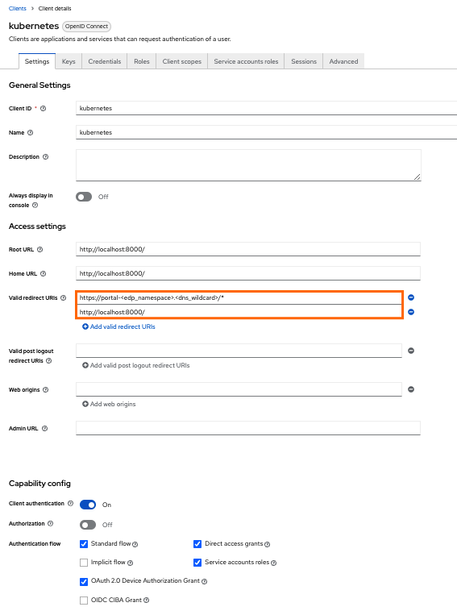

2. Configure the Keycloak client key in Kubernetes using the Kubernetes secrets or the [External Secrets Operator](../secrets-management/external-secrets-operator-integration.md):

    ```yaml
    apiVersion: v1
    kind: Secret
    metadata:
      name: keycloak-client-headlamp-secret
      namespace: edp
    type: Opaque
    stringData:
      clientSecret: <keycloak_client_secret_key>
    ```

3. Assign user to one or more groups in Keycloak.

## Integrate Portal With Kubernetes

Portal is integrated in Kubernetes in three steps:

1. Update the [values.yaml](../install-kuberocketci.md) file by enabling OIDC:

    :::note values.yaml

      ```yaml
      edp-headlamp:
        config:
          oidc:
            enabled: true
      ```

    :::

2. Navigate to Portal UI and log in by clicking the `Sign In` button:

    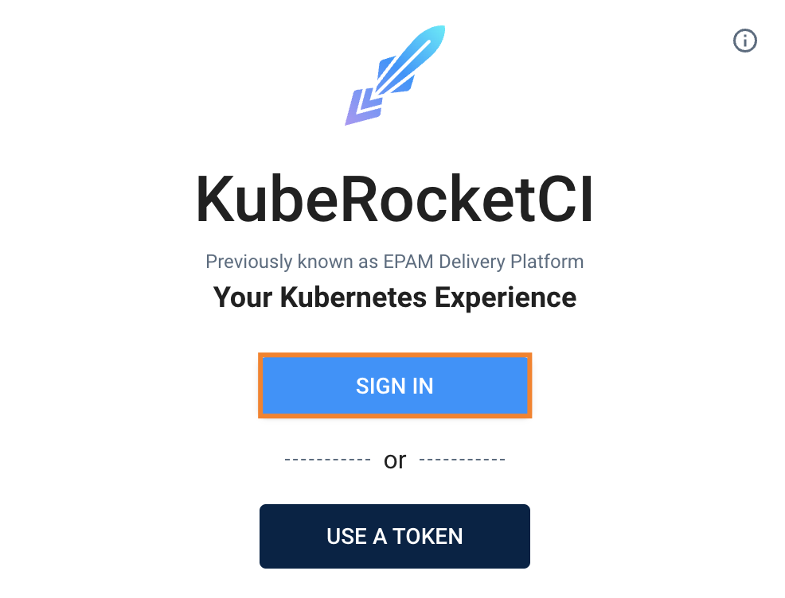

3. Upon logging in, specify the namespace for KubeRocketCI where platform is deployed by clicking the cluster settings link in the bottom left corner of the UI:

    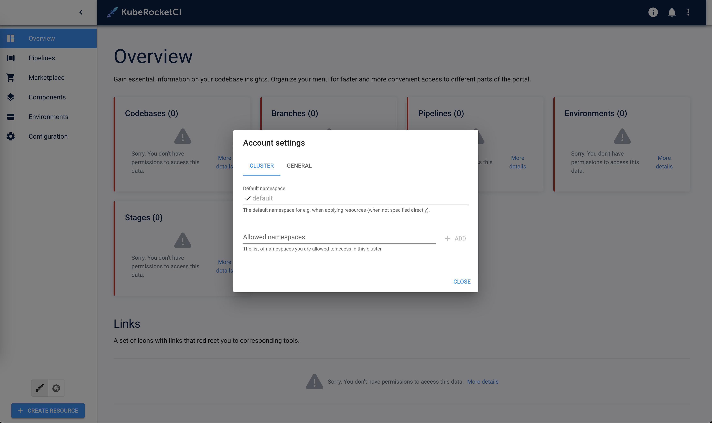

As a result, it is possible to control access and rights from the Keycloak endpoint.

## Configure User Profile Picture

To enhance account personalization, a profile picture can be configured in the Portal using Keycloak. This requires setting up the Keycloak client scope with the necessary user attributes.

Follow the steps below to configure the user profile picture in Keycloak:

1. Open the Keycloak admin console and navigate to the **Broker** realm. In the left sidebar menu, select **Client scopes** and choose the **profile** scope.

    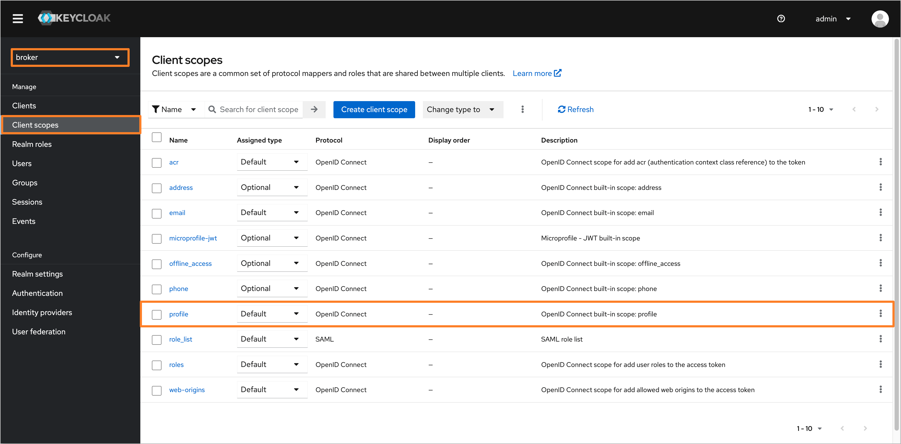

2. Navigate to the **Mappers** tab and ensure that the **picture** attribute is created. If the attribute is not present, click **Add mapper** button. In the dropdown menu, select **By configuration**.

    :::note
    If the **picture** user attribute is already present, skip to step 5.
    :::

    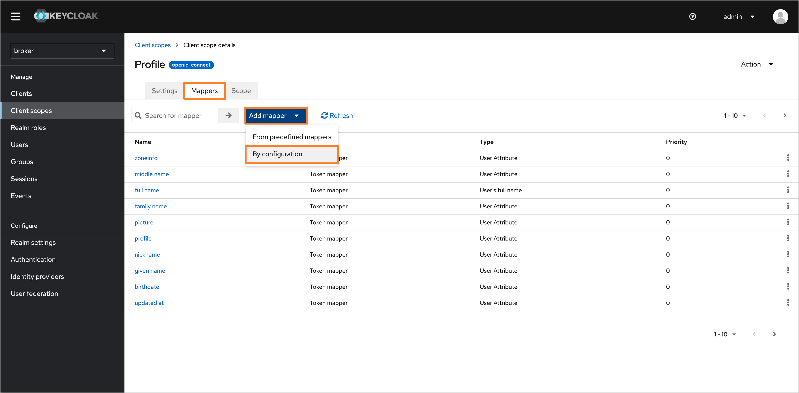

3. In the **Configure a new mapper** dialog, choose the **User Attribute** type.

    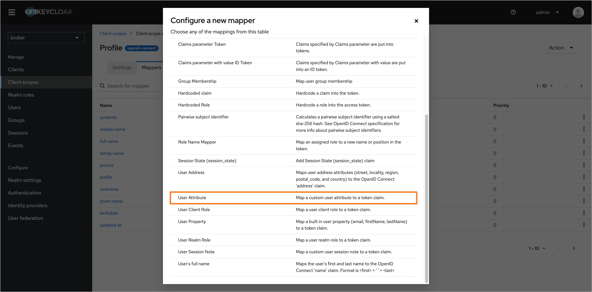

4. Fill in the following fields to configure the user attribute:

    - **Name**: `picture`
    - **User Attribute**: `picture`
    - **Token Claim Name**: `picture`
    - **Claim JSON Type**: `String`

    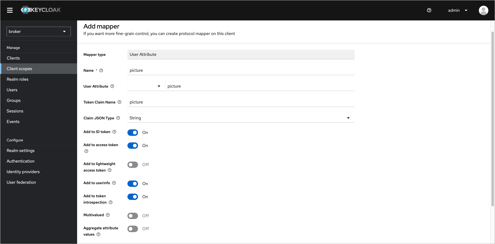

    Click **Save** to apply the changes.

5. After configuring the user attribute, navigate to the **Users** tab in the left sidebar menu and select the user you want to set a profile picture for.

    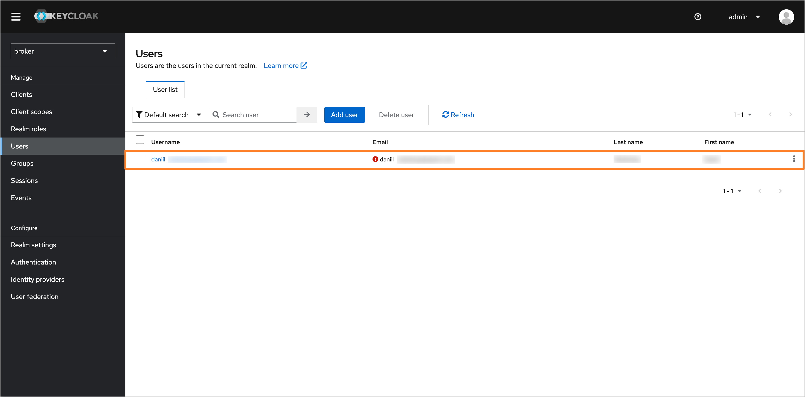

6. In the user profile, click **Attributes** and add the **picture** attribute with the URL of the desired profile picture.

    :::note
    The profile picture URL should refer to an image accessible via a public URL.
    :::

    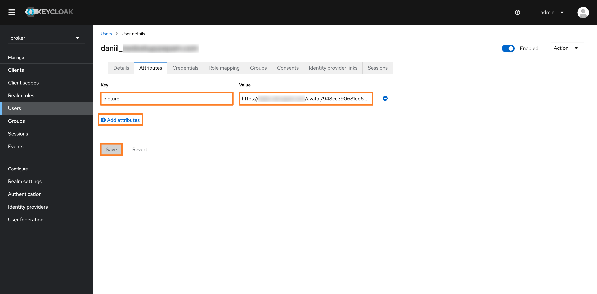

    Click **Save** to apply the changes.

7. After configuring the user profile picture in Keycloak, the profile picture will be displayed in the Portal UI.

    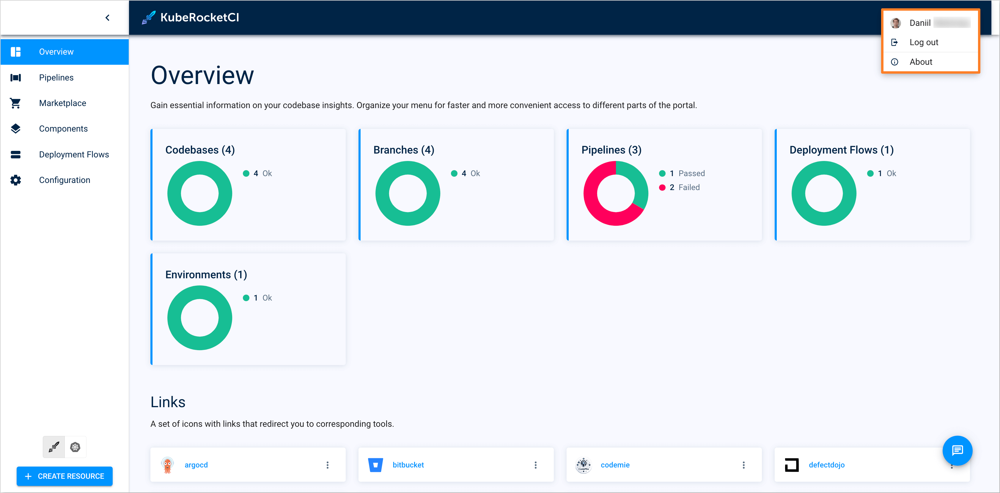

## Configure Default Namespace

After logging into the Portal, it is necessary to manually configure account settings like **Default namespace** and **Allowed namespaces**. To simplify this process, the `default_namespace` user attribute can be added to the user profile in Keycloak. This will ensure that the account settings are automatically configured during login.

Follow the steps below to configure the `default_namespace` user attribute in Keycloak:

1. Open the Keycloak admin console and navigate to the **Broker** realm. In the left sidebar menu, select **Client scopes** and choose the **profile** scope.

    

2. Navigate to the **Mappers** tab and click the **Add mapper** button. In the dropdown menu, select **By configuration**.

    

3. In the **Configure a new mapper** dialog, choose the **User Attribute** type.

    

4. Fill in the following fields to configure the user attribute:

    - **Name**: `default_namespace`
    - **User Attribute**: `default_namespace`
    - **Token Claim Name**: `default_namespace`
    - **Claim JSON Type**: `String`

    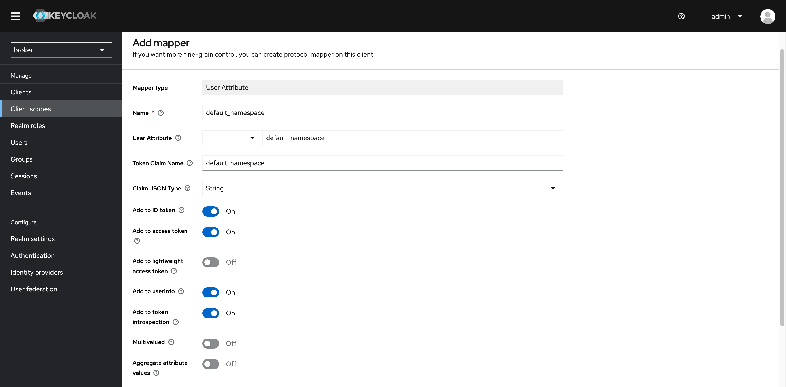

    Click **Save** to apply the changes.

5. After configuring the user attribute, navigate to the **Users** tab in the left sidebar menu and select the user you want to set a default namespace for.

    

6. In the user profile, click **Attributes** and add the **default_namespace** attribute with the name of the desired default namespace.

    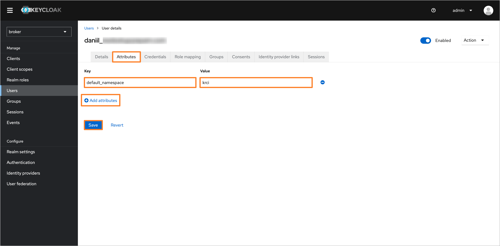

    Click **Save** to apply the changes.

7. After configuring the user attribute with the default namespace in Keycloak, the account settings, such as the **Default namespace** and **Allowed namespaces**, will be automatically configured during login.

    

## Changing the Lifespan of an Access Token

Change the Access Token Lifespan: go to your Keycloak and select *Openshift realm* > *Realm settings* > *Tokens* >
*Access Token Lifespan* > set a new value to the field and save this change.

By default, "Access Token Lifespan" value is 5 minutes.

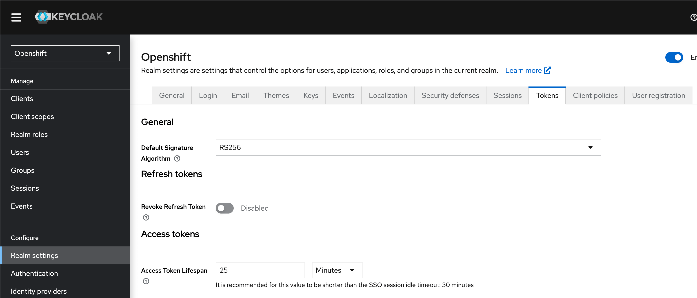

## Related Articles

* [EKS OIDC With Keycloak](configure-keycloak-oidc-eks.md)
* [External Secrets Operator](../secrets-management/external-secrets-operator-integration.md)
