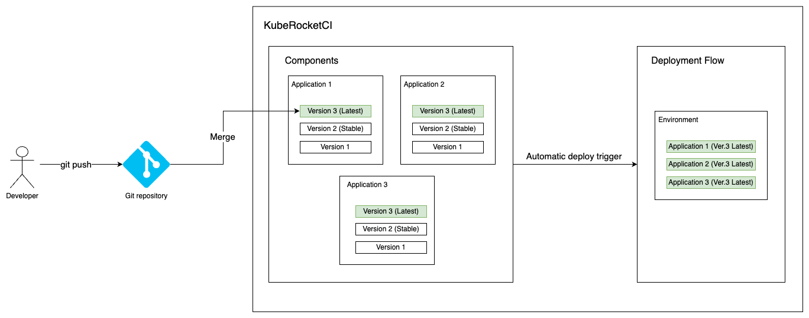
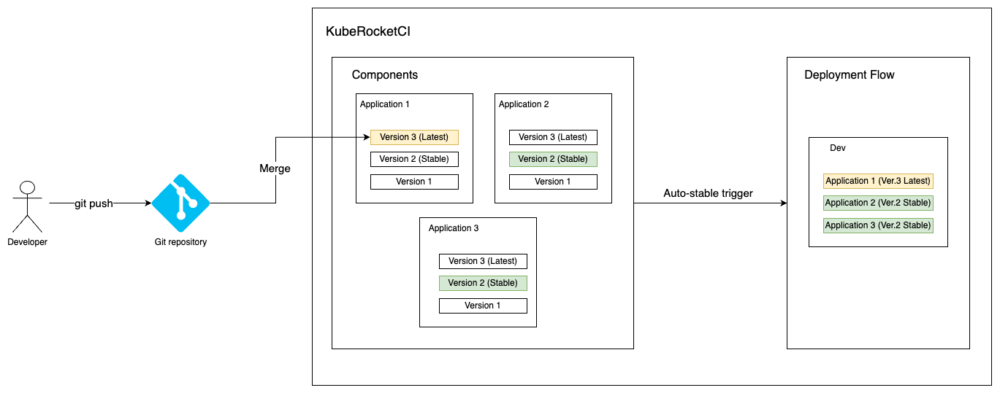
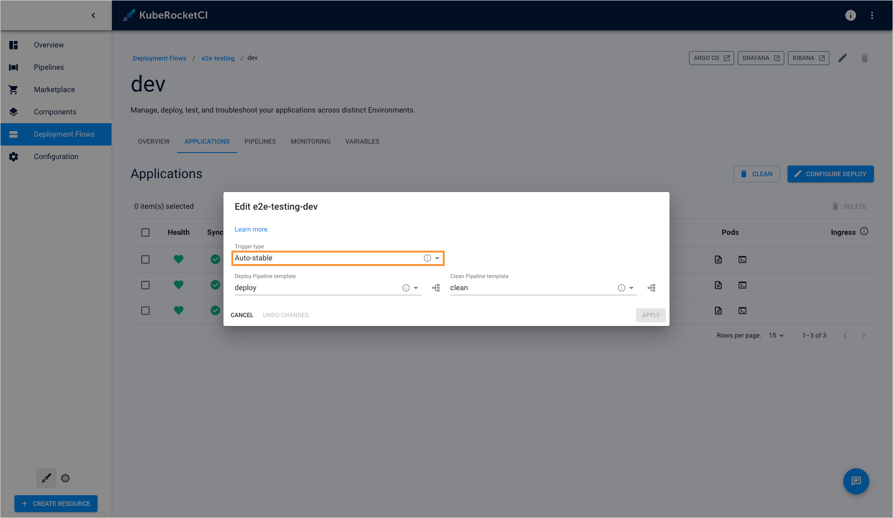
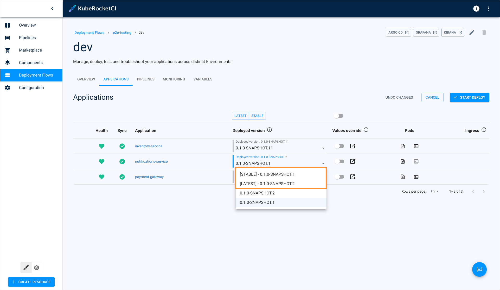
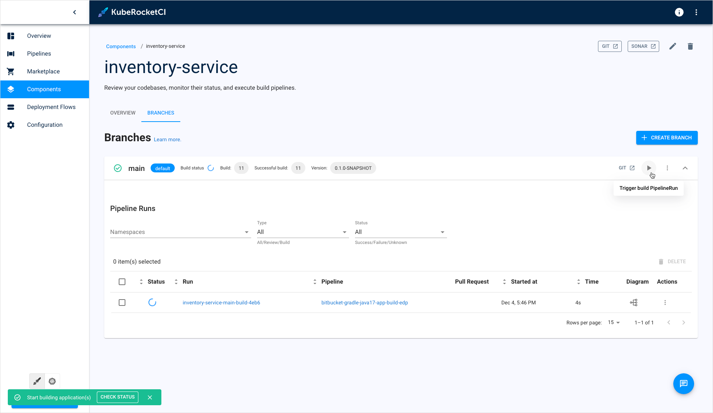
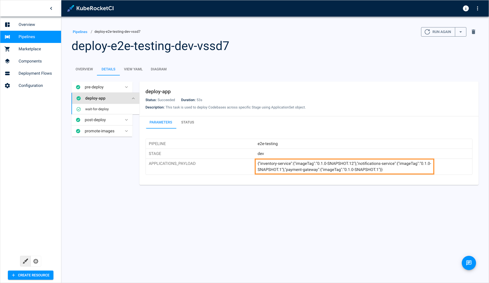

<!-- markdownlint-disable MD025 -->

# Deployment Strategies Overview

<head>
  <link rel="canonical" href="https://docs.kuberocketci.io/docs/operator-guide/cd/auto-stable-trigger-type" />
</head>

Deploying applications to production environments involves risks of downtime and service disruptions. To mitigate such issues and enhance stability, KubeRocketCI provides several deployment strategies.

## Deployment Strategies in KubeRocketCI

In KubeRocketCI, application deployment can be triggered once the new application version is released. Application deployment strategies are managed by the trigger type resource. There are three trigger types:

* **Manual**: Requires a user to manually initiate the deployment process after a new application version is ready.
* **Auto-deploy**: Automatically triggers the deployment pipeline as soon as a new application version is built, all the applications will deployed with latest version available.
* **Auto-stable**: This one is similar to **Auto-deploy** but features more complicated logic. In this trigger type, the newly released application version is deployed, whereas the rest of applications in the Environment will use the **Stable** image tag, even if they have an application image version marked as **Latest**. If there are no application images with the **Stable** tag available, the **Latest** application version will be used.

The diagram below illustrates how the **Auto-deploy** trigger type works:

  

As soon as a new application artifact is built, it is immediately deployed to the environment along with the rest of the applications using their latest versions.

In this strategy, if several application versions were built in a short period of time, only the latest of them will be deployed.

The diagram below illustrates how the **Auto-stable** trigger type works:

  

In contrast to the **Auto-deploy** trigger type, where deploy pipelines always deploy the latest application version, **Auto-stable** can safeguard application stability by preventing deployment of latest application version if this version wasn't unstable. If there are several build pipelines running at a time, they are placed in a queue and deployed consequently.

Understanding the difference between **Latest** and **Stable** tags is essential:

* **Latest**: Assigned to an application image as soon as a new version is built by developers and deployment process was initiated with this new application version. Application can have no tags if a new version is built but build pipeline wasn't completed successfully.
* **Stable**: The latest successfully deployed application. Application image gets the **Stable** tag when a new application image passes project's [quality gates](../../user-guide/autotest.md#add-autotest-as-a-quality-gate). Only one application image can be stable at the same time.

:::note
Each application can have only one **Latest** and one **Stable** version at a time. However, a single version can be marked as **Latest** and **Stable** at the same time. This typically occurs when a newly built version of the application passes all quality checks immediately after its release, making it both the most recent (**Latest**) and the verified stable (**Stable**) version.
:::

## Enable Auto-Stable Strategy

Enabling the **Auto-stable** trigger type necessitates proper Environment configuration.

### Prerequisites

Before proceeding, ensure you already have at least two [applications](../../user-guide/add-application.md) created and added into one [Environment](../../user-guide/manage-environments.md).

## Configure Deployment Flow

To enable the auto-stable deployment strategy, follow the steps below:

1. When creating/editing Environment, set the **auto-stable** trigger type:

  

2. Make sure you have an application with both **latest** and **stable** image tags:

  

3. Build one of your application that are included in the Environment:

  

4. View the deploy pipeline details to see that it deploys only stable application version:

  

  Note that **notifications-service** application, which has both both **Latest** and **Stable** images, was deployed with the stable version. While the application version 2 (latest) exists, it was deployed with the version 1 (stable).

## Related Articles

* [Manage Deployment Flows](../../user-guide/manage-environments.md)
* [Add Application](../../user-guide/add-application.md)
