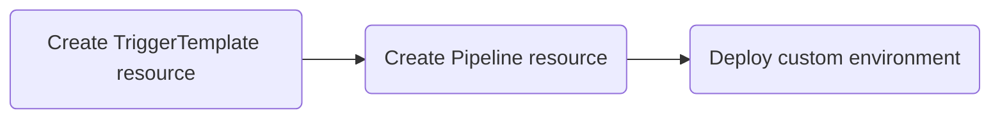
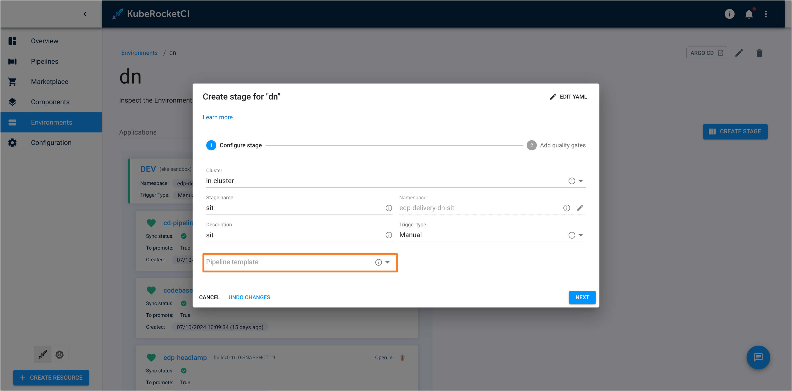

<!-- markdownlint-disable MD025 -->

# Customize Deploy Pipeline

<head>
  <link rel="canonical" href="https://docs.kuberocketci.io/docs/operator-guide/cd/customize-deploy-pipeline" />
</head>

When deploying applications into environments, it's important to automate both `pre-deployment` and `post-deployment` steps.

`Pre-deployment` procedures include essential tasks such as deploying databases, configuring specific software, and preparing the environment. Additionally, `post-deployment` procedures, such as testing, configuring, and removing old information from the environment, are crucial for ensuring the smooth operation of the deployed application. To facilitate these processes, the custom deployment feature is implemented in KubeRocketCI.

This page provides comprehensive guidelines on how to adjust the deployment logic to cater your needs.

<div style={{ display: 'flex', justifyContent: 'center' }}>
<iframe width="560" height="315" src="https://www.youtube.com/embed/eCQYjBblz9o" title="KubeRocketCI: Creating User-Defined Deploy and Clean Pipelines" frameborder="0" allow="accelerometer; autoplay; clipboard-write; encrypted-media; gyroscope; picture-in-picture" allowfullscreen="allowfullscreen"></iframe>
</div>

## Deploy Custom Pipeline

Overall, the custom pipeline creation involves the following steps:



1. **Create TriggerTemplate resource** -  On this step, create the `TriggerTemplate` custom resource that will appear as an option in the in the environment stage creation menu.
2. **Create Pipeline** - On this step, create custom resource called `Pipeline` that complements the trigger template. This resource contains all the tasks to perform within the custom pipeline.
3. **Integration** - On this step, you simply select your custom pipeline logic when creating a stage for your environment.

To customize your deployment pipeline, follow the steps below:

1. Create the `TriggerTemplate` custom resource by adding the following label:

    ```bash
    labels:
        app.edp.epam.com/pipelinetype: deploy
    ```

    :::note
      Please refer to the `TriggerTemplate` [example](https://github.com/epam/edp-tekton/blob/release/0.12/charts/pipelines-library/templates/triggers/cd/deploy.yaml) for more details. Remember to set your pipeline name in the `spec.resourcetemplates.spec.pipelineRef.name` [parameter](https://github.com/epam/edp-tekton/blob/release/0.12/charts/pipelines-library/templates/triggers/cd/deploy.yaml#L35).
    :::

2. Create the custom pipeline with your custom logic. Refer to the custom pipeline [example](https://github.com/epam/edp-tekton/blob/release/0.12/charts/pipelines-library/templates/triggers/cd/deploy.yaml) for more details.

3. Apply the created manifest files in the platform namespace (e.g., `krci`).

4. On the `Create stage` step on the KubeRocketCI portal, select the added trigger template in the `Pipeline template` section:

    

5. (Optional) In case you need to implement custom deployment in a remote cluster, do the following:

    * Connect the KubeRocketCI platform with the remote cluster if it is not integrated yet. Please refer to the [Add Cluster](../../user-guide/add-cluster.md) page for more details;
    * Mount the secret to the `run-quality-gate` resource by changing the [volumes](https://github.com/epam/edp-tekton/blob/release/0.16/charts/pipelines-library/templates/tasks/cd/run-quality-gate.yaml#L9) and [volumeMounts](https://github.com/epam/edp-tekton/blob/release/0.16/charts/pipelines-library/templates/tasks/cd/run-quality-gate.yaml#L40) sections;
    * Switch the [context](https://github.com/epam/edp-tekton/blob/release/0.16/charts/pipelines-library/templates/tasks/cd/run-quality-gate.yaml#L33) by specifying the appropriate kube config file of the `run-quality-gate` resource;
    * On the `Create stage` step on the KubeRocketCI portal, select the appropriate cluster in the `cluster` section:

      

## Related Articles

* [Add Cluster](../../user-guide/add-cluster.md)
* [Deploy Application With Custom Build Tool/Framework](../../use-cases/tekton-custom-pipelines.md)
* [Add Environment](../../user-guide/add-cd-pipeline.md)
