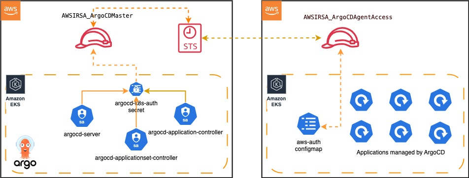

---

title: "Deploy Application In Remote Cluster via IRSA"
sidebar_label: "Deploy Application In Remote Cluster via IRSA"
description: "Learn how to securely deploy applications across AWS accounts using IRSA (IAM Roles for Service Accounts) in KubeRocketCI. Step-by-step guide for EKS cross-account access configuration."

---
<!-- markdownlint-disable MD025 -->

import Tabs from '@theme/Tabs';
import TabItem from '@theme/TabItem';

# Deploy Application In Remote Cluster via IRSA

<head>
  <link rel="canonical" href="https://docs.kuberocketci.io/docs/operator-guide/cd/deploy-application-in-remote-cluster-via-irsa" />
</head>

KubeRocketCI provides the capability to deploy applications securely using IAM Roles for Service Accounts (IRSA) in AWS EKS.
This integration enables Kubernetes pods to assume IAM roles for secure and temporary access to AWS resources, eliminating the need for long-lived credentials. While the deployment process is streamlined for most users, the platform also supports advanced configurations for custom permissions and role management, ensuring flexibility for more complex scenarios.

## Prerequisites

To start using this approach, you need to have OIDC (OpenID Connect) already configured for your EKS cluster. This setup allows Kubernetes service accounts to securely assume IAM roles. For your convenience, please follow our documentation [EKS OIDC With Keycloak](../auth/configure-keycloak-oidc-eks.md). This setup seamlessly integrates OIDC with minimal effort.

## Roles

Cross-account interaction is performed through IRSA with a two-tiered IAM role setup:

- In AWS Account A, the EKS cluster runs a kuberocketci cd-pipeline-operator with service account.
- This service account obtains temporary credentials through IRSA, which are associated with the `AWSIRSA_\{cluster_name\}_CDPipelineOperator` role.
- `AWSIRSA_\{cluster_name\}_CDPipelineOperator` can then assume the `AWSIRSA_\{cluster_name\}_CDPipelineAgent` role in AWS Account B.
- `AWSIRSA_\{cluster_name\}_CDPipelineAgent` configures the environment (Stage) by creating namespaces, generating service accounts, copying secrets, and preparing for deployment.

### Required IAM Roles and Policies for KRCI

Below is a Trust Policy for the initial IRSA role that the service account assumes:

<details>
<summary><b>View: AWSIRSA_\{cluster_name\}_CDPipelineOperator (AWS Account A)</b></summary>
```json
{
    "Version": "2012-10-17",
    "Statement": [
        {
            "Effect": "Allow",
            "Principal": {
                "Federated": "arn:aws:iam::<AWS_ACCOUNT_A_ID>:oidc-provider/oidc.eks.<AWS_REGION>.amazonaws.com/id/EXAMPLED539D4633E53DE1B71EXAMPLE"
            },
            "Action": "sts:AssumeRoleWithWebIdentity",
            "Condition": {
                "StringEquals": {
                    "oidc.eks.<AWS_REGION>.amazonaws.com/id/EXAMPLED539D4633E53DE1B71EXAMPLE:sub": [
                        "system:serviceaccount:krci:edp-cd-pipeline-operator"
                    ]
                }
            }
        },
        {
            "Effect": "Allow",
            "Principal": {
                "AWS": "arn:aws:iam::<AWS_ACCOUNT_A_ID>:AWSIRSA_{cluster_name}_CDPipelineOperator"
            },
            "Action": "sts:AssumeRole",
            "Condition": {}
        }
    ]
}
```
</details>

Below is a Policy that allows assuming roles in Account B:

<details>
<summary><b>View: AWSIRSA_\{cluster_name\}_CDPipelineAssume (AWS Account A)</b></summary>
```json
{
  "Version": "2012-10-17",
  "Statement": [
    {
      "Effect": "Allow",
      "Action": "sts:AssumeRole",
      "Resource": "arn:aws:iam::<AWS_ACCOUNT_B_ID>:role/AWSIRSA_{cluster_name}_CDPipelineAgent"
    }
  ]
}
```
</details>

Below is a Trust Policy that allows to control access to Account B resources:

<details>
<summary><b>View: AWSIRSA_\{cluster_name\}_CDPipelineAgent (AWS Account B)</b></summary>
```json
{
    "Version": "2012-10-17",
    "Statement": [
        {
            "Effect": "Allow",
            "Action": "sts:AssumeRole",
            "Resource": "arn:aws:iam::<AWS_ACCOUNT_A_ID>:role/AWSIRSA_{cluster_name}_CDPipelineOperator"
        }
    ]
}
```
</details>

Below is a Policy that defines permissions for deployments:

<details>
<summary><b>View: AWSIRSA_\{cluster_name\}_CDPipelineClusterAccess (AWS Account B)</b></summary>
```json
{
  "Version": "2012-10-17",
  "Statement": [
    {
      "Effect": "Allow",
      "Action": [
        "eks:DescribeCluster",
        "eks:ListClusters",
        "eks:AccessKubernetesApi"
      ],
      "Resource": "arn:aws:eks:<AWS_REGION>:<AWS_ACCOUNT_B_ID>:cluster/<cluster-name>"
    }
  ]
}
```
</details>

### Required IAM Roles and Policies for Argo CD Cross-Account Deployment

This section outlines the necessary IAM roles and policies required for Argo CD to manage Kubernetes clusters across AWS accounts securely. The setup follows AWS best practices by using IAM Roles for Service Accounts (IRSA) and cross-account access to limit privileges effectively.

This IAM role is used by Argo CD to authenticate via OIDC and assume required permissions:

  

IAM Policy for AWSIRSA_\{cluster_name}_ArgoCDMaster:

<details>
<summary><b>View: AWSIRSA_\{cluster_name\}_ArgoCDMaster (AWS Account A)</b></summary>

```json
{
    "Statement": [
        {
            "Action": "sts:AssumeRole",
            "Effect": "Allow",
            "Resource": [
                "arn:aws:iam::<AWS_ACCOUNT_B_ID>:role/AWSIRSA_{cluster_name}_ArgoCDAgentAccess"
            ]
        }
    ],
    "Version": "2012-10-17"
}
```
</details>

Trust Relationship for AWSIRSA_\{cluster_name}_ArgoCDMaster:

<details>
<summary><b>View: AWSIRSA_\{cluster_name\}_ArgoCDMasterClusterAccess (AWS Account A)</b></summary>
```json
{
    "Version": "2012-10-17",
    "Statement": [
        {
            "Effect": "Allow",
            "Principal": {
                "Federated": "arn:aws:iam::<AWS_ACCOUNT_A_ID>:oidc-provider/oidc.eks.<AWS_REGION>.amazonaws.com/id/EXAMPLED539D4633E53DE1B71EXAMPLE"
            },
            "Action": "sts:AssumeRoleWithWebIdentity",
            "Condition": {
                "StringLike": {
                    "oidc.eks.<AWS_REGION>.amazonaws.com/id/EXAMPLED539D4633E53DE1B71EXAMPLE:aud": "sts.amazonaws.com",
                    "oidc.eks.<AWS_REGION>.amazonaws.com/id/EXAMPLED539D4633E53DE1B71EXAMPLE:sub": [
                      "system:serviceaccount:argocd:argocd-application-controller",
                      "system:serviceaccount:argocd:argocd-applicationset-controller",
                      "system:serviceaccount:argocd:argocd-server"
                  ],
                }
            }
        }
    ]
}
```
</details>

IAM Policy for AWSIRSA_\{cluster_name}_ArgoCDAgentAccess:

<details>
<summary><b>View: AWSIRSA_\{cluster_name\}_ArgoCDAgentAccess (AWS Account B)</b></summary>
```json
{
    "Version": "2012-10-17",
    "Statement": [
        {
            "Effect": "Allow",
            "Action": [
                "eks:DescribeCluster",
                "eks:ListClusters",
                "eks:AccessKubernetesApi"
            ],
            "Resource": "arn:aws:eks:<AWS_REGION>:<AWS_ACCOUNT_B_ID>:cluster/<cluster-name>"
        }
    ]
}
```
</details>

Trust Relationship for AWSIRSA_\{cluster_name}_ArgoCDAgentAccess:

<details>
<summary><b>View: AWSIRSA_\{cluster_name\}_ArgoCDAssume (AWS Account B)</b></summary>
```json
{
    "Version": "2012-10-17",
    "Statement": [
        {
            "Effect": "Allow",
            "Action": "sts:AssumeRole",
            "Resource": "arn:aws:iam::<AWS_ACCOUNT_A_ID>:role/AWSIRSA_{cluster_name}_ArgoCDMaster"
        }
    ]
}
```
</details>

## Add Annotations to Service Accounts (Account A)

The next step is to add proper annotations to service accounts to grant permissions defined in the Roles.

### CD-Pipeline-Operator Service Account (Account A)

Add annotations to the Service Account of cd-pipeline-operator:

<Tabs
  defaultValue="values"
  values={[
    {label: 'Values.yaml', value: 'values'},
    {label: 'CLI', value: 'cli'},
    {label: 'Manifests', value: 'manifests'},
  ]}>

  <TabItem value="values">
    Update the `CD-Pipeline-Operator` configuration in [edp-install](https://github.com/epam/edp-install/blob/master/deploy-templates/values.yaml) repository to automatically add annotations to service account:

    ```yaml title="deploy-templates/values.yaml"
    cd-pipeline-operator:
      serviceAccount:
        annotations:
          eks.amazonaws.com/role-arn: "arn:aws:iam::<AWS_ACCOUNT_A_ID>:role/AWSIRSA_{cluster_name}_CDPipelineOperator"
    ```
  

  </TabItem>

  <TabItem value="cli">

  ```bash title="ServiceAccount: edp-cd-pipeline-operator"
  kubectl patch serviceaccount edp-cd-pipeline-operator -n krci \
    -p '{"metadata": {"annotations": {"eks.amazonaws.com/role-arn": "arn:aws:iam::<AWS_ACCOUNT_A_ID>:role/AWSIRSA_{cluster_name}_CDPipelineOperator"}}}'
  ```

  After applying annotations to service accounts, it is necessary to restart the corresponding deployments to ensure new pods are created with the updated IAM roles configuration. Use the following command:

  ```bash
  kubectl rollout restart deployment cd-pipeline-operator -n krci
  ```

  </TabItem>

  <TabItem value="manifests">

  ```yaml title="ServiceAccount: edp-cd-pipeline-operator"
  apiVersion: v1
  kind: ServiceAccount
  metadata:
    annotations:
      eks.amazonaws.com/role-arn: "arn:aws:iam::<AWS_ACCOUNT_A_ID>:role/AWSIRSA_{cluster_name}_CDPipelineOperator"
    name: edp-cd-pipeline-operator
    namespace: krci
  ```

  After applying annotations to service accounts, it is necessary to restart the corresponding deployments to ensure new pods are created with the updated IAM roles configuration. Use the following command:

  ```bash
  kubectl rollout restart deployment cd-pipeline-operator -n krci
  ```

  </TabItem>

</Tabs>


### Annotate Service Accounts in Kubernetes (Account A)

Annotate the service accounts in the account where Argo CD is located with the corresponding role ARN:

<Tabs
  defaultValue="values"
  values={[
  {label: 'Values.yaml', value: 'values'},
  {label: 'CLI', value: 'cli'},
  {label: 'Manifests', value: 'manifests'},
  ]}>

  <TabItem value="values">
    Update the Argo CD configuration in [Add-Ons](https://github.com/epam/edp-cluster-add-ons/blob/main/clusters/core/addons/argo-cd/values.yaml) repository to automatically add annotations to service accounts:

    ```yaml title="clusters/core/addons/argo-cd/values.yaml"
    argo-cd:
      controller:
        serviceAccount:
          # -- Annotations applied to created service account
          annotations:
            eks.amazonaws.com/role-arn: "arn:aws:iam::<AWS_ACCOUNT_A_ID>:role/AWSIRSA_{cluster_name}_ArgoCDMaster"

      server:
        serviceAccount:
          # -- Annotations applied to created service account
          annotations:
            eks.amazonaws.com/role-arn: "arn:aws:iam::<AWS_ACCOUNT_A_ID>:role/AWSIRSA_{cluster_name}_ArgoCDMaster"

      applicationSet:
        serviceAccount:
          # -- Annotations applied to created service account
          annotations:
            eks.amazonaws.com/role-arn: "arn:aws:iam::<AWS_ACCOUNT_A_ID>:role/AWSIRSA_{cluster_name}_ArgoCDMaster"

    ```
  </TabItem>

  <TabItem value="cli">

  ```bash title="ServiceAccount: argocd-application-controller"

  kubectl patch serviceaccount argocd-application-controller -n argocd \
    -p '{"metadata": {"annotations": {"eks.amazonaws.com/role-arn": "arn:aws:iam::<AWS_ACCOUNT_A_ID>:role/AWSIRSA_{cluster_name}_ArgoCDMaster"}}}'
  ```
  ```bash title="ServiceAccount: argocd-applicationset-controller"

  kubectl patch serviceaccount argocd-applicationset-controller -n argocd \
    -p '{"metadata": {"annotations": {"eks.amazonaws.com/role-arn": "arn:aws:iam::<AWS_ACCOUNT_A_ID>:role/AWSIRSA_{cluster_name}_ArgoCDMaster"}}}'
  ```
  ```bash title="ServiceAccount: argocd-server"

  kubectl patch serviceaccount argocd-server -n argocd \
    -p '{"metadata": {"annotations": {"eks.amazonaws.com/role-arn": "arn:aws:iam::<AWS_ACCOUNT_A_ID>:role/AWSIRSA_{cluster_name}_ArgoCDMaster"}}}'
  ```

  After applying annotations to service accounts, it is necessary to restart the corresponding workloads to ensure new pods are created with the updated IAM roles configuration. To do this, use the following commands:

  ```bash
  kubectl delete pod -l app.kubernetes.io/name=argocd-application-controller -n argocd

  kubectl delete pod -l app.kubernetes.io/name=argocd-applicationset-controller -n argocd

  kubectl delete pod -l app.kubernetes.io/name=argocd-server -n argocd
  ```

  </TabItem>

  <TabItem value="manifests">

  ```yaml title="ServiceAccount: argocd service accounts"
  apiVersion: v1
  kind: ServiceAccount
  metadata:
    annotations:
      eks.amazonaws.com/role-arn: "arn:aws:iam::<AWS_ACCOUNT_A_ID>:role/AWSIRSA_{cluster_name}_ArgoCDMaster"
    name: argocd-application-controller
    namespace: argocd
  ---
  apiVersion: v1
  kind: ServiceAccount
  metadata:
    annotations:
      eks.amazonaws.com/role-arn: "arn:aws:iam::<AWS_ACCOUNT_A_ID>:role/AWSIRSA_{cluster_name}_ArgoCDMaster"
    name: argocd-applicationset-controller
    namespace: argocd
  ---
  apiVersion: v1
  kind: ServiceAccount
  metadata:
    annotations:
      eks.amazonaws.com/role-arn: "arn:aws:iam::<AWS_ACCOUNT_A_ID>:role/AWSIRSA_{cluster_name}_ArgoCDMaster"
    name: argocd-server
    namespace: argocd
  ```


  After applying annotations to service accounts, it is necessary to restart the corresponding workloads to ensure new pods are created with the updated IAM roles configuration. To do this, use the following commands:

  ```bash
  kubectl delete pod -l app.kubernetes.io/name=argocd-application-controller -n argocd

  kubectl delete pod -l app.kubernetes.io/name=argocd-applicationset-controller -n argocd

  kubectl delete pod -l app.kubernetes.io/name=argocd-server -n argocd
  ```

  </TabItem>

</Tabs>


## Define Argo CD Project for Remote Clusters (Account A)

Update the Argo CD project to add a new destination for the remote cluster:

```yaml
apiVersion: argoproj.io/v1alpha1
kind: AppProject
metadata:
  name: krci
  namespace: argocd
spec:
  destinations:
    - namespace: krci-*
      server: https://EXAMPLED539D4633E53DE1B71EXAMPLE.gr7.<AWS_REGION_ACCOUNT_B>.eks.amazonaws.com
```

## Update aws_auth ConfigMap in Target Cluster (Account B)

Update the **aws_auth** ConfigMap in Target Cluster to access and operate in that Target Cluster:

<details>
<summary><b>View: aws-auth-configmap.yaml</b></summary>
```yaml
apiVersion: v1
kind: ConfigMap
metadata:
  name: aws-auth
  namespace: kube-system
data:
  mapRoles: |
    - groups:
      - "cd-pipeline-operator"
      rolearn: "arn:aws:iam::<AWS_ACCOUNT_B_ID>:role/AWSIRSA_{cluster_name}_CDPipelineAgent"
      username: "eksadminrole"
    - groups:
      - "system:masters"
      rolearn: "arn:aws:iam::<AWS_ACCOUNT_B_ID>:role/AWSIRSA_{cluster_name}_ArgoCDAgentAccess"
      username: "arn:aws:iam::<AWS_ACCOUNT_B_ID>:role/AWSIRSA_{cluster_name}_ArgoCDAgentAccess"
```
</details>

## Create ClusterRole and ClusterRoleBinding (Account B)

Associate the IAM Role with the **cd-pipeline-operator** group:


<Tabs
  defaultValue="kubernetes"
  values={[
  {label: 'Kubernetes RBAC', value: 'kubernetes'},
  {label: 'Capsule', value: 'capsule'},
  ]}>

  <TabItem value="kubernetes">

  <Tabs
    defaultValue="kubectl"
    values={[
    {label: 'kubectl', value: 'kubectl'},
    {label: 'Manifests', value: 'manifests'},
    ]}>

    <TabItem value="kubectl">
    ```bash title="ServiceAccount: argocd-application-controller"
    kubectl create clusterrole cd-pipeline-rolebinding-access \
      --verb=get,list,create,delete \
      --resource=rolebindings.rbac.authorization.k8s.io \
      --verb=create,get,list \
      --resource=secrets 


    kubectl create clusterrolebinding cd-pipeline-operator-rolebinding-access \
      --clusterrole=cd-pipeline-rolebinding-access \
      --group=cd-pipeline-operator
    ```
    </TabItem>

    <TabItem value="manifests">

    ```yaml title="cd-pipeline-rolebinding-access.yaml"
    apiVersion: rbac.authorization.k8s.io/v1
    kind: ClusterRole
    metadata:
      name: cd-pipeline-rolebinding-access
    rules:
      - verbs:
          - get
          - list
          - create
          - delete
        apiGroups:
          - rbac.authorization.k8s.io
        resources:
          - rolebindings
      - verbs:
          - create
          - get
          - list
        apiGroups:
          - ''
        resources:
          - secrets
    ```

    ```yaml title="cd-pipeline-operator-rolebinding-access.yaml"
    apiVersion: rbac.authorization.k8s.io/v1
    kind: ClusterRoleBinding
    metadata:
      name: cd-pipeline-operator-rolebinding-access
    subjects:
      - kind: Group
        apiGroup: rbac.authorization.k8s.io
        name: cd-pipeline-operator
    roleRef:
      apiGroup: rbac.authorization.k8s.io
      kind: ClusterRole
      name: cd-pipeline-rolebinding-access
    ```
    </TabItem>

  </Tabs>

  </TabItem>

  <TabItem value="capsule">

  ```yaml title="Capsule configuration"
  apiVersion: capsule.clastix.io/v1beta2
  kind: CapsuleConfiguration
  metadata:
    name: default
  spec:
    userGroups:
      - capsule.clastix.io
      - cd-pipeline-operator
  ```

  ```yaml title="Tenant configuration"
  apiVersion: capsule.clastix.io/v1beta2
  kind: Tenant
  metadata:
    name: krci
  spec:
    owners:
      - clusterRoles:
          - admin
          - capsule-namespace-deleter
        kind: Group
        name: cd-pipeline-operator
  ```
  </TabItem>

</Tabs>

## Next Steps

By completing all the steps in this documentation, you will obtain a token for integration with the Kubernetes cluster.
The next step is to configure the cluster integration with KubeRocketCI, as described in the documentation [Add Cluster](../../user-guide/add-cluster.md).

## Related Articles

* [Argo CD Integration](argocd-integration.md)
* [Add Cluster](../../user-guide/add-cluster.md)
* [Add Application](../../user-guide/add-application.md)
* [Add CD Pipeline](../../user-guide/add-cd-pipeline.md)
