### Deploy RPM Packages

KubeRocketCI can use two types of deployment packages: Helm chart and RPM packages. While the Helm chart is the default deployment package in KubeRocketCI, using RPM packages is beneficial for specific Linux distributions, such as Oracle, Fedora, openSUSE, and others where these packages are supported and widespread. To learn more about RPM packages, refer to the official [documentation](https://docs.redhat.com/en/documentation/red_hat_enterprise_linux/7/html/rpm_packaging_guide/getting-started-with-rpm-packaging#introduction-to-rpm-packaging_getting-started-with-rpm-packaging).

In KubeRocketCI, RPM support allows you to collect applications, store them as Nexus artifacts, and deploy them using the [Ansible](https://docs.ansible.com/ansible/latest/index.html) tool. RPM package support is implemented using two approaches:

**Default approach**: This approach involves configuring deployments using a GitOps repository and Kubernetes secrets.
**AWX approach**: This approach involves deploying applications using the [AWX](https://ansible.readthedocs.io/projects/awx/en/latest/) tool.

## Default Approach

The first approach to using RPM packages is the default approach. This approach is considered more complicated but efficient.

### Integration Flow

Default approach involves the following steps:


Here is a breakdown of the scheme above:

1. **Onboard GitOps repository**: GitOps repository is used to store pre-deploy information (such as dependencies) and Ansible configuration.
2. **Create GitOps repository secret**: Repository secret is required for downloading applications to your workloads.
3. **Create host secret**: Host secret is necessary for deploy pipelines to access your workloads.
4. **Create application**: Once all the system resources are created, proceed with creating application in KubeRocketCI portal.

:::note
  The **pre-deploy.yml** file will take affect only if the **Values override** option is enabled when deploying application.
:::

By completing these steps, you will be able to add, store, and deploy RPM applications.

To set up RPM integration, follow the steps below:

1. Open the KubeRocketCI portal. Navigate to **Configuration** -> **Deployment** -> **GitOps**:

  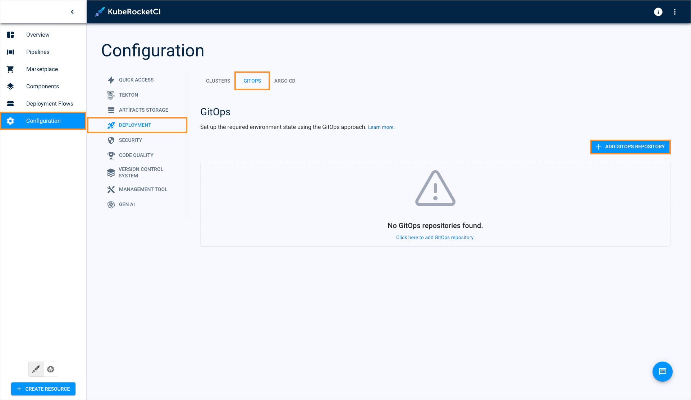

2. Specify the GitOps repository in the **username/repository_name** format:

  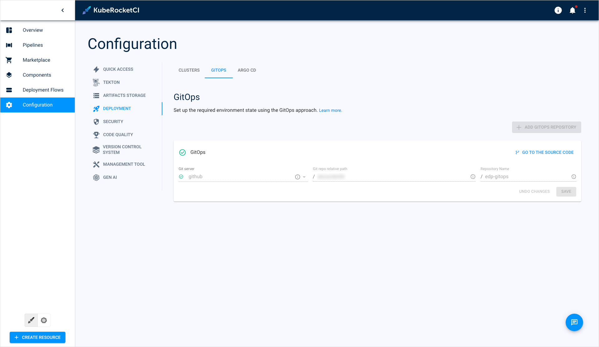

3. Create and apply the secret for the GitOps repository by running the command below. Specify your SSH key path, Git account, and repository name:

```bash
kubectl apply -f - <<EOF
apiVersion: v1
kind: Secret
metadata:
  name: cd-ansible-gitops-key
  namespace: <krci>
data:
  id_rsa: $(cat /path/to/repo_id_rsa | base64 | tr -d '\n')
  url: $(echo -n "git@github.com:edp-robot/ansible-gitops.git" | base64 | tr -d '\n')
type: Opaque
EOF
```

4. Create and apply the secret for the hosts by running the command below. Don't forget to specify your SSH key path:

```bash
kubectl apply -f - <<EOF
apiVersion: v1
kind: Secret
metadata:
  name: cd-ansible-ssh-key
  namespace: <krci>
data:
  id_rsa: $(cat /path/to/instance_id_rsa | base64 | tr -d '\n')
type: Opaque
EOF
```

5. When [creating codebases](../../user-guide/add-application.md), in the **Deployment option** field, select the **rpm-package** option:

  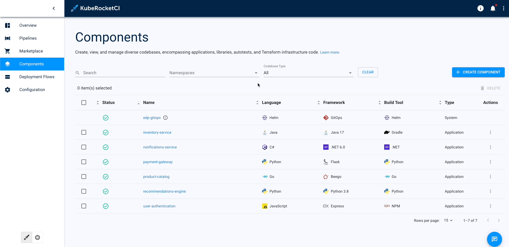

6. When [creating](../../user-guide/manage-environments.md#add-a-new-environment) or [editing](../../user-guide/manage-environments.md#edit-environment) environments, in the **Deploy pipeline template** field, select **deploy-ansible**:

  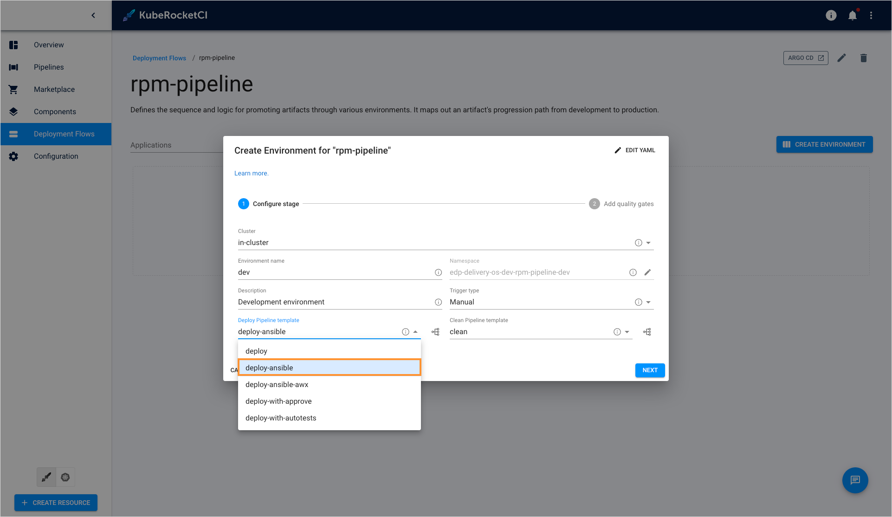

### GitOps Repository Structure

Below is a structure of a GitOps repository designed for deploying RPM packages:

```bash
nexus.repo
inventory.ini
pre-deploy.yml
├── web
│   ├── dev
│   │   ├── nano
│   │   │   ├── 01_playbook.yml
│   │   │   └── 02_playbook.yml
│   │   └── atop
│   │       ├── 01_playbook.yml
│   │       └── 02_playbook.yml
│   ├── qa
│   │   ├── nano
│   │   │   ├── 01_playbook.yml
│   │   │   └── 02_playbook.yml
│   │   └── atop
│   │       ├── 01_playbook.yml
│   │       └── 02_playbook.yml
│   └── prod
│       ├── nano
│       │   ├── 01_playbook.yml
│       │   └── 02_playbook.yml
│       └── atop
│           ├── 01_playbook.yml
│           └── 02_playbook.yml
└── db
    ├── dev
    │   ├── nano
    │   │   ├── 01_playbook.yml
    │   │   └── 02_playbook.yml
    │   └── atop
    │       ├── 01_playbook.yml
    │       ├── 02_playbook.yml
    │       └── 03_playbook.yml
    ├── qa
    │   ├── nano
    │   │   ├── 01_playbook.yml
    │   │   ├── 02_playbook.yml
    │   └── atop
    │       ├── 01_playbook.yml
    │       ├── 02_playbook.yml
    │       └── 03_playbook.yml
    └── prod
        ├── mysql
        │   ├── 01_playbook.yml
        │   └── 02_playbook.yml
        └── cc
            ├── 01_playbook.yml
            ├── 02_playbook.yml
            └── 03_playbook.yml
```

Below is a breakdown of the GitOps repository structure:

- **nexus.repo**: Contains the configuration for connecting to Nexus as a repository on the instances.
- **inventory.ini**: Contains groups with instances, user credentials, and additional settings for connecting to the instances.
- **pre-deploy.yml**: Contains general playbooks that contain a set of tasks that must be done before starting work, such as copying and connecting Nexus config, installing additional packages depending on the group.

The rest of the files are example of deployment configurations. To spread these configuration files between Deployment Flows and Environments, files comply to the following hierarchy:

```bash
\<deployment-flow-name\>/\<environment-name\>/\<package-name\>/01_\<file\>.yml
```

For example, the **web/qa/nano/01_copy-file.yml** file relates to the **nano** application that belongs to the **qa** Environment, which in turn belongs to the **web** Deployment Flow. The file name must begin with its serial number (e.g., 01, 02, 03, ...), followed by an underscore, the rest of the file name, and the file extension.

## AWX Approach

The second approach to manage RPM packages is AWX-based. It features user interface and considered more simple.

### AWX Integration Flow

Default approach involves the following steps:

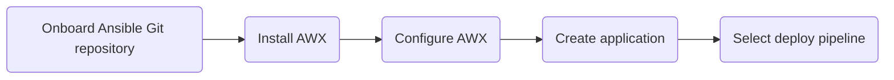

Here is a breakdown of the scheme above:

1. **Onboard Ansible Git repository**: Create an Ansible Git repository that contains playbooks that will be used in deploy pipelines.
2. **Install AWX**: Set Up AWX application. We recommend using [cluster add-ons](../add-ons-overview.md) to install it.
3. **Configure AWX**: Once AWX tool is installed, open its UI to create AWX Project, Inventory, Templates, etc.
4. **Create application**: [Add your application](../../user-guide/add-application.md) to KubeRocketCI as an RPM package.
5. **Select deploy pipeline**: Choose a specific deploy pipeline when creating/editing an environment to deploy RPM packages.

### AWX Integration

AWX Integration implies creating a Git repository, installing AWX and configuring it via UI.

### AWX Integration Prerequisites

Ensure that External Secrets Operator is [installed](../secrets-management/install-external-secrets-operator.md) and [configured](../secrets-management/external-secrets-operator-integration.md) properly.

### AWX Integration Procedure

To set up RPM integration using AWX tool, follow the steps below. By completing these steps, you will be able to add, store, and deploy RPM applications:

1. Onboard Ansible Git repository where you will store your Ansible configuration files. Below is a structure of an Ansible Git repository designed for deploying RPM packages:

  ```bash
  package-install.yaml
  ├── roles
      ├── pre-deploy
      │   ├── defaults
      │   ├── handlers
      │   ├── meta
      │   ├── tasks
      │   ├── vars
      │   ├── files
      │   │   └── nexus.repo
      │   └── README.md
      ├── package-install
      │   ├── defaults
      │   ├── handlers
      │   ├── meta
      │   ├── tasks
      │   ├── vars
      │   └── README.md
      ├── package-install
      │   ├── defaults
      │   ├── handlers
      │   ├── meta
      │   ├── tasks
      │   ├── vars
      │   └── README.md
      └── test-app-dev-web
          ├── defaults
          ├── handlers
          ├── meta
          ├── tasks
          ├── vars
          └── README.md
  ```

  Here is a breakdown of the scheme above:

  1. **package-install.yaml**: This is the main file that refers to playbooks located in the **roles** directory.
  2. **roles**: This directory contains all the Ansible roles that will be executed in deploy pipeline.
  3. **pre-deploy**: This is the first role the **package-install.yaml** file refers to. It connects to Nexus storage to interact with the application. You need to specify the required parameters in the **\<repo-name\>/roles/pre-deploy/files/nexus.repo** file.
  4. **package-install**: This role contains the playbooks that install all the dependencies to AWS EC2 instances.
  5. **test-app-dev-web**: This role contains the application playbooks, named according to the **\<codebase-name\>-\<deployment-flow-name\>-\<environment-name\>** convention. It will be executed only if the **Values override** parameter is set to **true** in the Deployment Flow during the component deployment process.

2. Install AWX via [cluster add-ons](https://github.com/epam/edp-cluster-add-ons):

  a. Create your private repository based on the [cluster add-ons](https://github.com/epam/edp-cluster-add-ons) fork.

  b. In the **chart/clusters/\<cluster_name\>/custom/awx-operator/values.yaml** file, specify hostname, secretName. OIDC mechanism is optional.

  c. In the **clusters/\<cluster_name\>/custom/awx-operator/templates/external-secrets/serviceaccount.yaml** file, specify the AWS IAM role with the access to the AWS Parameter Store service.

  d. In the **clusters/\<cluster_name\>/apps/values.yaml** file, enable the AWX operator:

  ```bash
  awx-operator:
    createNamespace: true
    enable: true
  ```

  e. Synchronize your state in Argo CD. Refer to the [README.md](https://github.com/epam/edp-cluster-add-ons/blob/main/README.md) file for more details.

3. Configure AWX via UI:

  a. Once AWX operator is deployed, navigate to its UI using the hostname you specified earlier:

    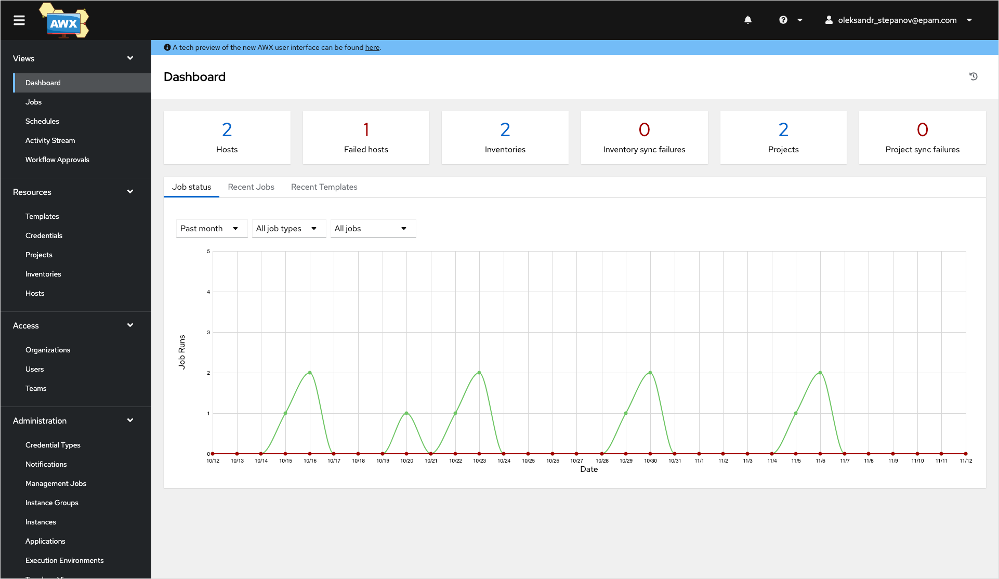

  b. (Optional) Configure OIDC. Navigate to **Settings** -> **Generic OIDC settings** and specify the required fields:

  * **OIDC Key**: Enter **awx**;
  * **OIDC Secret**: This is the client secret data taken from the secret you specified in the **eso.secretName** field of the **chart/clusters/\<cluster_name\>/custom/awx-operator/values.yaml** file;
  * **URL**: Specify the Keycloak realm URL.

    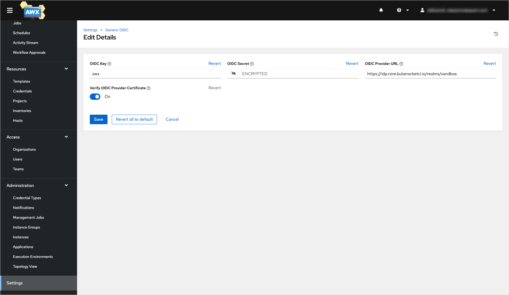

  c. Navigate to **Resources** -> **Credentials** and create two credentials:

    **For Git repository**: These credentials of the **Source Control** type must contain the SSH key you provided your Ansible Git repo with:

    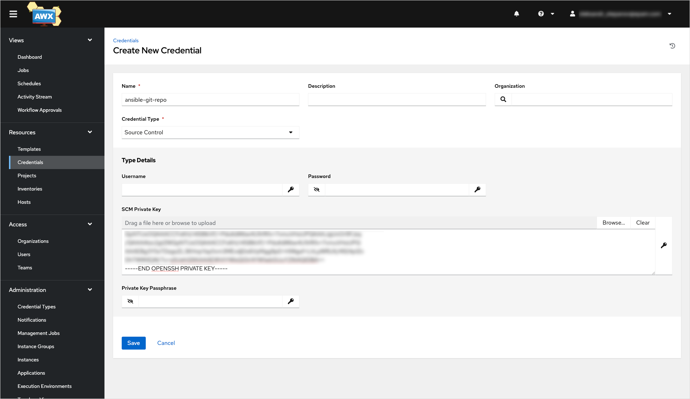

    **For AWS instances**: These credentials of the **Machine** type must contain the SSH key that grants access to your AWS EC2 instances:

    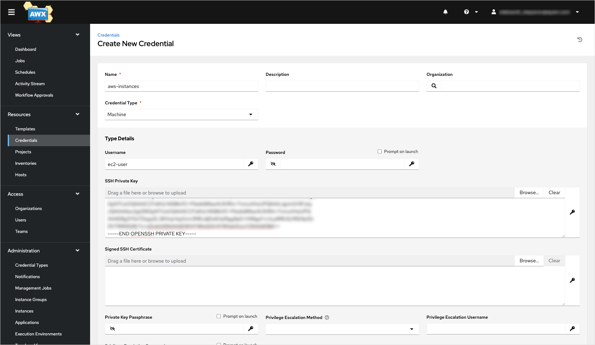

  d. Navigate to **Resources** -> **Project** and create Ansible Project that with your Git repository you created at the beginning of the integration:

    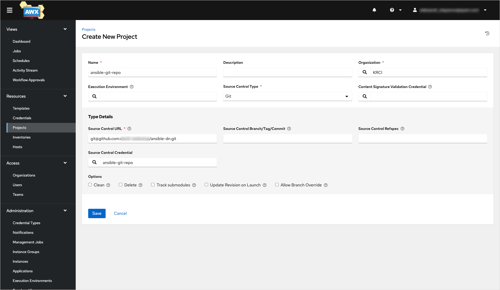

  e. Navigate to **Resources** -> **Inventories** and create an inventory using the **Add inventory** option:

    

  f. Navigate to **Resources** -> **Hosts** and add your hosts' IP addresses:

    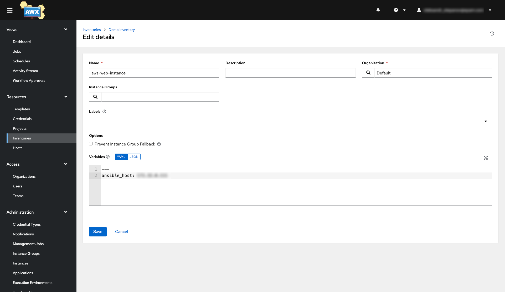

  g. Navigate to **Resources** -> **Templates**. Create job template called **package-install** as follows:

    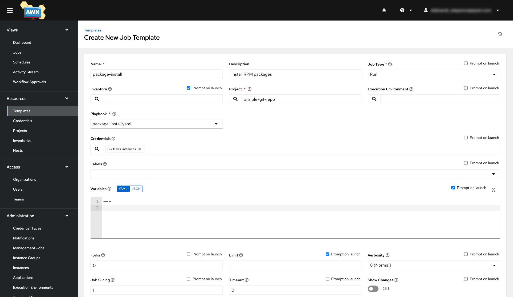

:::note
  Don't forget to select the **Prompt on launch** checkbox for **inventory**, **limit**, and **variables** fields.
:::

4. Create application with the **rpm-package** deployment option. Refer to the [Add Application](../../user-guide/add-application.md) page for more details:

  

5. When [creating environments](../../user-guide/manage-environments.md#add-a-new-environment), in the **Deploy pipeline template** field, select **deploy-ansible-awx**:

  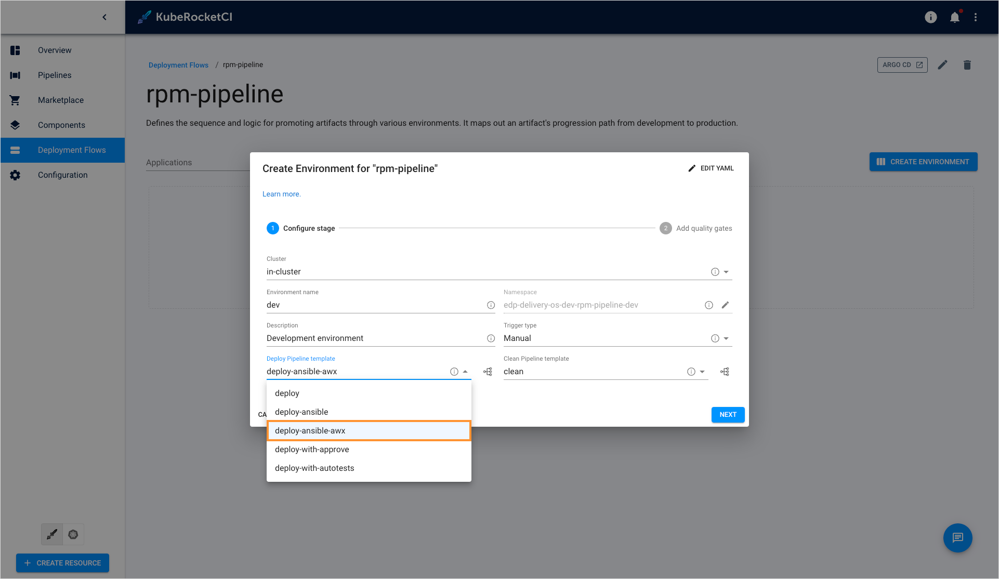

6. (Optional) When deploying application, enable the **Values override** option to apply configuration from the Ansible Git repository to be executed specifically for this component:

  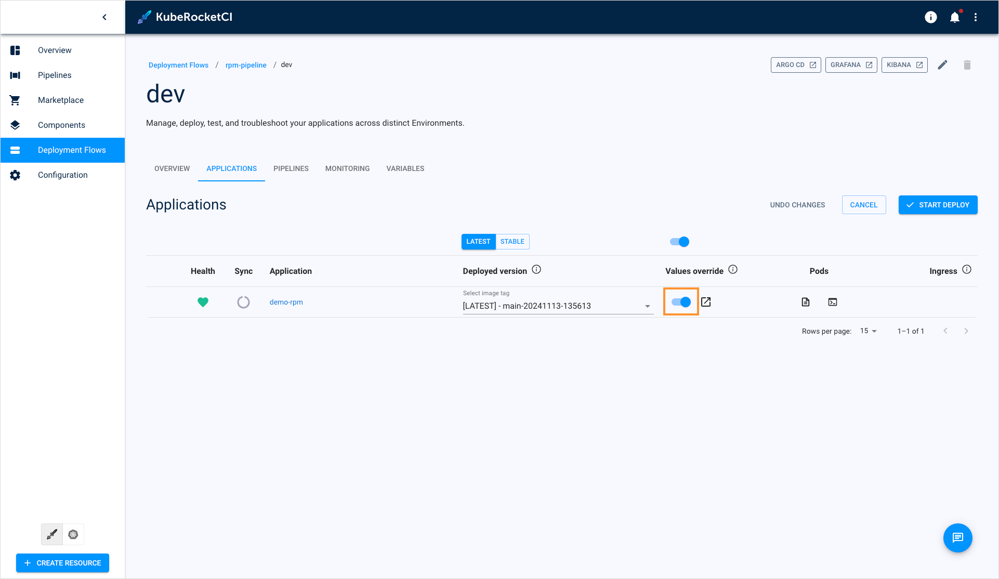

## Related Articles

* [Customize Deploy Pipeline](../../operator-guide/cd/customize-deploy-pipeline.md)
* [Add Deployment Flow](../../user-guide/add-cd-pipeline.md)
* [Manage Deployment Flows](../../user-guide/manage-environments.md)
* [Add Application](../../user-guide/add-application.md)
