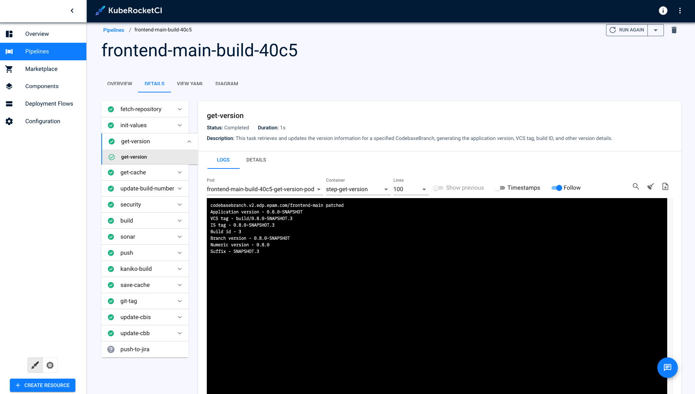
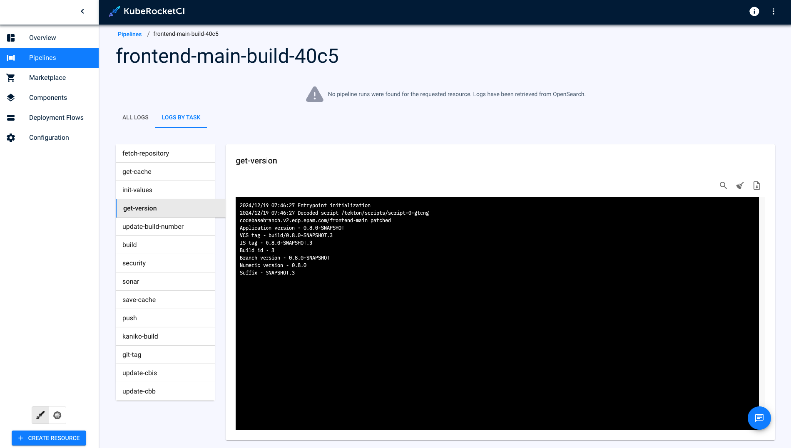

import Tabs from '@theme/Tabs';
import TabItem from '@theme/TabItem';

# Long Storage Logs For Tekton

This guide provides step-by-step instructions for configuring long-term log storage for Tekton. The primary issue addressed in this guide is that Tekton loses access to pipeline logs when associated resources are deleted. By following the instructions, you will ensure that logs are preserved and remain accessible in the KubeRocketCI UI, even after the deletion of Tekton pipeline resources.

## Configuration

To configure long-term log storage, follow these steps:

1. Install and Configure [OpenSearch](https://OpenSearch.org/) using [add-ons approach](https://github.com/epam/edp-cluster-add-ons/tree/main/clusters/core/addons/OpenSearch) or manually.

2. Install Krakend using the [add-ons approach](https://github.com/epam/edp-cluster-add-ons/tree/main/clusters/core/addons/krakend). Once installed, configure Krakend to ensure proper log retrieval and API handling. For detailed setup and configuration guidelines, refer to the [KrakenD Integration](../extensions/krakend.md).

Now, even after the deletion of pods or PipelineRuns, information about all executed tasks and their logs will remain accessible within the KubeRocketCI console.

    <Tabs
      defaultValue="default"
      values={[
        {label: 'Default Logs', value: 'default'},
        {label: 'Long-Term Logs', value: 'long-term'}
      ]}>

      <TabItem value="default">
        
      </TabItem>
 
      <TabItem value="long-term">
        
      </TabItem>
    </Tabs>

## Related Articles

* [Install Tekton](../install-tekton.md)
* [Install KubeRocketCI](../install-kuberocketci.md)
