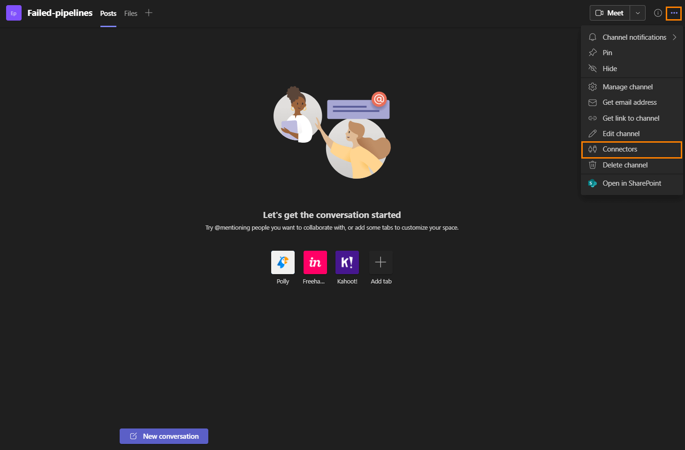
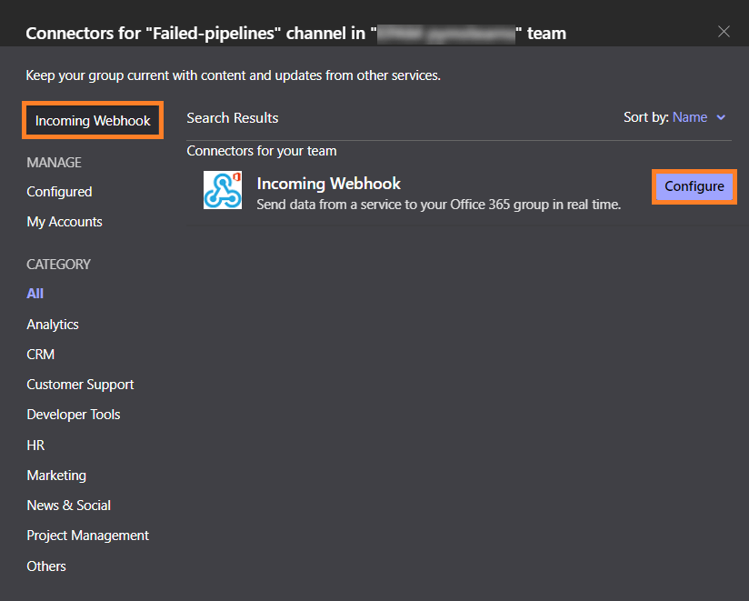
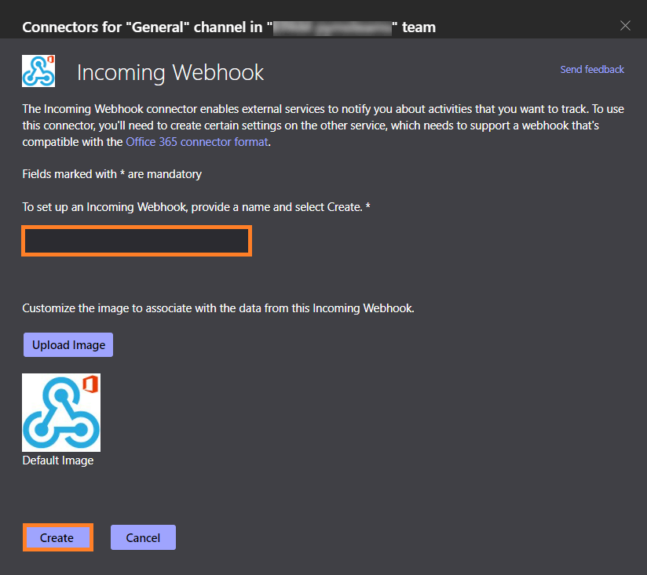
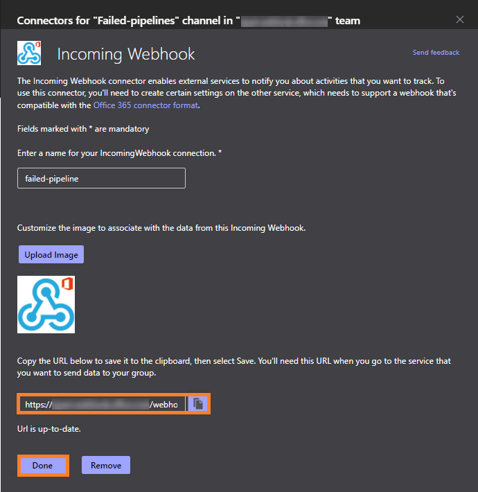

<!-- markdownlint-disable MD025 -->

# Microsoft Teams Notification

<head>
  <link rel="canonical" href="https://docs.kuberocketci.io/docs/operator-guide/ci/notification-msteams" />
</head>

This section describes how to set up and add notification status to Tekton pipelines by sending pipeline status to the Microsoft Teams channel.

## Create Incoming WebHook

To create a link to Incoming Webhook for the Microsoft Teams channel, follow the steps below:

1. Open the channel which will be receiving notifications and click the `•••` button from the upper-right corner. Select **Connectors** in the dropdown menu:

    

2. In the search field, type **Incoming Webhook** and click **Configure**:
    

3. Provide a name and upload an image for the webhook if necessary. Click **Create**:
    

4. Copy and save the unique `WebHookURL` presented in the dialog. Click `Done`:
    

5. Create a secret with the `<WebHookURL>` within the krci namespace.

    ```yaml
    kubectl -n krci create secret generic microsoft-teams-webhook-url-secret \
    --from-literal=url=<webhookURL>
    ```

6. Add the notification task to the pipeline and add the code below in `final-block` in the pipeline and save:

    ```yaml
    {{ include "send-to-microsoft-teams-build" . | nindent 4 }}
    ```

## Customize Notification Message

To make notification message informative, relevant text should be added to the message. Here are the steps to implement it:

1. Create a new pipeline with a unique name or modify your custom pipeline created before.

2. Add the task below in the `finally` block with a unique name. Edit the `params.message` value if necessary:

:::note Task send-to-microsoft-teams

  ```yaml
  - name: microsoft-teams-pipeline-status-notification-failed
    params:
    - name: webhook-url-secret
      value: microsoft-teams-webhook-url-secret
    - name: webhook-url-secret-key
      value: url
    - name: message
      value: >-
        Build Failed project: $(params.CODEBASE_NAME)<br /> branch: $(params.git-source-revision)<br /> pipeline: <a href=$(params.pipelineUrl)>$(context.pipelineRun.name)</a><br /> commit message: $(params.COMMIT_MESSAGE)
    taskRef:
      kind: Task
      name: send-to-microsoft-teams
    when:
    - input: $(tasks.status)
      operator: in
      values:
      - Failed
      - PipelineRunTimeout
  ```

:::

After customization, the following message is supposed to appear in the channel when failing pipelines:

  

## Related Articles

* [Install KubeRocketCI](../install-kuberocketci.md)
* [Install Tekton](../install-tekton.md)
