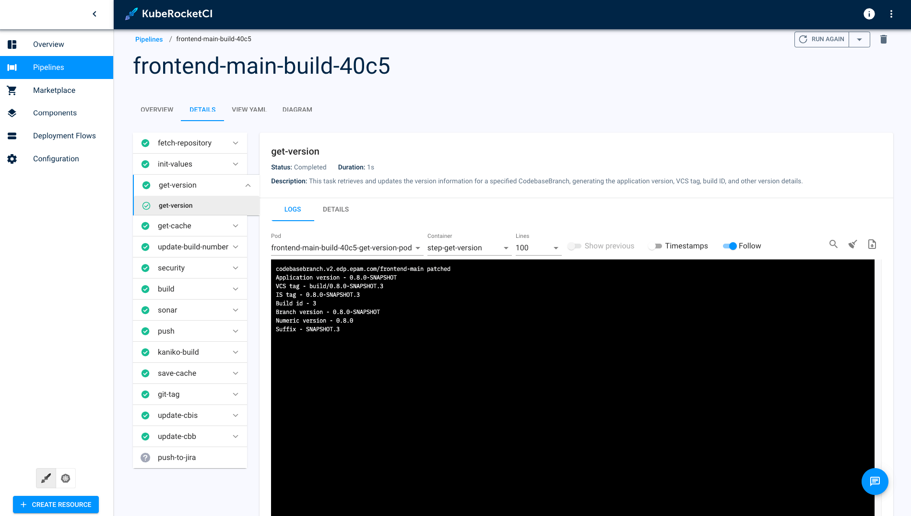
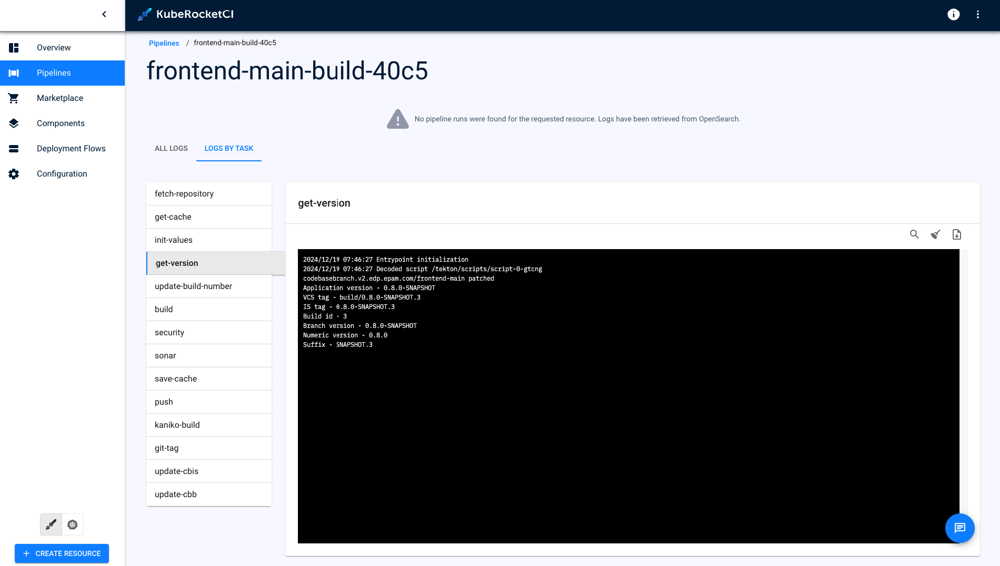

import Tabs from '@theme/Tabs';
import TabItem from '@theme/TabItem';

# Tekton Long-Term Log Storage

This guide provides detailed instructions for setting up long-term log storage in Tekton. Without this configuration, Tekton pipeline logs are lost when associated resources are deleted. By following the steps in this guide, you can ensure that logs are preserved and remain accessible via the KubeRocketCI User Interface (UI), even after Tekton pipeline resources are removed.

## Configuration

To configure long-term log storage, follow these steps:

1. Install and configure [OpenSearch](https://OpenSearch.org/) using the [add-ons approach](https://github.com/epam/edp-cluster-add-ons/tree/main/clusters/core/addons/OpenSearch) or manually.

2. Install KrakenD using the [add-ons approach](https://github.com/epam/edp-cluster-add-ons/tree/main/clusters/core/addons/krakend). Once installed, configure Krakend to ensure proper log retrieval and API handling. For detailed setup and configuration guidelines, refer to the [KrakenD Integration](../extensions/krakend.md).

With this setup, even after the deletion of pods or PipelineRuns, information about all executed tasks and their logs will remain accessible within the KubeRocketCI platform.

    <Tabs
      defaultValue="default"
      values={[
        {label: 'Default Logs', value: 'default'},
        {label: 'Long-Term Logs', value: 'long-term'}
      ]}>

      <TabItem value="default">
        
      </TabItem>
 
      <TabItem value="long-term">
        
      </TabItem>
    </Tabs>

## Related Articles

* [Install Tekton](../install-tekton.md)
* [Install KubeRocketCI](../install-kuberocketci.md)
