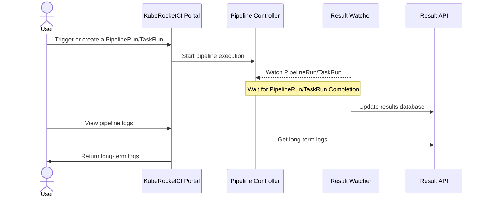

<!-- markdownlint-disable MD025 -->

import Tabs from '@theme/Tabs';
import TabItem from '@theme/TabItem';

# Tekton Long-Term Log Storage

<head>
  <link rel="canonical" href="https://docs.kuberocketci.io/docs/operator-guide/ci/tekton-long-term-storage" />
</head>

Tekton Results aims to help users logically group CI/CD workload history and separate out long term result storage away from the Pipeline controller. This allows you to:

- Provide custom Results metadata about your CI/CD workflows not available in the Tekton TaskRun/PipelineRun CRDs (for example: post-run actions).
- Group related workloads together (e.g. bundle related TaskRuns and PipelineRuns into a single unit).
- Make long-term result history independent of the Pipeline CRD controller, letting you free up etcd resources for Run execution.
- Store logs produced by the TaskRuns/PipelineRuns so that completed Runs can be cleaned to save resources.

## Long-Term Log Access Workflow

The following diagram illustrates the workflow for accessing long-term logs for pipelines in the KubeRocketCI Portal:



```mermaid
sequenceDiagram
    actor U as User
    participant KR as KubeRocketCI Portal
    participant PC as Pipeline Controller
    participant RW as Result Watcher
    participant RA as Result API

    U->>KR: Trigger or create a PipelineRun/TaskRun
    KR->>PC: Start pipeline execution
    RW-->>PC: Watch PipelineRun/TaskRun
    Note over PC,RW: Wait for PipelineRun/TaskRun Completion
    RW->>RA: Update results database
    U->>KR: View pipeline logs
    KR-->>RA: Get long-term logs
    KR->>U: Return long-term logs
    
```

## Install Tekton Results

Tekton Results is deployed as part of the Tekton Pipelines installation. For installing Tekton Pipelines, we recommend using the [add-ons approach](https://github.com/epam/edp-cluster-add-ons/blob/4456631feb6510ff875b5b839534968c3846da7a/clusters/core/apps/values.yaml#L286C1-L289C30). Here's an example of how to configure values.yaml before installation:

    ```yaml
    tekton:
        createNamespace: true
        enable: true
        namespace: tekton-pipelines
    ```

## Configuration

:::note
We use Postgres operator to connect to Tekton results, but you can use any other external databases supported. Please align configuration accordingly to Tekton result [documentation](https://github.com/tektoncd/results/blob/v0.18.0/docs/external-database.md).
:::

To configure long-term log storage for pipelines in the KubeRocketCI Portal, follow the steps below:

1. Storage sizes in the [results-pg.yaml](https://github.com/epam/edp-cluster-add-ons/blob/main/clusters/core/addons/tekton/results-pg.yaml) file define the allocated volumes for the Tekton Results PostgreSQL cluster:

   - **Database instance storage**
     - Path: `spec.instances.dataVolumeClaimSpec.resources.requests.storage`
     - Default: `2Gi`
     - Description: Specifies the size of the main PostgreSQL data volume.

   - **Backup repository storage**
     - Path: `spec.backups.pgbackrest.repos.volume.volumeClaimSpec.resources.requests.storage`
     - Default: `2Gi`
     - Description: Specifies the size of the pgBackRest backup repository volume.

2. Storage and retention settings in the [results.yaml](https://github.com/epam/edp-cluster-add-ons/blob/main/clusters/core/addons/tekton/results.yaml) file define how Tekton Results result records are retained in the database and how related storage is configured:

   - **Log storage size**
     - Path: `PersistentVolumeClaim.spec.resources.requests.storage`
     - Default: `5Gi`
     - Description: Specifies the allocated disk size for storing pipeline logs.

   - **Retention period**
     - Path: `ConfigMap.data.defaultRetention` in `tekton-results-config-results-retention-policy`
     - Default: `"30"` days
     - Description: Defines how long log files are retained before being automatically removed.

   - **Cleanup schedule**
     - Path: `ConfigMap.data.runAt` in `tekton-results-config-results-retention-policy`
     - Default: `"0 18 * * *0*"`
     - Description: Specifies the cron expression that determines when automated log cleanup runs (daily at 6:00 PM UTC).

:::warning
The retention policy agent removes only database records from PostgreSQL. It does not delete associated log files stored on persistent volumes, S3, or GCS backends. As a result, log data may remain on disk and consume storage even after the corresponding records are expired.
:::

3. To remove physical log files from PVCs (not just database records), use the settings in the [results-clean-old-logs-cronjob.yaml](https://github.com/epam/edp-cluster-add-ons/blob/main/clusters/core/addons/tekton/results-clean-old-logs-cronjob.yaml) file:

   - **Cleanup schedule**
     - Path: `spec.schedule`
     - Default: `"0 18 * * *"`
     - Description: Specifies the cron expression that determines when the CronJob runs (daily at 6:00 PM UTC).

   - **Physical log retention (days)**
     - Path: `spec.jobTemplate.spec.template.spec.containers.command` (the `-mtime +N` value in the `find` command)
     - Default: `30` days
     - Description: Physical log files in `/tekton-results/logs/` older than this many days are deleted from the PVC. The value is the number in `-mtime +N` (e.g. `+30` keeps files for 30 days).

:::note
In this example, the PGO (PostgreSQL Operator) is used for the Tekton Results database. 
:::

## Related Articles

- [Add Application](../../user-guide/add-application.md)
- [Install Tekton](../install-tekton.md)
- [Install KubeRocketCI](../install-kuberocketci.md)
- [KrakenD API Gateway](../extensions/krakend.md)
