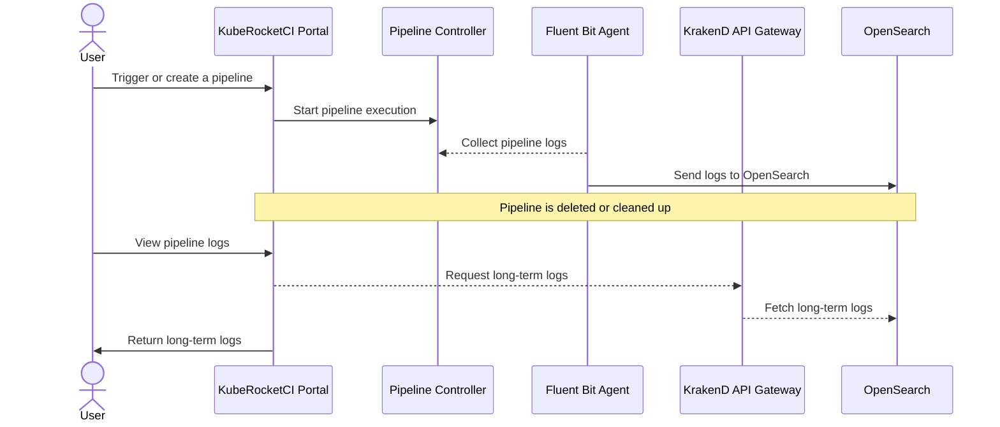
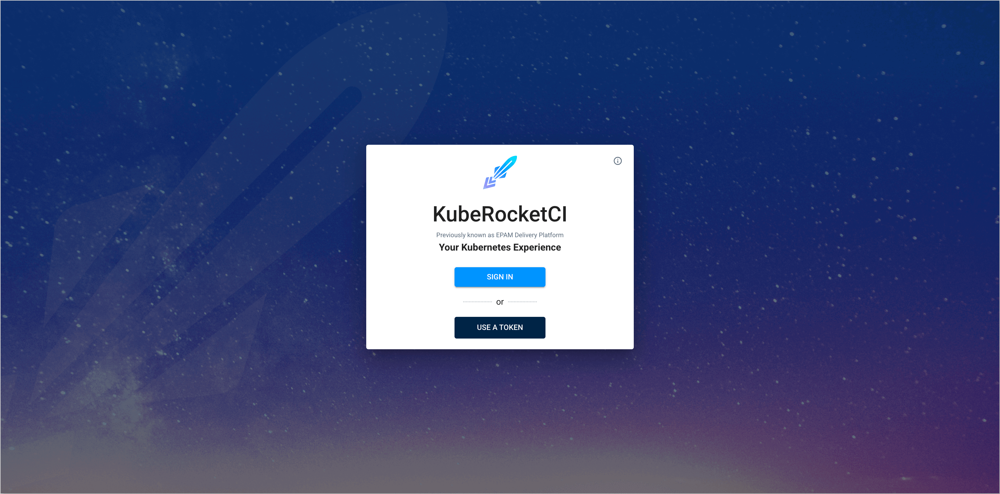
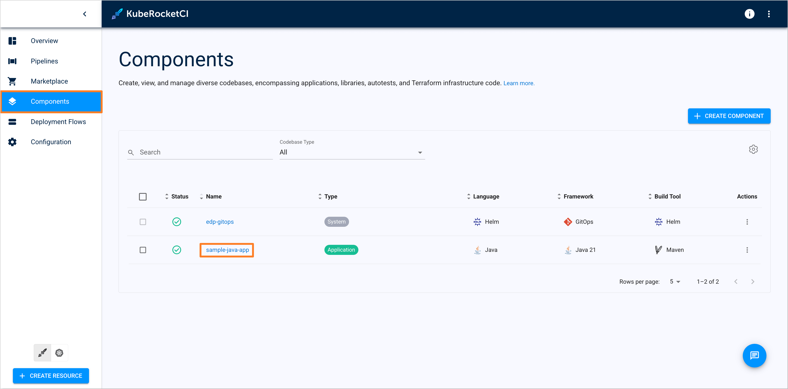
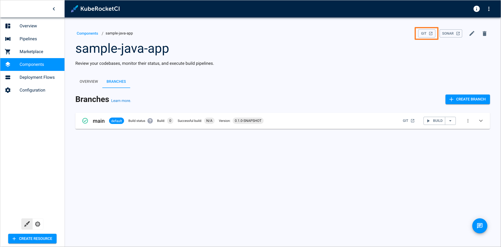
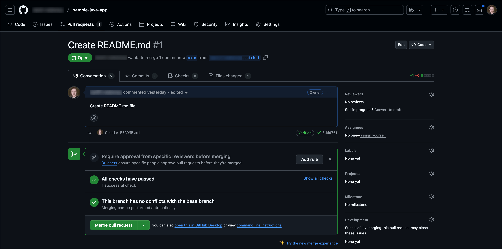
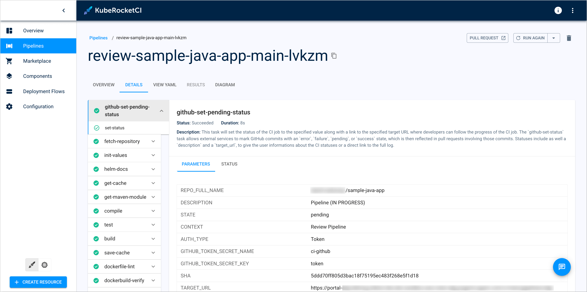
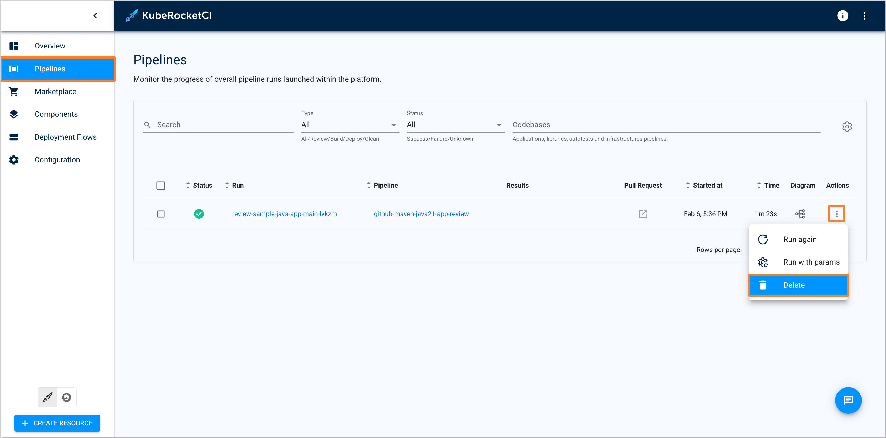
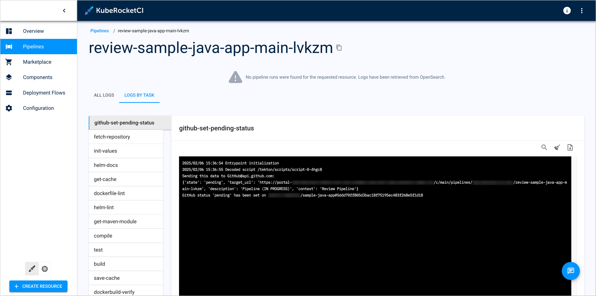

<!-- markdownlint-disable MD025 -->

import Tabs from '@theme/Tabs';
import TabItem from '@theme/TabItem';

# Tekton Long-Term Log Storage

<head>
  <link rel="canonical" href="https://docs.kuberocketci.io/docs/operator-guide/ci/tekton-long-term-storage" />
</head>

KubeRocketCI Portal provides the capability to view long-term logs for pipelines. The long-term logs are stored in the OpenSearch cluster and can be viewed in the KubeRocketCI Portal after pipeline cleanup or deletion. This guide describes how to configure and view long-term logs in the KubeRocketCI Portal.

## Long-Term Log Access Workflow

The following diagram illustrates the workflow for accessing long-term logs for pipelines in the KubeRocketCI Portal:



## Configuration

To configure long-term log storage for pipelines in the KubeRocketCI Portal, follow the steps below:

1. Install and configure OpenSearch cluster:

    :::note
    To install OpenSearch cluster, we recommend to use the [edp-cluster-add-ons](https://github.com/epam/edp-cluster-add-ons/tree/main/clusters/core/addons/opensearch) repository, which contains already prepared configurations for OpenSearch installation.
    :::

    To install OpenSearch cluster using the add-ons repository, follow the steps below:

    1. Clone the forked [edp-cluster-add-ons](https://github.com/epam/edp-cluster-add-ons/) repository.

    2. Navigate to the `clusters/core/addons/opensearch` directory and configure the `values.yaml` file with the necessary values for OpenSearch cluster installation.

        :::note
        Ensure that [Fluent Bit](https://github.com/epam/edp-cluster-add-ons/blob/44ca88c079d464c826fcae38f3f03fe983d1f984/clusters/core/addons/opensearch/values.yaml#L391) is configured to send container logs to the `logstash-edp` index in the OpenSearch cluster, as the KubeRocketCI Portal uses this index to retrieve long-term logs.
        :::

    3. Install the OpenSearch cluster using Helm or [Argo CD](../add-ons-overview.md) methods.

2. Install and configure KrakenD API Gateway:

    :::note
    To install KrakenD API Gateway with OpenSearch connection, we recommend to use the [edp-cluster-add-ons](https://github.com/epam/edp-cluster-add-ons/tree/main/clusters/core/addons/krakend) repository, which contains already prepared configurations for KrakenD installation.
    For more details, refer to the [KrakenD Integration](../extensions/krakend.md) guide.
    :::

    To install KrakenD API Gateway with OpenSearch connection, follow the steps below:

    1. Clone the forked [edp-cluster-add-ons](https://github.com/epam/edp-cluster-add-ons/) repository.

    2. Navigate to the `clusters/core/addons/krakend` directory and configure the `values.yaml` file with the necessary values for KrakenD installation.

        :::note
        Ensure that the KrakenD endpoint object for OpenSearch has the `/search/logs` endpoint name, as the KubeRocketCI Portal uses this endpoint to fetch long-term logs.
        :::

    3. Ensure that the KrakenD [configuration secret](https://github.com/epam/edp-cluster-add-ons/blob/main/clusters/core/addons/krakend/templates/external-secrets/krakend.yaml) contains the OpenSearch connection variables.

        <Tabs
          defaultValue="externalsecret"
          values={[
            {label: 'Manifests', value: 'manifests'},
            {label: 'External Secrets Operator', value: 'externalsecret'},
          ]}>

          <TabItem value="manifests">

          ```yaml
          apiVersion: v1
          kind: Secret
          metadata:
            name: krakend
            namespace: krakend
          type: Opaque
          stringData:
            OPENSEARCH_URL: https://opensearch-cluster-master.logging:9200
            OPENSEARCH_CREDS: <base64-encoded-credentials>
          ```

          </TabItem>

          <TabItem value="externalsecret">

          ```json
          {
            "OPENSEARCH_URL": "https://opensearch-cluster-master.logging:9200",
            "OPENSEARCH_CREDS": "<base64-encoded-credentials>"
          }
          ```
          </TabItem>

        </Tabs>

    4. Install the KrakenD API Gateway using Helm or [Argo CD](../add-ons-overview.md) methods.

## Viewing Long-Term Logs

After configuring long-term log storage for Pipelines in the KubeRocketCI Portal, follow the steps below to view long-term logs:

1. Navigate to the KubeRocketCI Portal and sign in with appropriate credentials.

    

2. In the **Components** section, navigate to the appropriate component (if component is not created yet, refer to the [Add Application](../../user-guide/add-application.md) guide to create a new one).

    

3. In the component window, in the right upper corner, click the **GIT** button to navigate to the component repository (e.g., GitHub repository).

    

4. In the component repository, create a Pull Request to trigger the review pipeline execution.

    

5. In the Pull Request checks section, click the **Show all checks** button and navigate to the review pipeline in the KubeRocketCI Portal by clicking the **Details** button.

    

6. In the pipeline window, check the pipeline status. Ensure that the pipeline is successfully executed and the logs are available.

    

7. Navigate to the **Pipelines** section and find the executed review pipeline. Delete the pipeline by clicking the **Delete** button.

    

8. Return to the Pull Request and click the **Show all checks** button. Navigate to the review pipeline again by clicking the **Details** button.

    

9. After the pipeline deletion, the long-term logs are displayed in the pipeline window.

    

This example demonstrates how to view long-term logs for review pipeline, but the same approach can be applied to other pipeline types.

## Related Articles

- [Add Application](../../user-guide/add-application.md)
- [Install Tekton](../install-tekton.md)
- [Install KubeRocketCI](../install-kuberocketci.md)
- [KrakenD API Gateway](../extensions/krakend.md)
