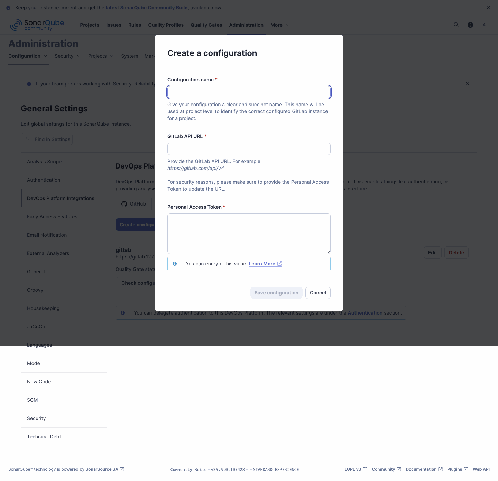
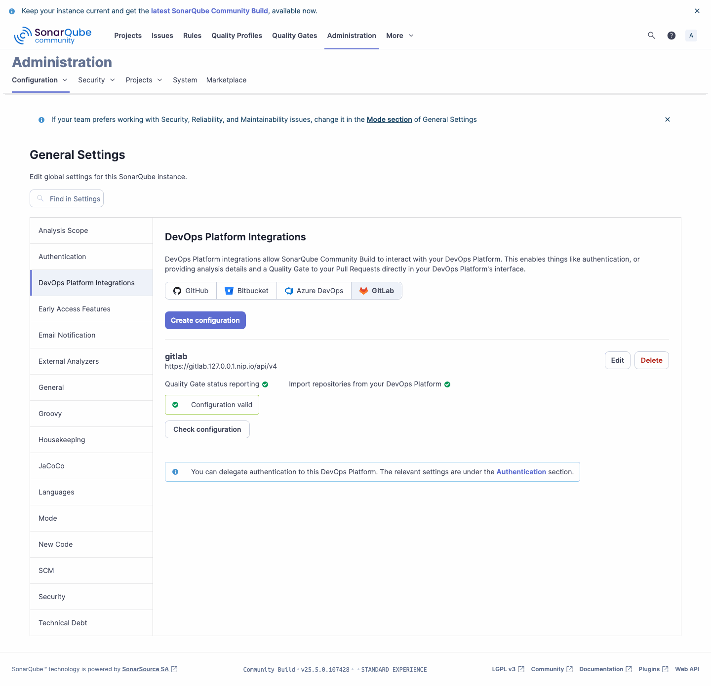
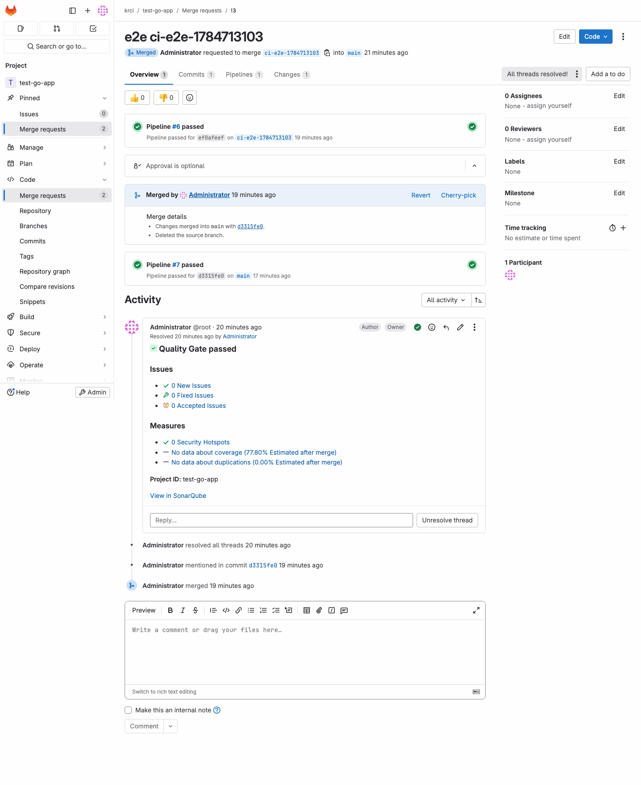

<!-- markdownlint-disable MD025 -->

import Tabs from '@theme/Tabs';
import TabItem from '@theme/TabItem';

# Publish SonarQube Reports to Pull Requests

<head>
  <link rel="canonical" href="https://docs.kuberocketci.io/docs/operator-guide/code-quality/sonarqube-pr-decoration" />
</head>

Pull request decoration makes SonarQube publish its **Quality Gate status** and **analysis summary** directly onto a merge request, so reviewers see new issues, security hotspots, coverage, and duplications without leaving the Git provider. This guide enables the feature in KubeRocketCI end to end, using a self-hosted **GitLab** instance as the baseline example. The same steps apply to GitHub, Bitbucket, and Azure DevOps — only the DevOps Platform type changes.

By the end, every review pipeline in KubeRocketCI adds a Quality Gate comment and a `SonarQube` commit status to the corresponding merge request.

## How SonarQube Pull Request Decoration Works

KubeRocketCI review pipelines already run SonarQube analysis in **pull request mode** (the scanner receives the `sonar.pullrequest.key`, `sonar.pullrequest.branch`, and `sonar.pullrequest.base` parameters automatically). To turn that analysis into a merge request comment, SonarQube needs three things:

1. A **DevOps Platform integration** that tells SonarQube how to reach the Git provider and post back (URL + access token).
2. A **project binding** that maps the SonarQube project to its Git repository.
3. A reachable **Server Base URL** so the links in the decoration resolve to your SonarQube instance.

### Does SonarQube Community Edition Support Pull Request Decoration?

Yes. SonarQube **Community** editions add branch and pull request analysis through the [sonarqube-community-branch-plugin](https://github.com/mc1arke/sonarqube-community-branch-plugin), which KubeRocketCI ships preinstalled. SonarQube Developer Edition and above provide the same capability natively, so no plugin is required there.

## Prerequisites

Before proceeding, ensure the following prerequisites are in place:

- SonarQube is integrated with KubeRocketCI. See [SonarQube Integration](sonarqube.md) for the base setup.
- A codebase hosted in GitLab with review and build pipelines already running.
- A GitLab **personal (or project/group) access token** with the `api` scope. SonarQube uses this token to post comments and commit statuses on merge requests.
- Administrator access to the SonarQube UI (or an admin token for the API).

## Trust the Git Provider Certificate

SonarQube posts decorations by calling the Git provider's API over HTTPS. If your GitLab (or other provider) serves a **self-signed certificate**, the SonarQube JVM must trust its CA — otherwise the integration fails on the TLS handshake with `Could not validate GitLab url`.

The SonarQube Helm chart exposes a `caCerts` option that imports a certificate into the JVM truststore and wires it into both the web and compute-engine processes (the compute engine runs the decoration):

```yaml title="values.yaml"
caCerts:
  enabled: true
  configMap:
    name: gitlab-ca      # ConfigMap holding the provider CA certificate
    key: ca.crt
    path: ca.crt
```

:::note
  Skip this step when your Git provider uses a certificate signed by a public, already-trusted Certificate Authority.
:::

## Configure the DevOps Platform Integration

Create a global GitLab configuration in SonarQube. Use the UI for a one-time manual setup, or the Web API to automate it.

<Tabs
  defaultValue="ui"
  values={[
    {label: 'SonarQube UI', value: 'ui'},
    {label: 'SonarQube Web API', value: 'api'},
  ]}>

  <TabItem value="ui">

  1. Open the SonarQube UI and navigate to **Administration** -> **Configuration** -> **DevOps Platform Integrations**. Select the **GitLab** tab and click **Create configuration**:

      

  2. Fill in the fields and click **Save configuration**:

      - **Configuration name** — a short identifier used when binding projects, for example `gitlab`.
      - **GitLab API URL** — the `/api/v4` endpoint of your instance, for example `https://gitlab.example.com/api/v4`.
      - **Personal Access Token** — the GitLab token with the `api` scope.

  3. Once saved, the configuration reports **Quality Gate status reporting** and **Import repositories** as valid:

      

  </TabItem>

  <TabItem value="api">

  Create the global GitLab configuration with the [`alm_settings/create_gitlab`](https://next.sonarqube.com/sonarqube/web_api/api/alm_settings) endpoint. Authenticate with an admin token (note the trailing colon, which leaves the password empty):

  ```bash
  curl -u "<sonar-admin-token>:" -X POST "https://sonarqube.example.com/api/alm_settings/create_gitlab" \
    --data-urlencode "key=gitlab" \
    --data-urlencode "url=https://gitlab.example.com/api/v4" \
    --data-urlencode "personalAccessToken=<gitlab-token-with-api-scope>"
  ```

  Verify the configuration can reach GitLab:

  ```bash
  curl -u "<sonar-admin-token>:" "https://sonarqube.example.com/api/alm_settings/validate?key=gitlab"
  ```

  An empty response with HTTP `204` confirms the connection. A `Could not validate GitLab url` error indicates a connectivity or TLS problem — see [Troubleshooting](#troubleshooting).

  </TabItem>

</Tabs>

## Bind the SonarQube Project to Its Repository

Link each SonarQube project to the GitLab repository it should decorate. The project key matches the KubeRocketCI codebase name.

<Tabs
  defaultValue="ui"
  values={[
    {label: 'SonarQube UI', value: 'ui'},
    {label: 'SonarQube Web API', value: 'api'},
  ]}>

  <TabItem value="ui">

  1. Open the project in SonarQube, click **Project Settings** (top-right), and select **DevOps Platform Integration** from the left menu of **General Settings**.
  2. Choose the `gitlab` configuration created earlier, provide the repository's **GitLab project ID**, and save.

  :::note
    The GitLab project ID is shown on the repository's home page under the project name, and in GitLab under **Settings** -> **General**.
  :::

  </TabItem>

  <TabItem value="api">

  Bind the project with the [`alm_settings/set_gitlab_binding`](https://next.sonarqube.com/sonarqube/web_api/api/alm_settings) endpoint. The `repository` value is the numeric GitLab project ID:

  ```bash
  curl -u "<sonar-admin-token>:" -X POST "https://sonarqube.example.com/api/alm_settings/set_gitlab_binding" \
    --data-urlencode "almSetting=gitlab" \
    --data-urlencode "project=<sonar-project-key>" \
    --data-urlencode "repository=<gitlab-project-id>" \
    --data-urlencode "monorepo=false"
  ```

  </TabItem>

</Tabs>

## Set the Server Base URL

For the links inside a decoration to resolve back to SonarQube, set the server base URL to the address reachable from the Git provider and reviewers:

```bash
curl -u "<sonar-admin-token>:" -X POST "https://sonarqube.example.com/api/settings/set" \
  --data-urlencode "key=sonar.core.serverBaseURL" \
  --data-urlencode "value=https://sonarqube.example.com"
```

The same value can be set in the UI under **Administration** -> **Configuration** -> **General** -> **Server base URL**.

## Verify Pull Request Decoration End to End

With the integration in place, exercise the full flow on a real merge request:

1. In the GitLab repository, create a feature branch and open a **merge request** against the default branch.
2. KubeRocketCI triggers the **review pipeline**, which runs SonarQube analysis in pull request mode.
3. When the analysis completes, SonarQube posts a **Quality Gate** comment and a `SonarQube` commit status on the merge request:

    

The comment links to the full pull request analysis in SonarQube, and the commit status appears alongside the pipeline status, giving reviewers a Quality Gate signal before the merge request is merged.

## Troubleshooting

| Symptom | Cause | Resolution |
|---------|-------|------------|
| `Could not validate GitLab url. Got an unexpected answer.` | SonarQube cannot complete the TLS handshake with a self-signed Git provider, or the URL/token is wrong. | Trust the provider CA as described in [Trust the Git Provider Certificate](#trust-the-git-provider-certificate). Confirm the API URL ends with `/api/v4` and the token has the `api` scope. |
| Decoration links point to `localhost` or fail to open | `sonar.core.serverBaseURL` is unset. | Set the server base URL as shown above. |
| No comment appears on the merge request | The analysis did not run in pull request mode, or the project is not bound. | Ensure the analysis was triggered by a review pipeline and that the project binding references the correct GitLab project ID. |

## Related Articles

* [SonarQube Integration](sonarqube.md)
* [Manage Project Visibility](sonarqube-visibility.md)
* [Sonarqube Project Properties for Application](../../user-guide/application-sonarqube-project-properties.md)
* [External Secrets Operator Integration](../secrets-management/external-secrets-operator-integration.md)
