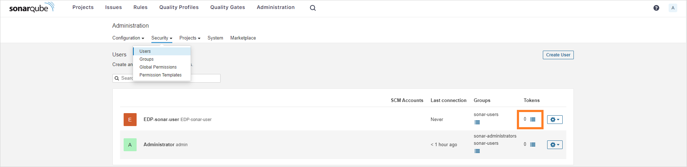
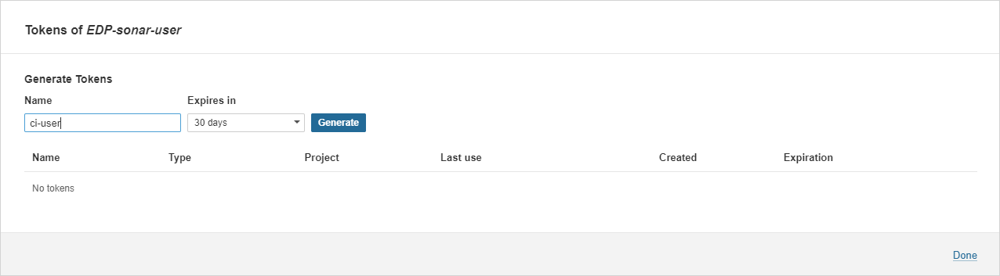
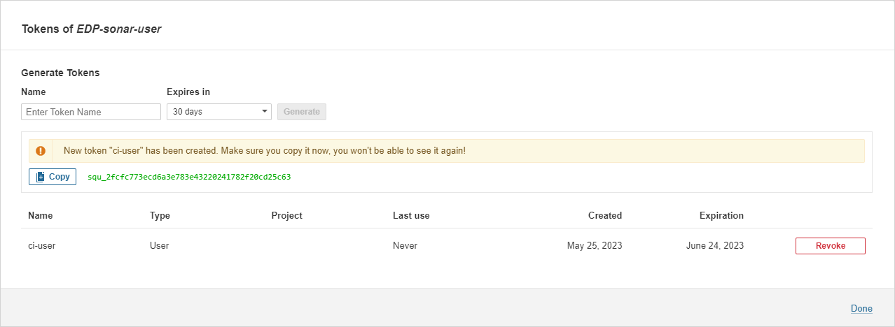
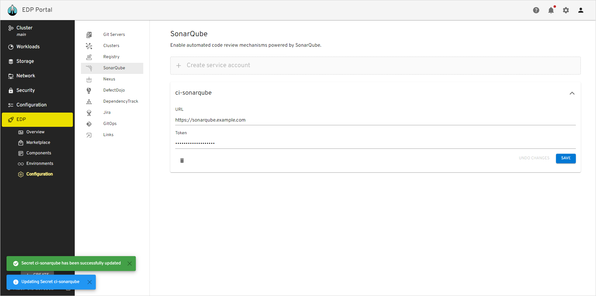
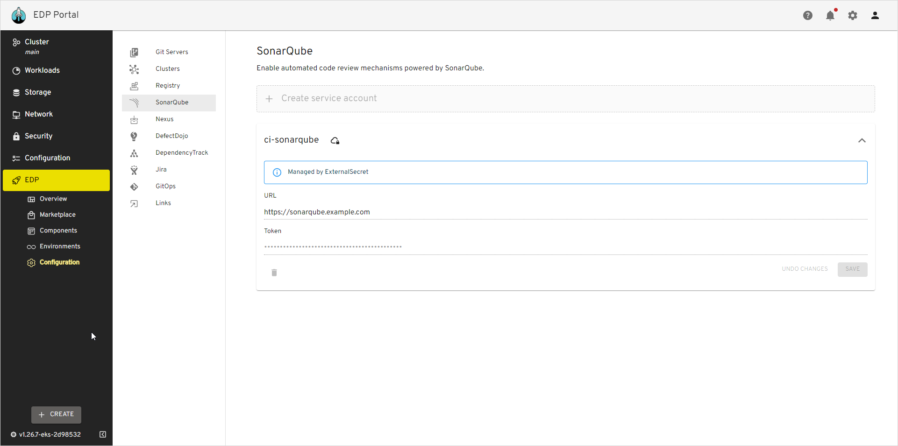

import Tabs from '@theme/Tabs';
import TabItem from '@theme/TabItem';

# SonarQube Integration

This documentation offers detailed guidance on seamlessly integrating SonarQube into KubeRocketCI.
It covers essential steps to ensure a robust connection between SonarQube's code quality and security
analysis capabilities with the platform's continuous delivery ecosystem,
facilitating enhanced code inspection and improvement practices within your development workflow.

<div style={{ display: 'flex', justifyContent: 'center' }}>
<iframe width="560" height="315" src="https://www.youtube.com/embed/0duxqmIKFpQ" title="SonarQube Integration" frameborder="0" allow="accelerometer; autoplay; clipboard-write; encrypted-media; gyroscope; picture-in-picture" allowfullscreen="allowfullscreen"></iframe>
</div>

## Prerequisites

Before proceeding, ensure that you have the following prerequisites:

* Kubectl version 1.26.0+ is installed. Please refer to the [Kubernetes official website](https://kubernetes.io/releases/download/) for details.
* [Helm](https://helm.sh) version 3.14.0+ is installed. Please refer to the [Helm page](https://github.com/helm/helm/releases) on GitHub for details.

## Installation

To streamline the installation of SonarQube in your environment, it is advised to utilize the resources available in the [Cluster Add-Ons](https://github.com/epam/edp-cluster-add-ons) repository. This method involves deploying SonarQube alongside the [sonar-operator](https://github.com/epam/edp-sonar-operator). Employing the Cluster Add-Ons framework simplifies the installation process and ensures efficient management and integration of SonarQube into your infrastructure.

## Configuration

To establish robust authentication and precise access control, generating a SonarQube token is essential. This token is a distinct identifier, enabling effortless integration between SonarQube and EDP. To generate the SonarQube token, proceed with the following steps:

1. Open the SonarQube UI and navigate to **Administration** -> **Security** -> **User**. Create a new user or select an existing one. Click the `Options List` icon to create a token:

    

2. Type the `ci-user` username, define an expiration period, and click the `Generate` button to create the token:

    

3. Click the `Copy` button to copy the generated `<Sonarqube-token>`:

    

4. Provision secrets using Manifest, EDP Portal or with the externalSecrets operator:

<Tabs
  defaultValue="portal"
  values={[
    {label: 'UI Portal', value: 'portal'},
    {label: 'Manifests', value: 'manifests'},
    {label: 'External Secrets Operator', value: 'externalsecret'},
  ]}>

  <TabItem value="portal">
  Go to **EDP Portal** -> **EDP** -> **Configuration** -> **SonarQube**. Update or fill in the **URL** and **Token** fields and click the **Save** button:

  
  </TabItem>

  <TabItem value="manifests">

  ```yaml
  apiVersion: v1
  kind: Secret
  metadata:
    name: ci-sonarqube
    namespace: edp
    labels:
      app.edp.epam.com/secret-type: sonar
      app.edp.epam.com/integration-secret: "true"
  type: Opaque
  stringData:
    url: https://sonarqube.example.com
    token: <sonarqube-token>
  ```

  </TabItem>

  <TabItem value="externalsecret">

  ```json
  "ci-sonarqube":
  {
    "url": "https://sonarqube.example.com",
    "token": "XXXXXXXXXXXX"
  },
  ```

  Go to **EDP Portal** -> **EDP** -> **Configuration** -> **SonarQube** and see the `Managed by External Secret` message:

  

  More details about External Secrets Operator integration can be found in the [External Secrets Operator Integration](https://epam.github.io/edp-install/operator-guide/external-secrets-operator-integration/) page.
  </TabItem>

</Tabs>

## Related Articles

* [Install EDP With Values File](../install-kuberocketci.md)
* [Install External Secrets Operator](../secrets-management/install-external-secrets-operator.md)
* [External Secrets Operator Integration](../secrets-management/external-secrets-operator-integration.md)
* [Cluster Add-Ons Overview](../add-ons-overview.md)
