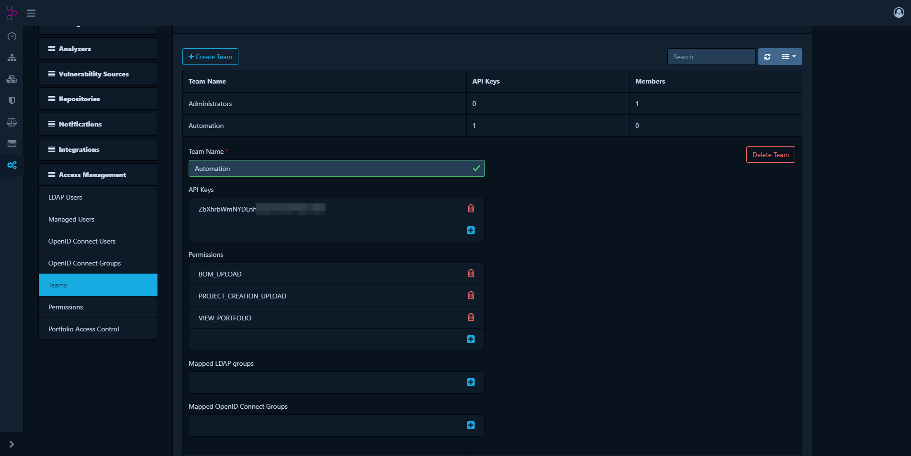
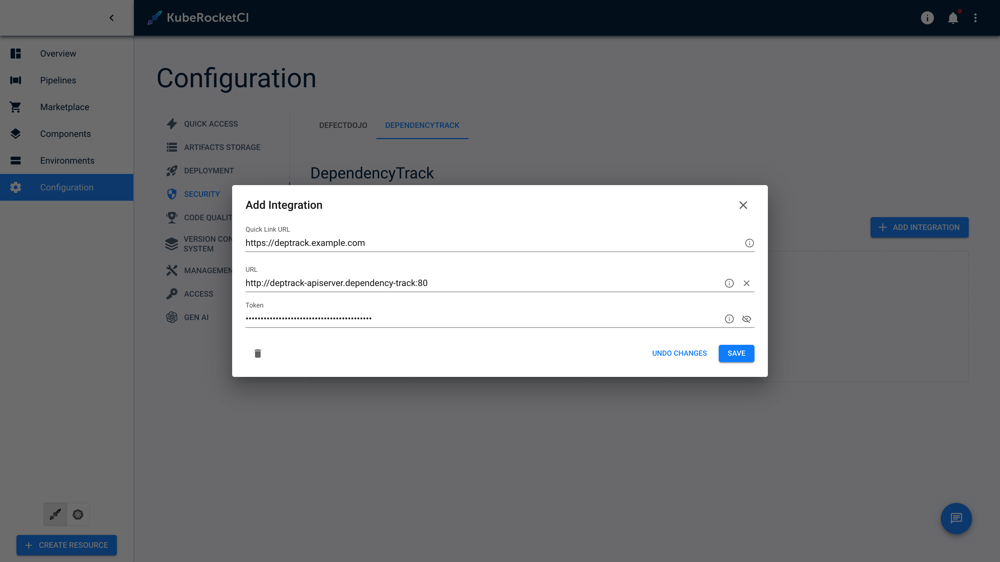
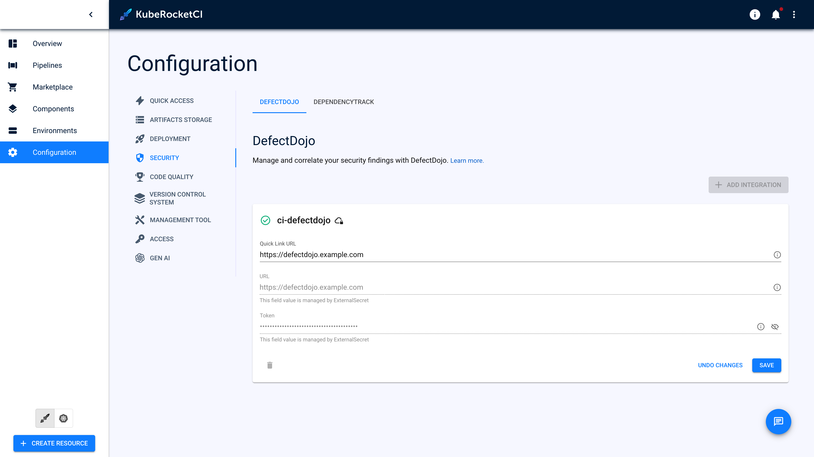

<!-- markdownlint-disable MD025 -->

import Tabs from '@theme/Tabs';
import TabItem from '@theme/TabItem';

# Integrate Dependency-Track

<head>
  <link rel="canonical" href="https://docs.kuberocketci.io/docs/operator-guide/devsecops/dependency-track" />
</head>

This documentation guide provides comprehensive instructions for installing and integrating Dependency-Track with the KubeRocketCI.

## Prerequisites

* Kubectl version 1.26.0+ is installed. Please refer to the [Kubernetes official website](https://kubernetes.io/releases/download/) for details.
* [Helm](https://helm.sh) version 3.14.0+ is installed. Please refer to the [Helm page](https://github.com/helm/helm/releases) on GitHub for details.

## Installation

To install Dependency-Track use [KubeRocketCI addons](../add-ons-overview.md) approach.

## Configuration

1. Open **Administration** -> **Access Management** -> **Teams**. Click **Create Team** -> **Automation** and click **Create**.

2. Click **+** in **Permissions** and add:

    ```bash
    BOM_UPLOAD
    PROJECT_CREATION_UPLOAD
    VIEW_PORTFOLIO
    ```

3. Click **+** in **API keys** to create token:

    

4. Provision secrets using a manifest, Portal, or with the externalSecrets operator:

<Tabs
  defaultValue="portal"
  values={[
    {label: 'UI Portal', value: 'portal'},
    {label: 'Manifests', value: 'manifests'},
    {label: 'External Secrets Operator', value: 'externalsecret'},
  ]}>

  <TabItem value="portal">
  Go to the **Portal** open **Configuration** -> **SECURITY** -> **DEPENDENCYTRACK**. Click **+ ADD INTEGRATION** fill fields `Quick Link URL`, `URL` and `Token` click the `save` button.

  
  </TabItem>

  <TabItem value="manifests">

  ```yaml
  apiVersion: v1
  kind: Secret
  metadata:
    name: ci-dependency-track
    namespace: <edp>
    labels:
      app.edp.epam.com/secret-type: dependency-track
      app.edp.epam.com/integration-secret: "true"
  stringData:
    token: <dependency-track-token>
    url: <dependency-track-api-url>
  type: Opaque
  ```

  </TabItem>

  <TabItem value="externalsecret">
  Store Dependency-Track URL and Token in the AWS Parameter Store with the following format:

  ```yaml
  "ci-dependency-track":
  {
    "token": "XXXXXXXXXXXX",
    "url": "https://dependency-track.example.com"
  }
  ```

  Go to the **Portal** open **Configuration** -> **SECURITY** -> **DEPENDENCYTRACK** see the secret managed by the `Managed by External Secret`.

  

  More detail on External Secrets Operator Integration can be found on [the following page](../secrets-management/external-secrets-operator-integration.md)
  </TabItem>

</Tabs>

After following the instructions provided, you should be able to integrate your Dependency-Track with the KubeRocketCI.

## Related Articles

* [Install External Secrets Operator](../secrets-management/install-external-secrets-operator.md)
* [External Secrets Operator Integration](../secrets-management/external-secrets-operator-integration.md)
* [Cluster Add-Ons Overview](../add-ons-overview.md)
