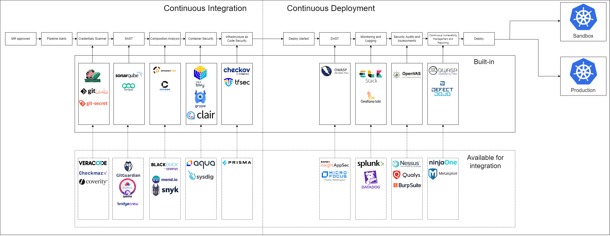

<!-- markdownlint-disable MD025 -->

# Security and Compliance: Overview

<head>
  <link rel="canonical" href="https://docs.kuberocketci.io/docs/operator-guide/devsecops/overview" />
</head>

KubeRocketCI emphasizes the importance of incorporating security practices into the software development lifecycle through the DevSecOps approach. By integrating a diverse range of open-source and enterprise security tools tailored to specific functionalities, organizations can ensure efficient and secure software development. These tools, combined with fundamental DevSecOps principles such as collaboration, continuous security, and automation, contribute to the identification and remediation of vulnerabilities early in the process, minimizes risks, and fosters a security-first culture across the organization.

## Integrated Scanners

The following tools are built into KubeRocketCI Tekton pipelines and run automatically as part of CI/CD workflows. For detailed information on when each scanner runs, how reports are produced, and how data flows into DefectDojo and Dependency-Track, refer to the [Security Scanning Pipelines](./security-pipelines.md) page.

| Tool | Category | Runs In | Results Destination |
|:----:|----------|---------|---------------------|
| [SonarQube](https://www.sonarqube.org/) | SAST + Code Quality | Build and Review pipelines | [SonarQube server](../code-quality/sonarqube.md) |
| [Semgrep](https://github.com/semgrep/semgrep) | SAST | Security-Scan pipeline | [DefectDojo](./defectdojo.md) |
| [Gitleaks](https://github.com/gitleaks/gitleaks) | Secret Detection | Security-Scan pipeline | [DefectDojo](./defectdojo.md) |
| [CycloneDX cdxgen](https://github.com/CycloneDX/cdxgen) | SCA / SBOM Generation | Security-Scan pipeline | [Dependency-Track](./dependency-track.md) |
| [Trivy](https://github.com/aquasecurity/trivy) | Container Vulnerability Scan | Security-Scan, Image-Scan-Remote pipelines | [DefectDojo](./defectdojo.md) |
| [Anchore Grype](https://github.com/anchore/grype) | Container Vulnerability Scan | Security-Scan pipeline | [DefectDojo](./defectdojo.md) |
| [Hadolint](https://github.com/hadolint/hadolint) | Dockerfile Linting | Review pipelines | Pipeline log |
| [Helm chart-testing](https://github.com/helm/chart-testing) | Helm Chart Linting | Review pipelines | Pipeline log |

## Required Integrations

To enable the full security scanning stack, provision the following integration secrets. Each secret is optional — if missing, the corresponding scanning step is skipped gracefully, allowing incremental tool adoption.

| Secret | Keys | Integration Guide |
|:------:|------|:-----------------:|
| `ci-sonarqube` | `token`, `url` | [SonarQube Integration](../code-quality/sonarqube.md) |
| `ci-defectdojo` | `token`, `url` | [Integrate DefectDojo](./defectdojo.md) |
| `ci-dependency-track` | `token`, `url` | [Integrate Dependency-Track](./dependency-track.md) |

## Supported Solutions Catalog

Beyond the tools integrated into default pipelines, KubeRocketCI supports the integration of additional open-source and enterprise security tools for organizations with extended security requirements. The table below provides a comprehensive view of available options for each security aspect.

| Functionality                          | Open-Source Tools (integrated in Pipelines) | Enterprise Tools (available for Integration)           |
|:--------------------------------------:|---------------------------------------------|--------------------------------------------------------|
| Hardcoded Credentials Scanner          | TruffleHog, GitLeaks, Git-secrets           | GitGuardian, SpectralOps, Bridgecrew                   |
| Static Application Security Testing    | SonarQube, Semgrep CLI                      | Veracode, Checkmarx, Coverity                          |
| Software Composition Analysis          | OWASP Dependency-Check, cdxgen              | Black Duck Hub, Mend, Snyk                             |
| Container Security                     | Trivy, Grype, Clair                         | Aqua Security, Sysdig Secure, Snyk                     |
| Infrastructure as Code Security        | Checkov, Tfsec                              | Bridgecrew, Prisma Cloud, Snyk                         |
| Dynamic Application Security Testing   | OWASP Zed Attack Proxy                      | Fortify WebInspect, Rapid7 InsightAppSec, Checkmarx    |
| Continuous Monitoring and Logging      | ELK Stack, OpenSearch, Loki                 | Splunk, Datadog                                        |
| Security Audits and Assessments        | OpenVAS                                     | Tenable Nessus, QualysGuard, BurpSuite Professional    |
| Vulnerability Management and Reporting | DefectDojo, OWASP Dependency-Track          | Metasploit                                             |

  

## Tool Descriptions

### Vulnerability Management

[DefectDojo](https://www.defectdojo.com/) is a comprehensive vulnerability management and security orchestration platform facilitating the handling of uploaded security reports. Examine the prerequisites and fundamental instructions for [installing DefectDojo](./defectdojo.md) on Kubernetes or OpenShift platforms.

[OWASP Dependency-Track](https://dependencytrack.org/) is an intelligent Software Composition Analysis (SCA) platform that provides a comprehensive solution for managing vulnerabilities in third-party and open-source components. See the [integration guide](./dependency-track.md) for setup instructions.

### Source Code Security

[Semgrep CLI](https://github.com/semgrep/semgrep) is a versatile and user-friendly command-line interface for the Semgrep security scanner, enabling developers to perform Static Application Security Testing (SAST) for various programming languages. It focuses on detecting and preventing potential security vulnerabilities, code quality issues, and custom anti-patterns.

[Gitleaks](https://github.com/gitleaks/gitleaks) is a versatile SAST tool used to scan Git repositories for hardcoded secrets, such as passwords and API keys, to prevent potential data leaks and unauthorized access.

[TruffleHog](https://github.com/trufflesecurity/trufflehog) is an open-source tool designed for finding and identifying potentially sensitive and secret information in the source code and commit history of Git repositories.

[Git-secrets](https://github.com/awslabs/git-secrets) is an open-source tool that helps prevent the accidental committing of secrets, sensitive information, and other types of confidential data into Git repositories.

### Container Security

[Trivy](https://github.com/aquasecurity/trivy) is a simple and comprehensive vulnerability scanner for containers and other artifacts, providing insight into potential security issues across multiple ecosystems. Trivy can be seamlessly integrated into CI/CD pipelines or utilized as part of Harbor.

[Grype](https://github.com/anchore/grype) is a fast and reliable vulnerability scanner for container images and filesystems, maintaining an up-to-date vulnerability database for efficient and accurate scanning.

[Clair](https://github.com/quay/clair) is an open-source container security tool designed to help assess the security of container images and identify vulnerabilities within them.

### Software Composition Analysis

[Cdxgen](https://github.com/CycloneDX/cdxgen) is a lightweight and efficient tool for generating Software Bill of Materials (SBOM) using CycloneDX, a standard format for managing component inventory. It helps organizations maintain an up-to-date record of all software components, their versions, and related vulnerabilities.

[OWASP Dependency-Check](https://owasp.org/www-project-dependency-check/) is a software composition analysis tool that helps identify and report known security vulnerabilities in project dependencies.

### Infrastructure as Code Security

[Tfsec](https://github.com/aquasecurity/tfsec) is an effective Infrastructure as Code (IaC) security scanner, tailored specifically for reviewing Terraform templates. It helps identify potential security issues related to misconfigurations and non-compliant practices.

[Checkov](https://github.com/bridgecrewio/checkov) is a robust static code analysis tool designed for IaC security, supporting various IaC frameworks such as Terraform, CloudFormation, and Kubernetes. It assists in detecting and mitigating security and compliance misconfigurations.

### Dynamic Application Security Testing

[OWASP Zed Attack Proxy (ZAP)](https://www.zaproxy.org/) is a security testing tool for finding vulnerabilities in web applications during the development and testing phases.

### Monitoring and Logging

[ELK Stack](../monitoring-and-observability/kibana-ilm-rollover.md) (Fluent Bit, Elasticsearch, Kibana) is used in Kubernetes for log aggregation, supporting Logsight for Stage Verification and Incident Detection.

[Loki](https://github.com/Neo23x0/Loki) is a log aggregation system designed for cloud-native environments. It is part of the CNCF and is often used alongside Prometheus for monitoring and observability.

[OpenSearch](https://opensearch.org/) is the flexible, scalable, open-source way to build solutions for data-intensive applications.

### Security Audits

[OpenVAS](https://openvas.org/) is an open-source network vulnerability scanner and security management tool designed to identify and assess security vulnerabilities in computer systems, networks, and applications.

## Related Articles

* [Security Scanning Pipelines](./security-pipelines.md)
* [Integrate DefectDojo](./defectdojo.md)
* [Integrate Dependency-Track](./dependency-track.md)
* [SonarQube Integration](../code-quality/sonarqube.md)
