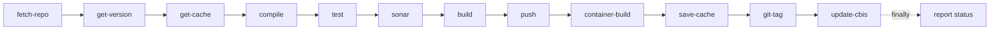
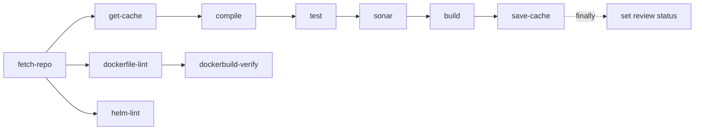
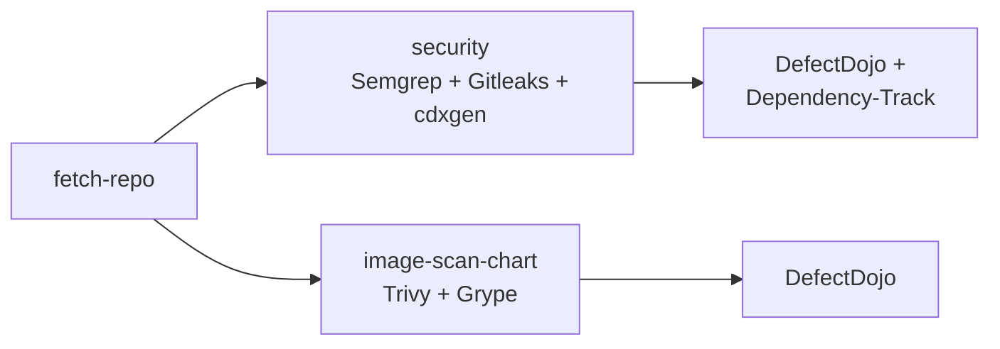

<!-- markdownlint-disable MD025 -->

import Tabs from '@theme/Tabs';
import TabItem from '@theme/TabItem';

# Security Scanning Pipelines

<head>
  <link rel="canonical" href="https://docs.kuberocketci.io/docs/operator-guide/devsecops/security-pipelines" />
</head>

KubeRocketCI provides automated security scanning at three levels of the software delivery lifecycle: source code, dependencies, and container images. Scanners are embedded into Tekton pipelines and report findings to [DefectDojo](./defectdojo.md), [Dependency-Track](./dependency-track.md), and [SonarQube](../code-quality/sonarqube.md).

| Tool | Category | Report Destination | DefectDojo Scan Type |
|:----:|----------|--------------------|-----------------------|
| [Semgrep](https://github.com/semgrep/semgrep) | SAST | DefectDojo | `Semgrep JSON Report` |
| [Gitleaks](https://github.com/gitleaks/gitleaks) | Secret Detection | DefectDojo | `Gitleaks Scan` |
| [CycloneDX cdxgen](https://github.com/CycloneDX/cdxgen) | SCA / SBOM | Dependency-Track | N/A (direct API upload) |
| [SonarQube](https://www.sonarqube.org/) | SAST + Code Quality | SonarQube server | N/A |
| [Trivy](https://github.com/aquasecurity/trivy) | Container Vulnerability Scan | DefectDojo | `Trivy Scan` |
| [Anchore Grype](https://github.com/anchore/grype) | Container Vulnerability Scan | DefectDojo | `Anchore Grype` |
| [Hadolint](https://github.com/hadolint/hadolint) | Dockerfile Linting | Pipeline log | N/A |
| [Helm chart-testing](https://github.com/helm/chart-testing) | Helm Chart Linting | Pipeline log | N/A |

## Pipeline Types

Security scanning is distributed across three pipeline types. Each serves a different stage of the development workflow.

### Build and Review Pipelines

Build and review pipelines are language-specific and run for every codebase. They include [SonarQube](../code-quality/sonarqube.md) for code quality and security analysis, [Hadolint](https://github.com/hadolint/hadolint) for Dockerfile validation, and [Helm chart-testing](https://github.com/helm/chart-testing) for chart linting.

**Build pipeline** — triggered on merge to a tracked branch:



**Review pipeline** — triggered on PR/MR creation or update:



:::info
  For details on SonarQube configuration and Quality Gate behavior, refer to the [SonarQube Integration](../code-quality/sonarqube.md) page.
:::

### Security-Scan Pipeline

A dedicated pipeline that runs comprehensive security analysis independently from build/review. Available for all supported VCS providers (GitHub, GitLab, Gerrit, Bitbucket). Triggered via webhook or manually through the KubeRocketCI portal.

After cloning the repository, two tasks execute **in parallel**:



The pipeline returns two result URLs visible in the portal:

- `SCAN_REPORT_URL` — DefectDojo link to code security findings (Semgrep + Gitleaks)
- `IMAGE_SCAN_REPORT_URL` — DefectDojo link to container image findings (Trivy + Grype)

### Image-Scan-Remote Pipeline

An on-demand pipeline for scanning pre-built container images from remote registries without source code. Accepts an array of fully-qualified image references:

```yaml
params:
  - name: IMAGE_NAMES
    value:
      - "registry.example.com/myapp/backend:1.2.3"
      - "registry.example.com/myapp/frontend:1.2.3"
  - name: CODEBASE_NAME
    value: "myapp"
```

Uses Trivy only (no Grype) and uploads results to DefectDojo with per-image engagements.

### Scanner-to-Pipeline Matrix

| Scanner | Build Pipeline | Review Pipeline | Security-Scan Pipeline | Image-Scan-Remote |
|:-------:|:-:|:-:|:-:|:-:|
| SonarQube | Yes | Yes (PR mode) | - | - |
| Semgrep | - | - | Yes | - |
| Gitleaks | - | - | Yes | - |
| cdxgen (SBOM) | - | - | Yes | - |
| Trivy | - | - | Yes | Yes |
| Grype | - | - | Yes | - |
| Hadolint | - | Yes | - | - |
| Helm Lint | - | Yes | - | - |

## Scanner Reference

This section describes each integrated scanner: what it detects, the command it runs, and where results are reported.

### Source Code Scanners

#### Semgrep (SAST)

Semgrep performs Static Application Security Testing across the entire source tree. It runs as the first step of the `security` task in the security-scan pipeline.

**Command:**

```bash
semgrep --jobs 1 --config=auto . --json \
  --output semgrep-report.json --disable-version-check
```

Key behaviors:

- Uses `--config=auto` which downloads community and recommended rules from the Semgrep registry, selecting rules based on detected languages and frameworks.
- Runs single-threaded (`--jobs 1`) for stability in container environments.
- Excludes `.docker/config.json` via a `.semgrepignore` file created at scan time.
- Produces a JSON report consumed by the DefectDojo upload step.
- Does **not** fail the pipeline on findings — results go to DefectDojo for triage.

**DefectDojo mapping:** scan type = `Semgrep JSON Report`, engagement = `code-security-{branch}`.

#### Gitleaks (Secret Detection)

Gitleaks detects hardcoded secrets, API keys, passwords, and tokens in the source code. It runs as the second step of the `security` task.

**Command:**

```bash
gitleaks detect --source . --report-format=json \
  --report-path=gitleaks-report.json \
  --no-git --verbose --exit-code=0 --config=gitleaks.toml
```

Key behaviors:

- `--no-git` scans file content only (not git history), which is faster and avoids needing a full git clone.
- `--exit-code=0` ensures the pipeline does not fail on findings — all results are sent to DefectDojo.
- Uses a custom `gitleaks.toml` config that excludes the `.docker/` directory.

**DefectDojo mapping:** scan type = `Gitleaks Scan`, engagement = `code-security-{branch}`.

#### CycloneDX cdxgen (SCA / SBOM)

[CycloneDX cdxgen](https://github.com/CycloneDX/cdxgen) generates a Software Bill of Materials (SBOM) from the project source and uploads it directly to [Dependency-Track](./dependency-track.md). It runs as the third step of the `security` task and is also available as a standalone `cdxgen` Tekton task.

**Command:**

```bash
/opt/cdxgen/bin/cdxgen.js \
  --api-key=$API_TOKEN \
  --server-url=$DEPTRACK_URL \
  --project-name=$PROJECT_NAME \
  --project-version=$PROJECT_BRANCH \
  --print
```

Key behaviors:

- Automatically detects the project type (Maven, npm, pip, Go, etc.) and generates an appropriate SBOM.
- Uploads the SBOM directly to Dependency-Track via its API (not through DefectDojo).
- `--project-name` maps to the KubeRocketCI Codebase name (e.g., `my-java-app`).
- `--project-version` maps to the git branch being scanned (e.g., `main`, `release/1.0`).
- If the `ci-dependency-track` secret is missing or empty, the step is skipped gracefully.

After upload, Dependency-Track provides:

- Full dependency tree visualization
- Known vulnerability (CVE) matching against NVD and other feeds
- License risk analysis (GPL, Apache, MIT compliance)
- Policy evaluation (banned components, outdated versions)
- Audit workflow for triaging findings
- Project-level risk scoring

#### SonarQube (Code Quality and Security)

SonarQube scanning is embedded in every build and review pipeline. It serves a dual purpose: code quality enforcement and security vulnerability detection. SonarQube is the **only scanner that acts as a hard gate** — if the Quality Gate fails, the pipeline fails.

SonarQube provides language-specific task variants:

| Task Name | Language | Build Tool |
|-----------|----------|------------|
| `sonarqube-maven` | Java (Maven) | Maven plugin (`sonar:sonar`) |
| `sonarqube-gradle` | Java (Gradle) | Gradle plugin (`sonarqube`) |
| `sonarqube-general` | Go, Python, JS/TS | Standalone `sonar-scanner-cli` |
| `sonarqube-dotnet` | C# / .NET | `dotnet sonarscanner` |

Each task performs three phases:

1. **Project setup** — verifies SonarQube availability, auto-creates the project if missing (using the Codebase's default branch).
2. **Analysis** — runs the scanner with branch-mode parameters (build pipeline) or pull-request-mode parameters (review pipeline).
3. **Quality Gate** — with `sonar.qualitygate.wait=true`, the scanner polls SonarQube until evaluation completes. A failed Quality Gate blocks artifact publishing (build) or sets a failing PR status (review).

SonarQube detects bugs, security vulnerabilities, security hotspots, code smells, coverage gaps, and code duplications.

:::info
  For installation, configuration, and integration instructions, refer to the [SonarQube Integration](../code-quality/sonarqube.md) page.
:::

### Container Image Scanners

Container image scanning discovers and reports vulnerabilities in OS packages and application libraries baked into container images. KubeRocketCI provides multiple scanning approaches depending on the context.

#### Helm-Based Image Discovery (image-scan-chart)

This is the primary approach, used in all security-scan pipelines. It renders the application's Helm chart to discover which container images are deployed, then scans each one.

**Execution flow:**

| Step | Description |
|------|-------------|
| **discover-image-repository** | Queries Kubernetes for the `CodebaseImageStream` CR to extract the image repository and latest tag |
| **helm-template-and-extract** | Runs `helm template` with image overrides from the previous step, then parses rendered manifests for all `image:` references |
| **trivy** | Scans each discovered image using [Trivy](https://github.com/aquasecurity/trivy) in client/server mode, producing a JSON report per image |
| **grype** | Scans each discovered image using [Anchore Grype](https://github.com/anchore/grype), producing a JSON report per image |
| **upload-report** | Uploads all Trivy and Grype reports to DefectDojo with per-image engagements |

Key details:

- **CodebaseImageStream lookup** normalizes the branch name (lowercase, non-alphanumeric characters replaced with `-`) to locate the correct resource.
- **Helm template** uses `--set image.repository` and `--set image.tag` overrides so rendered manifests contain real production image references.
- If no Helm chart exists at `deploy-templates/`, the scan is skipped gracefully.
- **Trivy** runs in client/server mode by default (server at `http://trivy-service.trivy-system:4954`) for performance. It falls back to standalone mode if no server is configured.
- **Grype** always runs standalone (no server mode).
- Both scanners use **soft failure** — a scan error on one image does not block other images from being scanned. Upload errors **do** fail the task.

#### Remote Registry Scanning (image-scan-remote)

For scanning images that already exist in a remote registry, without needing source code or Helm charts. This approach uses Trivy only (no Grype) and creates per-image engagements in DefectDojo.

#### Build-Time TAR Scanning (image-scan)

For scanning container images saved as TAR archives (e.g., output of `kaniko --tarPath`). Runs both Trivy and Grype. Uses a fixed DefectDojo engagement name `container-security`.

#### Standalone Trivy Check (trivy-scan)

A lightweight task that scans a single image for **HIGH and CRITICAL** vulnerabilities only:

```bash
trivy image --scanners vuln --severity HIGH,CRITICAL "${TARGET_IMAGE}"
```

Results are printed to the pipeline log. No DefectDojo integration.

### Infrastructure-as-Code Linting

These tools run during review pipelines to catch issues before merge:

- **Hadolint** — validates Dockerfile best practices: pinned base images, proper instruction ordering, and shell best practices.
- **Helm chart-testing** — validates Helm chart structure, values schema, and template rendering using `ct lint`.

Both tools block the review pipeline on failure.

## DefectDojo Reporting Model

Understanding how KubeRocketCI organizes findings in DefectDojo is essential for navigating scan results and configuring alerts.

### Data Hierarchy

```text
Product Type: "KubeRocketCI"
  └─ Product: "{CODEBASE_NAME}"
       ├─ Engagement: "code-security-{branch}"
       │    ├─ Test: "Semgrep JSON Report"
       │    │    └─ Findings: [...]
       │    └─ Test: "Gitleaks Scan"
       │         └─ Findings: [...]
       │
       ├─ Engagement: "image:registry.example.com/myapp:1.0.0"
       │    ├─ Test: "Trivy Scan"
       │    │    └─ Findings: [...]
       │    └─ Test: "Anchore Grype"
       │         └─ Findings: [...]
       │
       └─ Engagement: "image:nginx:1.25"
            ├─ Test: "Trivy Scan"
            └─ Test: "Anchore Grype"
```

- **Product Type** — `KubeRocketCI` (configurable via `DD_PRODUCT_TYPE_NAME`). Groups all platform codebases.
- **Product** — one per KubeRocketCI Codebase. Named after the Codebase (e.g., `my-java-app`).
- **Engagement** — groups related scans. Naming depends on the scan source (see table below).
- **Test** — one per scanner execution. Holds the actual findings.

### Engagement Naming Strategy

| Scan Source | Engagement Name | Rationale |
|:----------:|----------------|-----------|
| Code security scans | `code-security` or `code-security-{branch}` | One engagement per branch for SAST and secret findings |
| Container image scans | `image:{full-image-reference}` | One engagement per image to prevent `close_old_findings` from cross-contaminating findings between different images |
| TAR image scans | `container-security` | Fixed engagement for build-time scanning |

### Upload Mechanism

All uploads use the DefectDojo **reimport-scan** API:

```text
POST {DD_HOST_URL}/api/v2/reimport-scan/
Authorization: Token {DD_TOKEN}
Content-Type: multipart/form-data
```

Standard parameters sent with every upload:

| Parameter | Value | Purpose |
|-----------|-------|---------|
| `scan_date` | Current date (`YYYY-MM-DD`) | When the scan was performed |
| `minimum_severity` | `Info` | Import all severity levels |
| `active` | `true` | Mark findings as active |
| `verified` | `false` | Findings require human verification |
| `auto_create_context` | `true` | Auto-create product, engagement, and test if missing |
| `close_old_findings` | `true` | Close findings from previous scans that are no longer present |
| `push_to_jira` | `false` | No automatic Jira integration |
| `environment` | `Development` | Environment classification |
| `product_type_name` | `KubeRocketCI` | Product type grouping |
| `product_name` | `{CODEBASE_NAME}` | Maps to the KubeRocketCI Codebase |

### Result URLs

After upload, pipeline tasks return clickable DefectDojo URLs as results:

- **Single image scanned:** `{DD_HOST_URL}/engagement/{ENGAGEMENT_ID}`
- **Multiple images scanned:** `{DD_HOST_URL}/product/{PRODUCT_ID}` (shows all engagements)

These URLs appear in the KubeRocketCI portal pipeline run details.

## Configuration

### Required Secrets

| Secret Name | Keys | Used By | Purpose |
|:-----------:|------|---------|---------|
| `ci-defectdojo` | `token`, `url` | `security`, `image-scan-chart`, `image-scan-remote`, `image-scan` tasks | DefectDojo report upload |
| `ci-dependency-track` | `token`, `url` | `security` task (cdxgen step), standalone `cdxgen` task | SBOM upload to Dependency-Track |
| `ci-sonarqube` | `token`, `url` | All `sonarqube-*` tasks | SonarQube analysis |
| `ci-nexus` | `username`, `password` | `sonarqube-maven`, `sonarqube-gradle` tasks | Maven/Gradle artifact resolution during Sonar analysis |

:::tip
  All security-related secrets are optional at the task level. If a secret is missing, the corresponding step is skipped gracefully. This means you can incrementally adopt tools: start with SonarQube only, then add DefectDojo, then Dependency-Track.
:::

For secret provisioning instructions, refer to:

- [Integrate DefectDojo](./defectdojo.md)
- [Integrate Dependency-Track](./dependency-track.md)
- [SonarQube Integration](../code-quality/sonarqube.md)

### Helm Chart Settings

Security scanning pipelines are controlled by the following `values.yaml` settings in the `pipelines-library` Helm chart:

```yaml title="values.yaml"
global:
  gitProviders:
    - github        # Determines which security-scan pipeline variants are deployed
    - gitlab

pipelines:
  deployableResources:
    security: true   # Enable/disable all security-scan pipelines and tasks

    java:
      java25SkipSonar: true  # Skip SonarQube for Java 25

tekton:
  workspaceSize: 7Gi  # PVC size for pipeline workspaces
```

| Setting | Effect |
|---------|--------|
| `pipelines.deployableResources.security` | When `true`, deploys all security-scan pipelines, tasks, and triggers |
| `global.gitProviders` | Controls which VCS-specific pipeline variants are deployed (e.g., `github-security-scan`) |
| `java25SkipSonar` | When `true`, omits SonarQube from Java 25 pipelines (SonarQube does not yet support Java 25) |

### External Services

| Service | Default Endpoint | Purpose |
|---------|-----------------|---------|
| Trivy Server | `http://trivy-service.trivy-system:4954` | Centralized vulnerability database for faster container scans |
| SonarQube | From `ci-sonarqube` secret | Static analysis and Quality Gate evaluation |
| DefectDojo | From `ci-defectdojo` secret | Vulnerability management and reporting |
| Dependency-Track | From `ci-dependency-track` secret | SBOM storage, dependency vulnerability tracking, license analysis |

## End-to-End Example: Java Maven Application

This section walks through the complete security scanning lifecycle of a Java Maven application called `payment-service` on KubeRocketCI.

**Setup:**

- **Codebase:** `payment-service` (registered in KubeRocketCI)
- **Git provider:** GitHub
- **Branch:** `main`
- **Container image:** `registry.example.com/payment-service:0.1.0-SNAPSHOT.42`
- **Helm chart:** `deploy-templates/` with `image.repository` and `image.tag` values

### Phase 1: Developer Opens a Pull Request

A developer pushes a feature branch and opens a PR against `main`. GitHub fires a webhook, and the review pipeline starts.

```text
Pipeline: github-maven-java17-app-review
```

| Step | Task | What Happens |
|:----:|------|-------------|
| 1 | `fetch-repository` | Clones the PR branch |
| 2 | `init-values` | Reads Codebase/CodebaseBranch CRs for pipeline config |
| 3 | `get-cache` | Restores Maven `.m2/repository` cache |
| 4 | `compile` | Runs `mvn compile` |
| 5 | `test` | Runs `mvn verify` with JaCoCo coverage |
| 6 | **`sonar`** | **SonarQube PR analysis** (see below) |
| 7 | `build` | Runs `mvn package -DskipTests` |
| 8 | `save-cache` | Saves Maven cache for next run |
| 9 | `dockerfile-lint` | **Hadolint** validates `Dockerfile` |
| 10 | `dockerbuild-verify` | Dry-run container build (no push) |
| 11 | `helm-lint` | **chart-testing** validates `deploy-templates/` |
| finally | `set-status` | Reports pass/fail back to GitHub PR |

**SonarQube during review** — the `sonarqube-maven` task runs:

```bash
mvn -s /var/configmap/settings.xml -B \
  -Dsonar.projectKey=payment-service \
  -Dsonar.projectName=payment-service \
  -Dsonar.pullrequest.key=42 \
  -Dsonar.pullrequest.branch=feature/add-refunds \
  -Dsonar.pullrequest.base=main \
  -Dsonar.qualitygate.wait=true \
  -DskipTests verify sonar:sonar
```

**Result in SonarQube:** PR #42 appears as a decoration on the `payment-service` project. The Quality Gate evaluates new code coverage, bugs, vulnerabilities, and security hotspots. If the Quality Gate fails, the pipeline fails at step 6 and the GitHub PR status shows a red check.

### Phase 2: PR Is Merged — Build Pipeline Runs

After the PR is approved and merged, the build pipeline triggers.

```text
Pipeline: github-maven-java17-app-build-default
```

| Step | Task | What Happens |
|:----:|------|-------------|
| 1 | `fetch-repository` | Clones `main` branch |
| 2 | `init-values` | Reads Codebase CR metadata |
| 3 | `get-version` | Generates version: `0.1.0-SNAPSHOT.42` |
| 4 | `get-cache` | Restores Maven cache |
| 5 | `update-build-number` | Stamps version into the project |
| 6 | `compile` | Runs `mvn compile` |
| 7 | `test` | Runs `mvn verify` with JaCoCo |
| 8 | **`sonar`** | **SonarQube branch analysis** |
| 9 | `build` | Runs `mvn package -DskipTests` |
| 10 | `push` | Publishes JAR/WAR to Nexus |
| 11 | `container-build` | Kaniko builds and pushes container image |
| 12 | `save-cache` | Saves Maven cache |
| 13 | `git-tag` | Tags commit with `0.1.0-SNAPSHOT.42` |
| 14 | `update-cbis` | Updates CodebaseImageStream with new image tag and digest |
| finally | `report-status` | Reports to JIRA and GitHub |

**SonarQube during build** — branch analysis updates the `main` branch in SonarQube with the latest merged code, enabling long-lived branch trend tracking.

### Phase 3: Security-Scan Pipeline Runs

The security-scan pipeline is triggered via webhook or manually from the portal.

```text
Pipeline: github-security-scan
```

Two tasks run in parallel after `fetch-repository`:

#### Task A: security (SAST + Secrets + SCA)

| Step | Tool | What Happens |
|:----:|------|-------------|
| A.1 | **Semgrep** | Scans all source files for vulnerabilities. Writes `semgrep-report.json`. |
| A.2 | **Gitleaks** | Scans file content for hardcoded secrets. Writes `gitleaks-report.json`. |
| A.3 | **cdxgen** | Analyzes `pom.xml` and transitive dependencies. Generates CycloneDX SBOM. Uploads to Dependency-Track as project `payment-service`, version `main`. |
| A.4 | **Upload** | Uploads Semgrep and Gitleaks reports to DefectDojo. |

**What appears in DefectDojo after Task A:**

```text
Product: payment-service
  └─ Engagement: "code-security-main"
       ├─ Test: "Semgrep JSON Report"
       │    ├─ Finding: SQL Injection in PaymentDao.java:45 [HIGH]
       │    └─ Finding: Insecure Deserialization in WebConfig.java:112 [CRITICAL]
       └─ Test: "Gitleaks Scan"
            └─ Finding: AWS Access Key in application-dev.properties:7 [HIGH]
```

**What appears in Dependency-Track after Task A:**

```text
Project: payment-service (version: main)
  Components: 247
  Vulnerabilities:
    ├─ CVE-2024-22262 — spring-web 6.1.4 [HIGH]
    ├─ CVE-2024-22243 — spring-web 6.1.4 [MEDIUM]
    └─ CVE-2023-44487 — netty-codec-http2 4.1.97 [HIGH]
  License Risk:
    ├─ 198 components: Apache-2.0
    ├─ 41 components: MIT
    └─ 8 components: LGPL-2.1 (review required)
```

#### Task B: image-scan-chart (Container Scanning)

| Step | What Happens |
|------|-------------|
| B.1 `discover-image-repository` | Queries CodebaseImageStream for `payment-service-main`. Finds image: `registry.example.com/payment-service`, tag: `0.1.0-SNAPSHOT.42`. |
| B.2 `helm-template-and-extract` | Renders the Helm chart with image overrides. Discovers 2 images: `registry.example.com/payment-service:0.1.0-SNAPSHOT.42` and `nginx:1.25-alpine` (sidecar). |
| B.3 `trivy` | Scans both images against Trivy server. |
| B.4 `grype` | Scans both images with Grype. |
| B.5 `upload-report` | Uploads all 4 reports (2 images x 2 scanners) to DefectDojo. |

**What appears in DefectDojo after Task B:**

```text
Product: payment-service
  ├─ Engagement: "code-security-main"
  │    └─ (Semgrep + Gitleaks findings from Task A)
  │
  ├─ Engagement: "image:registry.example.com/payment-service:0.1.0-SNAPSHOT.42"
  │    ├─ Test: "Trivy Scan" (version: 0.1.0-SNAPSHOT.42, branch: main)
  │    │    ├─ Finding: CVE-2024-32002 — git 2.43.0 [HIGH]
  │    │    └─ Finding: CVE-2024-6345 — setuptools 69.0.3 [HIGH]
  │    └─ Test: "Anchore Grype" (version: 0.1.0-SNAPSHOT.42, branch: main)
  │         └─ Finding: CVE-2024-32002 — git 2.43.0 [High]
  │
  └─ Engagement: "image:nginx:1.25-alpine"
       ├─ Test: "Trivy Scan"
       │    └─ Finding: CVE-2024-24790 — Go standard library [CRITICAL]
       └─ Test: "Anchore Grype"
            └─ Finding: CVE-2024-24790 — Go standard library [Critical]
```

### Phase 4: On-Demand Remote Image Scan

If the security team needs to re-scan specific images without source code (e.g., after a Trivy DB update), they trigger the `image-scan-remote` pipeline:

```yaml
params:
  IMAGE_NAMES:
    - "registry.example.com/payment-service:0.1.0-SNAPSHOT.42"
  CODEBASE_NAME: "payment-service"
```

This runs Trivy against the remote registry and uploads results to the existing `payment-service` product in DefectDojo, updating the per-image engagement.

### Security Coverage Summary

| Scanner | What It Detects | Where Results Live | Blocks Pipeline? |
|---------|----------------|-------------------|:---:|
| **SonarQube** | Code quality, bugs, security vulnerabilities, coverage | SonarQube server | Yes (Quality Gate) |
| **Semgrep** | SAST findings (injection, deserialization, etc.) | DefectDojo | No |
| **Gitleaks** | Hardcoded secrets and credentials | DefectDojo | No |
| **cdxgen + Dependency-Track** | Vulnerable dependencies, license risks | Dependency-Track | No |
| **Trivy** | OS-level and library CVEs in container images | DefectDojo | No |
| **Grype** | OS-level and library CVEs in container images | DefectDojo | No |
| **Hadolint** | Dockerfile best practices | Pipeline log | Yes (review only) |
| **Helm Lint** | Chart structure and template errors | Pipeline log | Yes (review only) |

:::note
  SonarQube is the only scanner that acts as a hard gate. All other security scanners operate in a "report and continue" mode — findings are sent to DefectDojo and Dependency-Track for triage by the security team.
:::

## Related Articles

* [Security and Compliance: Overview](./overview.md)
* [Integrate DefectDojo](./defectdojo.md)
* [Integrate Dependency-Track](./dependency-track.md)
* [SonarQube Integration](../code-quality/sonarqube.md)
* [Tekton Overview](../ci/tekton-overview.md)
