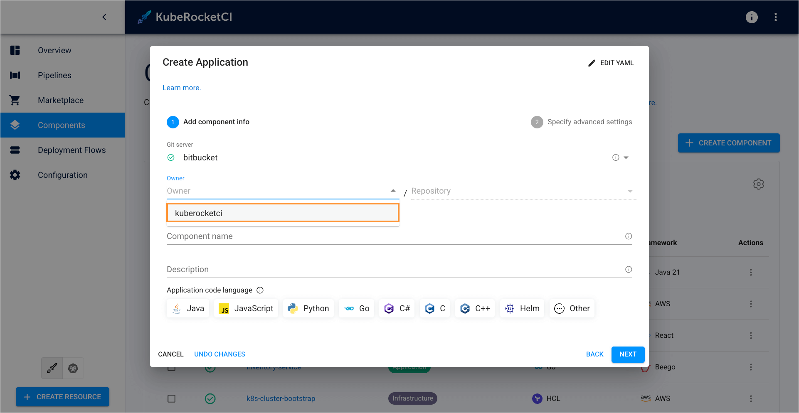
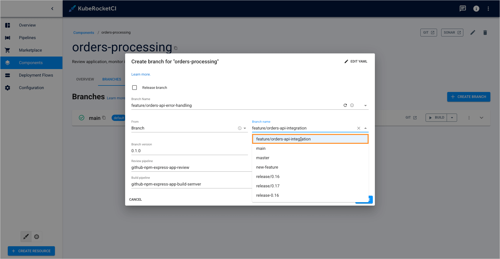
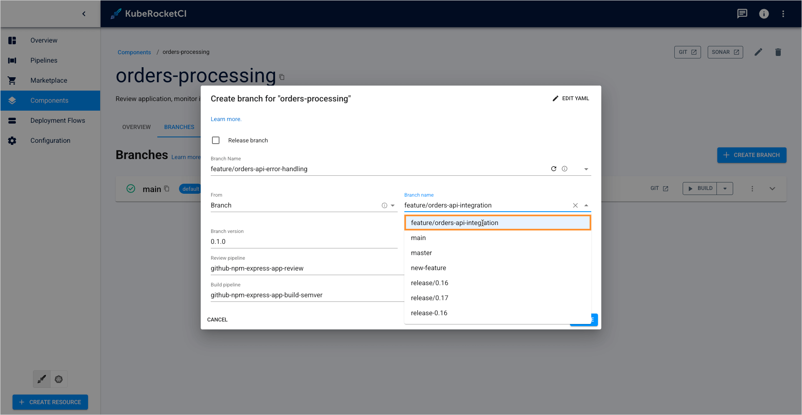

---

title: "Install GitFusion"
description: "Integrate GitFusion with KubeRocketCI for quick Git resource review within the KubeRocketCI portal."
sidebar_label: "GitFusion"

---
<!-- markdownlint-disable MD025 -->

# Install GitFusion

<head>
  <link rel="canonical" href="https://docs.kuberocketci.io/docs/operator-guide/extensions/git-discovery" />
</head>

This page describes installation of the [GitFusion](https://github.com/KubeRocketCI/gitfusion) component, allowing the portal to access Git-related information without requiring direct access to the Version Control System.

GitFusion enhances the developer experience by facilitating automated discovery of Git repositories, remote branches, and organizational structures across multiple Git providers. The service operates as an intermediary layer, securing communication between the KubeRocketCI portal and your Git infrastructure while enabling rich repository browsing capabilities.

## Prerequisites

To install GitFusion, you need to first ensure that the following prerequisites are met:

- An [Ingress Controller](https://github.com/epam/edp-cluster-add-ons/tree/main/clusters/core/addons/ingress-nginx) is installed and configured.
- A [Keycloak](../auth/keycloak.md) instance is installed and configured with the necessary settings from the [kuberocketci-rbac](https://github.com/epam/edp-cluster-add-ons/tree/main/clusters/core/addons/kuberocketci-rbac) repository.
- A [SonarQube](../code-quality/sonarqube.md) instance is installed and configured.
- A [Dependency-Track](../devsecops/dependency-track.md) instance is installed and configured.
- A [Krakend](./krakend.md) instance is installed and configured using edp-cluster-add-ons.

## Installation

:::warning
When integrating GitFusion with Bitbucket repositories, ensure your Bitbucket app password includes the `account:read` permission scope. Detailed instructions for configuring Bitbucket app passwords with appropriate permissions are available in the [Add Git Server](../../user-guide/add-git-server.md) documentation.
:::

To enable the GitFusion integration in KubeRocketCI, follow the steps below:

1. Activate GitFusion service deployment by modifying the `edp-install` Helm chart configuration. Set the `gitfusion.enabled` flag to `true` in your `values.yaml` file:

    ```yaml title="values.yaml"
    gitfusion:
      enabled: true
    ```

2. Configure the KrakenD API Gateway to expose GitFusion endpoints by modifying its routing configuration.

    :::note
    Reference KrakenD configurations in the [edp-cluster-add-ons](https://github.com/epam/edp-cluster-add-ons/tree/main/clusters/core/addons/krakend) repository.
    For more information on how to work with edp-cluster-add-ons, please refer to the [Install via Add-Ons](../add-ons-overview.md) page.
    :::

    1. Clone your forked copy of the [edp-cluster-add-ons](https://github.com/epam/edp-cluster-add-ons) repository.

    2. Access the KrakenD configuration directory at `clusters/core/addons/krakend` and modify the `values.yaml` file to include the GitFusion API endpoints:

        <details>
          <summary><b>values.yaml</b></summary>

        Add new GitFusion API endpoints to the `krakend.config` section:
        ```yaml
        krakend:
          config: |
            {
              "$schema": "https://www.krakend.io/schema/krakend.json",
              "version": 3,
              "name": "KrakenD - API Gateway",
              "timeout": "6000ms",
              "cache_ttl": "300s",
              "output_encoding": "json",
              "client_tls": {
                "@comment": "Skip SSL verification when connecting to backends",
                "allow_insecure_connections": true
              },
              "extra_config": {
                "router": {
                  "logger_skip_paths": [
                    "/__health"
                  ]
                },
                "auth/jwk-client": {
                    "@comment": "Enable a JWK shared cache amongst all endpoints of 60 minutes",
                    "shared_cache_duration": 3600
                }
              },
              "endpoints": [
                {
                  "endpoint": "/widgets/sonarqube/measures/component",
                  "method": "GET",
                  "output_encoding": "json",
                  "input_query_strings": [
                    "component",
                    "metricKeys"
                  ],
                  "extra_config": {
                    "auth/validator": {
                      "alg": "RS256",
                      "cache_duration": 3600,
                      "cache": true,
                      "disable_jwk_security": false,
                      "jwk_url": "{{ env "JWK_URL" }}"
                    }
                  },
                  "backend": [
                    {
                      "url_pattern": "/api/measures/component",
                      "encoding": "json",
                      "sd": "static",
                      "method": "GET",
                      "host": [
                        "{{ env "SONARQUBE_URL" }}"
                      ],
                      "extra_config": {
                        "qos/http-cache": {},
                        "modifier/martian": {
                          "header.Append": {
                            "scope": [
                              "request"
                            ],
                            "name": "Authorization",
                            "value": "Basic {{ env "SONARQUBE_TOKEN" }}"
                          }
                        }
                      }
                    }
                  ]
                },
                {
                  "endpoint": "/widgets/deptrack/project",
                  "method": "GET",
                  "output_encoding": "json",
                  "input_query_strings": [
                    "name"
                  ],
                  "extra_config": {
                    "auth/validator": {
                      "alg": "RS256",
                      "cache_duration": 3600,
                      "cache": true,
                      "disable_jwk_security": false,
                      "jwk_url": "{{ env "JWK_URL" }}"
                    }
                  },
                  "backend": [
                    {
                      "url_pattern": "/api/v1/project",
                      "encoding": "json",
                      "sd": "static",
                      "method": "GET",
                      "host": [
                        "{{ env "DEPTRACK_URL" }}"
                      ],
                      "is_collection": true,
                      "extra_config": {
                        "qos/http-cache": {},
                        "modifier/martian": {
                          "header.Append": {
                            "scope": [
                              "request"
                            ],
                            "name": "X-Api-Key",
                            "value": "{{ env "DEPTRACK_TOKEN" }}"
                          }
                        }
                      }
                    }
                  ]
                },
                {
                  "endpoint": "/widgets/deptrack/metrics/project/{uuid}/current",
                  "method": "GET",
                  "output_encoding": "json",
                  "input_query_strings": [
                    "name"
                  ],
                  "extra_config": {
                    "auth/validator": {
                      "alg": "RS256",
                      "cache_duration": 3600,
                      "cache": true,
                      "disable_jwk_security": false,
                      "jwk_url": "{{ env "JWK_URL" }}"
                    }
                  },
                  "backend": [
                    {
                      "url_pattern": "/api/v1/metrics/project/{uuid}/current",
                      "encoding": "json",
                      "sd": "static",
                      "method": "GET",
                      "host": [
                        "{{ env "DEPTRACK_URL" }}"
                      ],
                      "is_collection": false,
                      "extra_config": {
                        "qos/http-cache": {},
                        "modifier/martian": {
                          "header.Append": {
                            "scope": [
                              "request"
                            ],
                            "name": "X-Api-Key",
                            "value": "{{ env "DEPTRACK_TOKEN" }}"
                          }
                        }
                      }
                    }
                  ]
                },
                {
                  "endpoint": "/search/logs",
                  "method": "POST",
                  "output_encoding": "json",
                  "extra_config": {
                    "auth/validator": {
                      "alg": "RS256",
                      "cache_duration": 3600,
                      "cache": true,
                      "disable_jwk_security": false,
                      "jwk_url": "{{ env "JWK_URL" }}"
                    }
                  },
                  "backend": [
                    {
                      "url_pattern": "/logstash-edp-*/_search",
                      "method": "POST",
                      "host": [
                        "{{ env "OPENSEARCH_URL" }}"
                      ],
                      "encoding": "json",
                      "extra_config": {
                        "qos/http-cache": {},
                        "modifier/martian": {
                          "header.Append": {
                            "scope": [
                              "request"
                            ],
                            "name": "Authorization",
                            "value": "Basic {{ env "OPENSEARCH_CREDS" }}"
                          }
                        }
                      }
                    }
                  ]
                },
                {
                  "endpoint": "/gitfusion/repositories",
                  "method": "GET",
                  "input_query_strings": ["*"],
                  "output_encoding": "json",
                  "extra_config": {
                    "auth/validator": {
                      "alg": "RS256",
                      "cache_duration": 3600,
                      "cache": true,
                      "disable_jwk_security": false,
                      "jwk_url": "{{ env "JWK_URL" }}"
                    }
                  },
                  "backend": [
                    {
                      "url_pattern": "/api/v1/repositories",
                      "encoding": "json",
                      "sd": "static",
                      "method": "GET",
                      "host": [
                        "{{ env "GITFUSION_URL" }}"
                      ],
                      "extra_config": {
                        "qos/http-cache": {}
                      }
                    }
                  ]
                },
                {
                  "endpoint": "/gitfusion/repository",
                  "method": "GET",
                  "input_query_strings": ["*"],
                  "output_encoding": "json",
                  "extra_config": {
                    "auth/validator": {
                      "alg": "RS256",
                      "cache_duration": 3600,
                      "cache": true,
                      "disable_jwk_security": false,
                      "jwk_url": "{{ env "JWK_URL" }}"
                    }
                  },
                  "backend": [
                    {
                      "url_pattern": "/api/v1/repository",
                      "encoding": "json",
                      "sd": "static",
                      "method": "GET",
                      "host": [
                        "{{ env "GITFUSION_URL" }}"
                      ],
                      "extra_config": {
                        "qos/http-cache": {}
                      }
                    }
                  ]
                },
                {
                  "endpoint": "/gitfusion/organizations",
                  "method": "GET",
                  "input_query_strings": ["*"],
                  "output_encoding": "json",
                  "extra_config": {
                    "auth/validator": {
                      "alg": "RS256",
                      "cache_duration": 3600,
                      "cache": true,
                      "disable_jwk_security": false,
                      "jwk_url": "{{ env "JWK_URL" }}"
                    }
                  },
                  "backend": [
                    {
                      "url_pattern": "/api/v1/user/organizations",
                      "encoding": "json",
                      "sd": "static",
                      "method": "GET",
                      "host": [
                        "{{ env "GITFUSION_URL" }}"
                      ],
                      "extra_config": {
                        "qos/http-cache": {}
                      }
                    }
                  ]
                },
                {
                  "endpoint": "/gitfusion/branches",
                  "method": "GET",
                  "input_query_strings": ["*"],
                  "output_encoding": "json",
                  "extra_config": {
                    "auth/validator": {
                      "alg": "RS256",
                      "cache_duration": 3600,
                      "cache": true,
                      "disable_jwk_security": false,
                      "jwk_url": "{{ env "JWK_URL" }}"
                    }
                  },
                  "backend": [
                    {
                      "url_pattern": "/api/v1/branches",
                      "encoding": "json",
                      "sd": "static",
                      "method": "GET",
                      "host": [
                        "{{ env "GITFUSION_URL" }}"
                      ],
                      "extra_config": {
                        "qos/http-cache": {}
                      }
                    }
                  ]
                },
                {
                  "endpoint": "/gitfusion/invalidate",
                  "method": "POST",
                  "input_query_strings": ["*"],
                  "output_encoding": "json",
                  "extra_config": {
                    "auth/validator": {
                      "alg": "RS256",
                      "cache_duration": 3600,
                      "cache": true,
                      "disable_jwk_security": false,
                      "jwk_url": "{{ env "JWK_URL" }}"
                    }
                  },
                  "backend": [
                    {
                      "url_pattern": "/api/v1/cache/invalidate",
                      "encoding": "json",
                      "sd": "static",
                      "method": "DELETE",
                      "host": [
                        "{{ env "GITFUSION_URL" }}"
                      ],
                      "extra_config": {
                        "qos/http-cache": {}
                      }
                    }
                  ]
                }
              ]
            }
        ```

        </details>

    3. Configure the KrakenD secret to include GitFusion service connectivity details.

        :::note
        The `GITFUSION_URL` variable should point to the GitFusion service URL, e.g., `http://gitfusion.<krci-namespace>:8080`.
        :::

        Modify the `krakend` secret configuration to include the `GITFUSION_URL` environment variable:

        ```yaml title="KrakenD secret"
        kind: Secret
        apiVersion: v1
        metadata:
          name: krakend
          namespace: krakend
        data:
          ...
          GITFUSION_URL: http://gitfusion.<krci-namespace>:8080
        type: Opaque
        ```

        For environments utilizing External Secrets Operator with AWS Parameter Store, add the `GITFUSION_URL` variable to your Parameter Store configuration:

        ```yaml title="AWS Parameter Store"
        {
          "SONARQUBE_URL": "http://sonar.sonar:9000",
          "SONARQUBE_TOKEN": "<sonarqube-token",
          "DEPTRACK_URL": "http://dependency-track-api-server.dependency-track:8080",
          "DEPTRACK_TOKEN": "<dependency-track-token>",
          "JWK_URL": "https://keycloak.example.com/realms/<realmName>/protocol/openid-connect/certs",
          "OPENSEARCH_URL": "https://opensearch-cluster-master.logging:9200",
          "OPENSEARCH_CREDS": "opensearch-base64-encoded-credentials",
          "GITFUSION_URL": "http://gitfusion.<krci-namespace>:8080"
        }
        ```

    4. Save your modifications by committing and pushing the updated files to the `edp-cluster-add-ons` repository.

    5. Apply the configuration changes by accessing Argo CD and synchronizing the KrakenD application deployment.

## Verification

Once GitFusion deployment is complete, validate the integration functionality through the following testing procedures:

### Component Discovery

1. Navigate to **KubeRocketCI portal** -> **Components**.

2. On the **Components** page, click **+ Create component** -> **Application** -> **Import**.

3. Within the **Create Application** dialog, use the **Owner** dropdown to select your Git account (configured during Git Server setup):

    

4. Browse available repositories using the **Repository** dropdown to select the desired application for import:

    

### Creating Branches

1. Return to the **KubeRocketCI portal**, access **Components**, and select a specific component by clicking its name.

2. Switch to the **Branches** tab within the component details view and click **+ Create branch**.

3. In the **Create branch** dialog, interact with the branch name field to display the list of remotely available branches:

    

## Related Articles

- [Add Application](../../user-guide/add-application.md)
- [Manage Branches](../../user-guide/manage-branches.md)
- [KrakenD Integration](./krakend.md)
