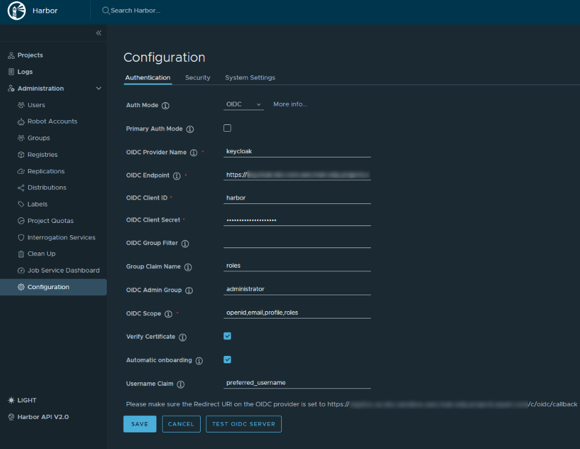

# Harbor OIDC Configuration

This page provides instructions for configuring [OIDC authorization](https://openid.net/connect/) for Harbor. This enables the use of Single Sign-On (SSO) for authorization in Harbor and allows centralized control over user access and rights through a single configuration point.

## Prerequisites

Before the beginning, ensure your cluster meets the following requirements:

* [Keycloak](install-keycloak.md) is installed;
* [EPAM Delivery Platform](install-edp.md) is installed.

## Configure Keycloak

To start from, configure Keycloak by creating two Kubernetes resources. Follow the steps below to succeed:

1. Generate the **keycloak-client-harbor-secret** for Keycloak using either the commands below or using the External Secrets Operator:

  ```bash
  keycloak_client_harbor_secret=$(openssl rand -base64 32 | head -c 32)
  ```

  ```bash
  kubectl -n edp create secret generic keycloak-client-harbor-secret \
      --from-literal=cookie-secret=${keycloak_client_harbor_secret}
  ```

2. Create the KeycloakClient custom resource by applying the HarborKeycloakClient.yaml file in the edp namespace. This custom resource will use the `keycloak-client-harbor-secret` to include the harbor client. After the download, you will receive the created harbor client, and the password that is actually the value of the Kubernetes secret from the step 1:

  ??? note "View: HarborKeycloakClient.yaml"
      ```yaml
      apiVersion: v1.edp.epam.com/v1
      kind: KeycloakClient
      metadata:
        name: harbor
      spec:
        advancedProtocolMappers: true
        clientId: harbor
        directAccess: true
        public: false
        secret: keycloak-client-harbor-secret
        defaultClientScopes:
          - profile
          - email
          - roles
        targetRealm: control-plane
        webUrl: <harbor_endpoint>
        protocolMappers:
          - name: roles
            protocol: openid-connect
            protocolMapper: oidc-usermodel-realm-role-mapper
            config:
              access.token.claim: true
              claim.name: roles
              id.token.claim: true
              userinfo.token.claim: true
              multivalued: true
      ```

## Configure Harbor

The next stage is to configure Harbor. Proceed with following the steps below:

1. Log in to Harbor UI with an account that has Harbor system administrator privileges. To get the administrator password, execute the command below:

  ```bash
  kubectl get secret harbor -n harbor -o jsonpath='{.data.HARBOR_ADMIN_PASSWORD}' | base64 --decode
  ```

2. Navigate to **Administration** -> **Configuration** -> **Authentication**. Configure OIDC using the parameters below:

  ```
  auth_mode: oidc_auth
  oidc_name: keycloak
  oidc_endpoint: <keycloak_endpoint>/auth/realms/control-plane
  oidc_client_id: harbor
  oidc_client_secret: <keycloak-client-harbor-secret>
  oidc_groups_claim: roles
  oidc_admin_group: administrator
  oidc_scope: openid,email,profile,roles
  verify_certificate: true
  oidc_auto_onboard: true
  oidc_user_claim: preferred_username
  ```

  

As a result, users will be prompted to authenticate themselves when logging in to Harbor UI.


## Related Articles

* [Configure Access Token Lifetime](../faq.md#how-to-change-the-lifespan-of-an-access-token-that-is-used-for-headlamp-and-oidc-login-plugin)
* [EKS OIDC With Keycloak](configure-keycloak-oidc-eks.md)
* [External Secrets Operator Integration](external-secrets-operator-integration.md)
* [Integrate Harbor With EDP Pipelines](container-registry-harbor-integration-tekton-ci.md)
