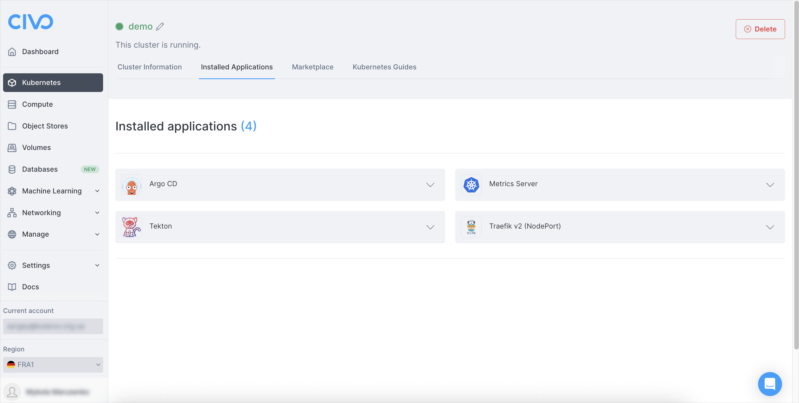
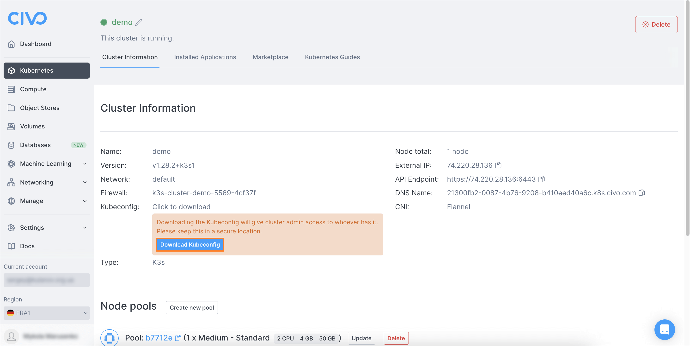
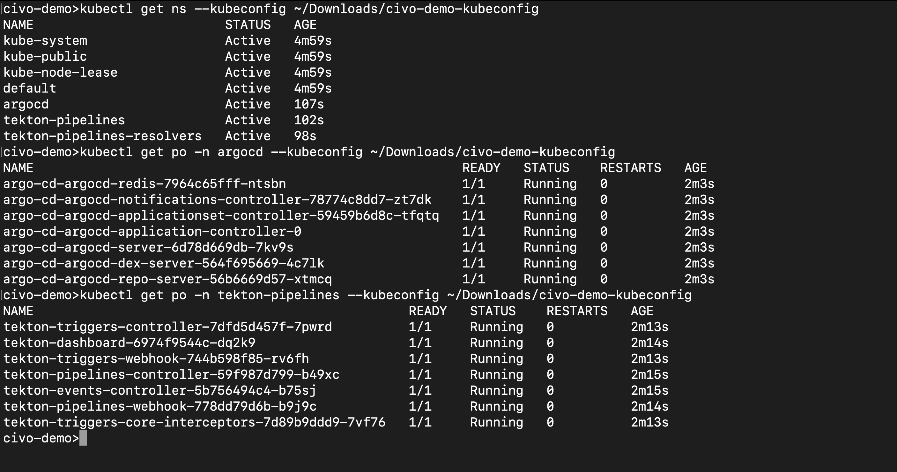
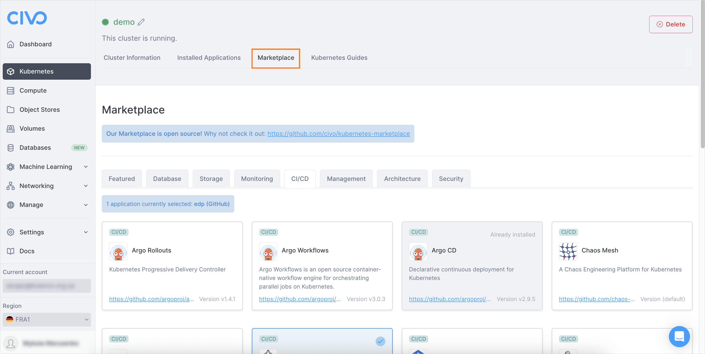
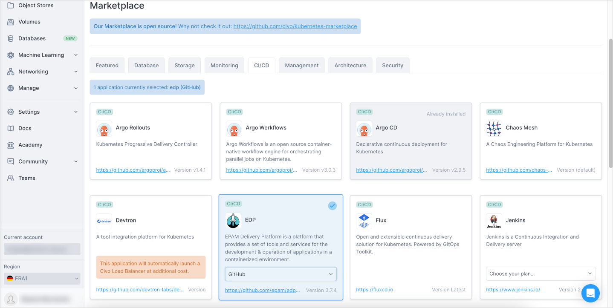
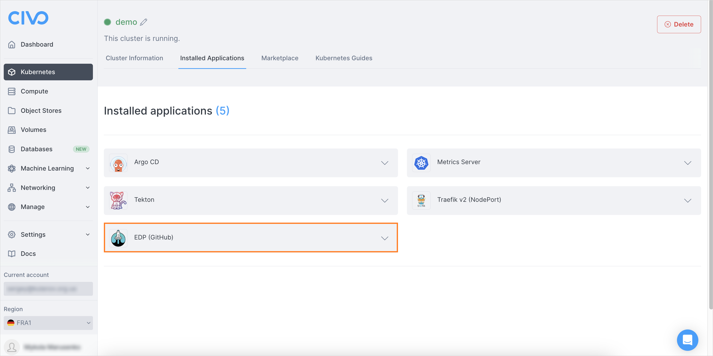
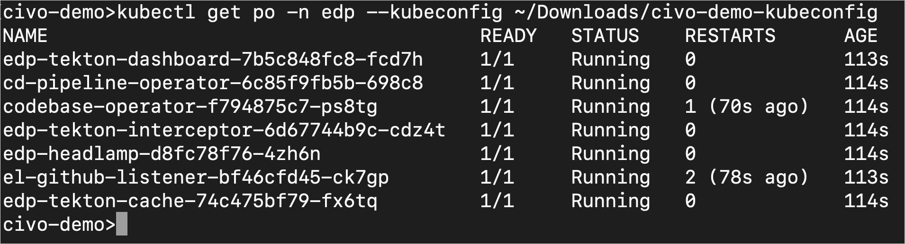
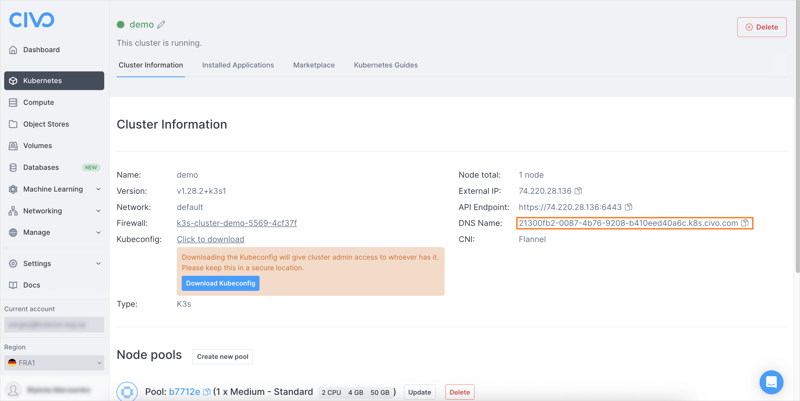
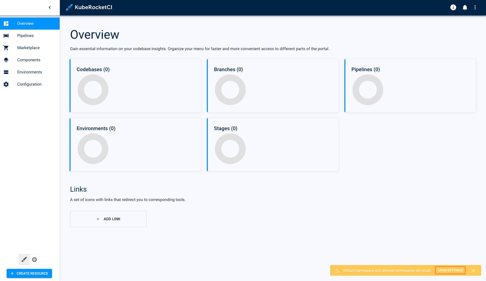

# Install via Civo Marketplace

This documentation provides detailed instructions on how to install the KubeRocketCI platform via [Civo Marketplace](https://www.civo.com/marketplace/kuberocketci).
As a prerequisite, make sure to [sign up](https://dashboard.civo.com/signup) on Civo.

<div style={{ display: 'flex', justifyContent: 'center' }}>
<iframe width="560" height="315" src="https://www.youtube.com/embed/QjZoPnIKDtA" title="Install KubeRocketCI via Civo" frameborder="0" allow="accelerometer; autoplay; clipboard-write; encrypted-media; gyroscope; picture-in-picture" allowfullscreen="allowfullscreen"></iframe>
</div>

## Launch Cluster

The first step of the installation procedure is to launch the cluster. Please refer to the [official instructions](https://www.civo.com/docs/kubernetes/create-a-cluster) that describe this process in detail.
To succeed, follow the steps below:

1. Log in to your personal account.

2. Create a new Kubernetes cluster with the following parameters. Please refer to the [official guidelines](https://www.civo.com/docs/kubernetes/create-a-cluster) for more details:

    * **Name**: `demo`
    * **How many nodes**: 1
    * **Select size**: Type: Standard, Size: Medium
    * **Network**: Default
    * **Firewall**: Create a new firewall with the 443 and 6443 ports opened
    * **Advanced options**: Kubernetes version: latest (currently 1.28.2)
    * **Marketplace**: Choose the Argo CD and Tekton stacks

3. Wait till the cluster is created.

    :::note
      The cluster deployment takes around two minutes. After cluster deployment, additional 5 minutes are required for both Argo CD and Tekton stacks to get deployed.
    :::

4. As soon as cluster is deployed, ensure all the marketplace applications are installed, too:

    

5. Download and apply the kubeconfig file:

    

6. Ensure all the pods are up and running in both the Tekton and Argo CD namespaces after 5 minutes of waiting. Restart deployments if the pods are failed to deploy:

    ```bash
    kubectl get ns
    kubectl get pods -n tekton-pipelines
    kubectl get pods -n argocd
    ```

    

## Install KubeRocketCI

As soon as the cluster is deployed, it is time to install the EDP application.

1. In the Civo portal, navigate to **Marketplace** -> **CI/CD**:

    

2. Select EDP and choose which Version Control Systems you would prefer to integrate it with and click the **Install Apps** button:

    

3. Wait till the EDP app appears in the **Installed applications** list:

    

4. Wait till all the pods are up and running. Use the `kubectl get pods` command to check the status of the pods:

    ```bash
    kubectl get pods -n edp
    ```

    

5. As soon as all the pods are deployed. Navigate to the **Cluster Information** tab and copy the DNS name:

    

6. In the new browser tab, access the Portal UI by typing the URL according to the `https://portal-edp.<DNS_name>` format.

7. Accept the security warning and click the **service access token** link to open the [instructions](https://headlamp.dev/docs/latest/installation/#create-a-service-account-token) on how to get a token to log in to the Portal UI.

8. As soon as the token is created, paste it in the **ID token** field and click the **Authenticate** button.

9. Click the notification in the bottom left corner to open the Cluster Settings menu:

    

10. In the Cluster Settings menu, enter **edp** in both default and allowed namespaces and click the **Back** button:

    :::note
      Don't forget to click the **+** button to add the allowed namespace.
    :::

    

Congratulations! You have just installed the KubeRocketCI platform on the Civo cluster. Now you are ready to proceed with integrating KubeRocketCI with all the necessary third-party tools.
Navigate to the [Integrate SonarQube](../quick-start/integrate-sonarcloud.md) page to proceed with onboarding KubeRocketCI.

## Related Articles

* [Install via AWS Marketplace](aws-marketplace-install.md)
* [Install KubeRocketCI](install-kuberocketci.mdx)
* [Integrate SonarQube](../quick-start/integrate-sonarcloud.md)
