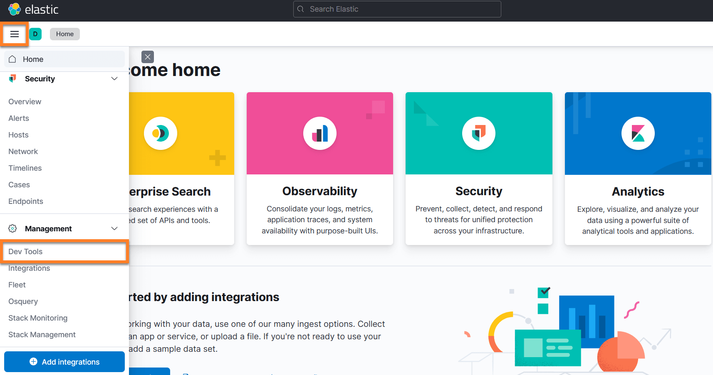
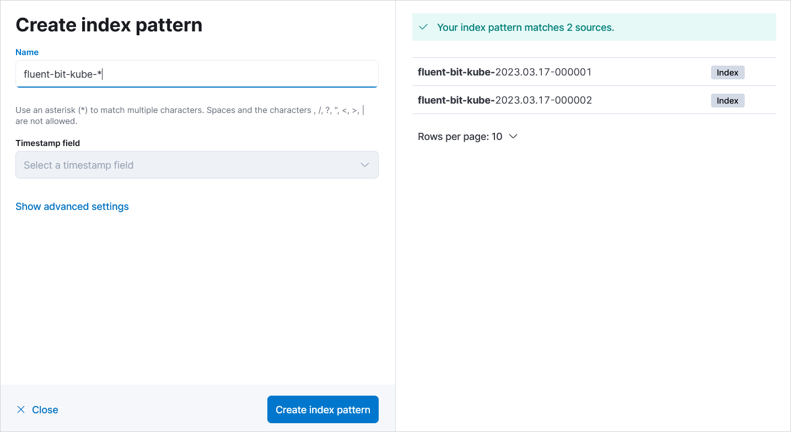
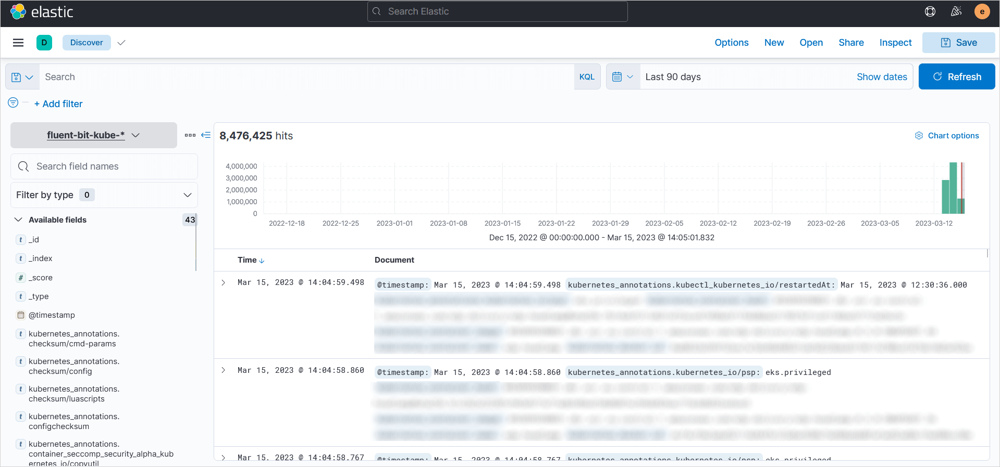

# Aggregate Application Logs Using EFK Stack

This documentation describes the advantages of EFK stack over the traditional ELK stack, explains the value that this stack brings to EDP and instructs how to set up the EFK stack to integrate the advanced logging system with your application.

### ELK Stack Overview
The __ELK__ (Elasticsearch, Logstash and Kibana) stack gives the ability to aggregate logs from all the managed systems and applications, analyze these logs and create visualizations for application and infrastructure monitoring, faster troubleshooting, security analytics and more.

Here is a brief description of the ELK stack default components:

* __Beats family__ - The logs shipping tool that conveys logs from the source locations, such as Filebeat, Metricbeat, Packetbeat, etc. Beats can work instead of Logstash or along with it.
* __Logstash__ - The log processing framework for log collecting, processing, storing and searching activities.
* __Elasticsearch__ - The distributed search and analytics engine based on [Lucene](https://lucene.apache.org/) Java library.
* __Kibana__ - The visualization engine that queries the data from Elasticsearch.


### EFK Stack Overview
We use __FEK (also called EFK)__ (Fluent Bit, Elasticsearch, Kibana) stack in Kubernetes instead of __ELK__ because this stack provides us with the support for [Logsight](https://docs.logsight.ai/#/) for Stage Verification and Incident Detection. In addition to it, __Fluent Bit__ has a smaller memory fingerprint than Logstash.
__Fluent Bit__ has the Inputs, Parsers, Filters and Outputs plugins similarly to Logstash.


### Automate Elasticsearch Index Rollover With ILM

In this guide, index rollover with the Index Lifecycle Management [ILM](https://www.elastic.co/guide/en/elasticsearch/reference/current/getting-started-index-lifecycle-management.html) is automated in the FEK stack.

The resources can be created via API using curl, Postman, Kibana Dev Tools console or via GUI.
They are going to be created them using Kibana Dev Tools.

1. Go to `Management` → `Dev Tools` in the Kibana dashboard:

   

2. Create index lifecycle policy with the index [rollover](https://www.elastic.co/guide/en/elasticsearch/reference/8.6/ilm-rollover.html):

  !!! Note
      This policy can also be created in GUI in `Management` → `Stack Management` → `Index Lifecycle Policies`.

  [Index Lifecycle](https://www.elastic.co/guide/en/elasticsearch/reference/current/ilm-index-lifecycle.html) has several phases: Hot, Warm, Cold, Frozen, Delete. Indices also have different [priorities](https://www.elastic.co/guide/en/elasticsearch/reference/current/ilm-set-priority.html) in each phase. The warmer the phase, the higher the priority is supposed to be, e.g., 100 for the hot phase, 50 for the warm phase, and 0 for the cold phase.

  In this Use Case, only the Hot and Delete phases are configured. So an index will be created, rolled over to a new index when 1gb in size or 1day in time and deleted in 7 days.
  The rollover may not happen exactly at 1GB because it depends on how often Kibana checks the index size. Kibana usually checks the index size every 10 minutes but this can be changed by setting the [indices.lifecycle.poll_interval](https://www.elastic.co/guide/en/elasticsearch/reference/current/ilm-settings.html) monitoring timer.

  The index lifecycle policy example:

   <details>
      <Summary><b>Index Lifecycle Policy</b></Summary>
    ```json
    PUT _ilm/policy/fluent-bit-policy
    {
      "policy": {
        "phases": {
          "hot": {
            "min_age": "0ms",
            "actions": {
              "set_priority": {
                "priority": 100
              },
              "rollover": {
                "max_size": "1gb",
                "max_primary_shard_size": "1gb",
                "max_age": "1d"
              }
            }
          },
          "delete": {
            "min_age": "7d",
            "actions": {
              "delete": {
                "delete_searchable_snapshot": true
              }
            }
          }
        }
      }
    }
    ```
   </details>

  Insert the code above into the `Dev Tools` and click the arrow to send the `PUT` request.

3. Create an [index template](https://www.elastic.co/guide/en/elasticsearch/reference/current/index-templates.html) so that a new index is created according to this template after the rollover:

  !!! Note
      This policy can also be created in GUI in `Management` → `Stack Management` → `Index Management` → `Index Templates`.

  Expand the menu below to see the index template example:

   <details>
      <Summary><b>Index Template</b></Summary>
    ```json
    PUT /_index_template/fluent-bit
    {
      "index_patterns": ["fluent-bit-kube-*"],
      "template": {
        "settings": {
          "index": {
            "lifecycle": {
              "name": "fluent-bit-policy",
              "rollover_alias": "fluent-bit-kube"
            },
            "number_of_shards": "1",
            "number_of_replicas": "0"
          }
        }
      }
    }
    ```
   </details>

  !!! Note
      * `index.lifecycle.rollover_alias` is required when using a policy containing the rollover action and specifies which alias to rollover on behalf of this index. The intention here is that the rollover [alias](https://www.elastic.co/guide/en/elasticsearch/reference/8.6/aliases.html) is also defined on the index.

      * `number_of_shards` is the quantity of the primary shards. Elasticsearch index is really just a logical grouping of one or more physical shards, where each shard is actually a self-contained index. By distributing the documents in an index across multiple shards and distributing those shards across multiple nodes, Elasticsearch can ensure redundancy, which both protects against hardware failures and increases query capacity as nodes are added to a cluster. As the cluster grows (or shrinks), Elasticsearch automatically migrates shards to re-balance the cluster. Please refer to the official documentation [here](https://www.elastic.co/guide/en/elasticsearch/reference/current/scalability.html).

      * `number_of_replicas` is the number of replica shards. A replica shard is a copy of a primary shard. Elasticsearch will never assign a replica to the same node as the primary shard, so make sure you have more than one node in your Elasticsearch cluster if you need to use replica shards. The Elasticsearch cluster details and the quantity of nodes can be checked with:

          ```json
          GET _cluster/health
          ```

      Since we use one node, the number_of_shards  is 1 and number_of_replicas is 0. If you put more replicas within one node, your index will get yellow status in Kibana, yet still be working.

4. Create an empty [index](https://www.elastic.co/guide/en/elasticsearch/reference/current/indices-create-index.html) with write permissions:

  !!! Note
      This index can also be created in GUI in `Management` → `Stack Management` → `Index Management` → `Indices`.

  Index example with the [date math](https://www.elastic.co/guide/en/elasticsearch/reference/current/api-conventions.html) format:

   <details>
      <Summary><b>Index</b></Summary>
    ```json
    # URI encoded /<fluent-bit-kube-{now/d}-000001>
    PUT /%3Cfluent-bit-kube-%7Bnow%2Fd%7D-000001%3E
    {
      "aliases": {
        "fluent-bit-kube": {
          "is_write_index": true
        }
      }
    }
    ```
   </details>

  The code above will create an index in the`{index_name}-{current_date}-{rollover_index_increment}` format. For example: `fluent-bit-kube-2023.03.17-000001`.

  Please refer to the official documentation on the index rollover with Date Math [here](https://www.elastic.co/guide/en/elasticsearch/reference/master/indices-rollover-index.html#_using_date_math_with_the_rollover_api).

  !!! Note
      It is also possible to use index pattern below if the date math format does not seem applicable:

      <details>
          <Summary><b>Index</b></Summary>
        ```json
        PUT fluent-bit-kube-000001
        {
          "aliases": {
            "fluent-bit-kube": {
              "is_write_index": true
            }
          }
        }
        ```
      </details>

  Check the status of the created index:

    ```json
    GET fluent-bit-kube*-000001/_ilm/explain
    ```

5. Configure Fluent Bit. Play attention to the [Elasticsearch Output](https://docs.fluentbit.io/manual/pipeline/outputs/elasticsearch) plugin configuration.

  The important fields in the `[OUTPUT]` section are `Index fluent-bit-kube` since we should use the index with the same name as Rollover Alias in Kibana and `Logstash_Format Off` as we use the Rollover index pattern in Kibana that increments by 1.

  ConfigMap example with [Configuration Variables](https://docs.fluentbit.io/manual/v/1.0/configuration/variables) for `HTTP_User` and `HTTP_Passwd`:

   <details>
      <Summary><b>ConfigMap fluent-bit</b></Summary>
    ```yaml
    data:
      fluent-bit.conf: |
        [SERVICE]
            Daemon Off
            Flush 10
            Log_Level info
            Parsers_File parsers.conf
            Parsers_File custom_parsers.conf
            HTTP_Server On
            HTTP_Listen 0.0.0.0
            HTTP_Port 2020
            Health_Check On

        [INPUT]
            Name tail
            Tag kube.*
            Path /var/log/containers/*.log
            Parser docker
            Mem_Buf_Limit 5MB
            Skip_Long_Lines Off
            Refresh_Interval 10
        [INPUT]
            Name systemd
            Tag host.*
            Systemd_Filter _SYSTEMD_UNIT=kubelet.service
            Read_From_Tail On
            Strip_Underscores On

        [FILTER]
            Name                kubernetes
            Match               kube.*
            Kube_Tag_Prefix     kube.var.log.containers.
            Kube_URL            https://kubernetes.default.svc:443
            Kube_CA_File        /var/run/secrets/kubernetes.io/serviceaccount/ca.crt
            Kube_Token_File     /var/run/secrets/kubernetes.io/serviceaccount/token
            Merge_Log           Off
            Merge_Log_Key       log_processed
            K8S-Logging.Parser  On
            K8S-Logging.Exclude On
        [FILTER]
            Name nest
            Match kube.*
            Operation lift
            Nested_under kubernetes
            Add_prefix kubernetes.
        [FILTER]
            Name modify
            Match kube.*
            Copy kubernetes.container_name tags.container
            Copy log message
            Copy kubernetes.container_image tags.image
            Copy kubernetes.namespace_name tags.namespace
        [FILTER]
            Name nest
            Match kube.*
            Operation nest
            Wildcard tags.*
            Nested_under tags
            Remove_prefix tags.

        [OUTPUT]
            Name            es
            Match           kube.*
            Index           fluent-bit-kube
            Host            elasticsearch-master
            Port            9200
            HTTP_User       ${ES_USER}
            HTTP_Passwd     ${ES_PASSWORD}
            Logstash_Format Off
            Time_Key       @timestamp
            Type            flb_type
            Replace_Dots    On
            Retry_Limit     False
            Trace_Error     Off
    ```
   </details>

6. Create index pattern (Data View starting from Kibana v8.0):

  Go to `Management` → `Stack Management` → `Kibana` → `Index patterns` and create an index with the `fluent-bit-kube-*` pattern:

  

7. Check logs in Kibana. Navigate to `Analytics` → `Discover`:

  

  !!! Note
      In addition, in the top-right corner of the `Discover` window, there is a button called `Inspect`. Clicking on it will reveal the query that Kibana is sending to Elasticsearch. These queries can be used in Dev Tools.

8. Monitor the created indices:

  ```json
  GET _cat/indices/fluent-bit-kube-*
  ```

  !!! Note
      Physically, the indices are located on the `elasticsearch` Kubernetes pod in `/usr/share/elasticsearch/data/nodes/0/indices`. It is recommended to backup indices only via [Snapshots](https://www.elastic.co/guide/en/elasticsearch/reference/current/snapshot-restore.html).

We've configured the index rollover process. Now the index will be rolled over to a new one once it reaches the indicated size or time in the policy, and old indices will be removed according to the policy as well.

When you create an empty index that corresponds to the pattern indicated in the index template, the index template attaches `rollover_alias` with the `fluent-bit-kube` name, policy and other configured data. Then the Fluent Bit Elasticsearch output plugin sends logs to the `Index fluent-bit-kube` rollover alias. The index rollover process is managed by ILM that increments our indices united by the `rollover_alias` and distributes the log data to the latest index.

### ILM Without Rollover Policy

It is also possible to manage index lifecycle without rollover indicated in the policy. If this is the case, this section will explain how to refactor the index to make it look that way: `fluent-bit-kube-2023.03.18`.

!!! Note
    The main drawback of this method is that the indices can be managed only by their creation date.

To manage index lifecycle without rollover policy, follow the steps below:

1. Create a Policy without `rollover` but with indices deletion:

   <details>
      <Summary><b>Index Lifecycle Policy</b></Summary>
    ```json
    PUT _ilm/policy/fluent-bit-policy
    {
      "policy": {
        "phases": {
          "hot": {
            "min_age": "0ms",
            "actions": {
              "set_priority": {
                "priority": 100
              }
            }
          },
          "delete": {
            "min_age": "7d",
            "actions": {
              "delete": {
                "delete_searchable_snapshot": true
              }
            }
          }
        }
      }
    }
    ```
   </details>

2. Create an index template with the `rollover_alias` parameter:

   <details>
      <Summary><b>Index Template</b></Summary>
    ```json
    PUT /_index_template/fluent-bit
    {
      "index_patterns": ["fluent-bit-kube-*"],
      "template": {
        "settings": {
          "index": {
            "lifecycle": {
              "name": "fluent-bit-policy",
              "rollover_alias": "fluent-bit-kube"
            },
            "number_of_shards": "1",
            "number_of_replicas": "0"
          }
        }
      }
    }
    ```
   </details>

3. Change the Fluent Bit `[OUTPUT]` config to this one:

   <details>
      <Summary><b>ConfigMap fluent-bit</b></Summary>
    ```yaml
    [OUTPUT]
        Name            es
        Match           kube.*
        Host            elasticsearch-master
        Port            9200
        HTTP_User       ${ES_USER}
        HTTP_Passwd     ${ES_PASSWORD}
        Logstash_Format On
        Logstash_Prefix fluent-bit-kube
        Logstash_DateFormat %Y.%m.%d
        Time_Key        @timestamp
        Type            flb_type
        Replace_Dots    On
        Retry_Limit     False
        Trace_Error     On
    ```
   </details>

4. Restart Fluent Bit pods.

Fluent Bit will be producing a new index every day with the new date in its name like in the `fluent-bit-kube-2023.03.18` name. Index deleting will be performed according to the policy.

### Tips on Fluent Bit Debugging

If you experience a lot of difficulties when dealing with Fluent Bit, this section may help you.<br />

Fluent Bit has docker images labelled `-debug`, e.g., `cr.fluentbit.io/fluent/fluent-bit:2.0.9-debug`.

Change that image in the Kubernetes Fluent Bit DaemonSet and add the `Trace_Error On` parameter to the `[OUTPUT]` section in the Fluent Bit configmap:

  ```yaml
  [OUTPUT]
    Trace_Error On
  ```

After adding the parameter above, you will start seeing more informative logs that will probably help you find out the reason of the problem.

### Related Articles
* [Index Lifecycle Management](https://www.elastic.co/guide/en/elasticsearch/reference/current/getting-started-index-lifecycle-management.html)
* [Elasticsearch Output](https://docs.fluentbit.io/manual/pipeline/outputs/elasticsearch)
