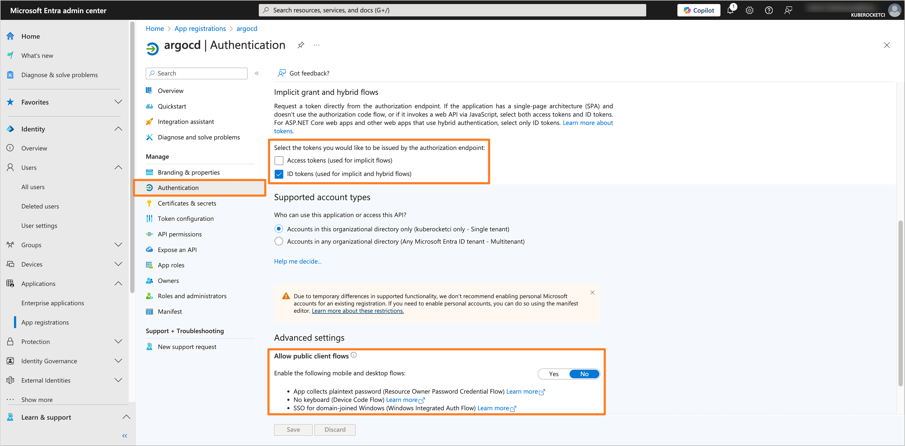
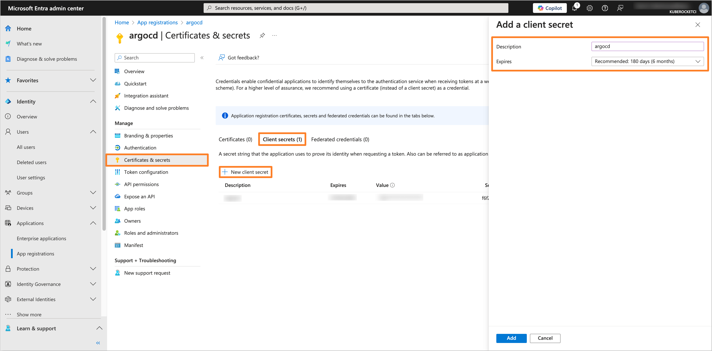
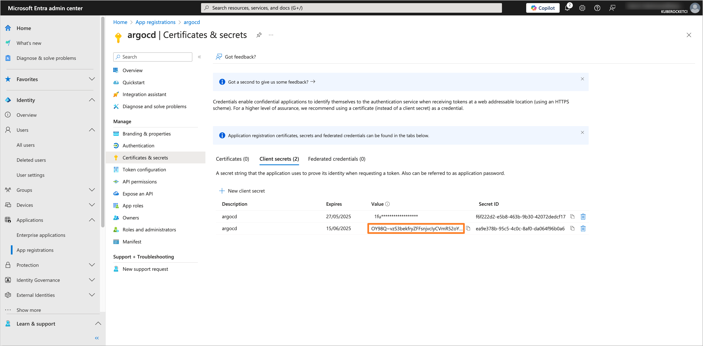
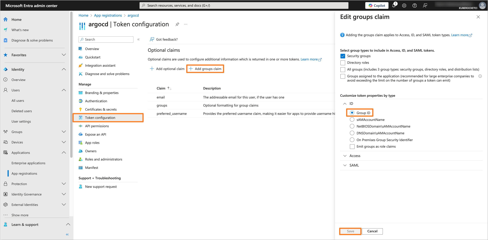
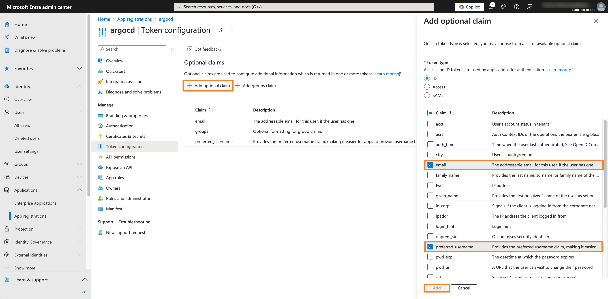
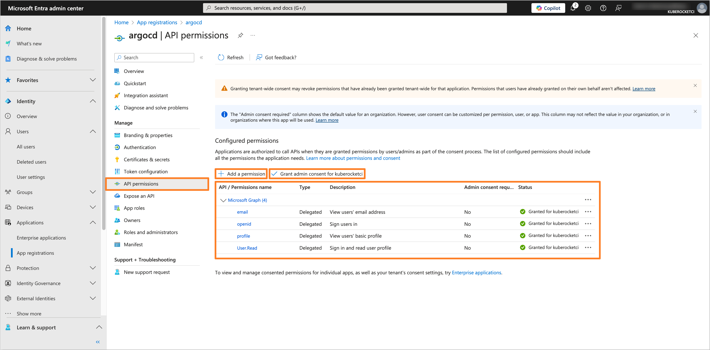
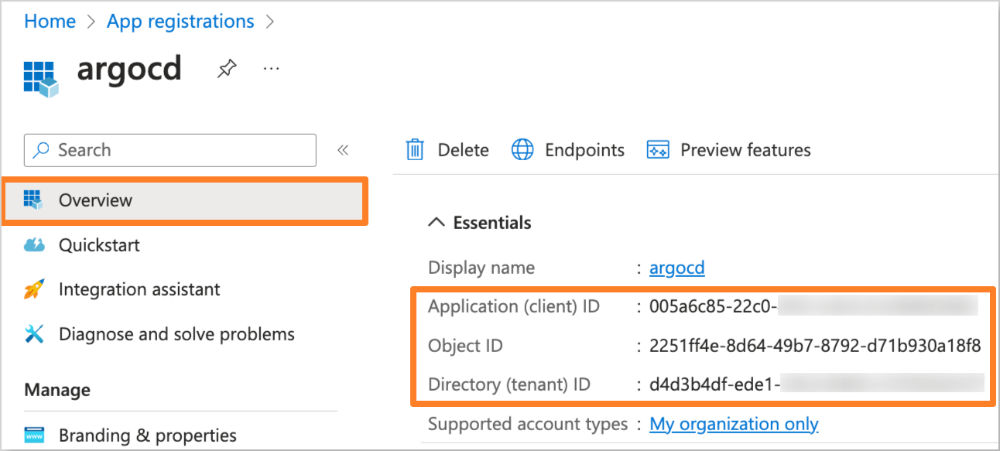
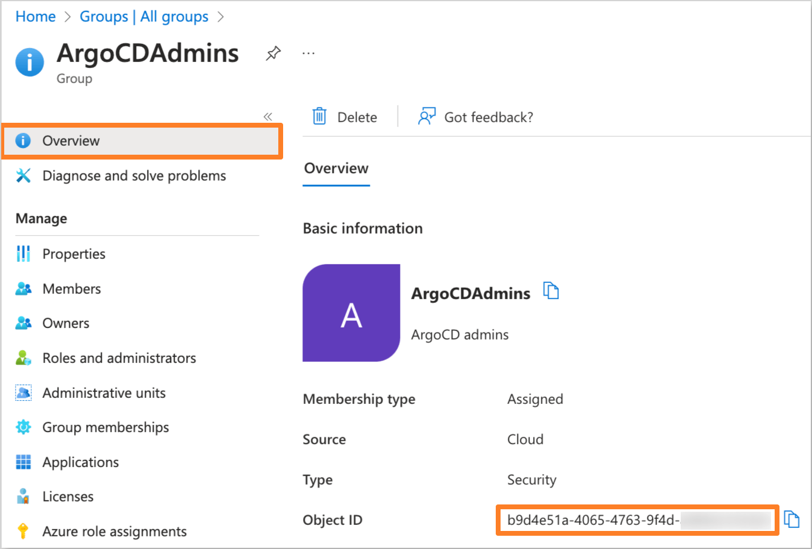
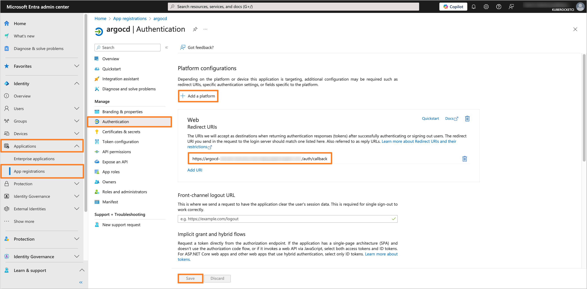

# Argo CD

This section provides instructions on how to configure OIDC authentication for the Argo CD using Microsoft Entra as the Identity Provider.

## Prerequisites

- Access to the [Microsoft Entra Admin Center](https://entra.microsoft.com/) with administrative privileges.
- Created Microsoft Entra Tenant.
- Installed Argo CD (can be installed during **Configuring Helm chart** step).
- Fork copy of the [edp-cluster-add-ons](https://github.com/epam/edp-cluster-add-ons) repository.
- (Optional) Installed External Secrets Operator.

## Configuring Microsoft Entra Application

To configure Microsoft Entra as the Identity Provider for the Argo CD, it is necessary to create and configure an Application in the Microsoft Entra Admin Center.

1. Log in to the [Microsoft Entra Admin Center](https://entra.microsoft.com/?feature.msaljs=true#home).

    

2. In the left sidebar menu, select **Applications** and click **App registrations**.

    

3. Click on the **New registration** button.

    

4. Fill in the required fields, such as **Name**, **Supported account types** and **Redirect URI** (You can skip setting the **Redirect URI** if you don't deploy Argo CD yet). Click **Register** to create the application.

    :::note
    The **Redirect URI** should be in the format `https://<Argo CD URL>/auth/callback`.
    :::

    

5. In the created application, navigate to the **Authentication** section from the left sidebar menu. In the **Implicit grant and hybrid flows** section, select **ID tokens** for the token type. In the **Allow public client flows** section, set the value to **No**.

    

6. Navigate to the **Certificates & secrets** section. In the **Client secrets** tab, click on the **New client secret** button to create a new secret. Fill in the required fields and click **Add**.

    

7. Copy the generated client secret value and store it securely. You will need this value to configure the Argo CD Helm chart.

    

8. Navigate to the **Token configuration** section and click on **Add group claim** button. Choose the group type as **Security Groups** and for the ID token type, select **Group ID**.

    

    Also, add the **preferred_username** and **email** optional claims.

    

9. Navigate to the **API permissions** section. Click on the **Add a permission** button. Select **Microsoft Graph** and then **Delegated permissions**. Add the following permissions:

    - **email**
    - **openid**
    - **profile**
    - **User.Read**

    

    After adding the permissions, click on the **Grant admin consent for 'Tenant name'** button to grant the required permissions.

## Creating the Groups

To manage access to the Argo CD, it is necessary to create groups in the Microsoft Entra Admin Center and assign users to them.

1. In the Microsoft Entra Admin Center, in the left sidebar menu, select **Groups** and then **All groups**. Click on **New group** button to create a new group(s) for users who will have access to Argo CD (e.g., `ArgoCDAdmins`, `ArgoCDReadOnly`, etc.).

    

2. Fill in the required fields, such as **Groups type** and **Group name**. In the **Members** section, add users who will be part of the group.

    

3. Click on the **Create** button and repeat this process for each required group.

## Configuring Argo CD Helm chart

To integrate Argo CD with configured Microsoft Entra Application, it is necessary to configure the Argo CD Helm chart. In this example, we will use the [edp-cluster-add-ons](https://github.com/epam/edp-cluster-add-ons) repository to deploy Argo CD to the Kubernetes (e.g. AWS EKS) cluster.

:::note
The Application data, such as **Application (client) ID** and **Directory (tenant) ID**, can be found in the **Overview** section of the Application in the Microsoft Entra Admin Center.

:::

:::note
The **Object ID** can be found in the **Overview** section of the group in the Microsoft Entra Admin Center.

:::

1. Navigate to the forked [Cluster Add-Ons repository](https://github.com/epam/edp-cluster-add-ons) and locate the `values.yaml` file in the `argo-cd` directory.

    Update the `values.yaml` file with the following values:

    ```yaml title="argo-cd/values.yaml"
    argo-cd:
      configs:
        cm:
          url: "https://<Argo CD URL>"
          application.instanceLabelKey: argocd.argoproj.io/instance-edp
          exec.enabled: true
          oidc.config: |
            name: Entra
            issuer: https://login.microsoftonline.com/<Directory (tenant) ID>/v2.0
            clientID: <Application (client) ID>
            clientSecret: $keycloak-client-argocd-secret:clientSecret
            requestedIDTokenClaims:
              groups:
                essential: true
                value: "SecurityGroup"
            requestedScopes:
              - openid
              - profile
              - email
        rbac:
          scopes: '[groups, email]'
          policy.csv: |
            # default global admins
            g, "<Object ID of ArgoCDAdmins group>", role:admin
            # Default global developers
            g, "<Object ID of ArgoCDReadOnly group>", role:readonly
    ```

    Replace the following placeholders with the actual values:

    - `<Argo CD URL>` - Endpoint of the Argo CD.
    - `<Directory (tenant) ID>` - Directory (tenant) ID of the Microsoft Entra Tenant.
    - `<Application (client) ID>` - Application (client) ID from the Microsoft Entra Application settings.
    - `<Object ID of ArgoCDAdmins group>` - Object ID of the **ArgoCDAdmins** group created in the Microsoft Entra Admin Center.
    - `<Object ID of ArgoCDReadOnly group>` - Object ID of the **ArgoCDReadOnly** group created in the Microsoft Entra Admin Center.

2. Update or create the `keycloak-client-argocd-secret` secret with the Application Client Secret value.

    - Using External Secrets Operator

      Be sure to update the AWS Parameter Store object path specified in the `argo-cd/values.yaml` file in the `eso.secretName` field with the Application Client Secret value.

      ```json title="AWS Parameter Store object"
      {
        "clientSecret": "<Application Client secret>"
      }
      ```

    - Manual approach

      Create the `keycloak-client-argocd-secret` secret manually using the following template:

      ```yaml title="keycloak-client-argocd-secret.yaml"
      apiVersion: v1
      kind: Secret
      metadata:
        name: keycloak-client-argocd-secret
        namespace: <namespace>
      data:
        clientSecret: <Application Client secret>
      ```

3. After updating the `values.yaml` file, commit the changes to the repository and apply the changes with Helm or Argo CD.

4. Navigate to the Microsoft Entra Application and add the **Redirect URI** in the **Authentication** section if you haven't done it before.

    :::note
    The **Redirect URI** should be in the format `https://<Argo CD URL>/auth/callback`.
    :::

    

5. Verify that the OIDC authentication is configured correctly by logging in to Argo CD using the **Log in via Entra** option.

    

After completing these steps, the Argo CD will be configured to use Microsoft Entra as the Identity Provider for authentication. Users will be able to log in to the Argo CD using their Microsoft Entra credentials.

## Related Articles

- [OpenID Connect Authentication Overview](./oidc-authentication-overview.md)
