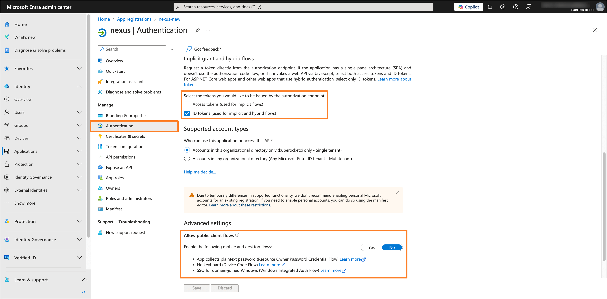
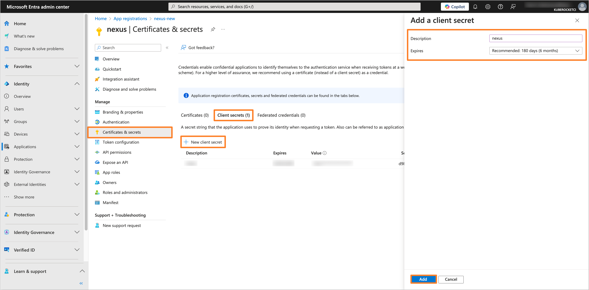
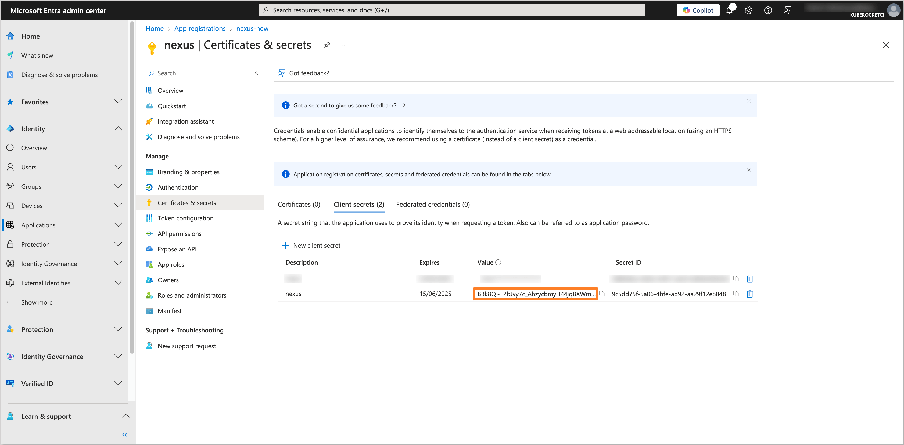
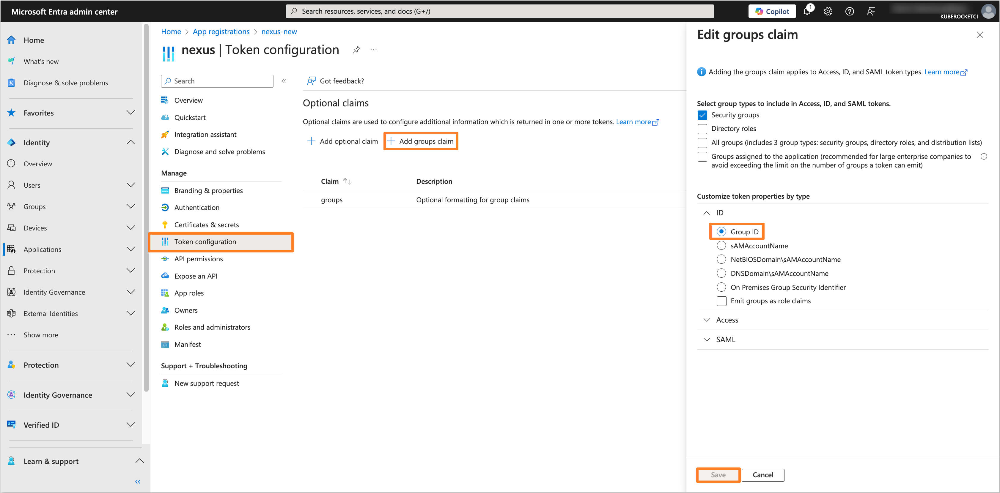
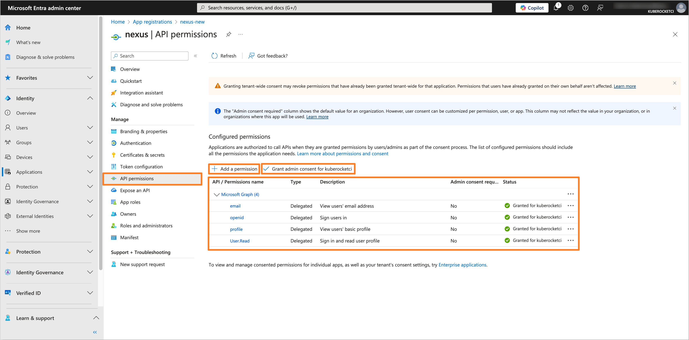
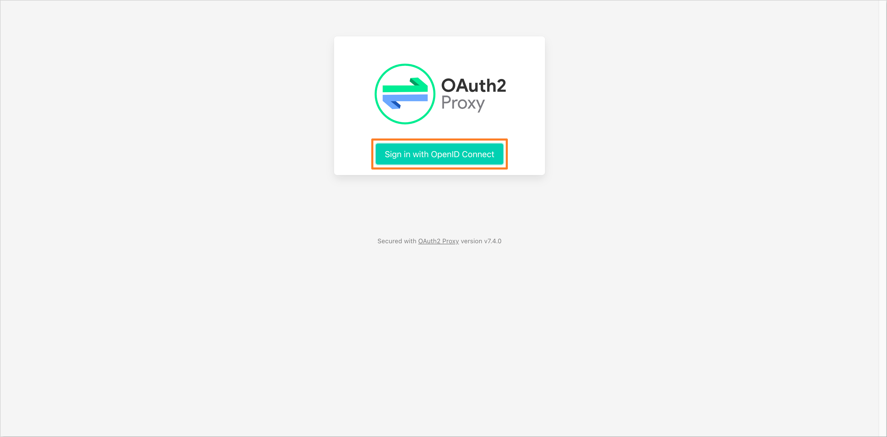

# Guide: Microsoft Entra SSO integration with Nexus

This guide provides instructions on how to configure Nexus with OpenID Connect (OIDC) authentication using Microsoft Entra as the Identity Provider (IdP) and OAuth2-proxy as an authentication proxy.

## Prerequisites

- Access to the [Microsoft Entra Admin Center](https://entra.microsoft.com/) with administrative privileges.
- Created Microsoft Entra Tenant.
- Installed [Nexus](https://github.com/epam/edp-cluster-add-ons/tree/0a1bd78c52899294ef7e17bfae5d3e6477206109/clusters/core/addons/nexus) (can be installed during **Configuring Helm chart** step).
- Installed [Nexus Operator](https://github.com/epam/edp-cluster-add-ons/tree/main/clusters/core/addons/nexus-operator) (can be installed during **Configuring Helm chart** step).
- Fork copy of the [edp-cluster-add-ons](https://github.com/epam/edp-cluster-add-ons) repository.
- (Optional) Installed External Secrets Operator.

## Configuring Microsoft Entra Application

To configure Microsoft Entra as the Identity Provider for Nexus, it is necessary to create and configure an Application in the Microsoft Entra Admin Center.

1. Log in to the [Microsoft Entra Admin Center](https://entra.microsoft.com/?feature.msaljs=true#home).

    

2. In the left sidebar menu, select **Applications** and click **App registrations**.

    

3. Click on the **New registration** button.

    

4. Fill in the required fields, such as **Name**, **Supported account types** and **Redirect URI** (You can skip setting the **Redirect URI** if you don't deploy OAuth2-proxy yet). Click **Register** to create the application.

    :::note
    The **Redirect URI** should be in the format `https://<OAuth2-proxy ingress endpoint>/oauth2/callback`.
    `<OAuth2-proxy ingress endpoint>` can be found in the `values.yaml` file of the [Nexus Helm chart](https://github.com/epam/edp-cluster-add-ons/blob/0a1bd78c52899294ef7e17bfae5d3e6477206109/clusters/core/addons/nexus/values.yaml#L89) in the `clusters/core/addons/nexus` directory.
    :::

    

5. In the created application, navigate to the **Authentication** section from the left sidebar menu. In the **Implicit grant and hybrid flows** section, select **ID tokens** for the token type. In the **Allow public client flows** section, set the value to **No**.

    

6. Navigate to the **Certificates & secrets** section. In the **Client secrets** tab, click on the **New client secret** button to create a new secret. Fill in the required fields and click **Add**.

    

7. Copy the generated client secret value and store it securely. You will need this value to configure the OAuth2-proxy Helm chart.

    

8. Navigate to the **Token configuration** section and click on **Add groups claim** button. Choose the group type as **Security Groups** and for the ID token type, select **Group ID**.

    

9. Navigate to the **API permissions** section. Click on the **Add a permission** button. Select **Microsoft Graph** and then **Delegated permissions**. Add the following permissions:

    - **email**
    - **openid**
    - **profile**
    - **User.Read**

    

    After adding the permissions, click on the **Grant admin consent for 'Tenant name'** button to grant the required permissions.

## Creating the Groups

To manage access to Nexus using OAuth2-proxy, it is necessary to create groups in the Microsoft Entra Admin Center and add users to these groups.

1. In the Microsoft Entra Admin Center, in the left sidebar menu, select **Groups** and then **All groups**. Click on **New group** button to create a new group(s) for users who will have access to Nexus (e.g., `administrator`, `developer`).

    

2. Fill in the required fields, such as **Groups type** and **Group name**. In the **Members** section, add users who will have access to SonarQube.

    

3. After adding the necessary members, review the group settings and click **Create** to save the group. Repeat this process for each required group.

## Configuring Nexus and OAuth2-proxy Helm charts

To integrate Nexus with the configured Microsoft Entra Application, it is necessary to configure the Nexus and OAuth2-proxy Helm charts. In this example, we will use the [edp-cluster-add-ons](https://github.com/epam/edp-cluster-add-ons) repository to deploy Nexus and OAuth2-proxy to the Kubernetes (e.g. AWS EKS) cluster.

1. Navigate to the forked [Cluster Add-Ons repository](https://github.com/epam/edp-cluster-add-ons) and locate the `values.yaml` file in the `clusters/core/addons/nexus` directory.

    Update the `oauth2-proxy` section in the `values.yaml` file with the following values:

    ```yaml title="clusters/core/addons/nexus/values.yaml"
    oauth2-proxy:
      enabled: true
      config:
        configFile: |-
          allowed_groups = ["<Object ID of Administrator Group>", "<Object ID of Developer Group>"]
          azure_tenant = "<Directory (tenant) ID>"
          client_id = "<Application (client) ID>"
          cookie_csrf_expire="5m"
          code_challenge_method="S256"
          insecure_oidc_allow_unverified_email = "true"
          cookie_csrf_per_request="true"
          cookie_secure = "false"
          email_domains = [ "*" ]
          oidc_issuer_url = "https://login.microsoftonline.com/<Directory (tenant) ID>/v2.0"
          pass_access_token = "true"
          pass_authorization_header = "true"
          pass_basic_auth = "false"
          oidc_email_claim = "preferred_username"
          provider = "oidc"
          redirect_url = "https://nexus.example.com/oauth2/callback"
          skip_jwt_bearer_tokens = "true"
          upstreams = [ "http://nexus:8081" ]
          whitelist_domains = ["*"]
          silence_ping_logging = "true"
          scope = "openid email profile"
        existingSecret: oauth2-proxy

      ingress:
        enabled: true
        hosts:
          - nexus.example.com
    ```

    Replace the placeholders with the actual values from the Microsoft Entra Admin Center:
    - `<Object ID of Administrators Group>` and `<Object ID of Developers Group>` with the Object IDs of the groups created in the Microsoft Entra Admin Center.
    - `<Directory (tenant) ID>` with the Directory ID of the Microsoft Entra Tenant.
    - `<Application (client) ID>` with the Application ID of the Microsoft Entra Application.
    - `nexus.example.com` with the desired redirect URL for the OAuth2-proxy.

2. Update or create the `oauth2-proxy` secret with the Client Secret and other necessary values.

    - Using External Secrets Operator

      Be sure to update the AWS Parameter Store object path specified in the `clusters/core/addons/nexus/values.yaml` file in the `eso.secretName` field with the `client-id`, `client-secret` and `cookie-secret` values.

      :::note
      - `client-id` refers to the **Application (client) ID** of your Microsoft Entra Application.
      - `client-secret` refers to the **Application Client Secret** value of your Microsoft Entra Application.
      - `cookie-secret` is a randomly generated secret value.
      :::

      ```json title="AWS Parameter Store object"
      {
        "oauth2-proxy": {
          "client-id": "<Application (client) ID>",
          "client-secret": "<Application Client Secret>",
          "cookie-secret": "<Randomly generated secret>"
        }
      }
      ```

    - Manual approach

      Create the `oauth2-proxy` secret manually using the following template:

      ```yaml title="oauth2-proxy.yaml"
      apiVersion: v1
      kind: Secret
      metadata:
        name: oauth2-proxy
        namespace: <namespace>
      type: Opaque
      data:
        client-id: <Application (client) ID>
        client-secret: <Application Client Secret>
        cookie-secret: <Randomly generated secret>
      ```

      Replace `<Application (client) ID>`, `<Application Client Secret>`, and `<Randomly generated secret>` with the actual values.

3. After updating the `values.yaml` file and creating the `oauth2-proxy` secret, commit the changes to the repository and apply the changes with Helm or Argo CD.

## Creating the Nexus users with Nexus Operator

:::note
Nexus users can also be created directly from the Nexus UI instead of using the Nexus Operator Helm chart.
:::

To be able to access Nexus using OAuth2-proxy and Microsoft Entra, it is necessary to create users in Nexus with the appropriate roles. In this example, we will demonstrate how to create users with Nexus Operator.

1. Make sure that the [Nexus Operator](https://github.com/epam/edp-cluster-add-ons/tree/main/clusters/core/addons/nexus-operator) is installed. If not, follow the instructions in the [Sonatype Nexus Repository OSS Integration documentation](../artifacts-management/nexus-sonatype).

2. Configure the following `NexusUser` custom resource to create a user with the `nx-admin` and `edp-admin` roles:

    ```yaml title="nexus-user.yaml"
    apiVersion: edp.epam.com/v1alpha1
    kind: NexusUser
    metadata:
      name: test-user
      namespace: nexus
    spec:
      email: <User email>
      firstName: <User first name>
      id: <User email>
      lastName: <User last name>
      nexusRef:
        kind: Nexus
        name: nexus
      roles:
        - edp-admin
        - nx-admin
      secret: $ci-user:password
      status: active
    ```

    Replace the placeholders with the actual values.

3. After configuring the `NexusUser` custom resource, apply the changes to the Kubernetes cluster.

4. Repeat the process for each user you want to grant access to Nexus.

5. Verify that the OIDC Authentication is configured correctly by logging in to Nexus using the OAuth2-proxy endpoint. Click on the **Sign in with Open ID Connect** button to authenticate with Microsoft Entra credentials.

    

After completing these steps, Nexus will be configured with OIDC authentication using Microsoft Entra as the Identity Provider. Users will be able to log in to Nexus using OAuth2-proxy endpoint with their Microsoft Entra credentials.

## Related Articles

- [OpenID Connect (OIDC) Authentication Overview](./oidc-authentication-overview.md)
