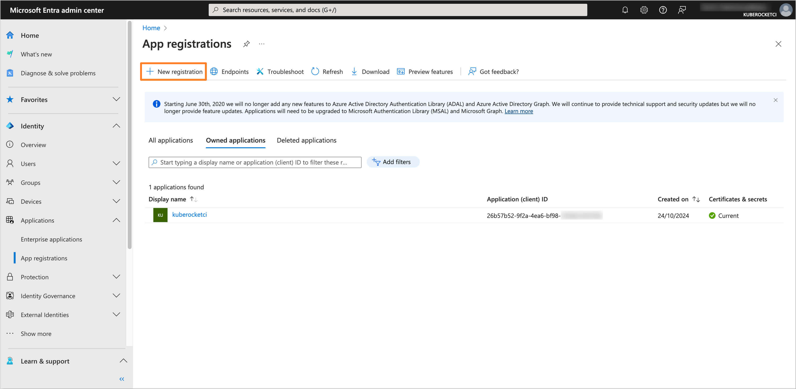
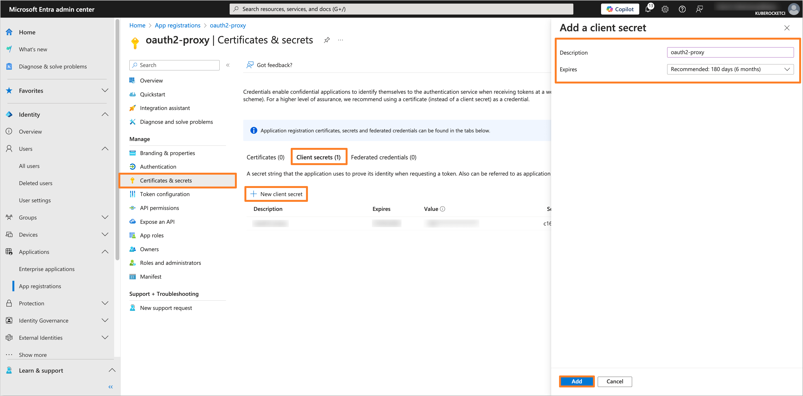
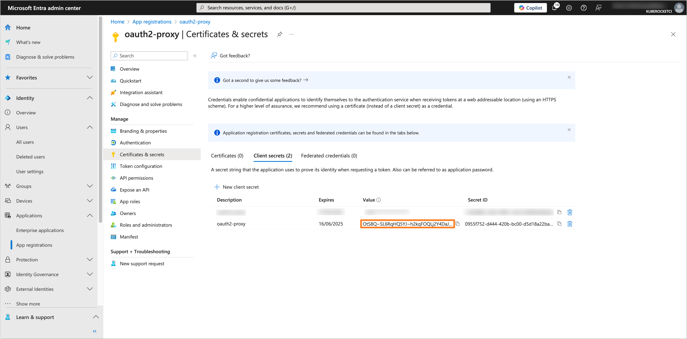
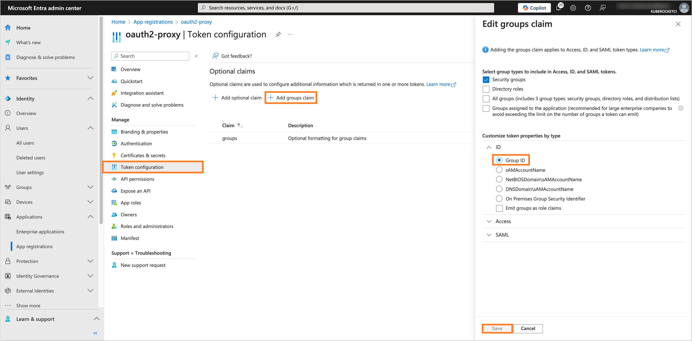
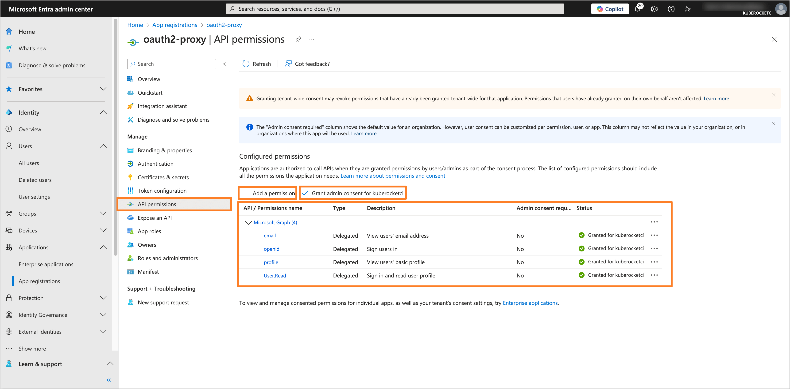
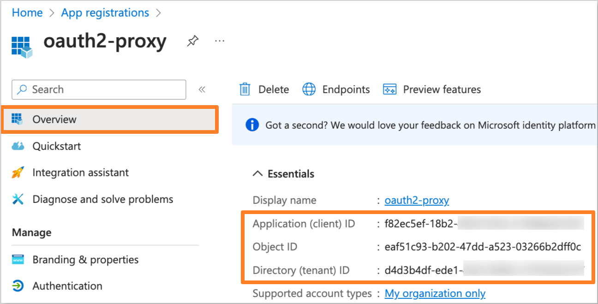
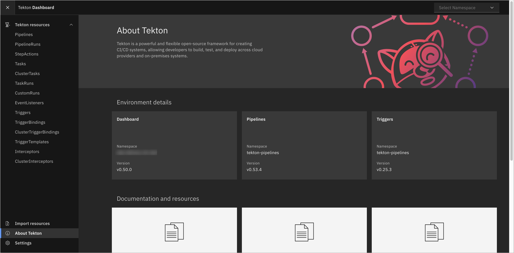

---

title: "Guide: Microsoft Entra SSO Integration With OAuth2-proxy (Tekton Dashboard)"
description: "Instructions on configuring OAuth2-proxy for Tekton Dashboard with OIDC authentication using Microsoft Entra as the Identity Provider."
sidebar_label: "OAuth2-proxy (Tekton Dashboard)"

---
<!-- markdownlint-disable MD025 -->

# Guide: Microsoft Entra SSO Integration With OAuth2-proxy (Tekton Dashboard)

<head>
  <link rel="canonical" href="https://docs.kuberocketci.io/docs/operator-guide/microsoft-entra/oauth2-proxy-authentication/" />
</head>

This guide provides instructions on how to configure OAuth2-proxy for the Tekton Dashboard with OIDC authentication using Microsoft Entra as the Identity Provider.

## Prerequisites

- Access to the [Microsoft Entra Admin Center](https://entra.microsoft.com/) with administrative privileges.
- Created Microsoft Entra Tenant.
- Installed Tekton Dashboard.
- Installed OAuth2-proxy (can be installed during **Configuring Helm chart** step).
- Fork copy of the [edp-cluster-add-ons](https://github.com/epam/edp-cluster-add-ons) repository.
- (Optional) Installed External Secrets Operator.

## Configuring Microsoft Entra Application

To configure Microsoft Entra as the Identity Provider for the OAuth2-proxy, it is necessary to create and configure an Application in the Microsoft Entra Admin Center.

1. Log in to the [Microsoft Entra Admin Center](https://entra.microsoft.com/?feature.msaljs=true#home).

    

2. In the left sidebar menu, select **Applications** and click **App registrations**.

    

3. Click on the **New registration** button.

    

4. Fill in the required fields, such as **Name**, **Supported account types** and **Redirect URI** (You can skip setting the **Redirect URI** if you don't deploy OAuth2-proxy yet). Click **Register** to create the application.

    :::note
    The **Redirect URI** should be in the format `https://<OAuth2-proxy ingress URL>/oauth2/callback`.
    :::

    

5. In the created application, navigate to the **Certificates & secrets** section from the left sidebar menu. In the **Client secrets** tab, click on the **New client secret** button to create a new secret. Fill in the required fields and click **Add**.

    

6. Copy the generated Client secret value and store it securely. You will need this value to configure the OAuth2-proxy Helm chart.

    

7. Navigate to the **Token configuration** section and click on **Add groups claim** button. Choose the group type as **Security Groups** and for the ID token type, select **Group ID**.

    

8. Navigate to the **API permissions** section. Click on the **Add a permission** button. Select **Microsoft Graph** and then **Delegated permissions**. Add the following permissions:

    - **email**
    - **openid**
    - **profile**
    - **User.Read**

    

    After adding the permissions, click on the **Grant admin consent for 'Tenant name'** button to grant the required permissions.

After the application is configured, you can proceed with the OAuth2-proxy Helm chart configuration.

## Creating the Groups

To manage access to the Tekton Dashboard (or any other application with OAuth2-proxy), it is necessary to create groups in the Microsoft Entra Admin Center and assign users to it.

1. In the Microsoft Entra Admin Center, in the left sidebar menu, select **Groups** and then **All groups**. Click on **New group** button to create a new group(s) for users who will have access to Tekton Dashboard (e.g., `administrator`, `developer`).

    

2. Fill in the required fields, such as **Groups type** and **Group name**. In the **Members** section, add users who will have access to SonarQube.

    

3. After adding the necessary members, review the group settings and click **Create** to save the group. Repeat this process for each required group.

## Configuring OAuth2-proxy Helm chart

To integrate OAuth2-proxy with the configured Microsoft Entra Application, it is necessary to configure the OAuth2-proxy Helm chart.

:::note
The Application data, such as **Application (client) ID** and **Directory (tenant) ID**, can be found in the **Overview** section of the Application in the Microsoft Entra Admin Center.

:::

:::note
The **Object ID** can be found in the **Overview** section of the group in the Microsoft Entra Admin Center.

:::

1. Navigate to the forked [Cluster Add-Ons repository](https://github.com/epam/edp-cluster-add-ons) and locate the `values.yaml` file in the `clusters/core/addons/oauth2-proxy` directory.

    Update the `values.yaml` file with the following values:

    ```yaml title="clusters/core/addons/oauth2-proxy/values.yaml"
    oauth2-proxy:
      config:
        configFile: |-
          allowed_groups = ["<Object ID of Administrator Group>", "<Object ID of Developer Group>"]
          code_challenge_method="S256"
          azure_tenant = "<Directory (tenant) ID>"
          client_id = "<Application (client) ID>"
          cookie_domains = ["example.domain.com"]
          cookie_secure = "false"
          email_domains = [ "*" ]
          insecure_oidc_allow_unverified_email = "true"
          oidc_issuer_url = "https://login.microsoftonline.com/<Directory (tenant) ID>/v2.0"
          pass_authorization_header = "true"
          pass_basic_auth = "false"
          pass_user_headers = "true"
          oidc_email_claim = "preferred_username"
          provider = "oidc"
          redirect_url = "https://oauth-oauth2-proxy.example.domain.com/oauth2/callback"
          reverse_proxy = "true"
          skip_jwt_bearer_tokens = "true"
          skip_provider_button = "true"
          whitelist_domains = ".example.domain.com"
          scope = "openid email profile"

        existingSecret: oauth2-proxy

      ingress:
        enabled: true
        hosts:
          - oauth-oauth2-proxy.example.domain.com
    ```

    Replace the following placeholders with the actual values:
    - `<Object ID of Administrator Group>` - Object ID of the `administrator` group created in the Microsoft Entra Admin Center.
    - `<Object ID of Developer Group>` - Object ID of the `developer` group created in the Microsoft Entra Admin Center.
    - `<Directory (tenant) ID>` - Directory (tenant) ID of the Microsoft Entra Tenant.
    - `<Application (client) ID>` - Application (client) ID of the Microsoft Entra Application created in the previous step.
    - `example.domain.com` - Domain name associated with the OAuth2-proxy.

2. Update or create the `oauth2-proxy` secret with the Application Client Secret value.

    - Using External Secrets Operator

      Be sure to update the AWS Parameter Store object path specified in the `clusters/core/addons/oauth2-proxy/values.yaml` file in the `eso.secretName` field with the `client-id`, `client-secret` and `cookie-secret` values.

      :::note
      - `client-id` refers to the **Application (client) ID** of your Microsoft Entra Application.
      - `client-secret` refers to the **Application Client Secret** value of your Microsoft Entra Application.
      - `cookie-secret` is a randomly generated secret value.
      :::

      ```json title="AWS Parameter Store object"
      {
        "oauth2-proxy": {
          "client-id": "<Application (client) ID>",
          "client-secret": "<Application Client Secret>",
          "cookie-secret": "<Randomly generated secret>"
        }
      }
      ```

    - Manual approach

      Create the `oauth2-proxy` secret manually using the following template:

      ```yaml title="oauth2-proxy-secret.yaml"
      apiVersion: v1
      kind: Secret
      metadata:
        name: oauth2-proxy
        namespace: <namespace>
      type: Opaque
      data:
        client-id: <Application (client) ID>
        client-secret: <Application Client Secret>
        cookie-secret: <Randomly generated secret>
      ```

      Replace `<Application (client) ID>`, `<Application Client Secret>`, and `<Randomly generated secret>` with the appropriate values.

3. After updating the `values.yaml` file and creating the `oauth2-proxy` secret, commit the changes to the repository and apply the changes with Helm or Argo CD.

After the OAuth2-proxy is configured, it can serve as a reverse proxy, enabling secure access to various applications by handling authentication and passing validated user identity data.

## Configuring Tekton Dashboard

To configure the Tekton Dashboard to use OAuth2-proxy for OIDC authentication, it is necessary to update the Tekton Dashboard Ingress resource.

1. Log in to the Kubernetes cluster where the Tekton Dashboard is installed.

2. Edit the Ingress resource associated with the Tekton Dashboard by adding `auth-signin` and `auth-url` of oauth2-proxy to the annotations.

    ```bash
    kubectl annotate ingress <application-ingress-name> -n <namespace> \
    nginx.ingress.kubernetes.io/auth-signin='https://<oauth-ingress-host>/oauth2/start?rd=https://$host$request_uri' \
    nginx.ingress.kubernetes.io/auth-url='http://oauth2-proxy.oauth2-proxy.svc.cluster.local:80/oauth2/auth'
    ```

    Replace the following placeholders with the actual values.

3. Verify that the OIDC authentication is configured correctly by accessing the Tekton Dashboard URL and logging in with the Microsoft Entra credentials.

    

After completing these steps, the Tekton Dashboard will be configured to use OAuth2-proxy with Microsoft Entra as the Identity Provider for authentication. Users will be able to log in to the Tekton Dashboard using their Microsoft Entra credentials.

## Related Articles

- [OpenID Connect (OIDC) Authentication Overview](./oidc-authentication-overview.md)
