# SonarQube

This page provides instructions on how to configure SonarQube with OpenID Connect (OIDC) authentication using Microsoft Entra as the Identity Provider (IdP).

## Prerequisites

- Access to the [Microsoft Entra Admin Center](https://entra.microsoft.com/) with administrative privileges.
- Created Microsoft Entra Tenant.
- Installed SonarQube.
- Fork copy of the [edp-cluster-add-ons](https://github.com/epam/edp-cluster-add-ons) repository.

## Configuring Microsoft Entra Application

To configure Microsoft Entra as the Identity Provider for SonarQube, it is necessary to create and configure an Application in the Microsoft Entra Admin Center.

1. Log in to the [Microsoft Entra Admin Center](https://entra.microsoft.com/?feature.msaljs=true#home).

    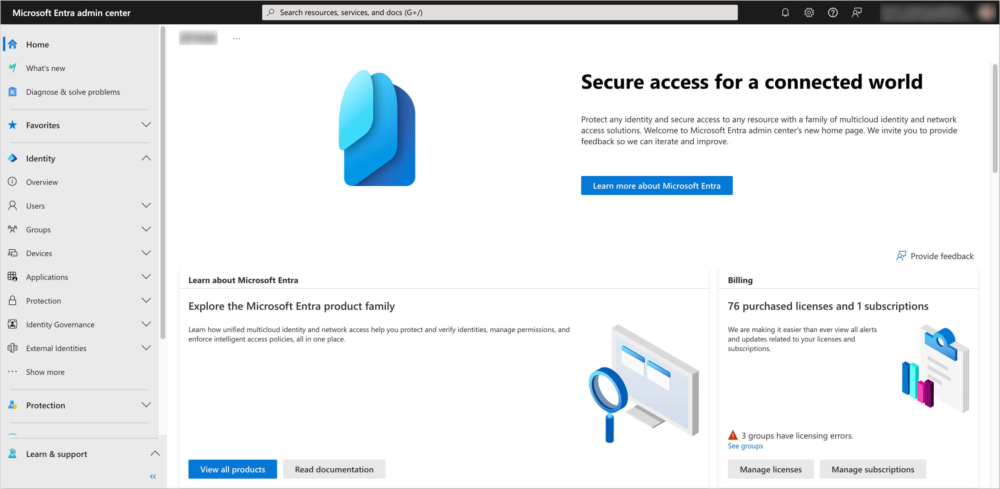

2. In the left sidebar menu, select **Applications** and click **App registrations**.

    

3. Click on the **New registration** button.

    

4. Fill in the required fields, such as **Name**, **Supported account types** and **Redirect URI**. Click **Register** to create the application.

    :::note
    The **Redirect URI** should be in the format `https://<SonarQube URL>/oauth2/callback/oidc`.
    :::

    

5. In the created application, navigate to the **Authentication** section from the left sidebar menu. In the **Implicit grant and hybrid flows** section, select **ID tokens** for the token type. In the **Allow public client flows** section, set the value to **No**.

    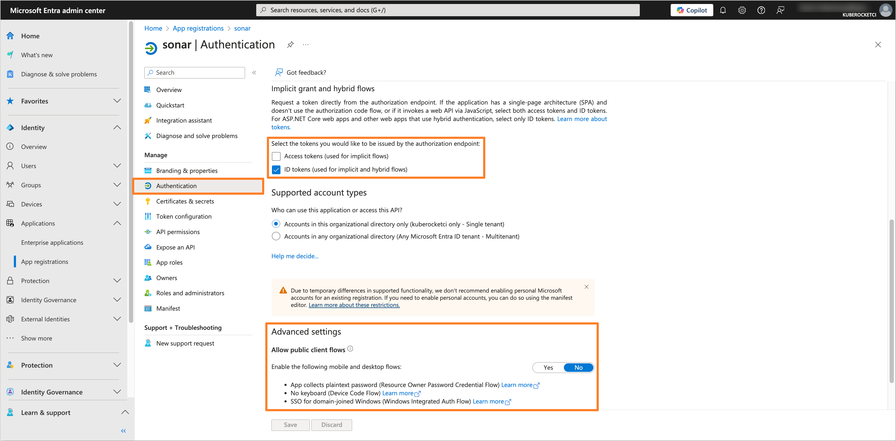

6. Navigate to the **Certificates & secrets** section. In the **Client secrets** tab, click on the **New client secret** button to create a new secret. Fill in the required fields and click **Add**.

    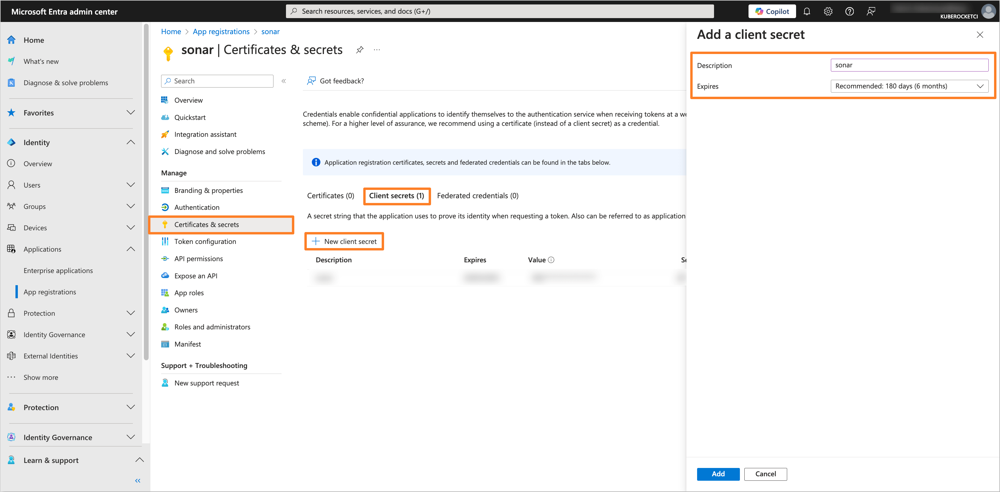

7. Copy the generated client secret value and store it securely. You will need this value to configure the SonarQube Helm chart.

    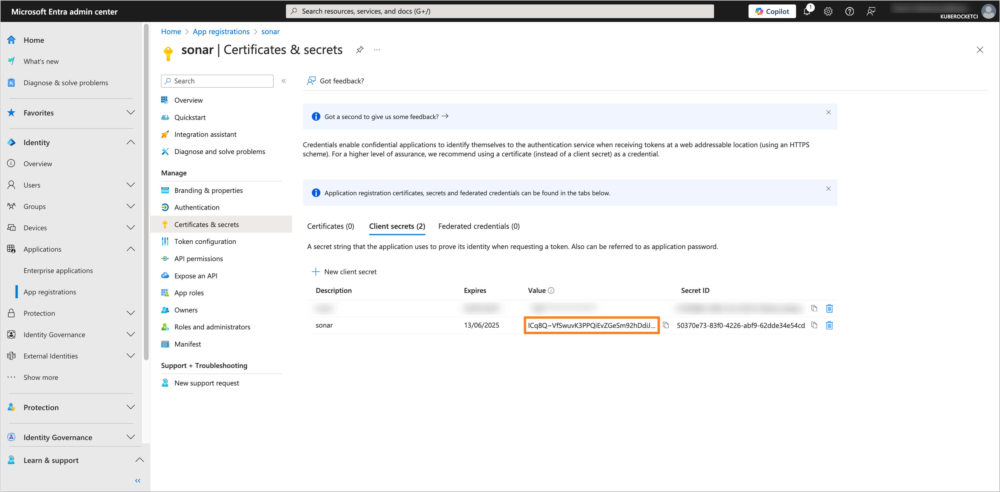

8. Navigate to the **Token configuration** section and click on **Add groups claim** button. Choose the group type as **Security Groups** and for the ID token type, select **Group ID**.

    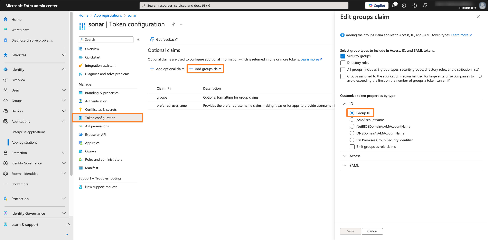

    Also, add the **preferred_username** optional claim.

    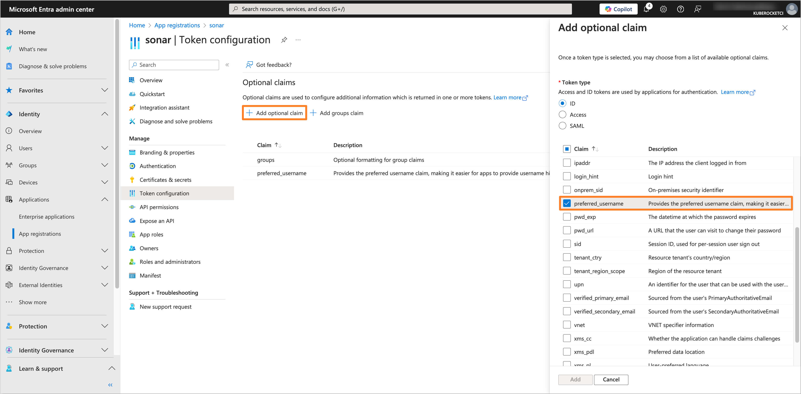

9. Navigate to the **API permissions** section. Click on the **Add a permission** button. Select **Microsoft Graph** and then **Delegated permissions**. Add the following permissions:

    - **email**
    - **offline_access**
    - **openid**
    - **profile**
    - **User.Read**

    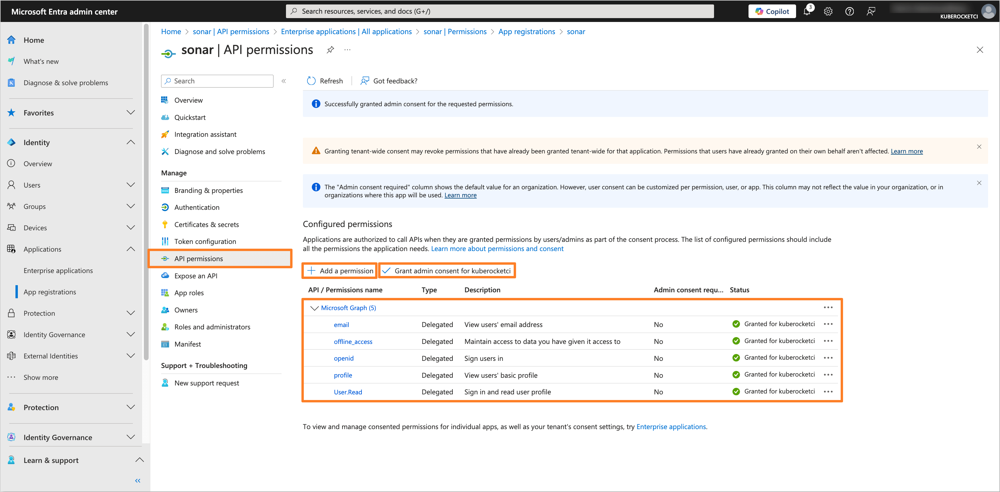

    After adding the permissions, click on the **Grant admin consent for 'Tenant name'** button to grant the required permissions.

## Creating the Groups

To manage access to SonarQube, it is necessary to create the groups in Microsoft Entra and assign users to it.

1. In the Microsoft Entra Admin Center, in the left sidebar menu, select **Groups** and then **All groups**. Click on **New group** button to create a new group(s) for users who will have access to SonarQube (e.g., `sonar-administrators`, `sonar-developers`).

    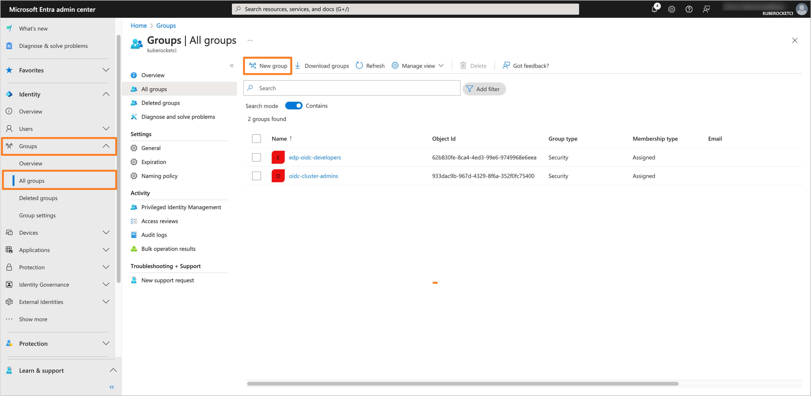

2. Fill in the required fields, such as **Groups type** and **Group name**. In the **Members** section, add users who will be part of the group.

    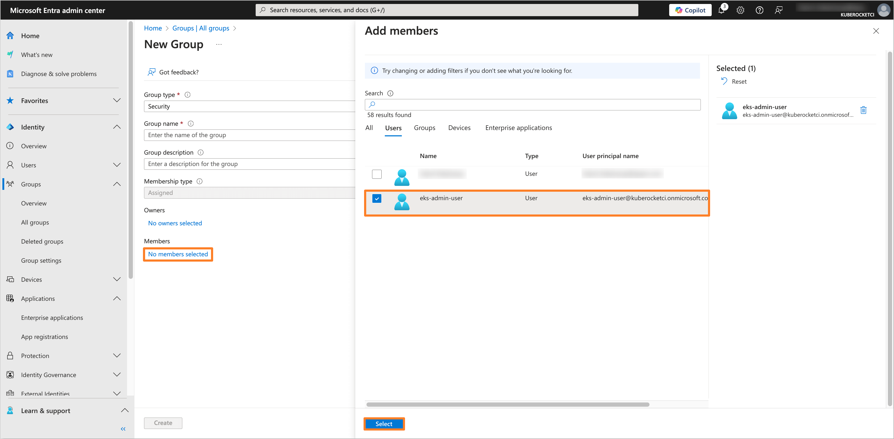

3. After adding the necessary members, review the group settings and click **Create** to save the group. Repeat this process for each required group.

    :::important
    Ensure that the groups created in Microsoft Entra correspond to the groups configured in SonarQube. In SonarQube, the group name **must exactly match the Object ID** of the corresponding Microsoft Entra group, as this is required for proper synchronization and access control.
    :::

    :::note
    The **Object ID** of the Microsoft Entra group can be found in the **Overview** section of the group in the Microsoft Entra Admin Center.
    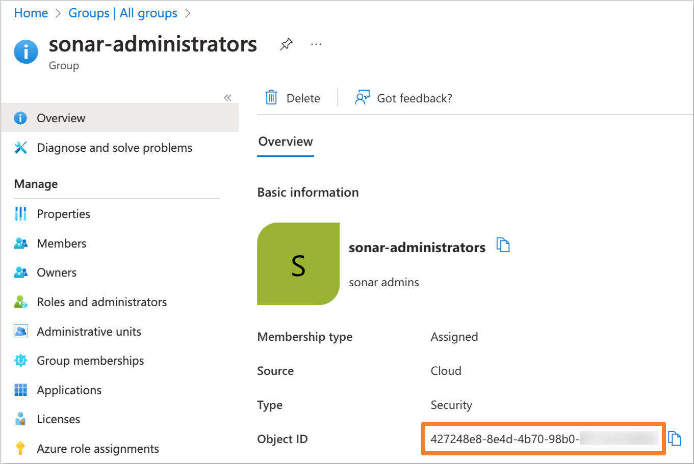
    :::

    Below is an example of how the `sonar-administrators` group should appear in SonarQube:

    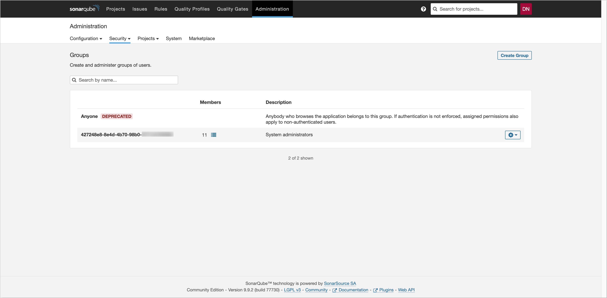

## Configuring SonarQube with Sonar-Operator

:::note
SonarQube OIDC configuration can also be configured directly from the SonarQube UI instead of using the Sonar-Operator.
:::

In this section, we will demonstrate how to set up OIDC authentication for SonarQube using the [edp-sonar-operator](https://github.com/epam/edp-sonar-operator) Helm chart. This approach aligns with the automation and consistency principles of the KubeRocketCI platform.

1. Navigate to the forked [Cluster Add-Ons repository](https://github.com/epam/edp-cluster-add-ons) and locate the `sonar.yaml` file at the following path `clusters/core/addons/sonar-operator/templates/sonar/sonar.yaml`.

    Update the `sonar.yaml` file to match the configuration below:

    ```yaml title="sonar.yaml"
    apiVersion: edp.epam.com/v1alpha1
    kind: Sonar
    metadata:
      name: sonar
    spec:
      url: {{ .Values.sonarUrl }}
      secret: {{ .Values.sonarSecret }}
      defaultPermissionTemplate: edp-default
      settings:
        - key: sonar.dbcleaner.hoursBeforeKeepingOnlyOneSnapshotByDay
          value: "20"
        - key: sonar.auth.oidc.enabled
          value: "true"
        - key: sonar.auth.oidc.issuerUri
          value: "https://login.microsoftonline.com/<Directory (tenant) ID>/v2.0"
        - key: sonar.auth.oidc.clientId.secured
          value: "<Application (client) ID>"
        - key: sonar.auth.oidc.clientSecret.secured
          value: "<Client secret>"
        - key: sonar.core.serverBaseURL
          value: {{ .Values.sonarUrl }}
        - key: sonar.auth.oidc.groupsSync.claimName
          value: "groups"
        - key: sonar.auth.oidc.groupsSync
          value: "true"
        - key: sonar.auth.oidc.idTokenSigAlg
          value: "RS256"
    ```

    Replace the placeholders with the following values:

    - `<Directory (tenant) ID>` - Microsoft Entra Tenant ID.
    - `<Application (client) ID>` - Application ID from the Microsoft Entra Application settings.
    - `<Client secret>` - Generated client secret value from the Microsoft Entra Application settings.

2. After updating the `sonar.yaml` file, commit the changes to the repository and apply the changes with Helm or Argo CD.

3. Verify that the OIDC authentication is configured correctly by logging in to SonarQube using **Log in with OpenID Connect** option.

    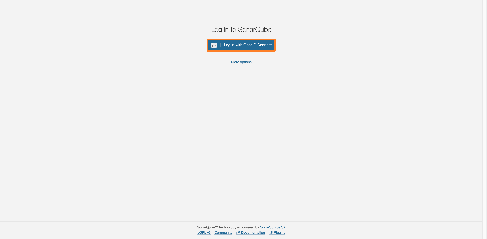

After completing these steps, SonarQube will be configured with OIDC authentication using Microsoft Entra as the Identity Provider. Users will be able to log in to SonarQube using their Microsoft Entra credentials.

## Related Articles

- [OpenID Connect Authentication Overview](./oidc-authentication-overview.md)
