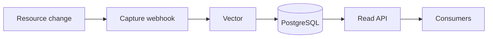

---

title: "Kubernetes Audit Trails Setup"
description: "Install and configure the krci-audit add-on to capture, store, and query a Kubernetes admission audit trail of who changed which resources in KubeRocketCI."
sidebar_label: "Audit Trails Setup"

---
<!-- markdownlint-disable MD025 -->

# Audit Trails Setup

<head>
  <link rel="canonical" href="https://docs.kuberocketci.io/docs/operator-guide/monitoring-and-observability/audit-trails-setup" />
</head>

The **krci-audit** add-on records an append-only audit trail of admission changes to the Kubernetes resources managed by KubeRocketCI — who created, updated, or deleted an object, and when. It is self-contained and never blocks platform operations: if auditing is unavailable, the change still proceeds.

## Architecture

krci-audit is composed of three parts and a read API:

* **Capture** — a `ValidatingWebhookConfiguration` (the native Kubernetes admission-control mechanism, backed by [kube-audit-rest](https://github.com/RichardoC/kube-audit-rest)) receives the `AdmissionReview` for each matching change. Its `failurePolicy` is `Ignore` with a short timeout, so platform mutations are never blocked.
* **Ship** — a [Vector](https://vector.dev/) sidecar tails the capture log, keeps only the events selected by the store filter, and writes them to PostgreSQL.
* **Store** — a dedicated PostgreSQL database holds the events in a monthly-partitioned, append-only table. Writes use a least-privilege role that cannot update or delete existing records.
* **Read API** — a separate, read-only service exposes initiator lookup (who created a resource) and an audit-events query. It connects to PostgreSQL as a SELECT-only role, so the read path can never modify the trail.

Data flows one way:



A Kubernetes resource change triggers the capture webhook, which Vector ships to PostgreSQL; the read API then serves that stored data to consumers.

## Installation

krci-audit is delivered as a KubeRocketCI [add-on](../add-ons-overview.md). It is disabled by default.

**Prerequisites:** [cert-manager](https://cert-manager.io/) (bundled with KubeRocketCI) issues the webhook's serving certificate. For `pgo` database mode you also need the Crunchydata PostgreSQL operator; to deliver credentials through the [External Secrets Operator](../secrets-management/install-external-secrets-operator.md), install that add-on first.

1. Provide the database credentials Secret. The chart never generates credentials — it only reads a Secret you supply, in every database mode. Create it in the `krci-audit` namespace (or populate it with the [External Secrets Operator](../secrets-management/install-external-secrets-operator.md)):

    ```bash
    kubectl -n krci-audit create secret generic krci-audit-db-access \
      --from-literal=db-owner-username=krci-audit \
      --from-literal=db-owner-password="$(openssl rand -base64 24)" \
      --from-literal=writer-password="$(openssl rand -base64 24)" \
      --from-literal=reader-password="$(openssl rand -base64 24)"
    ```

    The `db-owner-*` keys are required for `simple` mode; `writer-password` is always required; `reader-password` is required when the read API is enabled.

2. Enable the add-on in `clusters/core/apps/values.yaml`:

    ```yaml
    krci-audit:
      enable: true
    ```

3. Sync the add-on in Argo CD. The chart applies the schema migration, provisions PostgreSQL (for `simple`/`pgo` modes), and starts the capture and read API workloads.

## Configuration

The add-on wrapper overrides only `db.mode`; the full configuration surface lives in the component chart's `values.yaml`. The most common settings:

| Setting | Default | Purpose |
|---------|---------|---------|
| `capture.rules` | `v2.edp.epam.com/*`, `tekton.dev/pipelineruns` | Which admissions the API server sends to the webhook. |
| `capture.filter` | KubeRocketCI groups + Tekton PipelineRuns | Which received events are actually stored (change any time with `helm upgrade`, no rebuild). |
| `capture.namespaces` | `[]` (all) | Restrict auditing to named namespaces. |
| `capture.level` | `metadata` | Object body captured: `metadata` (bounds size and PII) or `full`. |
| `db.mode` | `simple` (add-on) | PostgreSQL provisioning: `external` (bring your own), `pgo` (Crunchydata operator), or `simple` (in-cluster Postgres for dev/small installs). |
| `retention.months` | `12` | Months of history to keep (see [Retention](#retention)). |

### Retention

A scheduled CronJob (nightly at `02:00` by default) drops audit history older than `retention.months`. Retention is **month-granular**: expired data is removed a whole monthly partition at a time, so the smallest effective window is about one month — sub-monthly windows (for example, three weeks) are not supported. The job only drops whole partitions and never deletes individual rows, preserving append-only integrity.

## Access control

The read API is exposed only inside the cluster (a `ClusterIP` Service, no Ingress); consumers reach it by in-cluster DNS. It connects to the database as a SELECT-only role, so it cannot alter the trail. Network exposure is the interim access boundary; API authentication and authorization are planned.

## Querying the audit trail

The read API is reachable in-cluster at `<release>-api.<namespace>:8080`. To query it from your workstation, port-forward the Service:

```bash
kubectl -n krci-audit port-forward svc/krci-audit-api 18080:8080
```

Look up who created a resource (initiator lookup) by `kind`, `namespace`, and `name`:

```bash
curl "http://localhost:18080/api/v1/audit/initiator?kind=PipelineRun&namespace=krci&name=build-test-go-app-main-8a2c"
```

```json
{
  "actor": "system:serviceaccount:krci:krci-admin",
  "operation": "CREATE",
  "found": true,
  "timestamp": "2026-07-07T12:41:00Z"
}
```

Query the recorded events (filterable by `kind`, `operation`, `actor`, and paginated):

```bash
curl "http://localhost:18080/api/v1/audit/events?kind=PipelineRun&operation=UPDATE&limit=20"
```

## Compliance usage

The audit trail provides evidence for compliance frameworks such as **SOC 2**, **ISO 27001**, **GDPR**, and **PCI DSS**: an immutable, time-stamped record of who changed which resources. Auditors retrieve evidence through the read API — initiator lookup ("who created this resource") and the filterable audit-events query — without direct database access.

## Related Articles

* [Install via Add-Ons](../add-ons-overview.md)
* [Authentication and Authorization](../auth/platform-auth-model.md)
* [Pipelines Overview](../../user-guide/pipelines.md)
